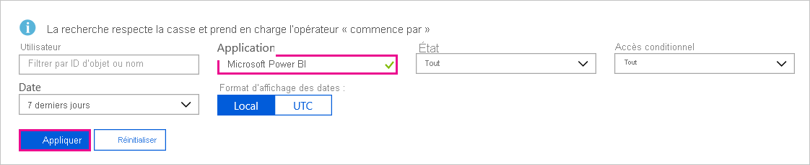
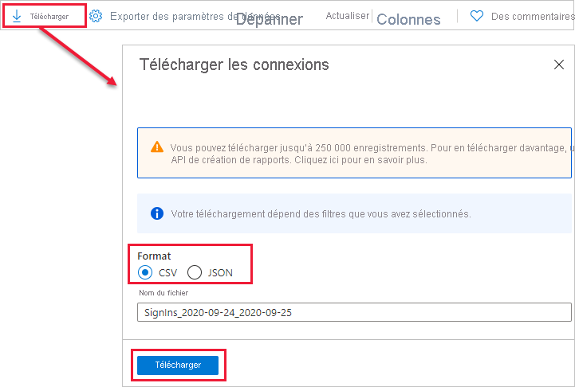

# Trouver les utilisateurs Power BI qui se sont connectés

Si vous êtes administrateur de locataire et que vous voulez voir quels utilisateurs se sont connectés à Power BI, utilisez les [rapports d’accès et d’utilisation Azure Active Directory](/azure/active-directory/reports-monitoring/concept-sign-ins) pour une meilleure visibilité.

> [!NOTE]
> Le rapport **Connexions** fournit des informations utiles, mais n’indique pas le type de licence dont dispose chaque utilisateur. Utilisez le Centre d’administration Microsoft 365 pour voir les licences.

## Conditions requises

Tous les utilisateurs (y compris ceux qui ne sont pas administrateurs) peuvent voir un rapport de leurs propres connexions, mais pour voir un rapport concernant tous les utilisateurs, vous devez remplir les conditions suivantes.

* Votre locataire doit avoir une licence Azure Active Directory Premium associée.

* Vous devez être dans un des rôles suivants : administrateur général, administrateur de la sécurité ou lecteur sécurité.

## Utiliser le portail Azure pour afficher les connexions

Pour afficher l’activité de connexion, procédez comme suit.

1. Dans le **portail Azure**, sélectionnez **Azure Active Directory**.

1. Sous **Surveillance**, sélectionnez **Connexions**.
   
    

1. Filtrez l’application par **Microsoft Power BI** ou **Power BI Gateway** et sélectionnez **Appliquer**.

    **Microsoft Power BI** filtre l’activité de connexion liée au service, tandis que **Power BI Gateway** filtre l’activité de connexion spécifique à la passerelle de données locale.
   
    

## Exporter les données

Vous pouvez [télécharger un rapport de connexion](/azure/active-directory/reports-monitoring/quickstart-download-sign-in-report) dans deux formats : CSV et JSON.

En haut du rapport **Connexions**, sélectionnez **Télécharger**, puis sélectionnez l’une des options suivantes :

* **CSV** pour télécharger un fichier CSV correspondant aux données actuellement filtrées.

* **JSON** pour télécharger un fichier JSON correspondant aux données actuellement filtrées.

## Rétention de données

Les données de connexion sont disponibles pendant une durée maximale de 30 jours. Pour plus d’informations, consultez [Stratégies de rétention de rapport Azure Active Directory](/azure/active-directory/reports-monitoring/reference-reports-data-retention).

## Étapes suivantes

[Utilisation de l’audit dans votre organisation](service-admin-auditing.md)

D’autres questions ? [Essayez d’interroger la communauté Power BI](https://community.powerbi.com/)