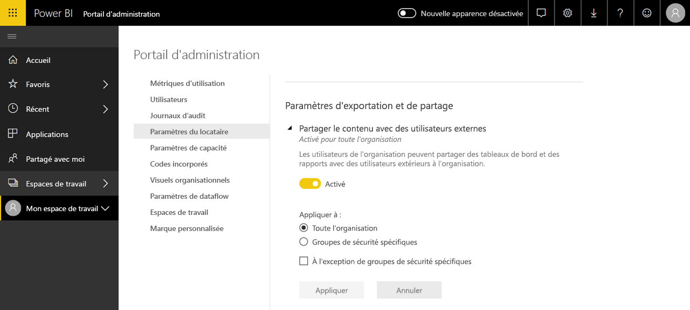

# Présentation de l’administration de Power BI

L’administration de Power BI est la gestion des paramètres à l’échelle de l’organisation qui contrôlent le fonctionnement de Power BI. Les utilisateurs qui sont affectés aux rôles d’administrateur configurent, supervisent et provisionnent les ressources organisationnelles. Cet article donne une vue d’ensemble des rôles, des tâches et des outils d’administration pour vous aider à démarrer.

## Rôles d’administrateur liés à Power BI

Il existe plusieurs rôles qui travaillent ensemble de façon à administrer Power BI pour votre organisation. La plupart des rôles d’administrateur sont affectés dans le Centre d’administration Microsoft 365 ou via PowerShell. Les rôles d’administrateur de la capacité Power BI Premium et de la capacité Power BI Embedded sont affectés quand la capacité est créée. Pour plus d’informations sur chacun des rôles d’administrateur, consultez [À propos des rôles d’administrateur](/microsoft-365/admin/add-users/about-admin-roles). Pour savoir comment affecter des rôles d’administrateur, consultez [Affecter des rôles d’administrateur](/microsoft-365/admin/add-users/assign-admin-roles).

| **Type d’administrateur** | **Étendue d’administration** | **Tâches Power BI** |
| --- | --- | --- |
| Administrateur général | Microsoft 365 | Dispose d’un accès illimité à toutes les fonctionnalités de gestion pour l’organisation |
| | | Attribue des rôles à d’autres utilisateurs |
| Administrateur de facturation | Microsoft 365 | Gérer les abonnements |
| | | Acheter des licences |
| Administrateur de licences | Microsoft 365 | Attribuer des licences à des utilisateurs ou les supprimer |
| Administrateur d’utilisateurs | Microsoft 365 | Créer et gérer des utilisateurs et des groupes |
| | | Réinitialiser les mots de passe utilisateur |
| Administrateur Power BI | Service Power BI | Accès complet aux tâches de gestion de Power BI|
| | | Activer et désactiver des fonctionnalités de Power BI |
| | | Créer un rapport sur les performances et l’utilisation |
| | | Examiner et gérer les audits |
| Administrateur de capacité Power BI Premium | Une seule capacité Premium | Affecter des espaces de travail à la capacité|
| | | Gérer les autorisations des utilisateurs sur la capacité |
| | | Gérer les charges de travail pour configurer l’utilisation de la mémoire |
| | | Redémarrer la capacité |
| Administrateur de capacité Power BI Embedded | Une seule capacité Embedded | Affecter des espaces de travail à la capacité|
| | | Gérer les autorisations des utilisateurs sur la capacité |
| | | Gérer les charges de travail pour configurer l’utilisation de la mémoire |
| | | Redémarrer la capacité |

## Tâches et outils d’administration

Les administrateurs de Power BI travaillent principalement dans le portail d’administration Power BI. Vous devez cependant être familiarisé avec les outils et les centres d’administration associés. Consultez le tableau ci-dessus pour déterminer quel rôle est nécessaire pour effectuer des tâches en utilisant les outils listés ici.

| **Outil** | **Tâches courantes** |
| --- | --- |
| [Portail d’administration Power BI](https://app.powerbi.com/admin-portal) | Acquérir et travailler avec une capacité Premium |
| | Garantir la qualité de service |
| | Gérer les espaces de travail |
| | Publier des visuels Power BI |
| | Vérifier les codes utilisés pour incorporer Power BI dans d’autres applications |
| | Résoudre les problèmes d’accès aux données et autres |
| [Centre d’administration Microsoft 365](https://admin.microsoft.com) | Gérer les utilisateurs et les groupes |
| | Acheter et attribuer des licences |
| | Empêcher les utilisateurs d’accéder à Power BI |
| [Centre de sécurité et de conformité Microsoft 365](https://protection.office.com) | Examiner et gérer les audits |
| | Classification et suivi des données |
| | Stratégies de protection contre la perte de données |
| | Gouvernance des informations |
| [Azure Active Directory dans le portail Azure](https://aad.portal.azure.com) | Configurer l’accès conditionnel aux ressources Power BI |
| | Approvisionner la capacité de Power BI Embedded |
| [Applets de commande PowerShell](/powershell/power-bi/overview) | Gérer les espaces de travail et d’autres aspects de Power BI avec des scripts |
| [API et SDK d’administration](service-admin-reference.md) | Créez des outils d’administration personnalisés. Par exemple, Power BI Desktop peut utiliser ces API pour générer des rapports à partir de données liées à l’administration. |

## Étapes suivantes

Maintenant que vous connaissez les principes fondamentaux de l’administration de Power BI, consultez les articles suivants pour découvrir plus d’informations :

- [Utiliser le portail d’administration de Power BI](service-admin-portal.md)
- [Indications concernant les paramètres du locataire](../guidance/admin-tenant-settings.md)
- [Utiliser les applets de commande PowerShell](/powershell/power-bi/overview)
- [FAQ sur l’administration de Power BI](service-admin-faq.md)
- [Gestion des licences du service Power BI pour les utilisateurs de votre organisation](service-admin-licensing-organization.md)
- Vous avez des questions ? [Essayez d’interroger la communauté Power BI](https://community.powerbi.com/)
- Vous avez des suggestions ? [Envoyez-nous vos idées pour améliorer Power BI](https://ideas.powerbi.com/)