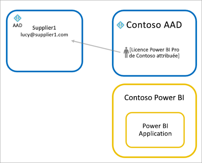
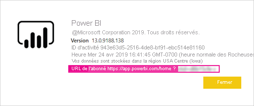

# Distribuer du contenu Power BI à des utilisateurs invités externes avec Azure AD B2B

Power BI permet de partager du contenu avec des utilisateurs invités externes par le biais d’Azure Active Directory Business to Business (Azure AD B2B). En utilisant Azure AD B2B, votre organisation active et régit le partage avec des utilisateurs externes à un emplacement central. Par défaut, l’expérience des invités externes est limitée à la consommation. De plus, vous pouvez autoriser les utilisateurs invités extérieurs à votre organisation à modifier et à gérer du contenu au sein de votre organisation.

Cet article offre une introduction générale à Azure AD B2B dans Power BI. Pour plus d’informations, consultez [Distribuer du contenu Power BI à des utilisateurs invités externes avec Azure AD B2B](../guidance/whitepaper-azure-b2b-power-bi.md).

## Activer l’accès

Veillez à activer la fonctionnalité [Partager du contenu avec des utilisateurs externes](service-admin-portal.md#export-and-sharing-settings) sur le portail d’administration de Power BI avant d’inviter des utilisateurs. Même si cette option est activée, l’utilisateur doit disposer du rôle Inviteur d’invités dans Azure Active Directory pour pouvoir inviter des utilisateurs.

L’option [Autoriser les utilisateurs invités externes à modifier et à gérer le contenu de l’organisation](service-admin-portal.md#allow-external-guest-users-to-edit-and-manage-content-in-the-organization) vous permet d’accorder aux utilisateurs invités la possibilité de voir et créer du contenu dans les espaces de travail, notamment la navigation dans le contenu Power BI de votre organisation.

> [!NOTE]
> Le paramètre [Partager du contenu avec des utilisateurs externes](service-admin-portal.md#export-and-sharing-settings) détermine si Power BI permet d’inviter des utilisateurs externes dans votre organisation. Une fois qu’un utilisateur externe a accepté l’invitation, il devient un utilisateur invité Azure AD B2B de l’organisation. Il apparaît dans les sélecteurs de personnes dans l’ensemble de l’expérience Power BI. Lorsque le paramètre est désactivé, les utilisateurs déjà invités dans votre organisation conservent leurs accès d’origine et continuent de figurer dans les expériences des sélecteurs de personnes. Par ailleurs, les invités ajoutés par le biais de l’approche des [invitations planifiées](#planned-invites) apparaîtront également dans les sélecteurs de personnes. Pour empêcher les utilisateurs invités d’accéder à Power BI, utilisez une stratégie d’accès conditionnel Azure AD.

## Qui pouvez-vous inviter ?

La plupart des adresses e-mail sont prises en charge pour les invitations des utilisateurs, notamment les comptes de messagerie personnelle comme gmail.com, outlook.com et hotmail.com. Azure AD B2B appelle ces adresses des *identités sociales*.

Il n’est pas possible d’inviter des utilisateurs associés à un cloud pour le secteur public, comme [Power BI US Government](service-govus-overview.md).

## Inviter des utilisateurs

Les utilisateurs invités nécessitent des invitations seulement la première fois que vous les invitez dans votre organisation. Pour inviter des utilisateurs, utilisez des invitations planifiées ou ad hoc.

Pour utiliser des invitations ad hoc, servez-vous des fonctionnalités suivantes :

* Partage de rapports et de tableaux de bord
* Liste d’accès à l’application

Les invitations ad hoc ne sont pas prises en charge dans la liste d’accès à l’espace de travail. Utilisez l’[approche des invitations planifiées](#planned-invites) pour ajouter ces utilisateurs à votre organisation. Une fois l’utilisateur externe devenu invité dans votre organisation, ajoutez-le à la liste d’accès à l’espace de travail.

### Invitations planifiées

Utilisez une invitation planifiée si vous savez quels utilisateurs inviter. Le portail Azure ou PowerShell vous permet d’envoyer les invitations. Vous devez disposer du rôle Administrateur d’utilisateurs pour pouvoir inviter des utilisateurs.

Procédez comme suit pour envoyer une invitation dans le portail Azure.

1. Dans le [portail Azure](https://portal.azure.com), sélectionnez **Azure Active Directory**.

1. Sous **Gérer**, sélectionnez **Utilisateurs** > **Tous les utilisateurs** > **Nouvel utilisateur invité**.

    

1. Entrez une **adresse e-mail** et un **message personnel**.

    

1. Sélectionnez **Inviter**.

Pour inviter plusieurs utilisateurs, utilisez PowerShell ou créez une invitation en bloc dans Azure AD. Pour utiliser PowerShell afin de créer l’invitation en bloc, suivez la procédure décrite dans [Tutoriel : Invitation en bloc d’ utilisateurs Azure AD B2B Collaboration avec PowerShell](/azure/active-directory/b2b/bulk-invite-powershell/). Pour utiliser le Portail Azure afin de créer l’invitation en bloc, suivez la procédure décrite dans [Tutoriel : Invitation en bloc d’utilisateurs Azure AD B2B Collaboration](/azure/active-directory/b2b/tutorial-bulk-invite/).

L’utilisateur invité doit sélectionner **Mise en route** dans l’e-mail d’invitation reçu. Il est alors ajouté à l’organisation.

### Invitations ad hoc

Pour inviter à tout moment un utilisateur externe, ajoutez-le à votre tableau de bord ou à votre rapport à l’aide de la fonctionnalité de partage, ou à votre application à partir de la page d’accès. L’exemple suivant montre comment inviter un utilisateur externe à utiliser une application.

L’utilisateur invité reçoit un e-mail indiquant que vous avez partagé l’application avec lui.

L’utilisateur invité doit se connecter en utilisant l’adresse e-mail de son organisation. Il recevra une demande d’acceptation de l’invitation une fois connecté. Après la connexion, l’application s’ouvre pour l’utilisateur invité. Pour revenir à l’application, il doit marquer le lien à l’aide d’un signet ou enregistrer l’e-mail.

## Licences

L’utilisateur invité doit disposer de la licence appropriée pour voir le contenu que vous avez partagé. Il existe trois façons de vérifier que l’utilisateur dispose d’une licence appropriée : utiliser Power BI Premium, attribuer une licence Power BI Pro ou utiliser la licence Power BI Pro de l’invité.

Les [utilisateurs invités qui peuvent modifier et gérer le contenu de l’organisation](service-admin-portal.md#allow-external-guest-users-to-edit-and-manage-content-in-the-organization) ont besoin d’une licence Power BI Pro pour contribuer au contenu des espaces de travail ou partager du contenu avec d’autres utilisateurs.

### Utiliser Power BI Premium

L’affectation de l’espace de travail à la [capacité Power BI Premium](service-premium-what-is.md) permet à l’utilisateur invité d’utiliser l’application sans disposer d’une licence Power BI Pro. Power BI Premium permet également à des applications de tirer parti d’autres capacités, comme des fréquences de rafraîchissement accrues, une capacité dédiée et des modèles de grande taille.

### Affecter une licence Power BI Pro à un utilisateur invité

Si vous affectez une licence Power BI Pro de votre organisation à un utilisateur invité, celui-ci pourra voir le contenu partagé avec lui. Pour plus d’informations sur l’attribution de licences, consultez [Attribution de licences à des utilisateurs via la page Licences](/office365/admin/manage/assign-licenses-to-users#assign-licenses-to-users-on-the-licenses-page). Avant d’attribuer des licences Pro à des utilisateurs invités, consultez le site des [Conditions d’utilisation des produits](https://www.microsoft.com/licensing/terms) pour vérifier que vous êtes en conformité avec les conditions de votre contrat avec Microsoft.

### Utilisateur invité apportant sa propre licence Power BI Pro

Il peut arriver que l’utilisateur invité dispose déjà d’une licence Power BI Pro, attribuée par le biais de sa propre organisation.

## Utilisateurs invités pouvant modifier et gérer du contenu

Quand vous utilisez la fonctionnalité [Autoriser les utilisateurs invités externes à modifier et à gérer le contenu de l’organisation](service-admin-portal.md#allow-external-guest-users-to-edit-and-manage-content-in-the-organization), les utilisateurs invités spécifiés bénéficient d’un accès supplémentaire au système Power BI de votre organisation. Les invités autorisés peuvent voir tout le contenu pour lequel ils disposent d’autorisations, accéder à l’accueil, parcourir les espaces de travail, installer des applications, voir où ils figurent dans la liste d’accès et contribuer au contenu des espaces de travail. Ils peuvent créer des espaces de travail de la nouvelle expérience ou en être administrateurs. Certaines limitations s’appliquent. La section Considérations et limitations liste ces restrictions.

Pour aider les invités autorisés à se connecter à Power BI, fournissez-leur l’URL du locataire. Pour trouver l’URL de locataire, effectuez les étapes suivantes.

1. Dans le menu d’en-tête du service Power BI, sélectionnez l’aide ( **?** ), puis **À propos de Power BI**.

2. Recherchez la valeur en regard de **URL de locataire**. Partagez l’URL du locataire avec les utilisateurs invités autorisés.

    

## Considérations et limitations

* Par défaut, Azure AD B2B limite les invités externes à la seule consommation du contenu. Les invités Azure AD B2B externes peuvent consulter les applications, les tableaux de bord et les rapports, exporter des données, et créer des abonnements par courrier pour les tableaux de bord et les rapports. Ils ne peuvent pas accéder aux espaces de travail ou publier leur propre contenu. Pour supprimer ces restrictions, vous pouvez utiliser la fonctionnalité [Autoriser les utilisateurs invités externes à modifier et à gérer le contenu de l’organisation](service-admin-portal.md#allow-external-guest-users-to-edit-and-manage-content-in-the-organization).

* Une licence Power BI Pro est nécessaire pour inviter des utilisateurs. Les utilisateurs de la version Pro d’essai ne peuvent pas inviter d’utilisateurs dans Power BI.

* Certaines expériences ne sont pas disponibles pour les [utilisateurs invités qui peuvent modifier et gérer le contenu de l’organisation](service-admin-portal.md#allow-external-guest-users-to-edit-and-manage-content-in-the-organization). Pour mettre à jour ou publier des rapports, ils doivent utiliser le service Power BI, notamment Obtenir les données pour charger des fichiers Power BI Desktop.  Les expériences suivantes ne sont pas prises en charge :
  * Diriger la publication de Power BI Desktop vers le service Power BI
  * Les utilisateurs invités ne peuvent pas utiliser Power BI Desktop pour se connecter à des jeux de données du service dans le service Power BI
  * Espaces de travail classiques liés à Groupes Microsoft 365
    * Les utilisateurs invités ne peuvent pas créer ces espaces de travail ni en être administrateurs
    * Les utilisateurs invités peuvent être membres
  * L’envoi d’invitations ad hoc n’est pas pris en charge pour les listes d’accès aux espaces de travail
  * Power BI Publisher pour Excel n’est pas pris en charge pour les utilisateurs invités
  * Les utilisateurs invités ne peuvent pas installer une passerelle Power BI Gateway et la connecter à votre organisation
  * Les utilisateurs invités ne peuvent pas installer d’applications à publier dans toute l’organisation
  * Les utilisateurs invités ne peuvent pas utiliser, créer, mettre à jour ou installer des packs de contenu d’organisation
  * Les utilisateurs invités ne peuvent pas utiliser la fonctionnalité Analyser dans Excel
  * Les utilisateurs invités ne peuvent pas être @mentioned dans les commentaires
  * Les utilisateurs invités ne peuvent pas utiliser des abonnements
  * Les utilisateurs invités qui utilisent cette fonctionnalité doivent disposer d’un compte professionnel ou scolaire

* Les utilisateurs invités utilisant des identités sociales seront confrontés à d’autres limitations en raison de restrictions de connexion.
  * Ils peuvent utiliser les expériences de consommation dans le service Power BI par le biais d’un navigateur web.
  * Ils ne peuvent pas utiliser les applications Power BI Mobile
  * Ils ne peuvent pas se connecter quand un compte professionnel ou scolaire est nécessaire

* Pour l’instant, cette fonctionnalité n’est pas disponible avec le composant WebPart de rapport Power BI SharePoint Online.

* Des paramètres Azure Active Directory peuvent limiter ce que les utilisateurs invités externes peuvent faire dans l’ensemble de votre organisation. Ils s’appliquent également à votre environnement Power BI. La documentation suivante décrit les paramètres :
  * [Gérer les paramètres de collaboration externes](/azure/active-directory/b2b/delegate-invitations#configure-b2b-external-collaboration-settings)
  * [Autoriser ou bloquer les invitations aux utilisateurs B2B provenant d’organisations spécifiques ](https://docs.microsoft.com/azure/active-directory/b2b/allow-deny-list)
  * [Utiliser l’accès conditionnel pour autoriser ou bloquer l’accès](/azure/active-directory/conditional-access/concept-conditional-access-cloud-apps)

* Vous pouvez partager du contenu d’un cloud pour le secteur public, comme GCC, avec un utilisateur du cloud commercial externe. Toutefois, l’utilisateur invité ne peut pas utiliser sa propre licence. Le contenu doit être en capacité Premium pour permettre l’accès. Autre possibilité, vous pouvez attribuer une licence Power BI Pro au compte invité.

* Le partage en dehors de votre organisation n’est pas pris en charge pour les clouds nationaux, comme les instances de cloud Allemagne et Chine. Créez des comptes d’utilisateur dans votre organisation qui permettront aux utilisateurs externes d’accéder au contenu.

* Si vous partagez du contenu directement avec un utilisateur invité, Power BI lui envoie un e-mail avec le lien. Pour éviter l’envoi d’un e-mail, ajoutez l’utilisateur invité à un groupe de sécurité et partagez le contenu avec le groupe de sécurité.  

## Étapes suivantes

Pour plus d’informations, notamment sur la façon dont fonctionne la sécurité au niveau des lignes, consultez le livre blanc : [Distribuer du contenu Power BI à des utilisateurs invités externes à l’aide d’Azure AD B2B](https://aka.ms/powerbi-b2b-whitepaper).

Pour plus d’informations sur Azure AD B2B, consultez [Qu’est-ce qu’Azure AD B2B Collaboration ?](/azure/active-directory/active-directory-b2b-what-is-azure-ad-b2b/).
