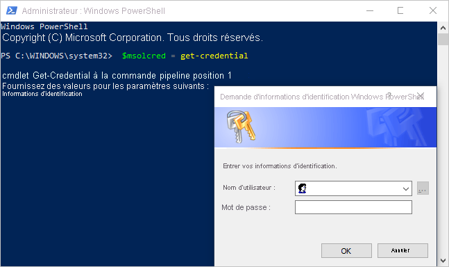

# <a name="administering-power-bi---frequently-asked-questions-faq"></a>Administration de Power BI - Forum Aux Questions (FAQ)

Cet article répond aux questions fréquemment posées concernant l’administration de Power BI. Pour une vue d’ensemble de l’administration de Power BI, consultez [Présentation de l’administration de Power BI](service-admin-administering-power-bi-in-your-organization.md).

## <a name="whats-in-this-article"></a>Que contient cet article ?

### <a name="sign-up-for-power-bi-section"></a>S’inscrire à la section Power BI

* [Avec PowerShell](#using-powershell)
* [Comment les utilisateurs peuvent-ils s’inscrire à Power BI ?](#how-do-users-sign-up-for-power-bi)
* [Comment les utilisateurs individuels de mon organisation peuvent-ils s’inscrire ?](#how-do-individual-users-in-my-organization-sign-up)
* [Comment empêcher les utilisateurs de rejoindre mon locataire Office 365 existant ?](#how-can-i-prevent-users-from-joining-my-existing-microsoft-365-tenant)
* [Comment puis-je permettre aux utilisateurs de s’associer à mon locataire Office 365 existant ?](#how-can-i-allow-users-to-join-my-existing-microsoft-365-tenant)
* [Comment vérifier que le blocage est activé dans le locataire ?](#how-do-i-check-if-i-have-the-block-on-in-the-tenant)
* [Comment empêcher les utilisateurs existants d’utiliser Power BI ?](#how-can-i-prevent-my-existing-users-from-starting-to-use-power-bi)
* [Comment puis-je autoriser mes utilisateurs existants à s’inscrire à Power BI ?](#how-can-i-allow-my-existing-users-to-sign-up-for-power-bi)

### <a name="administration-of-power-bi-section"></a>Administration de la section Power BI

* [Quelles seront les conséquences sur ma méthode actuelle de gestion des identités pour les utilisateurs de mon organisation ?](#how-will-this-change-the-way-i-manage-identities-for-users-in-my-organization-today)
* [Comment faire pour gérer Power BI ?](#how-do-we-manage-power-bi)
* [Quelle est la procédure à suivre pour gérer un locataire créé par Microsoft pour mes utilisateurs ?](#what-is-the-process-to-manage-a-tenant-created-by-microsoft-for-my-users)
* [Si j’ai plusieurs domaines, puis-je contrôler le client (tenant) Microsoft 365 auquel sont ajoutés les utilisateurs ?](#if-i-have-multiple-domains-can-i-control-the-microsoft-365-tenant-that-users-get-added-to)
* [Comment supprimer Power BI pour les utilisateurs déjà inscrits ?](#how-do-i-remove-power-bi-for-users-that-already-signed-up)
* [Comment connaître la date à laquelle les nouveaux utilisateurs ont rejoint mon locataire ?](#how-do-i-know-when-new-users-have-joined-my-tenant)
* [Quels sont les éventuels autres aspects auxquels je dois me préparer ?](#are-there-any-additional-things-i-should-prepare-for)
* [Où est situé mon locataire Power BI ?](#where-is-my-power-bi-tenant-located)
* [Présentation du contrat SAL Power BI](#what-is-the-power-bi-sla)
* [Comment Power BI gère la haute disponibilité et le basculement ?](#how-does-power-bi-handle-high-availability-and-failover)

### <a name="security-in-power-bi-section"></a>Sécurité dans la section Power BI

* [Power BI répond-il aux exigences de conformité nationales, régionales et sectorielles ?](#does-power-bi-meet-national-regional-and-industry-specific-compliance-requirements)
* [Comment fonctionne la sécurité dans Power BI ?](#how-does-security-work-in-power-bi)

## <a name="sign-up-for-power-bi"></a>S’inscrire à Power BI

### <a name="using-powershell"></a>Avec PowerShell

Certaines procédures de cette section nécessitent des scripts Windows PowerShell. Si vous n’êtes pas familiarisé avec PowerShell, nous vous recommandons le [guide de prise en main de PowerShell](https://go.microsoft.com/fwlink/p/?LinkID=286814). Pour exécuter les scripts, commencez par installer la dernière version 64 bits d’[Azure Active Directory PowerShell for Graph](/powershell/azure/active-directory/).

### <a name="how-do-users-sign-up-for-power-bi"></a>Comment les utilisateurs peuvent-ils s’inscrire à Power BI ?

En tant qu’administrateur Microsoft 365, vous pouvez vous inscrire à Power BI via le [site web de Power BI](https://powerbi.microsoft.com) ou via la page [Acheter des services](https://admin.microsoft.com/AdminPortal/Home#/catalog) du Centre d’administration Microsoft 365. Quand un administrateur Microsoft 365 s’inscrit à Power BI, il peut attribuer des licences aux utilisateurs qui doivent y accéder.

En outre, les utilisateurs de votre organisation peuvent s’inscrire à Power BI sur le [site web de Power BI](https://powerbi.microsoft.com). Quand un utilisateur de votre organisation s’inscrit à Power BI, le service lui attribue automatiquement une licence Power BI. Pour plus d’informations, consultez les articles [Inscription à Power BI en tant que particulier](../fundamentals/service-self-service-signup-for-power-bi.md) et [Gestion des licences Power BI dans votre organisation](service-admin-licensing-organization.md).

### <a name="how-do-individual-users-in-my-organization-sign-up"></a>Comment les utilisateurs individuels de mon organisation peuvent-ils s’inscrire ?

Trois scénarios peuvent s’appliquer aux utilisateurs de votre organisation :

* **Scénario 1** : Votre organisation a déjà un environnement Microsoft 365 existant, et l’utilisateur qui s’inscrit à Power BI a déjà un compte Microsoft 365.
    Dans ce scénario, si un utilisateur a déjà un compte professionnel ou scolaire dans le locataire (par exemple contoso.com), mais n’a pas encore Power BI, Microsoft active simplement le plan (gratuit) Power BI pour ce compte. L’utilisateur est automatiquement informé sur la manière d’utiliser le service Power BI.

* **Scénario 2** : Votre organisation a déjà un environnement Microsoft 365, mais l’utilisateur qui s’inscrit à Power BI n’a pas de compte Microsoft 365.
    Dans ce scénario, l’utilisateur a une adresse e-mail dans le domaine de votre organisation (par exemple contoso.com), mais il n’a pas encore de compte Microsoft 365. Dans ce cas, l’utilisateur peut s’inscrire à Power BI et reçoit automatiquement un compte. Cette action lui permet d’accéder au service Power BI. Par exemple, si une employée nommée Nancy utilise son adresse e-mail professionnelle (comme nancy@contoso.com) pour s’inscrire, Microsoft ajoute automatiquement Nancy en tant qu’utilisatrice dans l’environnement Microsoft 365 de Contoso et active Power BI pour son compte.

* **Scénario 3** : Votre organisation n’a pas d’environnement Microsoft 365 connecté à votre domaine de messagerie.
    Aucune action administrative n’est requise pour que votre organisation tire parti de Power BI. Le service ajoute des utilisateurs à un nouveau répertoire utilisateur cloud uniquement. Vous pouvez également choisir de prendre le contrôle en tant qu’administrateur général de Microsoft 365 pour le client (tenant) et de les gérer.

> [!IMPORTANT]
> Si votre organisation possède plusieurs domaines de messagerie et si vous préférez que toutes les extensions d’adresse de messagerie appartiennent au même client, ajoutez tous les domaines d’adresse de messagerie à un client Azure Active Directory avant que des utilisateurs ne s’inscrivent. Une fois que vous avez créé des utilisateurs, aucun mécanisme automatique ne permet d’en déplacer d’un locataire à l’autre. Pour plus d’informations sur ce processus, consultez [Si j’utilise plusieurs domaines, puis-je contrôler le client (tenant) Microsoft 365 auquel sont ajoutés les utilisateurs ?](#if-i-have-multiple-domains-can-i-control-the-microsoft-365-tenant-that-users-get-added-to) plus loin dans cet article et [Ajouter un domaine à Microsoft 365](/office365/admin/setup/add-domain/).

### <a name="how-can-i-prevent-users-from-joining-my-existing-microsoft-365-tenant"></a>Comment empêcher les utilisateurs de se joindre à mon client (tenant) Microsoft 365 existant ?

En tant qu’administrateur général, vous disposez de plusieurs moyens pour empêcher les utilisateurs de se joindre à votre locataire Microsoft 365 existant. Si vous bloquez l’accès, les tentatives d’inscription des utilisateurs échouent, et un message s’affiche les invitant à contacter l’administrateur de leur organisation. Il est inutile de répéter ce processus si vous avez déjà désactivé la distribution automatique des licences (par exemple, via Office 365 Éducation pour les étudiants, les enseignants et le personnel).

Utilisez le script PowerShell suivant pour empêcher les nouveaux utilisateurs de s’associer à un client géré. ([En savoir plus sur PowerShell][1].)

```powershell
$msolcred = get-credential
connect-msolservice -credential $msolcred

Set-MsolCompanySettings -AllowEmailVerifiedUsers $false
```

> [!NOTE]
> Le blocage de l’accès empêche les nouveaux utilisateurs de votre organisation de s’inscrire à Power BI. Les utilisateurs qui s’inscrivent à Power BI avant la désactivation des nouvelles inscriptions conservent leurs licences. Pour supprimer un utilisateur, consultez [Comment supprimer Power BI pour les utilisateurs déjà inscrits ?](#how-do-i-remove-power-bi-for-users-that-already-signed-up) plus loin dans cet article.

### <a name="how-can-i-allow-users-to-join-my-existing-microsoft-365-tenant"></a>Comment puis-je permettre à des utilisateurs de se joindre à mon client (tenant) Microsoft 365 existant ?

Utilisez le script PowerShell suivant pour permettre aux nouveaux utilisateurs de s’associer à un locataire géré. ([En savoir plus sur PowerShell][1].)

```powershell
$msolcred = get-credential
connect-msolservice -credential $msolcred

Set-MsolCompanySettings -AllowEmailVerifiedUsers $true
```

### <a name="how-do-i-check-if-i-have-the-block-on-in-the-tenant"></a>Comment vérifier que le blocage est activé dans le locataire ?

Utilisez le script PowerShell suivant pour vérifier les paramètres. *AllowEmailVerifiedUsers* doit avoir la valeur False. ([En savoir plus sur PowerShell][1].)

```powershell
$msolcred = get-credential
connect-msolservice -credential $msolcred

Get-MsolCompanyInformation | fl allow*
```

### <a name="how-can-i-prevent-my-existing-users-from-starting-to-use-power-bi"></a>Comment empêcher les utilisateurs existants d’utiliser Power BI ?

Le paramètre Azure AD qui contrôle cette option est **AllowAdHocSubscriptions**. La plupart des locataires ont ce paramètre défini sur *true*, ce qui signifie qu’il est activé. Si vous avez acquis Power BI via un partenaire, ce paramètre peut être défini sur *false*, ce qui signifie qu’il est désactivé.

Utilisez le script PowerShell suivant pour désactiver les abonnements ad hoc. ([En savoir plus sur PowerShell][1].)

1. Connectez-vous à Azure Active Directory avec vos informations d’identification Microsoft 365. La première ligne du script PowerShell suivant vous invite à entrer vos informations d’identification. La deuxième ligne établit la connexion à Azure Active Directory.

    ```powershell
     $msolcred = get-credential
     connect-msolservice -credential $msolcred
    ```

   

1. Une fois que vous êtes connecté, exécutez la commande suivante pour voir comment votre locataire est actuellement configuré.

    ```powershell
     Get-MsolCompanyInformation | fl AllowAdHocSubscriptions
    ```

1. Exécutez la commande suivante pour activer (`$true`) ou désactiver (`$false`) **AllowAdHocSubscriptions**.

    ```powershell
     Set-MsolCompanySettings -AllowAdHocSubscriptions $false
    ```

> [!NOTE]
> L’indicateur **AllowAdHocSubscriptions** permet de contrôler plusieurs fonctionnalités d’utilisateur dans votre organisation, notamment la possibilité pour les utilisateurs de s’inscrire au service Azure Rights Management. La modification de cet indicateur affecte toutes ces fonctionnalités. Avec la valeur *false*, les utilisateurs peuvent toujours s’inscrire pour un essai individuel de Power BI Pro.

### <a name="how-can-i-allow-my-existing-users-to-sign-up-for-power-bi"></a>Comment puis-je autoriser mes utilisateurs existants à s’inscrire à Power BI ?

Pour permettre aux utilisateurs existants de s’inscrire à Power BI, exécutez la commande indiquée dans la section précédente, mais indiquez la valeur `$true` au lieu de la valeur `$false` à la dernière étape.

## <a name="administration-of-power-bi"></a>Administration de Power BI

### <a name="how-will-this-change-the-way-i-manage-identities-for-users-in-my-organization-today"></a>Quelles seront les conséquences sur ma méthode actuelle de gestion des identités pour les utilisateurs de mon organisation ?

Trois scénarios peuvent s’appliquer aux utilisateurs de votre organisation :

* **Scénario 1** : Si votre organisation a déjà un environnement Microsoft 365 et que tous les utilisateurs de celle-ci ont un compte Microsoft 365, la gestion des identités ne change pas.

* **Scénario 2** : Si votre organisation a déjà un environnement Microsoft 365, mais que tous les utilisateurs de celle-ci n’ont pas de compte Microsoft 365, Microsoft crée un utilisateur dans le client (tenant) et attribue des licences en fonction de l’adresse e-mail professionnelle ou scolaire de l’utilisateur.

    En conséquence, le nombre d’utilisateurs que vous gérez à un moment donné augmente à mesure que les utilisateurs de votre organisation s’inscrivent pour bénéficier du service.

* **Scénario 3** : Si votre organisation n’a pas d’environnement Microsoft 365 connecté à votre domaine de messagerie, la gestion des identités ne change pas.

    Le service ajoute les utilisateurs à un nouvel annuaire d’utilisateurs cloud uniquement, dont vous pouvez choisir de prendre le contrôle en tant qu’administrateur général Microsoft 365 et de les gérer.

### <a name="how-do-we-manage-power-bi"></a>Comment faire pour gérer Power BI ?

Power BI fournit un portail d’administration Power BI pour les utilisateurs du rôle d’administrateur général Microsoft 365 et pour les utilisateurs du rôle d’administrateur du service Power BI. Pour utiliser le portail d’administration Power BI, vous devez marquer votre compte en tant que compte d’**administrateur général** dans Microsoft 365 ou Azure Active Directory, ou quelqu’un doit attribuer le rôle d’administrateur du service Power BI à votre compte d’utilisateur. Pour plus d’informations, consultez [Présentation du rôle d’administrateur Power BI](service-admin-role.md) et [Portail d’administration Power BI](service-admin-portal.md). Le portail permet de contrôler les paramètres au niveau du client (tenant) et de visualiser des statistiques d’utilisation de Power BI, et il contient un lien vers le Centre d’administration Microsoft 365 pour gérer les utilisateurs et les groupes.

### <a name="what-is-the-process-to-manage-a-tenant-created-by-microsoft-for-my-users"></a>Quel est la procédure à suivre pour gérer un client créé par Microsoft pour mes utilisateurs ?

Lorsqu’un utilisateur libre-service s’inscrit à un service cloud qui utilise Azure AD, le service l’ajoute à un annuaire Azure AD non managé basé sur son domaine de courrier. Vous pouvez revendiquer et gérer un locataire que quelqu’un a créé selon un processus appelé *prise de contrôle par l’administrateur*. Pour plus d’informations, consultez [Prise de contrôle d’un annuaire non managé en tant qu’administrateur dans Azure Active Directory](/azure/active-directory/users-groups-roles/domains-admin-takeover). Le type de prise de contrôle varie selon qu’il existe ou non un locataire managé associé à votre domaine :

* Power BI prend en charge la prise de contrôle par l’administrateur interne. Lorsque vous effectuez une prise de contrôle par l’administrateur _interne_ d’un annuaire Azure non géré, vous êtes ajouté en tant qu’administrateur général de l’annuaire non géré. Aucun utilisateur, domaine ou plan de service n’est migré vers un autre annuaire que vous administrez.

* Power BI ne prend plus en charge la prise de contrôle par un administrateur externe. Lorsque vous effectuez une prise de contrôle par un administrateur _externe_ d’un annuaire Azure non géré, vous ajoutez le nom de domaine DNS de l’annuaire non géré à votre annuaire Azure géré. Une prise de contrôle externe entraîne la perte de l’accès à tout le contenu Power BI sur le locataire non managé d’origine. Les rapports Power BI doivent être republiés sur le nouveau locataire, et les tableaux de bord et les applications Power BI doivent être recréés dans le nouveau locataire.

### <a name="if-i-have-multiple-domains-can-i-control-the-microsoft-365-tenant-that-users-get-added-to"></a>Si j’ai plusieurs domaines, puis-je contrôler le client (tenant) Microsoft 365 auquel sont ajoutés les utilisateurs ?

Si vous ne faites rien, le service crée un locataire pour chaque domaine et sous-domaine de courrier d’utilisateur. Si vous voulez regrouper tous les utilisateurs dans un seul client quelle que soit leur extension d’adresse de messagerie : Créez un locataire cible à l’avance ou utilisez un locataire existant. Ajoutez tous les domaines et sous-domaines existants que vous souhaitez consolider au sein de ce locataire. Tous les utilisateurs dont les adresses e-mail se terminent par ces domaines et sous-domaines sont automatiquement associés au locataire cible lorsqu’ils s’inscrivent.

> [!IMPORTANT]
> Une fois que vous avez créé des utilisateurs, aucun mécanisme automatique pris en charge ne permet d’en déplacer d’un locataire à l’autre. Pour plus d’informations sur l’ajout de domaines à un même locataire Microsoft 365, consultez [Ajouter vos utilisateurs et votre domaine à Microsoft 365](/office365/admin/setup/add-domain/).

### <a name="how-do-i-remove-power-bi-for-users-that-already-signed-up"></a>Comment supprimer Power BI pour les utilisateurs déjà inscrits ?

Si vous ne voulez pas qu’un utilisateur déjà inscrit à Power BI puisse accéder à ce service, vous pouvez supprimer sa licence Power BI.

1. Accédez au [Centre d’administration Microsoft 365](https://admin.microsoft.com/AdminPortal/Home#/homepage).

1. Dans le volet de navigation, sélectionnez **Utilisateurs** > **Utilisateurs actifs**.

1. Recherchez l’utilisateur dont vous voulez supprimer la licence, puis sélectionnez son nom.

    Vous pouvez également effectuer une gestion en bloc des licences utilisateurs. Pour ce faire, sélectionnez plusieurs utilisateurs, puis sélectionnez **Modifier les licences de produits**.

1. À la page de détails de l’utilisateur, à côté de **Licences de produits** et sélectionnez **Modifier**.

1. Définissez **Power BI (gratuit)** ou **Power BI Pro** sur **Désactivé**, selon la licence que vous avez appliquée à son compte.

1. Sélectionnez **Enregistrer**.

### <a name="how-do-i-know-when-new-users-have-joined-my-tenant"></a>Comment connaître la date à laquelle les nouveaux utilisateurs ont rejoint mon client ?

Les utilisateurs qui se sont joints à votre locataire via une inscription en libre-service se voient attribuer une licence unique, que vous pouvez filtrer dans votre volet des utilisateurs actifs du tableau de bord d’administration. Pour créer cette nouvelle vue, procédez comme suit.

1. Accédez au [Centre d’administration Microsoft 365](https://admin.microsoft.com/AdminPortal/Home#/homepage).

1. Dans le volet de navigation, sélectionnez **Utilisateurs** > **Utilisateurs actifs**.

1. Dans le menu **Vues**, sélectionnez **Ajouter un affichage personnalisé**.

1. Nommez votre nouvelle vue, puis, sous **Licence produit attribuée**, sélectionnez **Power BI (gratuit)** ou **Power BI Pro**.

    Vous ne pouvez sélectionner qu’une seule licence par vue. Si votre organisation a à la fois des licences **Power BI (gratuit)** et des licences **Power BI Pro**, vous devrez créer deux vues.

1. Entrez d’autres conditions de votre choix, puis sélectionnez **Ajouter**.

1. La nouvelle vue est disponible dans le menu **Vues** dès que vous l’avez créée.

### <a name="are-there-any-additional-things-i-should-prepare-for"></a>Quels sont les éventuels autres aspects auxquels je dois me préparer ?

Vous pouvez avoir à gérer une augmentation des demandes de réinitialisation de mot de passe. Pour plus d’informations sur ce processus, consultez [Réinitialiser le mot de passe d’un utilisateur dans Office 365](/office365/admin/add-users/reset-passwords).

Vous pouvez supprimer un utilisateur de votre locataire en suivant le processus standard dans le Centre d’administration Microsoft 365. Cependant, si l’utilisateur a toujours une adresse e-mail active au sein de votre organisation, il peut s’associer au client, sauf si vous empêchez tous les utilisateurs de le faire.

### <a name="where-is-my-power-bi-tenant-located"></a>Où est situé mon client Power BI ?

Pour plus d’informations sur la région de données où se trouve votre locataire Power BI, consultez [Où est situé mon locataire Power BI ?](service-admin-where-is-my-tenant-located.md).

### <a name="what-is-the-power-bi-sla"></a>Présentation du contrat SLA Power BI

Pour plus d’informations sur le contrat de niveau de service Power BI, consultez les [termes du contrat de licence et la documentation](https://www.microsoftvolumelicensing.com/DocumentSearch.aspx?Mode=3&DocumentTypeId=37) dans la section **Gestion des licences** du site web Microsoft Licensing.

### <a name="how-does-power-bi-handle-high-availability-and-failover"></a>Comment Power BI gère la haute disponibilité et le basculement ?

Pour plus d’informations sur la haute disponibilité et le basculement, consultez [FAQ sur la haute disponibilité, le basculement et la reprise d’activité avec Power BI](service-admin-failover.md).

## <a name="security-in-power-bi"></a>Sécurité dans Power BI

### <a name="does-power-bi-meet-national-regional-and-industry-specific-compliance-requirements"></a>Power BI répond-il aux exigences de conformité nationales, régionales et sectorielles ?

Pour plus d’informations sur la conformité Power BI, consultez le [Centre de gestion de la confidentialité Microsoft](https://www.microsoft.com/TrustCenter/CloudServices/business-application-platform/default.aspx).

### <a name="how-does-security-work-in-power-bi"></a>Comment fonctionne la sécurité dans Power BI ?

Microsoft a créé Power BI sur les bases de Microsoft 365, qui lui-même repose sur des services Azure, comme Azure Active Directory. Pour obtenir une vue d’ensemble de l’architecture de Power BI, consultez [Sécurité de Power BI](service-admin-power-bi-security.md).

## <a name="next-steps"></a>Étapes suivantes

[Portail d’administration Power BI](service-admin-portal.md)  
[Présentation du rôle d’administrateur Power BI](service-admin-role.md)  
[Inscription en libre-service à Power BI](../fundamentals/service-self-service-signup-for-power-bi.md)  
[Achat de Power BI Pro](service-admin-purchasing-power-bi-pro.md)  
[Qu’est-ce que Power BI Premium ?](service-premium-what-is.md)  
[Comment acheter Power BI Premium ?](service-admin-premium-purchase.md)  
[Livre blanc sur Power BI Premium](https://aka.ms/pbipremiumwhitepaper)  
[Gérer votre groupe dans Power BI et Microsoft 365](../collaborate-share/service-manage-app-workspace-in-power-bi-and-office-365.md)  
[Gestion des comptes professionnels ou scolaires](/office365/servicedescriptions/office-365-platform-service-description/user-account-management/)  
[Gestion des groupes Microsoft 365](/office365/admin/email/create-edit-or-delete-a-security-group/)  

D’autres questions ? [Essayez d’interroger la communauté Power BI](https://community.powerbi.com/)

[1]: https://docs.microsoft.com/powershell/scripting/overview
