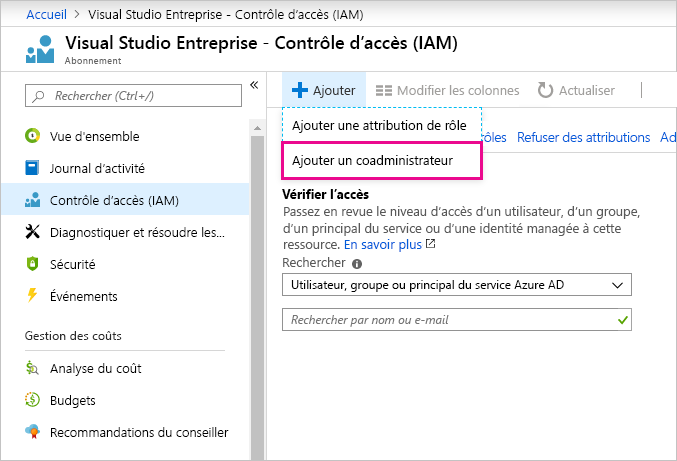

# Utilisation du même compte pour Power BI et Azure

Si vous utilisez à la fois Power BI et Azure, vous souhaiterez peut-être utiliser la même connexion pour les deux services afin de ne pas avoir à entrer votre mot de passe à deux reprises.

Power BI vous connecte avec votre compte professionnel, associé à votre adresse de messagerie professionnelle ou scolaire.  Azure vous connecte avec un compte Microsoft ou avec votre compte professionnel.

Si vous souhaitez utiliser la même connexion pour Azure et Power BI, veillez à vous connecter à Azure avec votre compte professionnel.

**Que se passe-t-il si je me connecte déjà à Azure avec mon compte Microsoft ?**

Vous pouvez ajouter votre compte professionnel en tant que coadministrateur dans Azure en suivant ces étapes :

1. Connectez-vous au [portail Azure](https://portal.azure.com/). Si vous êtes un utilisateur dans plusieurs annuaires Azure, sélectionnez **Abonnements** , puis filtrez pour afficher uniquement l’annuaire et les abonnements que vous souhaitez modifier.

1. Dans le volet de navigation, sélectionnez **Contrôle d’accès (IAM)** , puis sélectionnez **Ajouter** \> **Ajouter un coadministrateur**.

    

1. Entrez l’adresse de messagerie associée à votre compte professionnel, puis sélectionnez **Ajouter**.

1. La prochaine fois que vous vous connectez au portail Azure, utilisez votre adresse de messagerie professionnelle.

D’autres questions ? [Posez vos questions à la communauté Power BI](https://community.powerbi.com/)
