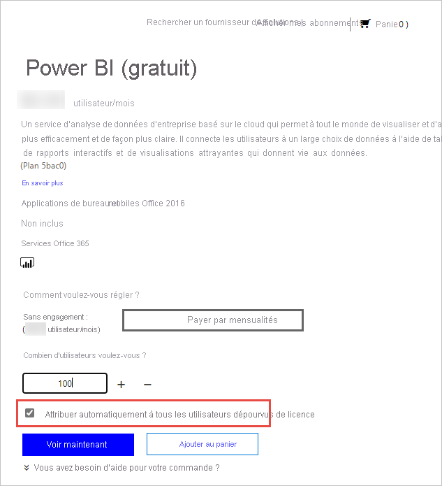

# Gestion des licences du service Power BI pour les utilisateurs de votre organisation

Ce qu’un utilisateur peut faire dans le service Power BI dépend du type de licence par utilisateur dont il dispose. Le niveau d’accès fourni par sa licence varie selon que l’espace de travail auquel vous accédez est attribué à la capacité Power BI Premium. Tous les utilisateurs du service Power BI doivent disposer d’une licence.

Il existe deux moyens pour les utilisateurs d’obtenir une licence. Avec les fonctionnalités d’inscription en libre-service et leur compte professionnel ou scolaire, ils peuvent bénéficier de leur propre licence gratuite ou Pro. Sinon, les administrateurs peuvent acquérir un abonnement Power BI et affecter des licences aux utilisateurs.

Cet article porte sur l’achat de services et de licences par utilisateur du point de vue de l’administrateur. Pour savoir comment obtenir sa propre licence en tant qu’utilisateur, consultez [Inscription à Power BI à titre individuel](../fundamentals/service-self-service-signup-for-power-bi.md).

## Achat et affectation de licences Pro

Vous devez disposer d’un rôle d’administrateur pour acheter ou affecter des licences au sein de votre organisation. Ces rôles sont attribués à l’aide du Centre d’administration Azure Active Directory ou du Centre d’administration Microsoft 365. Le tableau suivant indique le rôle requis pour effectuer des tâches liées à l’achat et à la gestion des licences. Pour plus d’informations sur les rôles d’administrateur dans Azure Active Directory, consultez [Affichage et attribution des rôles d’administrateur dans Azure Active Directory](/azure/active-directory/users-groups-roles/directory-manage-roles-portal). Pour plus d’informations sur les rôles d’administrateur dans Microsoft 365, et notamment les meilleures pratiques, consultez [À propos des rôles d’administrateur](/microsoft-365/admin/add-users/about-admin-roles?view=o365-worldwide).

| Qui peut acheter des services et des licences ? | Qui peut gérer les licences utilisateur ? |
| --------------- | --------------- |
| Administrateur de facturation | Administrateur de licence |
| Administrateur général | Administrateur d’utilisateurs |
|  | Administrateur général |

Ces rôles gèrent l’organisation. Pour plus d’informations sur les rôles d’Administrateur de service Power BI, consultez [Présentation des rôles d’Administrateur de service Power BI](service-admin-role.md).

## Obtenir Power BI pour votre organisation

Pour plus d’informations sur la tarification, consultez [Comparaison des tarifs et des produits](https://powerbi.microsoft.com/pricing/).

Un administrateur général ou un administrateur de facturation peut s’inscrire au service Power BI et acheter des licences pour les utilisateurs de son organisation. Si vous ne souhaitez pas passer à l’achat tout de suite, sélectionnez l’essai de Power BI Pro. Vous bénéficierez de 25 licences à utiliser pendant un mois. Pour des instructions pas à pas sur l’inscription, consultez [Souscription d’un abonnement Power BI pour une organisation](service-admin-org-subscription.md).

## À propos de l’inscription en libre-service

Un utilisateur individuel peuvent obtenir sa propre licence Power BI en s’inscrivant avec son compte professionnel ou scolaire. Dans le cadre d’une licence gratuite, il peut explorer Power BI pour la visualisation et l’analyse des données personnelles avec Mon espace de travail, mais pas partager avec d’autres utilisateurs. Une licence Power BI Pro est nécessaire pour partager du contenu. Les utilisateurs peuvent passer au type de licence Pro par le biais d’une mise à niveau ou s’inscrire directement à Pro, si l’organisation utilise le cloud commercial. Ni l’achat direct de Pro ni la mise à niveau vers Pro ne sont disponibles pour les établissements d’enseignement et les organisations déployées dans des clouds Azure Government, Azure Allemagne ou Azure China 21Vianet.

Si vous ne souhaitez pas que les utilisateurs de votre organisation utilisent l’inscription en libre-service, consultez [Activation et désactivation de l’inscription en libre-service](service-admin-disable-self-service.md) pour savoir comment la désactiver.

La désactivation de l’inscription en libre-service empêche les utilisateurs d’explorer Power BI à des fins de visualisation et d’analyse des données. Si vous bloquez l’inscription individuelle, il peut être intéressant d’obtenir des licences Power BI (gratuit) pour votre organisation et de les affecter à tous les utilisateurs. Suivez la procédure ci-dessous pour affecter automatiquement une licence Power BI (gratuit) à tous les utilisateurs existants :

1. Connectez-vous au [Centre d’administration Microsoft 365](https://admin.microsoft.com) avec vos informations d’identification d’administrateur général ou d’administrateur de facturation.
1. Dans le menu encadré de gauche, sélectionnez **Facturation** > **Acheter des services**.
1. Recherchez l’offre Power BI (gratuit) ou faites défiler la liste pour le trouver. Sélectionnez-la, puis **Obtenir maintenant**.
1. Entrez le nombre de licences nécessaires pour couvrir tous vos utilisateurs.
1. Sélectionnez **Attribuer automatiquement à tous les utilisateurs dépourvus de licence** , puis validez.

  

Si vous souhaitez voir quels utilisateurs de votre organisation disposent déjà d’une licence, consultez [Affichage et gestion des licences utilisateur](service-admin-manage-licenses.md) pour savoir comment procéder.

## Types de licences et fonctionnalités

Il existe deux types de licences Power BI par utilisateur : gratuite et Pro. Le type de licence nécessaire pour un utilisateur est déterminé par l’endroit où le contenu est stocké et par les interactions souhaitées avec ce contenu. L’emplacement de stockage dépend du [type d’abonnement](#subscription-types) de l’organisation.

Il existe un type d’abonnement, [Power BI Premium](service-admin-premium-purchase.md), qui permet aux utilisateurs disposant d’une licence gratuite d’agir sur le contenu des espaces de travail de capacité Premium. En dehors de la capacité Premium, un utilisateur disposant d’une licence gratuite ne peut utiliser le service Power BI que pour se connecter aux données et créer des rapports et des tableaux de bord dans **Mon espace de travail**. Il ne peut pas partager du contenu avec d’autres personnes ni en publier sur d’autres espaces de travail. Pour en savoir plus sur les types d’espaces de travail, consultez [Types des espaces de travail](../consumer/end-user-workspaces.md#types-of-workspaces).

Un abonnement Power BI standard utilise la capacité partagée. Si le contenu est stocké dans une capacité partagée, les utilisateurs disposant d’une licence Power BI Pro ne peuvent collaborer qu’avec d’autres utilisateurs Power BI Pro. Ils ont la possibilité de consommer du contenu publié par d’autres personnes, de publier du contenu sur des espaces de travail d’application, de partager des tableaux de bord et de s’abonner à des tableaux de bord et à des rapports.  Quand les espaces de travail sont en capacité Premium, les utilisateurs Pro peuvent distribuer du contenu à des utilisateurs dépourvus de licence Power BI Pro.

Le tableau ci-dessous récapitule les fonctionnalités de base de chaque type de licence. Pour une décomposition détaillée de la disponibilité des fonctionnalités par type de licence, consultez [Fonctionnalités par type de licence](../fundamentals/service-features-license-type.md).

| Type de licence | Fonctionnalités lorsque l’espace de travail est en capacité partagée | Fonctionnalités supplémentaires lorsque l’espace de travail est en capacité Premium |
| --------- | ----------- | ----------- |
| Power BI (gratuit) | Accès au contenu de Mon espace de travail | Consommation du contenu partagé avec l’utilisateur |
| Power BI Pro | Publication de contenu sur d’autres espaces de travail, partage de tableaux de bord, abonnement à des tableaux de bord et à des rapports, partage avec des utilisateurs disposant d’une licence Pro | Distribution de contenu aux utilisateurs disposant de licences gratuites |

## Types d’abonnements

Tous les abonnements Microsoft de type licence commerciale basée sur l’utilisateur s’appuient sur des identités Azure Active Directory. Pour utiliser le service Power BI, vous devez vous connecter avec une identité prise en charge par Azure Active Directory pour les licences commerciales. Vous pouvez ajouter Power BI à n’importe quel abonnement Microsoft ayant recours à Azure Active Directory pour les services d’identité. Certains abonnements, comme Office 365 E5, incluent une licence Power BI Pro, de sorte qu’il n’est pas nécessaire de s’inscrire séparément à Power BI.

Il existe deux genres d’abonnements Power BI pour les organisations : standard et premium.

Avec un abonnement Power BI Pro standard en libre-service, les administrateurs affectent des licences par utilisateur. Des frais mensuels par utilisateur sont facturés pour les licences Power BI Pro. Ce type de licence permet la collaboration, la publication, le partage et l’analyse ad hoc. Le contenu est enregistré dans une capacité de stockage partagée complètement managée par Microsoft.

Un abonnement Power BI Premium alloue une capacité à une organisation. Adapté au décisionnel, à l’analytique Big Data et au reporting cloud et local des grandes entreprises, il fournit des contrôles avancés d’administration et de déploiement. Les ressources de calcul et de stockage dédiées sont gérées par les administrateurs de capacité de l’organisation. Cet environnement dédié fait l’objet d’un forfait mensuel. Entre autres avantages Premium, le contenu stocké dans une capacité Premium est accessible aux utilisateurs dépourvus de licences Power BI Pro et peut leur être distribué. La condition pour pouvoir utiliser Premium est qu’au moins un utilisateur dispose d’une licence Power BI Pro ; par ailleurs, les créateurs de contenu et les développeurs ont toujours besoin d’une licence Power BI Pro.

Les deux types d’abonnements ne s’excluent pas mutuellement. Il est possible de disposer à la fois de Power BI Premium et de Power BI Pro. Dans cette configuration, le contenu stocké dans la capacité Premium peut être partagé avec tous les utilisateurs ; la capacité partagée est également disponible. Pour plus d’informations sur les limites des capacités, consultez [Gestion du stockage de données dans les espaces de travail Power BI](service-admin-manage-your-data-storage-in-power-bi.md).

Pour comparer les fonctionnalités et les tarifs des produits, consultez [Tarifs de Power BI](https://powerbi.microsoft.com/pricing).

## Accès utilisateur invité

Vous pouvez distribuer du contenu à des utilisateurs extérieurs à votre organisation. Il faut pour cela les inviter à l’afficher en tant qu’invités. Ce partage avec des utilisateurs invités externes est permis par Azure Active Directory Business-to-Business (Azure AD B2B). En voici les prérequis :

- Le partage de contenu avec des utilisateurs externes doit être activé.

- L’utilisateur invité doit disposer d’une licence appropriée pour visualiser le contenu partagé.

Pour plus d’informations sur l’accès utilisateur invité, consultez [Distribution de contenu Power BI à des utilisateurs invités externes avec Azure AD B2B](service-admin-azure-ad-b2b.md).

## Acheter des licences Power BI Pro

Les administrateurs achètent des licences Power BI Pro par le biais de Microsoft 365 ou d’un partenaire Microsoft. Ils les affectent ensuite aux différents utilisateurs. Pour plus d’informations, consultez [Acheter et attribuer des licences Power BI Pro](service-admin-purchasing-power-bi-pro.md).

### Expiration de la licence Power BI Pro

Il y a une période de grâce après l’expiration d’une licence Power BI Pro. Pour les licences qui font partie d’un achat de licences en volume, la période de grâce est de 90 jours. Si vous avez acheté directement la licence, la période de grâce dure 30 jours.

L’abonnement Power BI Pro dispose du même cycle de vie que Microsoft 365. Pour plus d’informations, consultez [Qu’arrive-t-il à mes données et à mon accès à la fin de mon abonnement Microsoft 365 pour les entreprises ?](/microsoft-365/commerce/subscriptions/what-if-my-subscription-expires).

## Étapes suivantes

- [Acheter et attribuer des licences Power BI Pro](service-admin-purchasing-power-bi-pro.md)
- [Documentation sur les abonnements et la facturation d’entreprise](/microsoft-365/commerce/?view=o365-worldwide)
- [Trouver les utilisateurs Power BI qui se sont connectés](service-admin-access-usage.md)
- D’autres questions ? [Essayez d’interroger la communauté Power BI](https://community.powerbi.com/)