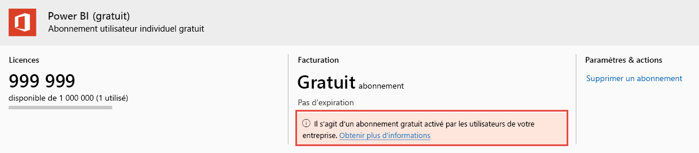

# Afficher et gérer les licences utilisateur Power BI

Cet article explique comment les administrateurs peuvent utiliser le Centre d’administration Microsoft 365 ou le portail Azure afin de visualiser et gérer les licences utilisateur pour le service Power BI.

> [!NOTE]
>
>Un utilisateur peut avoir à la fois une licence Power BI (gratuite) et une licence Power BI Pro. Cela peut se produire lorsqu’un utilisateur s’inscrit pour obtenir une licence gratuite, puis reçoit une licence Power BI Pro par la suite. Dans ce cas, le niveau de licence le plus élevé prévaut.
>

## Visualiser vos abonnements

Pour connaître les abonnements Power BI dont dispose votre organisation, procédez comme suit.

1. Connectez-vous au [Centre d’administration Microsoft 365](https://admin.microsoft.com).
2. Dans le menu de navigation, sélectionnez **Facturation** > **Produits et services**.

Vos abonnements Power BI actifs sont répertoriés avec les autres abonnements dont vous disposez. Un abonnement inattendu pour Power BI (gratuit) peut apparaître, comme illustré ici.

  

Ce type d’abonnement est créé pour vous lorsque les utilisateurs tirent parti de l’inscription en libre-service. Pour en savoir plus, consultez [Power BI dans votre organisation](https://docs.microsoft.com/microsoft-365/admin/misc/power-bi-in-your-organization?view=o365-worldwide).

## Gérer des licences utilisateur dans Microsoft 365

Pour utiliser le Centre d’administration Microsoft 365 afin de gérer des licences utilisateur, consultez la [documentation sur les abonnements et la facturation d’entreprise](https://docs.microsoft.com/microsoft-365/commerce/?view=o365-worldwide).

## Gérer des licences utilisateur dans le portail Azure

Procédez comme suit pour afficher et affecter des licences Power BI à l’aide du portail Azure.

1. Connectez-vous au [portail Azure](https://portal.azure.com).

2. Recherchez et sélectionnez **Azure Active Directory**.

3. Sous **Gérer** dans le menu de ressources Azure Active Directory, sélectionnez **Licences**.

4. Sélectionnez **Tous les produits** dans le menu de ressources, puis choisissez un type de licence Power BI pour afficher la liste des utilisateurs sous licence.

5. Pour attribuer une licence, dans la barre de commandes, sélectionnez **+ Attribuer**. Sur la page **Attribuer une licence**, choisissez un utilisateur, puis sélectionnez **Options d’affectation** afin d’activer une licence Power BI pour le compte d’utilisateur sélectionné.

6. Pour supprimer une licence, cochez la case en regard du nom de l’utilisateur, puis sélectionnez **Supprimer la licence**.

## Étapes suivantes

- [Acheter Power BI Pro](service-admin-purchasing-power-bi-pro.md)
- [Licences pour votre organisation](service-admin-licensing-organization.md)
