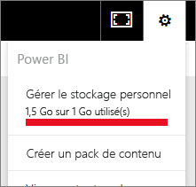
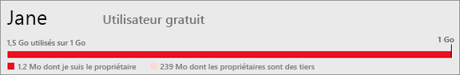

# Gérer le stockage de données dans les espaces de travail Power BI

Découvrez comment gérer le stockage de données dans votre espace de travail pour pouvoir continuer à publier des rapports et des jeux de données.

## Limites de capacité

Les limites de stockage des espaces de travail, que ce soit Mon espace de travail ou un espace de travail d’application, varient selon que l’espace de travail est en [capacité partagée ou Premium](../fundamentals/service-basic-concepts.md#capacities).

### Limites de la capacité partagée
Pour les espaces de travail en capacité partagée : 

- La limite de stockage par espace de travail est de 100 Go.
- Pour les espaces de travail d’application, l’utilisation totale ne peut pas dépasser la limite de stockage des abonnés de 10 Go, multipliée par le nombre de licences Pro de l’abonné.

### Limites de la capacité Premium
Pour les espaces de travail en capacité Premium :
- Il existe une limite de 100 To par capacité Premium.
- Il n’existe aucune limite de stockage par utilisateur.

Découvrez plus en détail les autres fonctionnalités du [modèle de tarification de Power BI](https://powerbi.microsoft.com/pricing).

## Ce qui est inclus dans le stockage

Vos propres jeux de données et rapports Excel, ainsi que ceux que d’autres personnes ont partagés avec vous, sont inclus dans votre espace de stockage des données. Les jeux de données correspondent à toutes les sources de données que vous avez chargées ou auxquelles vous vous êtes connecté. Ces sources de données incluent les fichiers Power BI Desktop et les classeurs Excel que vous utilisez. Les éléments suivants sont également inclus dans votre capacité de données.

* Plages Excel épinglées à un tableau de bord.
* Visualisations locales Reporting Services épinglées à un tableau de bord Power BI.
* Images téléchargées.

La taille d’un tableau de bord que vous partagez varie en fonction de ce qui est épinglé dessus. Par exemple, si vous épinglez des éléments provenant de deux rapports qui font partie de deux jeux de données différents, la taille inclut ces deux jeux de données.

## Gérer les éléments dont vous êtes propriétaire

Consultez l’espace de stockage des données que vous utilisez dans votre compte Power BI et gérez votre compte.

1. Pour gérer votre propre stockage, accédez à **Mon espace de travail** dans le volet de navigation.
   
    

2. Sélectionnez l’icône représentant un engrenage  située en haut à droite **Gérer le stockage personnel**.
   
    La barre supérieure montre la part de votre limite de stockage que vous avez utilisée.
   
    
   
    Les jeux de données et rapports sont répartis sous deux onglets :
   
    **Je suis le propriétaire :** vous avez chargé ces rapports et jeux de données sur votre compte Power BI, y compris les jeux de données de services tels que Salesforce et Dynamics CRM.  

    **Les propriétaires sont des tiers :** ces rapports et ces jeux de données ont été partagés avec vous par d’autres personnes.
1. Pour supprimer un jeu de données ou un rapport, sélectionnez l’icône représentant une corbeille .

N’oubliez pas que vous-même ou une autre personne pouvez avoir des rapports et des tableaux de bord basés sur un jeu de données. Si vous supprimez le jeu de données, les rapports et les tableaux de bord ne fonctionneront plus.

## Gérer votre espace de travail
1. Sélectionnez la flèche à côté de **Espaces de travail**, puis sélectionnez le nom de l’espace de travail.
   
    
2. Sélectionnez l’icône représentant un engrenage  située en haut à droite **Gérer le stockage de groupe**.
   
    La barre supérieure montre la part de la limite de stockage du groupe qui est utilisée.
   
    
   
    Les jeux de données et rapports sont répartis sous deux onglets :
   
    **Nous sommes les propriétaires :** vous-même ou une autre personne avez chargé ces rapports et jeux de données sur le compte Power BI du groupe, y compris les jeux de données de services comme Salesforce ou Dynamics CRM.

    **Les propriétaires sont des tiers :** ces rapports et ces jeux de données ont été partagés avec votre groupe par d’autres personnes.

3. Pour supprimer un jeu de données ou un rapport, sélectionnez l’icône représentant une corbeille .
   
   > [!NOTE]
   > N’oubliez pas que vous-même ou un autre membre du groupe pouvez avoir des rapports et des tableaux de bord basés sur un jeu de données. Si vous supprimez le jeu de données, les rapports et les tableaux de bord ne fonctionneront plus.
   
   Tous les membres d’un espace de travail qui ont le rôle d’administrateur, de membre ou de contributeur ont l’autorisation de supprimer les jeux de données et les rapports qu’il contient.

## Limites de jeu de données
Power BI limite chaque jeu de données importé à 1 Go. Si vous conservez l’expérience Excel au lieu d’importer les données, la limite s’élève à 250 Mo par jeu de données.

## Que se passe-t-il lorsque vous atteignez une limite ?
Lorsque vous atteignez la limite de capacité de données, le service vous en informe. 

L’icône représentant un engrenage permet d’afficher une barre rouge indiquant que la limite de capacité de données est dépassée.

Cette limite est également indiquée dans **Gérer le stockage personnel**.

 

 Lorsque vous essayez d’effectuer une action qui vous fait atteindre l’une des limites, un message vous en informe. Vous pouvez [gérer votre stockage](#manage-items-you-own) afin de réduire votre volume de stockage ou obtenir la possibilité de dépasser la limite.

 

 ## Étapes suivantes

 D’autres questions ? [Essayez d’interroger la communauté Power BI](https://community.powerbi.com/)
