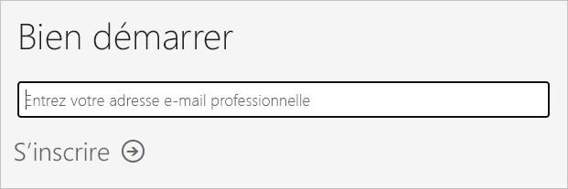
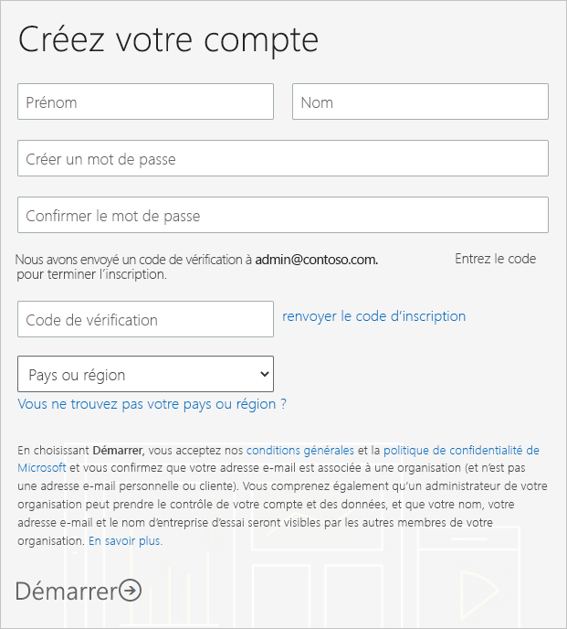
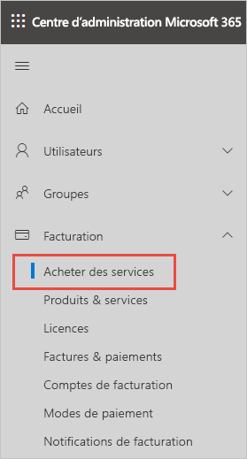
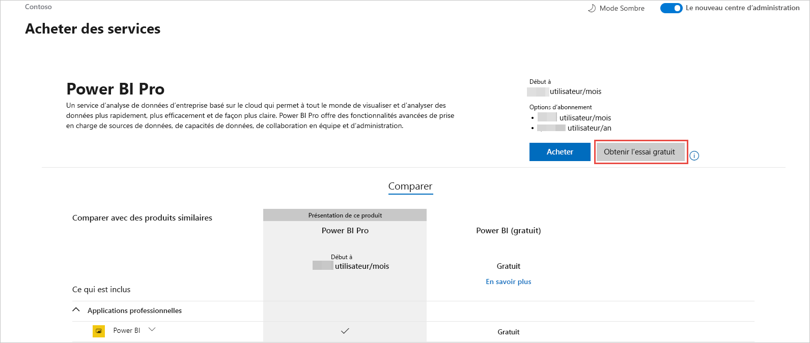

# Obtenir un abonnement Power BI pour votre organisation

En tant qu’administrateur, vous pouvez vous inscrire à Power BI sur le [site web de Power BI](https://powerbi.microsoft.com). Vous pouvez également vous abonner depuis la page Services d’achat du Centre d’administration Microsoft 365. Quand un administrateur s’inscrit à Power BI, il peut attribuer des licences aux utilisateurs autorisés.

En outre, les utilisateurs de votre organisation peuvent s’inscrire à Power BI sur le site web de Power BI. Quand un utilisateur de votre organisation s’inscrit à Power BI, il reçoit automatiquement une licence Power BI. Si vous souhaitez désactiver cette fonctionnalité, suivez les étapes décrites dans [Activer ou désactiver l’inscription et l’achat en libre-service](service-admin-disable-self-service.md).

## S’inscrire via Power BI

Vous aurez besoin d’un compte professionnel ou scolaire pour vous inscrire à un abonnement Power BI. Nous ne prenons pas en charge les adresses de messagerie fournies par des services de messagerie de consommateur ou par des fournisseurs de télécommunications.

Procédez comme suit pour vous inscrire :

1. Rendez-vous sur le [site web de Power BI](https://powerbi.microsoft.com). Sélectionnez **Essai gratuit**.
2. Entrez votre adresse e-mail professionnelle, puis sélectionnez **S’inscrire**.

   

3. Vérifiez votre identité. Nous vous enverrons par téléphone ou SMS un code de vérification à utiliser.
4. Sélectionnez **Oui** pour confirmer que vous utilisez une adresse de messagerie fournie par votre société.
5. Créez votre compte. Nous envoyons un code de vérification à votre adresse de messagerie pour finaliser l’inscription.

   

## S’inscrire via Microsoft 365

Si vous êtes un administrateur général ou un administrateur de facturation Microsoft 365, vous pouvez obtenir un abonnement Power BI pour votre organisation. Pour plus d’informations, consultez [Qui peut acheter et attribuer des licences ?](../service-admin-licensing-organization.md#who-can-purchase-and-assign-licenses).

> [!NOTE]
>
> Un abonnement Microsoft 365 E5 contient déjà des licences Power BI Pro. Pour savoir comment gérer les licences, consultez [Afficher et gérer les licences utilisateur](service-admin-manage-licenses.md).
>
>

Suivez ces étapes pour acheter des licences Power BI Pro dans le Centre d’administration Microsoft 365 :

1. Connectez-vous au [Centre d’administration Microsoft 365](https://admin.microsoft.com).

2. Dans le menu de navigation, sélectionnez **Facturation** > **Acheter des services**.
  
   

3. Effectuez une recherche ou faites défiler la liste pour trouver l’abonnement que vous souhaitez acheter. Vous trouverez **Power BI** sous **Autres catégories susceptibles de vous intéresser** en bas de la page. Sélectionnez le lien pour afficher les abonnements Power BI disponibles pour votre organisation.

4. Sélectionnez une offre, par exemple Power BI Pro.

5. Sur la page **Acheter des services**, sélectionnez **Acheter**. Si vous ne l’avez pas déjà utilisée, vous pouvez démarrer une évaluation gratuite de Power BI Pro. La version d’évaluation inclut 25 licences et expire au bout d’un mois.

   

6. Choisissez **Paiement mensuel** ou **Paiement pour toute une année**, en fonction de vos préférences de paiement.

7. Sous **Combien d’utilisateurs voulez-vous ?** , entrez le nombre de licences que vous souhaitez acheter, puis sélectionnez **Régler maintenant** pour finaliser la transaction.

8. Pour vérifier votre achat, accédez à **Facturation** > **Produits et services** et recherchez **Power BI Pro**.

Pour en savoir plus sur la façon dont votre organisation acquiert le service Power BI, consultez [Power BI dans votre organisation](https://docs.microsoft.com/microsoft-365/admin/misc/power-bi-in-your-organization?view=o365-worldwide).

## Étapes suivantes

- [Afficher et gérer les licences utilisateur](service-admin-manage-licenses.md)
- [Activer ou désactiver l’inscription et l’achat en libre-service](service-admin-disable-self-service.md)
- [Documentation sur les abonnements et la facturation d’entreprise](https://docs.microsoft.com/microsoft-365/commerce/?view=o365-worldwide)
