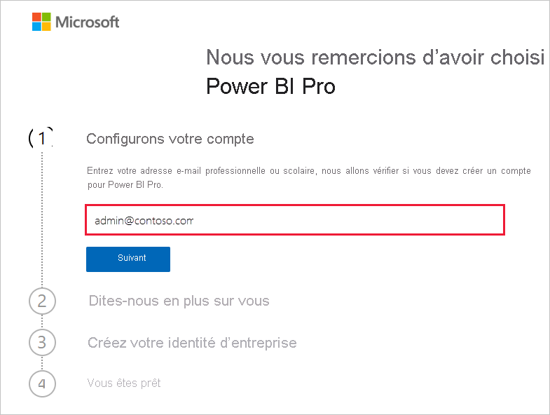
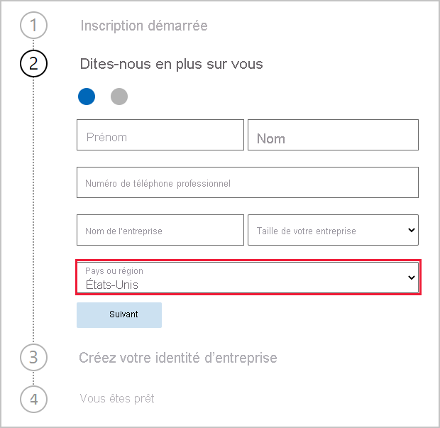
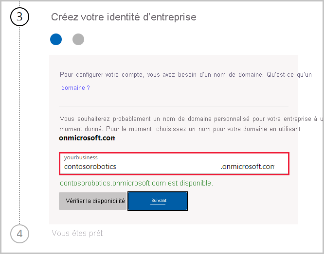

# Obtenir un abonnement au service Power BI pour votre organisation

Les administrateurs peuvent s’inscrire au service Power BI via la page **Acheter des services** du Centre d’administration Microsoft 365. Quand un administrateur s’inscrit à Power BI, il peut attribuer des licences aux utilisateurs autorisés.

Les utilisateurs de votre organisation peuvent s’inscrire à Power BI par le biais du site web Power BI. Quand un utilisateur de votre organisation s’inscrit à Power BI, il reçoit automatiquement une licence Power BI. Si vous souhaitez désactiver les fonctionnalités libre-service, effectuez les étapes décrites dans [Activer ou désactiver l’inscription et l’achat en libre-service](service-admin-disable-self-service.md).

## S’inscrire via Microsoft 365

Si vous êtes administrateur général ou administrateur de facturation, vous pouvez obtenir un abonnement Power BI pour votre organisation. Pour plus d’informations, consultez [Qui peut acheter et attribuer des licences ?](service-admin-licensing-organization.md#who-can-purchase-and-assign-licenses).

> [!NOTE]
>
> Un abonnement Microsoft 365 E5 contient déjà des licences Power BI Pro. Pour savoir comment gérer les licences, consultez [Afficher et gérer les licences utilisateur](service-admin-manage-licenses.md).
>
>

Suivez ces étapes pour acheter des licences Power BI Pro dans le Centre d’administration Microsoft 365 :

1. Connectez-vous au [Centre d’administration Microsoft 365](https://admin.microsoft.com).

2. Dans le menu de navigation, sélectionnez **Facturation** > **Acheter des services**.
  
   

3. Effectuez une recherche ou faites défiler la liste pour trouver l’abonnement que vous souhaitez acheter. Vous trouverez **Power BI** sous **Autres catégories susceptibles de vous intéresser** en bas de la page. Sélectionnez le lien pour afficher les abonnements Power BI disponibles pour votre organisation.

4. Sélectionnez une offre, par exemple Power BI Pro.

5. Sur la page **Acheter des services**, sélectionnez **Acheter**. Si vous ne l’avez pas déjà utilisée, vous pouvez démarrer une évaluation gratuite de Power BI Pro. La version d’évaluation inclut 25 licences et expire au bout d’un mois.

   

6. Choisissez **Paiement mensuel** ou **Paiement pour toute une année**, en fonction de vos préférences de paiement.

7. Sous **Combien d’utilisateurs voulez-vous ?** , entrez le nombre de licences que vous souhaitez acheter, puis sélectionnez **Régler maintenant** pour finaliser la transaction.

8. Pour vérifier votre achat, accédez à **Facturation** > **Produits et services** et recherchez **Power BI Pro**.

Pour en savoir plus sur la façon dont votre organisation peut contrôler et acquérir le service Power BI, consultez [Power BI dans votre organisation](https://docs.microsoft.com/microsoft-365/admin/misc/power-bi-in-your-organization?view=o365-worldwide).

## Autres manières d’obtenir Power BI pour votre organisation

Si vous n’êtes pas encore abonné à Microsoft 365, effectuez les étapes ci-dessous pour obtenir un essai gratuit de Power BI Pro pour votre organisation. Vous pouvez aussi [vous inscrire pour obtenir un essai gratuit de Microsoft 365](service-admin-signing-up-for-power-bi-with-a-new-office-365-trial.md), puis ajouter Power BI en effectuant les étapes décrites dans la section précédente.

Vous aurez besoin d’un compte professionnel ou scolaire pour vous inscrire à un abonnement Power BI. Nous ne prenons pas en charge les adresses de messagerie fournies par des services de messagerie de consommateur ou par des fournisseurs de télécommunications. Si vous n’avez pas de compte professionnel ou scolaire, vous pouvez en créer un lors de l’inscription.

Procédez comme suit pour vous inscrire :

1. Accédez à la page d’[inscription à Power BI Pro](https://signup.microsoft.com/create-account/signup?OfferId=d59682f3-3e3b-4686-9c00-7c7c1c736085&ali=1&products=d59682f3-3e3b-4686-9c00-7c7c1c736085). 

2. Entrez votre adresse e-mail professionnelle ou scolaire, puis sélectionnez **Suivant**. Ce n’est pas un problème si vous entrez une adresse e-mail qui n’est pas considérée comme une adresse e-mail professionnelle ou scolaire. Un nouveau compte sera configuré pour vous quand vous créerez votre identité d’entreprise.

   

3. Nous exécutons une vérification rapide pour déterminer si vous devez créer un nouveau compte. Sélectionnez **Configurer le compte** pour poursuivre le processus d’inscription.

   > [!NOTE]
   >Si votre adresse e-mail est déjà utilisée avec un autre service Microsoft, vous pouvez **vous connecter** ou **créer plutôt un compte**. Si vous choisissez de créer un compte, continuez à suivre ces étapes pour configurer le compte.
>
>
 
4. Remplissez le formulaire pour nous communiquer des renseignements sur vous-même. Veillez à choisir le pays ou la région approprié. Le pays que vous sélectionnez détermine l’emplacement de stockage de vos données, comme expliqué dans [Déterminer où est situé votre client Power BI](service-admin-where-is-my-tenant-located.md#how-to-determine-where-your-power-bi-tenant-is-located).

   

5. Sélectionnez **Suivant**. Nous devons envoyer un code de vérification pour vérifier votre identité. Indiquez un numéro de téléphone auquel nous pouvons envoyer un SMS ou vous appeler. Ensuite, sélectionnez **M’envoyer un code via SMS pour vérifier**.

6. Entrez le code de vérification, puis passez à **Créez votre identité d’entreprise**.

   

    Entrez un nom abrégé pour votre entreprise ; nous vérifierons qu’il est disponible. Nous utilisons ce nom abrégé pour créer le nom de votre organisation dans le centre de donné en tant que sous-domaine d’onmicrosoft.com. Vous pourrez ajouter votre propre domaine d’entreprise ultérieurement. Ne vous inquiétez pas si le nom abrégé que vous voulez est déjà pris. Une personne ayant un nom d’entreprise similaire aura probablement choisi le même nom abrégé. Essayez simplement une autre variante. Sélectionnez **Suivant**.
    
7. Créez votre ID utilisateur et votre mot de passe pour vous connecter à votre compte. Sélectionnez **S’inscrire**, et vous avez terminé.

Le compte que vous avez créé est maintenant l’administrateur général d’un nouveau locataire d’essai gratuit Power BI Pro. Vous pouvez vous connecter au [Centre d’administration Microsoft 365](https://admin.microsoft.com) pour ajouter d’autres utilisateurs, configurer un domaine personnalisé, acheter d’autres services et gérer votre abonnement Power BI.

## Étapes suivantes

- [Afficher et gérer les licences utilisateur](service-admin-manage-licenses.md)
- [Activer ou désactiver l’inscription et l’achat en libre-service](service-admin-disable-self-service.md)
- [Documentation sur les abonnements et la facturation d’entreprise](https://docs.microsoft.com/microsoft-365/commerce/?view=o365-worldwide)
