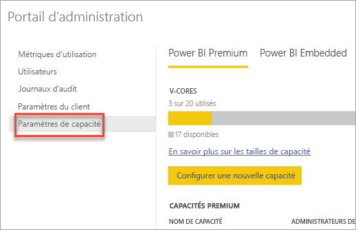
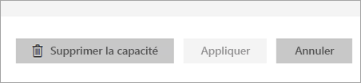
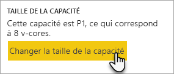
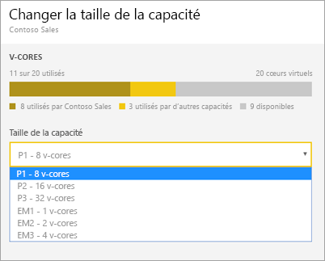
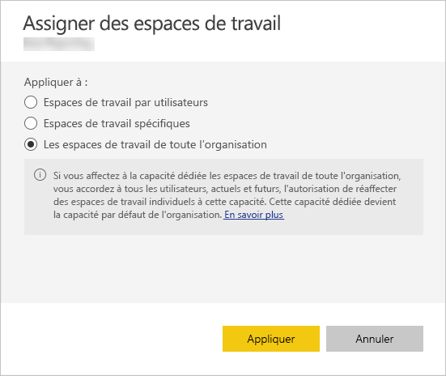
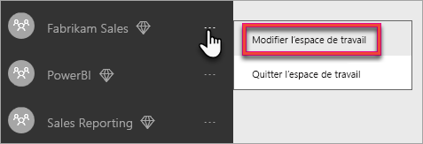
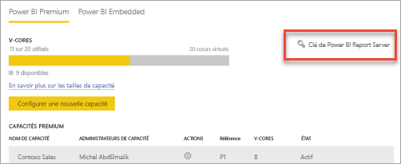

# Configurer et gérer les capacités dans Power BI Premium

La gestion de Power BI Premium implique la création, la gestion et la surveillance des capacités Premium. Cet article fournit des instructions pas à pas. Pour une vue d’ensemble des capacités, consultez [Gestion des capacités Premium](service-premium-capacity-manage.md).

Découvrez comment gérer les capacités Power BI Premium et Power BI Embedded, qui fournissent des ressources dédiées pour votre contenu.

Les *capacités* sont au cœur des offres Power BI Premium et Power BI Embedded. Elles représentent l’ensemble des ressources réservées à l’usage exclusif de votre organisation. Le fait de disposer d’une capacité dédiée vous permet de publier des tableaux de bord, rapports et jeux de données pour les utilisateurs de votre organisation sans devoir acheter des licences par utilisateur. De plus, les performances du contenu hébergé dans la capacité sont fiables et cohérentes. Pour plus d’informations, consultez [Qu’est-ce que Power BI Premium ?](../service-premium.md).

## Gérer la capacité

Une fois que vous avez acheté des nœuds de capacité dans Office 365, vous configurez la capacité dans le portail d’administration Power BI. Vous gérez les capacités Power BI Premium dans la section **Paramètres de capacité** du portail.

Vous gérez une capacité en sélectionnant son nom. Cette action a pour effet de vous diriger vers l’écran de gestion de la capacité.

Si aucun espace de travail n’a été attribué à la capacité, vous voyez un message relatif à l’[assignation d’un espace de travail à la capacité](#assign-a-workspace-to-a-capacity).

### Configuration d’une nouvelle capacité (Power BI Premium)

Le portail d’administration indique le nombre de *cœurs virtuels* que vous avez utilisés et qui sont toujours à votre disposition. Le nombre total de cœurs virtuels est basé sur les références SKU Premium que vous avez achetées. Par exemple, l’achat de références P3 et P2 met à disposition 48 cœurs (32 à partir de P3 et 16 à partir de P2).

Si des cœurs virtuels sont disponibles, configurez votre nouvelle capacité en effectuant les étapes suivantes.

1. Sélectionnez **Configurer une nouvelle capacité**.

1. Attribuez un nom à votre capacité.

1. Définissez qui est l’administrateur de cette capacité.

1. Sélectionnez la taille de votre capacité. Les options disponibles dépendent du nombre de v-cores disponibles. Vous ne pouvez pas sélectionner une option qui est supérieure à la quantité disponible.

    

1. Sélectionnez **Configurer**.

    

Les administrateurs de capacité, ainsi que les administrateurs Power BI et les administrateurs généraux Office 365, peuvent voir la capacité listée dans le portail d’administration.

### Paramètres de capacité

1. Dans l’écran de gestion de capacité Premium, sous **Actions**, sélectionnez l’**icône d’engrenage** pour examiner et mettre à jour les paramètres. 

    

1. Vous pouvez voir qui sont les administrateurs du service, la référence SKU et la taille de la capacité, ainsi que la région dans laquelle la capacité se trouve.

    

1. Vous pouvez également renommer ou supprimer une capacité.

    

> [!NOTE]
> Les paramètres de capacité Power BI Embedded sont gérés dans le portail Microsoft Azure.

### Changer la taille de la capacité

Les administrateurs Power BI et les administrateurs généraux Office 365 peuvent changer la capacité Power BI Premium. Un administrateur de capacité qui n’est pas administrateur Power BI ou administrateur général Office 365 n’a pas accès à cette option.

1. Sélectionnez **Changer la taille de la capacité**.

    

1. Dans l’écran **Changer la taille de la capacité**, ajustez votre capacité comme il convient.

    

    Les administrateurs sont libres de créer, redimensionner et supprimer des nœuds, tant qu’ils ont le nombre requis de v-cores.

    Les références SKU P ne peuvent pas être réajustées à la référence inférieure EM. Vous pouvez pointer sur n’importe quelle option désactivée pour voir une explication.

> [!IMPORTANT]
> Si votre capacité Power BI Premium subit une utilisation intensive des ressources entraînant des problèmes de performances ou de fiabilité, vous pouvez recevoir des e-mails de notification pour identifier et résoudre le problème. Pour plus d’informations, consultez les [notifications de capacité et de fiabilité](service-interruption-notifications.md#capacity-and-reliability-notifications).

### Gérer les autorisations de l’utilisateur

Vous pouvez désigner des administrateurs de capacité supplémentaires et des utilisateurs titulaires d’autorisations d’*affectation de capacité*. Les utilisateurs qui ont des autorisations d’affectation peuvent affecter un espace de travail à une capacité s’ils sont administrateurs de cet espace de travail. Ils peuvent également affecter leur espace de travail personnel (*Mon espace de travail*) à la capacité. Les utilisateurs disposant d’autorisations d’affectation n’ont pas accès au portail d’administration.

> [!NOTE]
> Pour Power BI Embedded, les administrateurs de la capacité sont définis dans le portail Microsoft Azure.

Sous **Autorisations de l’utilisateur**, développez **Utilisateurs avec autorisations d’affectation**, puis ajoutez des utilisateurs ou des groupes selon les besoins.

## Affecter un espace de travail à une capacité

Il existe deux façons d’affecter un espace de travail à une capacité : dans le portail d’administration et à partir d’un espace de travail.

### Affecter à partir du portail d’administration

Les administrateurs de capacité, ainsi que les administrateurs Power BI et les administrateurs généraux Office 365, peuvent attribuer en bloc des espaces de travail au moyen de la section de gestion de capacité Premium du portail d’administration. Quand vous gérez une capacité, vous voyez une section **Espaces de travail** qui vous permet d’affecter des espaces de travail.

1. Sélectionnez **Assigner des espaces de travail**. Cette option est disponible à plusieurs endroits.

1. Sélectionnez une option pour **Appliquer à**.

    

   | Sélection | Description |
   | --- | --- |
   | **Espaces de travail par utilisateurs** | Lorsque vous affectez des espaces de travail par utilisateur ou par groupe, tous les espaces de travail appartenant à ces utilisateurs, y compris leurs espaces de travail personnels, sont affectés à la capacité Premium. Ces utilisateurs sont automatiquement autorisés à assigner leurs espaces de travail. Cela inclut les espaces de travail déjà affectés à une autre capacité. |
   | **Espaces de travail spécifiques** | Entrez le nom d’un espace de travail spécifique à affecter à la capacité sélectionnée. |
   | **Les espaces de travail de toute l’organisation** | L’affectation des espaces de travail de toute l’organisation à une capacité Premium a pour effet d’affecter la totalité des espaces de travail ainsi que des espaces Mon espace de travail dont dispose votre organisation à cette capacité Premium. Et elle a également pour effet d’autoriser tous les utilisateurs présents et futurs à réaffecter des espaces de travail spécifiques à cette capacité. |
   | | |

1. Sélectionnez **Appliquer**.

### Affecter à partir des paramètres d’espace de travail

Vous pouvez également affecter un espace de travail à une capacité Premium à partir des paramètres de cet espace de travail. Pour pouvoir déplacer un espace de travail vers une capacité, vous devez disposer d’autorisations d’administration sur cet espace de travail, ainsi que d’autorisations d’affectation de capacité sur cette capacité. Notez que les administrateurs d’un espace de travail peuvent toujours supprimer celui-ci d’une capacité Premium.

1. Modifiez un espace de travail en sélectionnant les points de suspension **(...)** , puis **Modifier l’espace de travail**.

    

1. Sous **Modifier l’espace de travail**, développez **Avancé**.

1. Sélectionnez la capacité à laquelle vous souhaitez affecter cet espace de travail.

    

1. Sélectionnez **Enregistrer**.

Une fois enregistrés, l’espace de travail et tout son contenu sont déplacés vers la capacité Premium sans que cela occasionne d’interruption d’expérience pour les utilisateurs finaux.

## Clé de produit Power BI Report Server

Votre clé de produit Power BI Report Server est accessible sous l’onglet **Paramètres de capacité** du portail d’administration de Power BI. Elle est réservée aux administrateurs généraux ou aux utilisateurs dotés du rôle d’administrateur du service Power BI et si vous avez acheté une référence Power BI Premium.

La sélection de **Clé de Power BI Report Server** a pour effet d’afficher une boîte de dialogue contenant votre clé de produit. Copiez-la pour l’utiliser lors de l’installation.

Pour plus d’informations, consultez [Installer Power BI Report Server](../report-server/install-report-server.md).

## Étapes suivantes

[Gérer les capacités Premium](service-premium-capacity-manage.md)

D’autres questions ? [Essayez d’interroger la communauté Power BI](https://community.powerbi.com/)
