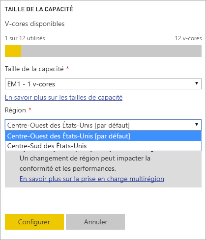
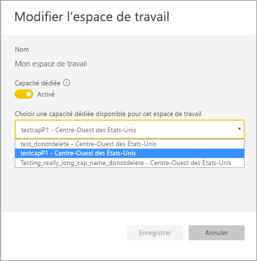
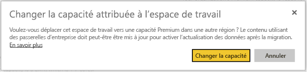
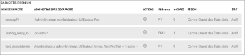

# Configurer la prise en charge multigéographique pour Power BI Premium

La fonctionnalité de zones géographiques multiples de Power BI Premium permet à des clients multinationaux de répondre à des exigences de résidence des données régionales, spécifiques à certains secteurs ou en fonction de l’organisation. En tant que client Power BI Premium vous pouvez déployer du contenu vers des centres de données dans des régions autres que la région d’origine du locataire Power BI. Une zone géographique (géographie) peut contenir plusieurs régions. Par exemple, les États-Unis sont une zone géographique, et les USA Centre-Ouest et les USA Centre Sud sont des régions des États-Unis. Vous pouvez choisir de déployer du contenu vers l’une des zones géographiques suivantes :

- United States
- Canada
- United Kingdom
- Brésil
- Europe
- Japon
- Inde
- Asie-Pacifique
- Australie
- Afrique

Les zones géographiques multiples ne sont pas disponibles pour Power BI Germany, Power BI Chine géré par 21Vianet, ou Power BI pour le gouvernement des États-Unis.

Les zones géographiques multiples sont désormais également disponibles dans Power BI Embedded. Pour en savoir plus, lisez [Prise en charge de plusieurs zones géographiques dans Power BI Embedded](../developer/embedded/embedded-multi-geo.md).

## Activer et configurer

Pour de nouvelles capacités, activez les zones géographiques multiples en sélectionnant une région autre que la région par défaut dans la liste déroulante.  Chaque capacité disponible indique la région où elle est actuellement située, par exemple, les **USA Centre-Ouest**.

Une fois que vous avez créé la capacité, elle reste dans cette région, et le contenu des espaces de travail créés sera stocké dans cette région. Vous pouvez migrer des espaces de travail d’une région à une autre via la liste déroulante dans l’écran des paramètres d’espace de travail.

Vous voyez ce message pour confirmer la modification.

Vous n’avez pas besoin de réinitialiser les informations d’identification de la passerelle pendant une migration pour l’instant.  Une fois qu’elles sont stockées dans la région de la capacité Premium, vous devez les réinitialiser lors de la migration.

Pendant la migration, certaines opérations peuvent échouer, telles que la publication de nouveaux jeux de données ou l’actualisation planifiée des données.  

Les éléments suivants sont stockés dans la région Premium lorsque des zones géographiques multiples sont activées :

- Modèles (fichiers .ABF) pour les jeux de données importés et de requête directe
- Cache de requête
- Images R

Ces éléments restent dans la région d’origine pour le locataire :

- Transmettre des jeux de données
- Classeurs Excel
- Métadonnées de tableau de bord/de rapport : par exemple, noms de mosaïques, mosaïques de requêtes
- Bus de service pour requêtes de passerelle ou travaux d’actualisation planifiés
- Autorisations
- Informations d'identification de jeux de données

## Voir les régions de la capacité

Dans le portail d’administration, vous pouvez afficher toutes les capacités de votre client Power BI et les régions où elles se trouvent actuellement.

 

## Modifier la région pour du contenu existant

Si vous devez modifier la région pour du contenu existant, vous avez deux options.

- Créer une deuxième capacité et déplacer des espaces de travail. Les utilisateurs gratuits ne rencontrent aucun temps d’arrêt tant que le locataire a des cœurs v-core de rechange.
- Si la création d’une deuxième capacité n’est pas une option, vous pouvez déplacer à nouveau temporairement le contenu vers une capacité partagée à partir de Premium. Vous n’avez pas besoin de cœurs v-core supplémentaires, mais les utilisateurs gratuits seront parfois confrontés à un temps d’arrêt.

## Déplacer du contenu en dehors de zones géographiques multiples  

Vous pouvez prendre des espaces de travail en dehors de la capacité Multi-Géo de deux manières :

- Supprimer la capacité actuelle où se trouve l’espace de travail.  Cela ramène l’espace de travail à une capacité partagée dans la région d’origine.
- Migrer à nouveau des espaces de travail individuels vers une capacité Premium située dans le locataire d’origine.

## Considérations et limitations

- Confirmez que tout mouvement que vous lancez entre des régions est conforme à toutes les exigences de conformité des entreprises et du gouvernement avant d’amorcer le transfert de données.
- Une requête de mise en cache stockée dans une région distante reste dans cette région au repos. Toutefois, les autres données en transit peuvent aller et venir entre des zones géographiques multiples.
- Lors du déplacement de données d’une région à une autre dans un environnement de zones géographiques multiples, les données source peuvent rester dans la région à partir de laquelle les données ont été déplacées pendant 30 jours maximum. Pendant ce temps, les utilisateurs finaux n’y ont pas accès. Elles sont supprimées de cette région et détruites pendant la période de 30 jours.

- La fonctionnalité des [dataflows](../transform-model/service-dataflows-overview.md) n’est pas prise en charge en mode multigéographique pour l’instant.

## Étapes suivantes

- [Qu’est-ce que Power BI Premium ?](service-premium-what-is.md)
- [Zones géographiques multiples pour des capacités Power BI Embedded](../developer/embedded/embedded-multi-geo.md)

D’autres questions ? [Essayez d’interroger la communauté Power BI](https://community.powerbi.com/)

