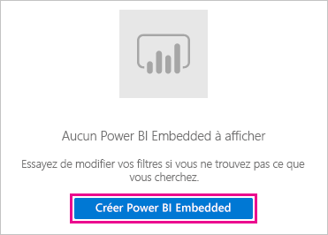
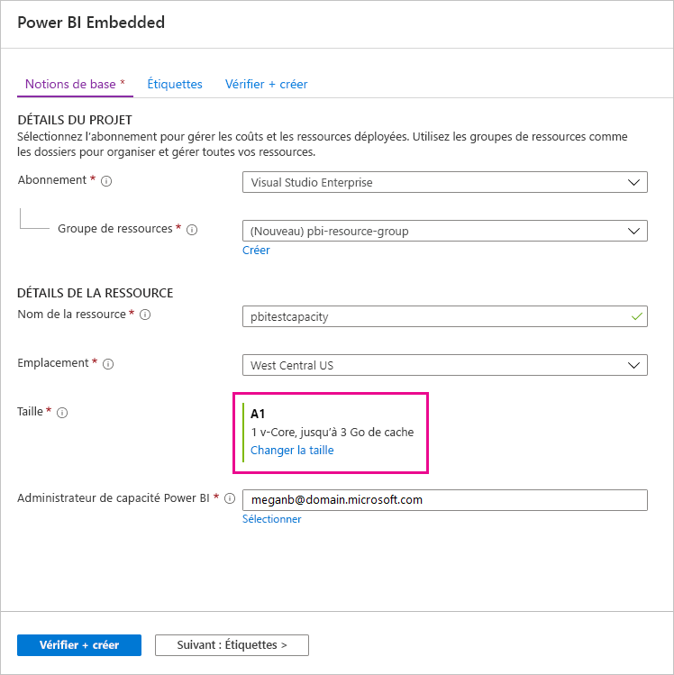
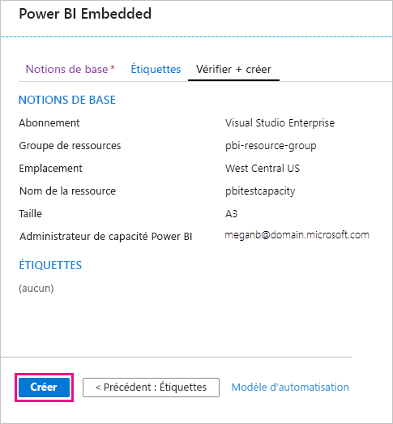
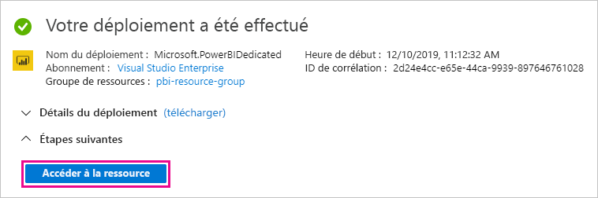

# Acheter Power BI Premium pour les tests

Cet article explique comment acheter des références SKU A Power BI Premium pour des scénarios de test ou dans les cas où vous ne disposez pas des autorisations nécessaires pour acheter des références SKU P (rôle Administrateur général ou Administrateur de facturation dans Microsoft 365). Les références SKU ne nécessitent aucun engagement et sont facturées à l’heure. Vous achetez des références SKU A dans le [portail Azure](https://portal.azure.com).

Pour plus d’informations sur Power BI Premium, consultez [Qu’est-ce que Power BI Premium ?](service-premium-what-is.md) Pour connaître le tarif actuel et obtenir des informations sur la planification, consultez la [page des tarifs de Power BI](https://powerbi.microsoft.com/pricing/) et la [Calculatrice Power BI Premium](https://powerbi.microsoft.com/calculator/). Les créateurs de contenu ont toujours besoin d’une [licence Power BI Pro](service-admin-purchasing-power-bi-pro.md), même si votre organisation utilise Power BI Premium. Veillez à acheter au moins une licence Power BI Pro pour votre organisation. Avec des références SKU A, _tous les utilisateurs_ qui consomment du contenu ont également besoin d’une licence Pro.

> [!NOTE]
> Si un abonnement Premium expire, vous avez un accès total à votre capacité pendant 30 jours. Après cela, votre contenu reviendra à une capacité partagée. Les modèles de plus de 1 Go ne sont pas pris en charge dans une capacité partagée.

## Acheter des références SKU A pour les tests et d’autres scénarios

Vous pouvez acheter des références SKU A par le biais du service Azure Power BI Embedded. Utilisez ensuite vos références SKU A pour :

- Permettre l’incorporation de Power BI dans des applications tierces. Pour plus d’informations, consultez [Power BI Embedded](../developer/embedded/azure-pbie-what-is-power-bi-embedded.md).

- Tester les fonctionnalités Premium avant d’acheter une référence SKU P.

- Créer des environnements de développement et de test parallèlement à un environnement de production qui utilise des références SKU P.

- Acheter Power BI Premium même si vous n’avez pas un rôle Administrateur général Microsoft 365 ou un rôle Administrateur de facturation.

> [!NOTE]
> Si vous achetez une référence A4 ou supérieure, vous bénéficiez de toutes les fonctionnalités Premium, à l’exception du partage illimité de contenu. Avec des références SKU A, _tous les utilisateurs_ qui consomment du contenu ont besoin d’une licence Pro.

Pour acheter des références SKU A dans le portail Azure, effectuez les étapes suivantes :

1. Connectez-vous au [portail Azure](https://portal.azure.com) avec un compte qui dispose au moins des autorisations d’administrateur de capacité dans Power BI.

1. Recherchez _Power BI Embedded_ et sélectionnez le service dans les résultats de la recherche.

    

1. Sélectionnez **Créer Power BI Embedded**.

    

1. Dans l’écran de création de **Power BI Embedded**, entrez les informations suivantes :

    - L’**abonnement** dans lequel créer le service Power BI Embedded.

    - L’**emplacement** physique où créer le groupe de ressources qui contient le service. Pour de meilleures performances, choisissez un emplacement proche de l’emplacement de votre locataire Azure Active Directory pour Power BI.

    - Le **groupe de ressources** existant à utiliser (ou créez-en un comme indiqué dans l’exemple).

    - L’**administrateur de capacité Power BI**. L’administrateur de capacité doit être un utilisateur membre ou un principal de service dans votre locataire Azure AD.

    

1. Si vous souhaitez utiliser toutes les fonctionnalités de Power BI Premium (à l’exception du partage illimité), vous avez besoin au minimum d’une référence SKU A4. Sélectionnez **Changer la taille**.

    

1. Sélectionnez une taille de capacité A4, A5 ou A6, qui correspond à P1, P2 et P3.

    

1. Sélectionnez **Vérifier + Créer**, vérifiez les options choisies, puis sélectionnez **Créer**.

    

1. Le déploiement peut prendre plusieurs minutes. Quand il est terminé, sélectionnez **Accéder à la ressource**.

    

1. Dans l’écran de gestion, passez en revue les options dont vous disposez pour gérer le service, notamment la mise en pause du service lorsque vous ne l’utilisez pas.

    

Après avoir acheté une capacité, découvrez comment [gérer les capacités](service-admin-premium-manage.md#manage-capacity) et comment [affecter des espaces de travail](service-admin-premium-manage.md#assign-a-workspace-to-a-capacity) à une capacité.

## Étapes suivantes

[Qu’est-ce que Power BI Premium ?](service-premium-what-is.md)
[Comment acheter Power BI Premium](service-admin-premium-purchase.md)
[Configurer et gérer les capacités dans Power BI Premium](service-admin-premium-manage.md)\
[Page de tarification de Power BI](https://powerbi.microsoft.com/pricing/)\
[Calculatrice Power BI Premium](https://powerbi.microsoft.com/calculator/)\
[FAQ Power BI Premium](service-premium-faq.md)\
[Planification d’un livre blanc sur le déploiement de Power BI en entreprise](https://aka.ms/pbienterprisedeploy)

D’autres questions ? [Essayez d’interroger la communauté Power BI](https://community.powerbi.com/)
