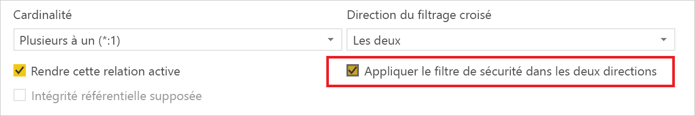
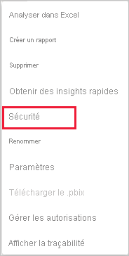
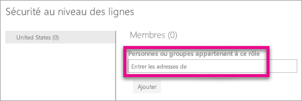
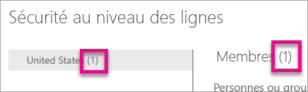
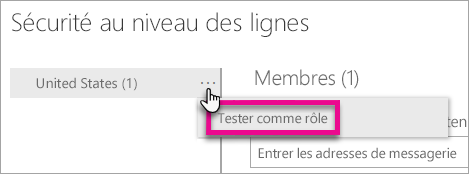
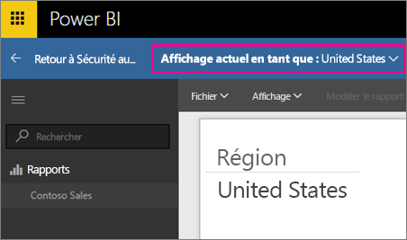
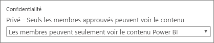

# Sécurité au niveau des lignes avec Power BI

La sécurité au niveau des lignes avec Power BI peut être utilisée pour restreindre l’accès aux données pour certains utilisateurs. Les filtres limitent l’accès aux données au niveau des lignes, et vous pouvez définir des filtres dans des rôles. Dans le service Power BI, les membres d’un espace de travail ont accès aux jeux de données de l’espace de travail. La sécurité au niveau des lignes (SNL) ne restreint pas cet accès aux données.

Vous pouvez configurer la sécurité au niveau des lignes (SNL) pour les modèles de données importés dans Power BI avec Power BI Desktop. Vous pouvez également configurer la sécurité au niveau des lignes sur les jeux de données qui utilisent DirectQuery, tels que SQL Server. En ce qui concerne les connexions actives Analysis Services ou Azure Analysis Services, la Sécurité au niveau des lignes est configurée dans le modèle, et non dans Power BI Desktop. L’option de sécurité ne s’affiche pas pour les jeux de données d’une connexion active.

[!INCLUDE [include-short-name](../includes/rls-desktop-define-roles.md)]

Par défaut, le filtrage de sécurité au niveau des lignes utilise des filtres unidirectionnels, que les relations soient définies comme unidirectionnelles ou bidirectionnelles. Pour activer manuellement le filtrage croisé bidirectionnel avec la sécurité au niveau des lignes, sélectionnez la relation et cochez la case **Appliquer le filtre de sécurité dans les deux directions**. Sélectionnez cette option quand vous avez également implémenté, au niveau du serveur, la sécurité dynamique au niveau des lignes, qui s’appuie sur un nom d’utilisateur ou un ID de connexion.

Pour plus d’informations, consultez [Filtrage croisé bidirectionnel avec DirectQuery dans Power BI Desktop](../transform-model/desktop-bidirectional-filtering.md) et [Sécurisation du modèle sémantique BI tabulaire](https://download.microsoft.com/download/D/2/0/D20E1C5F-72EA-4505-9F26-FEF9550EFD44/Securing%20the%20Tabular%20BI%20Semantic%20Model.docx).

[!INCLUDE [include-short-name](../includes/rls-desktop-view-as-roles.md)]

## Gérer la sécurité sur votre modèle

Pour gérer la sécurité sur votre modèle de données, procédez comme suit :

1. Dans le service Power BI, sélectionnez le menu **Plus d’options** pour un jeu de données. Ce menu s’affiche lorsque vous pointez sur un nom de jeu de données, que vous le sélectionniez dans le menu de navigation ou sur la page de l’espace de travail.

    

    

1. Sélectionnez **Sécurité**.

   

En cliquant sur Sécurité, vous accédez à la page SNL, sur laquelle vous pouvez ajouter des membres à un rôle que vous avez créé dans Power BI Desktop. L’option Sécurité n’apparaît que pour les propriétaires du jeu de données. Si le jeu de données se trouve dans un groupe, seuls les administrateurs de ce groupe la verront.

Vous pouvez uniquement créer ou modifier des rôles dans Power BI Desktop.

## Utilisation des membres

### Ajouter des membres

Ajoutez un membre au rôle en entrant l’adresse e-mail ou le nom de l’utilisateur ou du groupe de sécurité. Il n’est pas possible d’ajouter des groupes créés dans Power BI. Vous pouvez ajouter des membres [externes à votre organisation](../guidance/whitepaper-azure-b2b-power-bi.md#data-security-for-external-partners).

Le nombre de membres du rôle est indiqué entre parenthèses à côté du nom du rôle ou de Membres.

### Supprimer des membres

Vous pouvez supprimer des membres en cliquant sur la croix correspondant à leur nom. 

## Validation du rôle au sein du service Power BI

Vous pouvez vérifier que le rôle que vous avez défini fonctionne correctement en le testant.

1. Sélectionnez **Plus d’options** (...) en regard du rôle.
2. Sélectionnez **Tester les données comme rôle**

Les rapports disponibles pour ce rôle s’affichent. Les tableaux de bord n’apparaissent pas dans cette vue. Dans l’en-tête de page est indiqué le rôle en cours d’application.

Testez d’autres rôles, ou une combinaison de rôles, en sélectionnant **Affichage actuel comme**.

Vous pouvez choisir d’afficher les données comme pour une personne donnée ou sélectionner une combinaison de rôles disponibles pour vérifier qu’ils fonctionnent.

Pour revenir à l’affichage normal, sélectionnez **Retour à la sécurité au niveau des lignes**.

[!INCLUDE [include-short-name](../includes/rls-usernames.md)]

## Utilisation de la sécurité au niveau des lignes (SNL) avec des espaces de travail dans Power BI

Si vous publiez votre rapport Power BI Desktop dans un espace de travail du service Power BI, les rôles sont appliqués aux membres en lecture seule. Vous devez alors indiquer dans les paramètres de l’espace de travail que les membres peuvent uniquement afficher du contenu Power BI.

> [!WARNING]
> Si vous avez configuré l’espace de travail de sorte que les membres disposent d’autorisations de modification, les rôles SNL ne leur sont pas appliqués. Les utilisateurs voient toutes les données.

[!INCLUDE [include-short-name](../includes/rls-limitations.md)]

[!INCLUDE [include-short-name](../includes/rls-faq.md)]

## Étapes suivantes

- [Restreindre l’accès aux données avec la sécurité au niveau des lignes (SNL) pour Power BI Desktop](../create-reports/desktop-rls.md)
- [Aide sur la sécurité au niveau des lignes (RLS) dans Power BI Desktop](../guidance/rls-guidance.md)
- Vous avez des questions ? [Essayez d’interroger la communauté Power BI](https://community.powerbi.com/)
- Vous avez des suggestions ? [Envoyez-nous vos idées pour améliorer Power BI](https://ideas.powerbi.com/)
