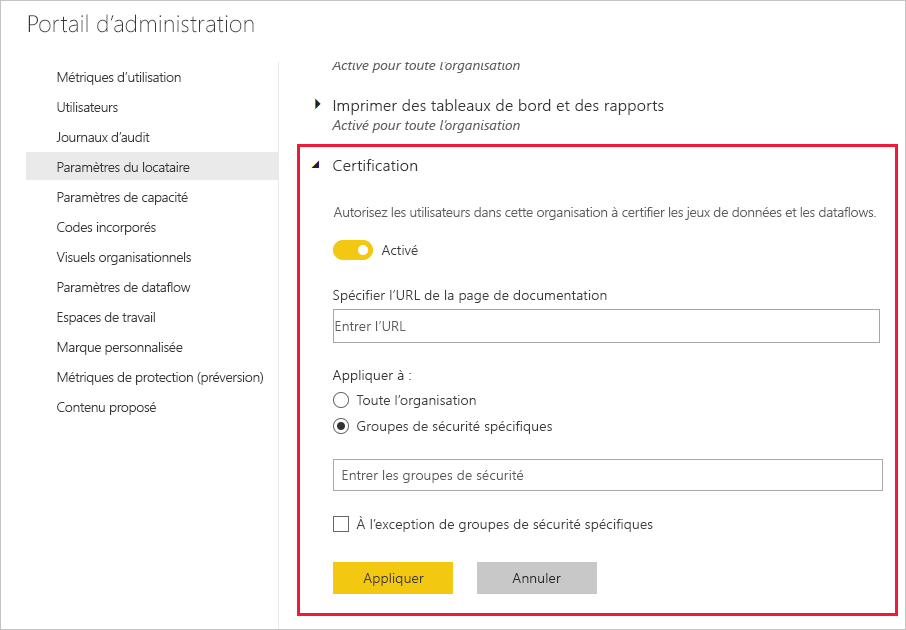

# Activer la certification de contenu

Votre organisation peut certifier du contenu sélectionné pour l’identifier en tant que source faisant autorité d’informations critiques. Actuellement, les types de contenu suivants peuvent être certifiés :
* Groupes de données
* Dataflows (préversion)
* Rapports (préversion)
* Applications (préversion)

En tant qu’administrateur Power BI, vous êtes responsable de l’activation et de la configuration du processus de certification pour votre organisation. La procédure est la suivante :
* Activation de la certification sur votre locataire
* Définition de la liste des groupes de sécurité dont les membres sont autorisés à certifier du contenu.
* Indication d’une URL qui pointe vers la documentation du processus de certification de contenu de l’organisation, si une telle documentation existe.

La certification fait partie de la fonctionnalité d’ *approbation* de Power BI. Reportez-vous à [Approbation : Promotion et certification de contenu Power BI](../collaborate-share/service-endorsement-overview.md) pour plus d’informations.

## Configurer la certification

1. Dans le portail d’administration, accédez à Paramètres du locataire.
1. Dans la section Paramètres d’exportation et de partage, développez la section Certification.

   

1. Définissez le bouton bascule sur **Activé**.
1. Si votre organisation dispose d’une stratégie de certification publiée, indiquez son URL ici. Cette URL va devenir le lien **En savoir plus** dans la section Certification de la [boîte de dialogue des paramètres d’approbation](../collaborate-share/service-endorse-content.md#request-content-certification). Si vous n’indiquez pas de lien, les utilisateurs qui veulent demander la certification de leur contenu sont invités à contacter leur administrateur Power BI.
1. Spécifiez un ou plusieurs groupes de sécurité dont les membres sont autorisés à certifier du contenu. Ces certificateurs autorisés pourront utiliser le bouton Certification de la section Certification de la [boîte de dialogue des paramètres d’approbation](../collaborate-share/service-endorse-content.md#certify-content).
    
    Si un groupe de sécurité contient des sous-groupes de sécurité auxquels vous ne voulez pas accorder de droits de certification, vous pouvez cocher la case **À l’exception de groupes de sécurité spécifiques** et entrer le nom de ces groupes dans la zone de texte qui s’affiche.
1. Cliquez sur **Appliquer**.

## Étapes suivantes
* [Promouvoir ou certifier du contenu](../collaborate-share/service-endorse-content.md)
* [En savoir plus sur l’approbation dans Power BI](../collaborate-share/service-endorsement-overview.md)
* Vous avez des questions ? [Essayez d’interroger la communauté Power BI](https://community.powerbi.com/)
