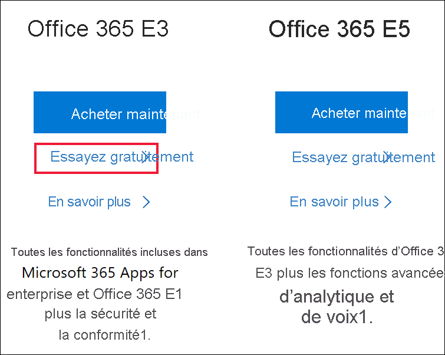
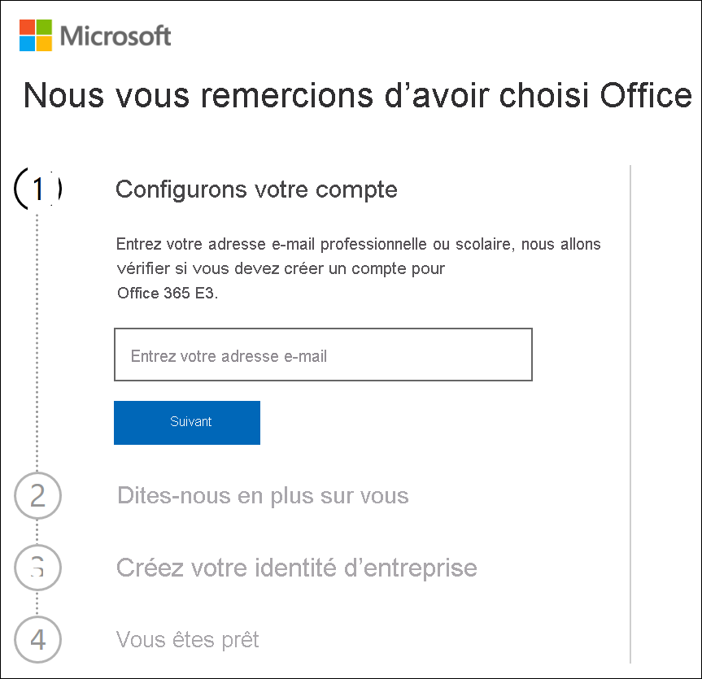
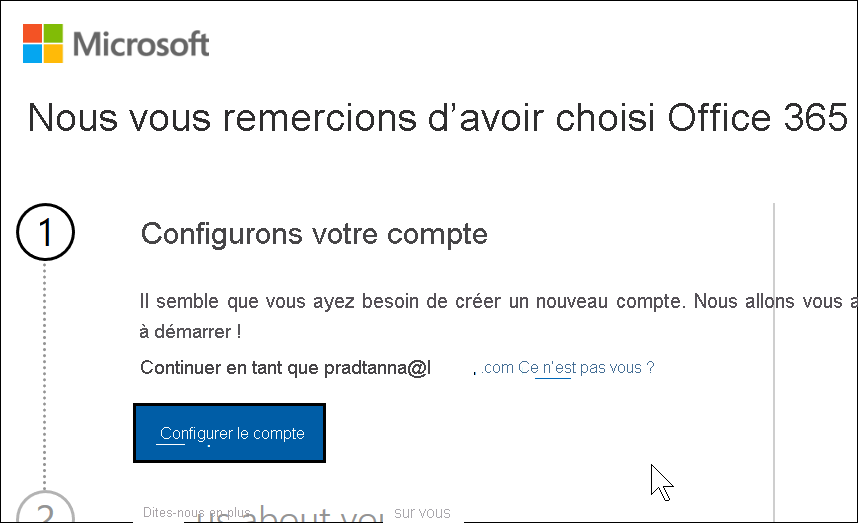
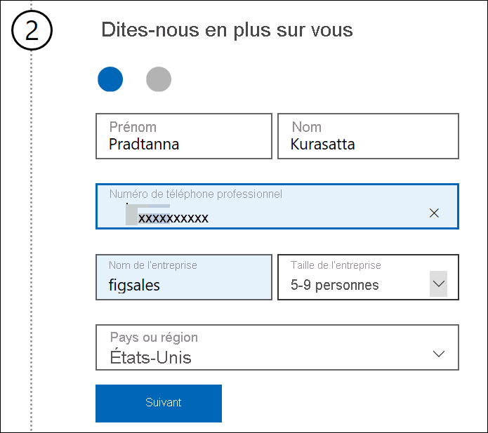
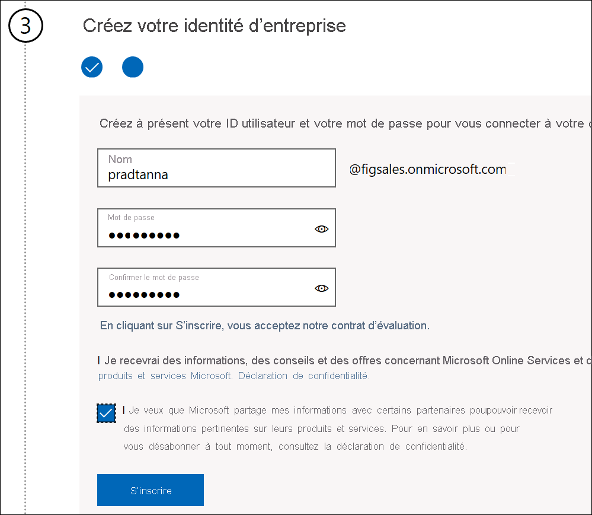
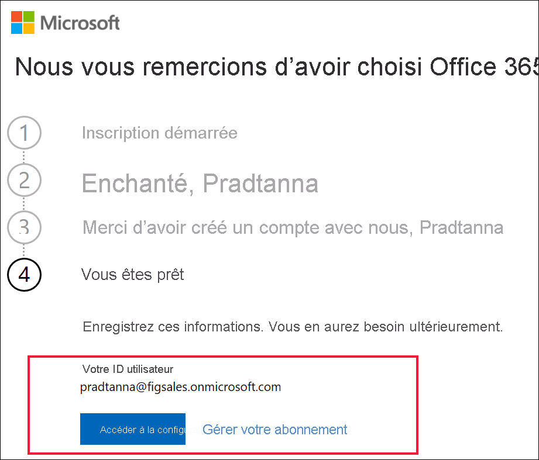

# Inscription à Power BI avec une nouvelle version d’évaluation de Microsoft 365

Cet article décrit une méthode alternative pour s’inscrire au service Power BI si vous ne disposez pas déjà d’un compte d’e-mail professionnel ou scolaire.

Si vous rencontrez des problèmes d’inscription à Power BI avec votre adresse e-mail, vérifiez d’abord qu’il s’agit d’une [adresse e-mail qui peut être utilisée avec Power BI](../fundamentals/service-self-service-signup-for-power-bi.md#supported-email-addresses). Si ce n’est pas le cas, inscrivez-vous pour une version d’évaluation de Microsoft 365 et créez un compte professionnel. Ensuite, utilisez ce nouveau compte professionnel pour vous inscrire auprès du service Power BI. Vous pourrez utiliser Power BI même après l’expiration de la version d’évaluation de Microsoft 365.

## S’inscrire à un essai Microsoft 365 d’Office

Inscrivez-vous pour un essai de Microsoft 365 [sur le site web de Microsoft 365](https://www.microsoft.com/microsoft-365/business/compare-more-office-365-for-business-plans). Si vous n’avez pas encore de compte, Microsoft vous guide tout au long des étapes à suivre pour en créer un. Étant donné que les comptes e-mail commerciaux (tels que Hotmail et Gmail) ne fonctionnent pas avec Microsoft 365, vous allez créer un nouveau compte.  Ce compte e-mail aura le format *zalan\@onmicrosoft.com*.

Si vous sélectionnez **Office 365 E5**, votre essai gratuit inclura Power BI Pro. L’essai gratuit de Power BI Pro expire en même temps que votre essai gratuit d’Office 365 E5 (actuellement, après 30 jours). Si, au lieu de cela, vous sélectionnez **Office 365 E3**, vous pourrez vous inscrire à Power BI en tant qu’utilisateur *gratuit* et effectuer une mise à niveau vers **Pro** pour un essai gratuit de 60 jours. 

1. Saisissez votre adresse de messagerie. Microsoft vous indiquera si cette adresse e-mail fonctionne avec Microsoft 365 ou si vous devez en créer une nouvelle.  

    Si vous avez besoin d’une nouvelle adresse e-mail, Microsoft vous guide tout au long des étapes. Première étape : création d’un compte. Sélectionnez **Configurer le compte**.

    

2. Entrez les détails du nouveau compte.

    

3. Créez votre adresse e-mail et votre mot de passe. Créez un nom de connexion au format you@yourcompany.onmicrosoft.com. Il s’agit de la connexion que vous utiliserez avec votre nouveau compte professionnel ou scolaire et avec Power BI.

    

4. Et c’est tout !  Vous disposez maintenant d’une adresse e-mail que vous pouvez utiliser pour vous inscrire à Power BI. Consultez [S’inscrire au service Power BI en tant que personne individuelle](../service-self-service-signup-for-power-bi.md)

     

    Vous devrez peut-être patienter pendant la création de votre locataire.

## Considérations importantes

Si vous avez des problèmes de connexion avec le nouveau compte, essayez d’utiliser une session de navigation privée.

En appliquant cette méthode d’inscription, vous créez un locataire d’organisation et vous devenez l’administrateur du locataire. Pour plus d’informations, consultez [Présentation de l’administration de Power BI](service-admin-administering-power-bi-in-your-organization.md). Vous pouvez ajouter de nouveaux utilisateurs à votre locataire, puis partager avec eux, comme décrit dans la [documentation sur l’administration de Microsoft 365](https://support.office.com/article/Add-users-individually-to-Office-365---Admin-Help-1970f7d6-03b5-442f-b385-5880b9c256ec).

## Étapes suivantes

[Présentation de l’administration de Power BI](service-admin-administering-power-bi-in-your-organization.md)  
[Gestion des licences Power BI dans votre organisation](service-admin-licensing-organization.md)  
[Inscription individuelle à Power BI](../fundamentals/service-self-service-signup-for-power-bi.md)

D’autres questions ? [Essayez d’interroger la communauté Power BI](https://community.powerbi.com/)
