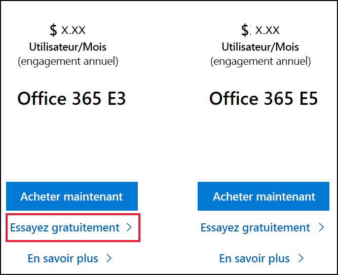
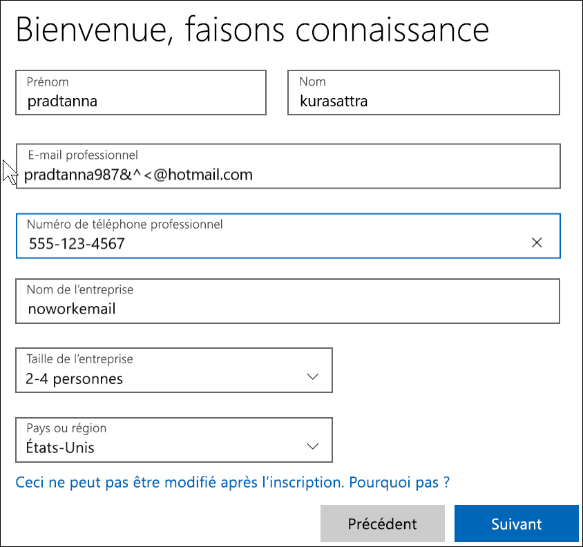

# Inscription à Power BI avec une nouvelle version d’évaluation de Microsoft 365

Cet article décrit une méthode alternative pour s’inscrire à Power BI si vous ne disposez pas déjà d’un compte d’e-mail professionnel ou scolaire. 

Si vous rencontrez des problèmes d’inscription à Power BI avec votre adresse e-mail, vérifiez d’abord qu’il s’agit d’une [adresse e-mail qui peut être utilisée avec Power BI](../fundamentals/service-self-service-signup-for-power-bi.md#supported-email-addresses). Si ce n’est pas le cas, inscrivez-vous pour une version d’évaluation de Microsoft 365 et créez un compte professionnel. Ensuite, utilisez ce nouveau compte professionnel pour vous inscrire auprès du service Power BI. Vous pourrez utiliser Power BI même après l’expiration de la version d’évaluation de Microsoft 365.

> [!NOTE]
> Office 365 a été récemment renommé en Microsoft 365. Tant que tous nos articles n’ont pas été mis à jour, vous pouvez donc le voir référencé sous le nom « Office 365 ».

1. Inscrivez-vous pour un essai de Microsoft 365 [sur le site web de Microsoft 365](https://www.microsoft.com/en-us/microsoft-365/business/compare-more-office-365-for-business-plans).

    

    

    

    

    

    

1. Créez votre nom de connexion professionnel sous la forme you@yourcompany.onmicrosoft.com. Il s’agit de la connexion que vous utiliserez avec Power BI.

    

        

1. Vous devrez peut-être patienter pendant la création de votre locataire. 

Et c’est tout !  Vous disposez maintenant d’une adresse e-mail que vous pouvez utiliser pour vous inscrire à Power BI. Consultez [S’inscrire au service Power BI en tant que personne individuelle](../fundamentals/service-self-service-signup-for-power-bi.md)

## Considérations importantes
Si vous avez des problèmes de connexion avec le nouveau compte, essayez d’utiliser une session de navigation privée.    

En appliquant cette méthode d’inscription, vous créez un locataire d’organisation et vous devenez l’administrateur du locataire. Pour plus d’informations, consultez [Présentation de l’administration de Power BI](service-admin-administering-power-bi-in-your-organization.md). Vous pouvez ajouter de nouveaux utilisateurs à votre locataire, puis partager avec eux, comme décrit dans la [documentation sur l’administration de Microsoft 365](https://support.office.com/en-sg/article/Add-users-individually-to-Office-365---Admin-Help-1970f7d6-03b5-442f-b385-5880b9c256ec).

## Étapes suivantes

[Présentation de l’administration de Power BI](service-admin-administering-power-bi-in-your-organization.md)  
[Gestion des licences Power BI dans votre organisation](service-admin-licensing-organization.md)  
[Inscription individuelle à Power BI](../fundamentals/service-self-service-signup-for-power-bi.md)

D’autres questions ? [Essayez d’interroger la communauté Power BI](https://community.powerbi.com/)