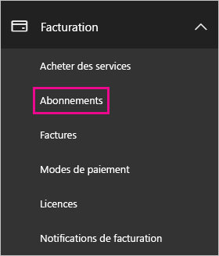
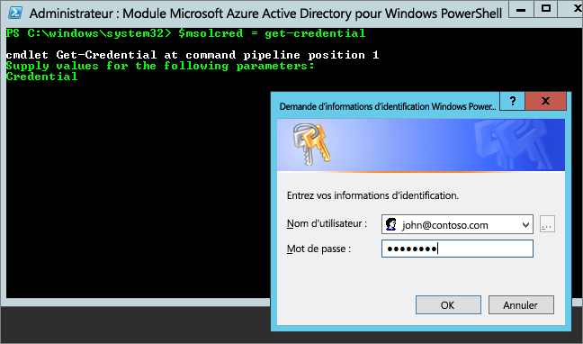

# <a name="unable-to-add-power-bi-to-office-365-partner-subscription"></a>Impossible d’ajouter Power BI à l’abonnement du partenaire Office 365

Office 365 permet aux sociétés de revendre Office 365 dans une offre groupée et intégrée à leurs propres solutions, pour fournir aux utilisateurs finaux un seul point de contact pour l’achat, la facturation et le support technique.

Si vous avez envie d’acquérir Power BI conjointement à votre abonnement Office 365, nous vous recommandons de contacter votre partenaire. Si votre partenaire ne propose actuellement pas Power BI, différentes options sont envisageables pour poursuivre.

## <a name="work-with-your-partner-to-purchase-power-bi"></a>Travailler avec votre partenaire pour acheter Power BI

Si vous voulez souscrire un abonnement à Power BI Pro ou Power BI Premium, déterminez avec votre partenaire les options qui s’offrent à vous :

* Votre partenaire accepte d’ajouter Power BI à son portefeuille pour que vous puissiez réaliser des achats auprès de lui.

* Votre partenaire est en mesure de vous faire passer vers un modèle qui vous permet d’acheter Power BI directement auprès de Microsoft ou d’un autre partenaire qui propose Power BI.

## <a name="purchase-from-microsoft-or-another-channel"></a>Acheter auprès de Microsoft ou par un autre canal

En fonction de la relation que vous entretenez avec votre partenaire, vous pouvez acheter Power BI directement auprès de Microsoft ou d’un autre partenaire. Vous pouvez vérifier si vous pouvez ajouter des abonnements de Power BI dans le centre d’administration Microsoft 365 (nécessite l’appartenance au rôle Administrateur général ou Administrateur de facturation).

1. Accédez au [Centre d’administration Microsoft 365](https://admin.microsoft.com/AdminPortal/Home#/homepage).

1. Dans le menu de gauche, ouvrez **Facturation** :

    * si vous voyez **Abonnements**, vous pouvez acquérir le service directement auprès de Microsoft, ou également contacter un partenaire qui propose Power BI.

        

    * Si vous ne voyez pas **Abonnements**, vous ne pouvez pas acheter directement auprès de Microsoft ou d’un autre partenaire.

Si votre partenaire ne propose pas Power BI et que vous ne pouvez pas acheter directement auprès de Microsoft ou d’un autre partenaire, envisagez de vous inscrire à un essai gratuit.

## <a name="sign-up-for-a-free-trial"></a>S’inscrire à un essai gratuit

Vous pouvez vous inscrire à un essai gratuit de Power BI. Si vous n’achetez Power BI Pro à la fin de la période d’essai, vous aurez toujours une licence gratuite proposant de nombreuses fonctionnalités de Power BI. Pour plus d’informations, consultez [Inscription individuelle à Power BI](../fundamentals/service-self-service-signup-for-power-bi.md).

### <a name="enable-ad-hoc-subscriptions"></a>Activer des abonnements ad-hoc

Par défaut, les inscriptions individuelle (également appelées abonnements ad hoc) sont désactivées. Dans ce cas, vous voyez le message suivant lorsque vous tentez de vous inscrire : *Votre service informatique a désactivé l’inscription à Microsoft Power BI*.


Pour activer les abonnements ad hoc, vous pouvez contacter votre partenaire pour le lui demander. Si vous êtes administrateur de votre client et savez comment utiliser les commandes PowerShell Azure Active Directory, vous pouvez activer les abonnements ad hoc vous-même. [ Azure Active Directory PowerShell pour Graph](/powershell/azure/active-directory/install-adv2/)

1. Connectez-vous à Azure Active Directory avec vos informations d’identification Office 365. La première ligne du script ci-dessous vous invite à entrer vos informations d’identification. La deuxième ligne établit la connexion à Azure Active Directory.

    ```powershell
    $msolcred = get-credential
    connect-msolservice -credential $msolcred
    ```

    

1. Une fois que vous êtes connecté, exécutez la commande suivante pour vérifier le paramètre actuel de `AllowAdHocSubscriptions`.

    ```powershell
    Get-MsolCompanyInformation
    ```

1. Exécutez la commande suivante pour activer les inscriptions gratuites.

    ```powershell
    Set-MsolCompanySettings -AllowAdHocSubscriptions $true
    ```

## <a name="next-steps"></a>Étapes suivantes

[Gestion des licences Power BI dans votre organisation](service-admin-licensing-organization.md)

D’autres questions ? [Essayez d’interroger la communauté Power BI](https://community.powerbi.com/)