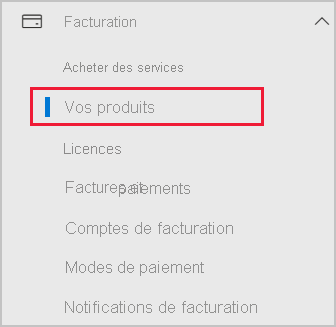

# Ajouter Power BI à un abonnement de partenaire Microsoft 365

Microsoft 365 permet aux entreprises de revendre Microsoft 365 dans une offre groupée et intégrée à leurs propres solutions, pour fournir aux clients un seul point de contact pour l’achat, la facturation et le support.

Si ajouter Power BI à votre abonnement Microsoft 365 vous intéresse, nous vous recommandons de contacter votre partenaire. Si votre partenaire ne propose pas Power BI, vous pouvez utiliser les options décrites ci-dessous.

## Travailler avec votre partenaire pour acheter Power BI

Si vous voulez souscrire un abonnement à Power BI Pro ou Power BI Premium, déterminez avec votre partenaire les options qui s’offrent à vous :

* Votre partenaire accepte d’ajouter Power BI à son portefeuille pour que vous puissiez réaliser des achats auprès de lui.

* Votre partenaire peut vous faire passer à un modèle qui vous permet d’acheter Power BI directement auprès de Microsoft ou d’un autre partenaire qui propose Power BI.

## Acheter auprès de Microsoft ou par un autre canal

En fonction de la relation que vous entretenez avec votre partenaire, vous pouvez acheter Power BI directement auprès de Microsoft ou d’un autre partenaire. Vous pouvez vérifier si vous pouvez ajouter des abonnements Power BI dans le centre d’administration Microsoft 365 (nécessite l’appartenance au rôle Administrateur général ou Administrateur de facturation).

1. Accédez au [Centre d’administration Microsoft 365](https://admin.microsoft.com/AdminPortal/Home#/homepage).

1. Dans le menu de gauche, ouvrez **Facturation**, puis sélectionnez **Vos produits** :

   

 1. Recherchez **Abonnements** comme indiqué dans l’image ci-dessous. si vous voyez **Abonnements**, vous pouvez acquérir le service directement auprès de Microsoft, ou également contacter un partenaire qui propose Power BI.

    

    Si vous ne voyez pas **Abonnements**, vous ne pouvez pas acheter directement auprès de Microsoft ou d’un autre partenaire.

Si votre partenaire ne propose pas Power BI et que vous ne pouvez pas acheter directement auprès de Microsoft ou d’un autre partenaire, vous pouvez vous inscrire à un essai gratuit.

## S’inscrire à un essai gratuit

Vous pouvez vous inscrire à un essai gratuit de Power BI. Si vous n’achetez Power BI Pro à la fin de la période d’essai, vous aurez toujours une licence gratuite proposant de nombreuses fonctionnalités de Power BI. Pour plus d’informations, consultez [Inscription individuelle à Power BI](../fundamentals/service-self-service-signup-for-power-bi.md).

### Activer des abonnements ad-hoc

Par défaut, les inscriptions individuelle (également appelées abonnements ad hoc) sont désactivées. Dans ce cas, vous voyez le message suivant lorsque vous tentez de vous inscrire : *Votre service informatique a désactivé l’inscription à Microsoft Power BI*.

Pour activer les abonnements ad hoc, vous pouvez contacter votre partenaire pour le lui demander. Si vous êtes administrateur de votre locataire et que vous savez comment utiliser les commandes PowerShell Azure Active Directory, vous pouvez activer vous-même des abonnements ad hoc. Pour plus d’informations, suivez les étapes décrites dans [Activer ou désactiver l’achat en libre-service](service-admin-disable-self-service.md).

## Étapes suivantes

* [Gestion des licences Power BI dans votre organisation](service-admin-licensing-organization.md)
* [Acheter et attribuer des licences Power BI Pro](service-admin-purchasing-power-bi-pro.md)

D’autres questions ? [Essayez d’interroger la communauté Power BI](https://community.powerbi.com/)