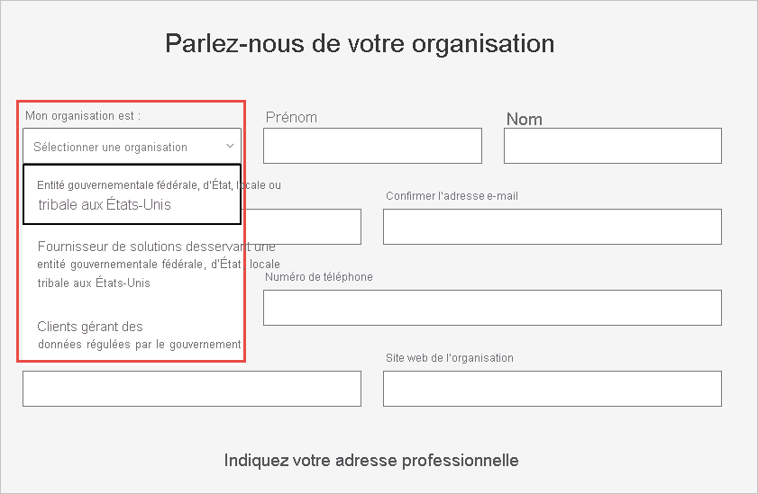

# Inscrire une organisation du gouvernement des États-Unis au service Power BI

Il existe une version du service Power BI intégrée aux [offres Microsoft 365 Secteur Public](https://www.microsoft.com/microsoft-365/government/compare-office-365-government-plans?rtc=1). Cet article s’adresse aux clients du gouvernement des États-Unis. Le processus d’inscription décrit ici est différent celui de la version commerciale du service Power BI.

Pour plus d’informations sur le service Power BI pour le gouvernement des États-Unis, consultez [Power BI pour les clients du gouvernement des États-Unis – Vue d’ensemble](service-govus-overview.md).

> [!NOTE]
> Cet article est destiné aux administrateurs autorisés à inscrire leur organisation du gouvernement des États-Unis à Power BI. Si vous êtes un utilisateur final, contactez votre administrateur afin d’obtenir un abonnement à Power BI pour le gouvernement des États-Unis.
> 
> 

## Sélection du processus d’inscription adapté à l’organisation du gouvernement des États-Unis

Votre organisation du gouvernement des États-Unis n’utilise peut-être pas encore la communauté cloud du secteur public ou dispose peut-être déjà d’un abonnement. Les sections suivantes détaillent la procédure d’inscription selon les stades d’inscription aux offres Microsoft 365 Secteur Public et à Power BI. La procédure est différente en fonction de votre inscription actuelle.

Après inscription à Power BI US Government, commencez le [processus de liste verte](#additional-signup-information) décrit dans cet article en collaboration avec votre équipe de compte. Cette étape est nécessaire pour permettre à votre organisation d’utiliser pleinement le Cloud de la communauté du secteur public.

## Inscription à une nouvelle offre Microsoft 365 Secteur Public

Si votre organisation est nouvelle dans la communauté cloud du secteur public, suivez la procédure ci-dessous pour obtenir une offre Microsoft 365 Secteur Public :

> [!NOTE]
> Cette procédure doit être suivie par l’administrateur général.
>

1. Accédez aux [plans Microsoft 365 Service Public](https://products.office.com/government/office-365-web-services-for-government).
2. Sélectionnez **Commencer avec un essai gratuit**.
3. Remplissez le formulaire pour nous communiquer des renseignements sur votre organisation. Utilisez la liste déroulante pour sélectionner le type de votre organisation.

   

4. Envoyez le formulaire pour commencer le processus d’intégration. Votre représentant ou votre partenaire Microsoft pourra répondre à vos questions si nécessaire.

Une fois ce processus terminé, suivez la procédure destinée aux clients Microsoft 365 Secteur public existants pour ajouter un abonnement Power BI.

## Ajouter Power BI à une offre Microsoft 365 Secteur Public

Si votre organisation dispose déjà d’une offre Microsoft 365 Secteur Public, suivez cette procédure pour ajouter un abonnement Power BI :

> [!NOTE]
> Cette procédure doit être suivie par l’administrateur général.
> 
> 

1. Connectez-vous au Centre d’administration Microsoft 365 avec vos informations d’identification d’administrateur général ou d’administrateur de facturation.
2. Sélectionnez **Facturation** > **Acheter des services**.
4. Effectuez une recherche ou faites défiler la liste pour trouver l’offre Power BI Pro Secteur Public et choisissez **Essayer** ou **Acheter maintenant**.
5. Finalisez votre commande.
6. Affectez des licences aux comptes d’utilisateurs.

## Informations complémentaires sur l’inscription

Pour pouvoir utiliser les services Power BI US Government, vous devez demander à votre équipe de compte Microsoft d’ajouter votre organisation à la liste verte Microsoft. Le processus de liste verte est utilisé par l’équipe d’ingénierie de Power BI pour migrer des clients de l’environnement cloud commercial vers le Cloud de la communauté du secteur public sécurisé. Cette procédure permet de garantir le bon fonctionnement des fonctionnalités disponibles dans le cloud du gouvernement des États-Unis. 

Pour obtenir une assistance afin de commencer le processus de liste verte, contactez votre équipe de compte Microsoft. Seuls les administrateurs peuvent demander l’ajout à la liste verte. Le processus prend environ trois semaines. Au cours de cette période, l’équipe d’ingénierie de Power BI apporte les modifications nécessaires au fonctionnement de votre locataire dans le cloud du gouvernement des États-Unis.

## Étapes suivantes

* [Vue d’ensemble de Power BI pour le gouvernement des États-Unis](service-govus-overview.md)
- [Modalités d’achat de Microsoft 365 Secteur Public](/office365/servicedescriptions/office-365-platform-service-description/office-365-us-government/microsoft-365-government-how-to-buy#how-do-i-buy-microsoft-365-government)