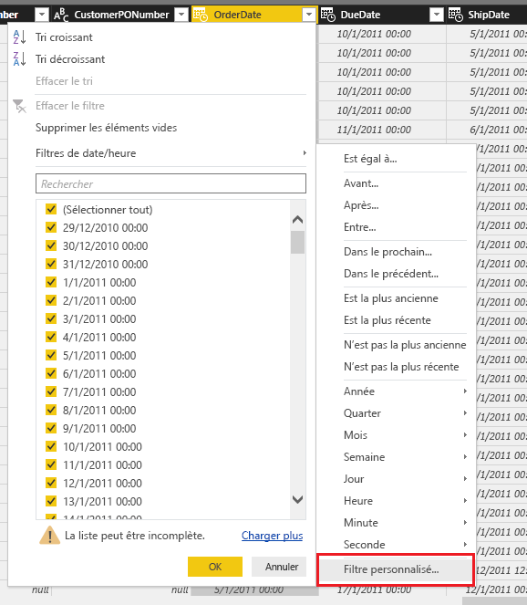
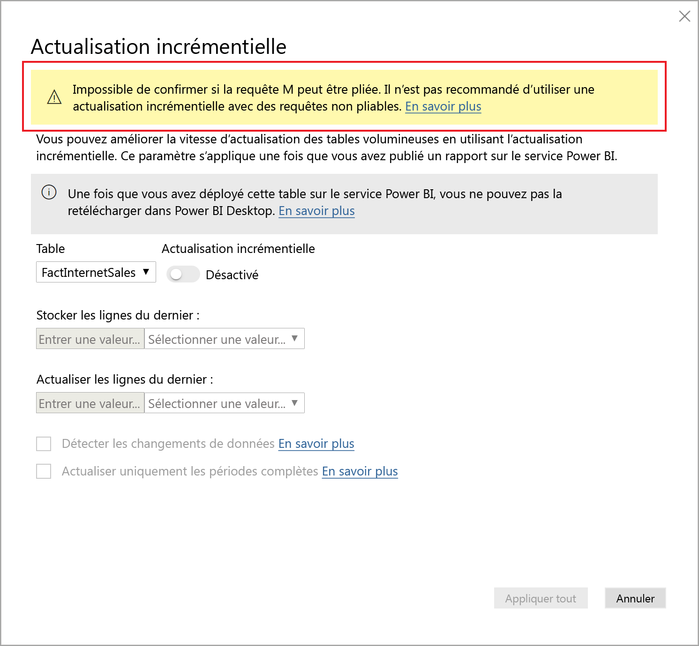
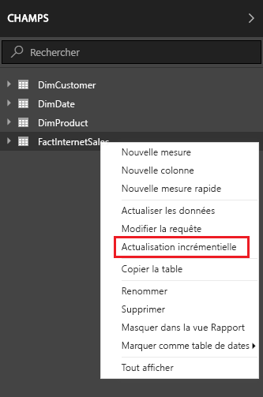
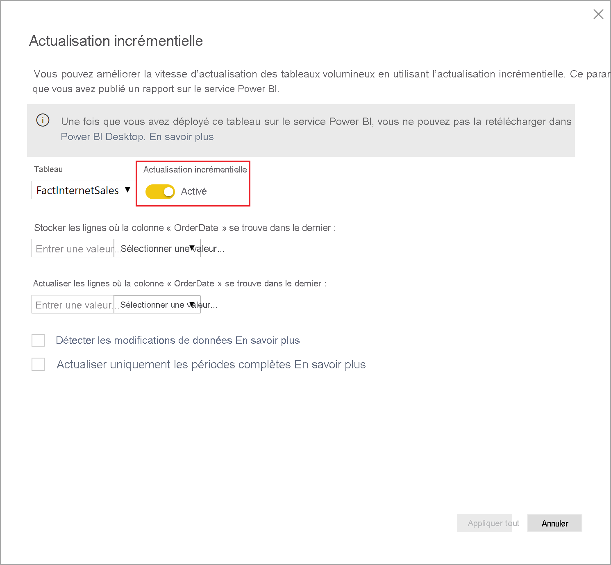
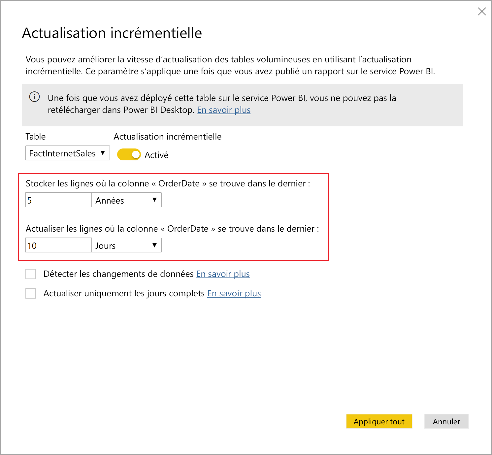
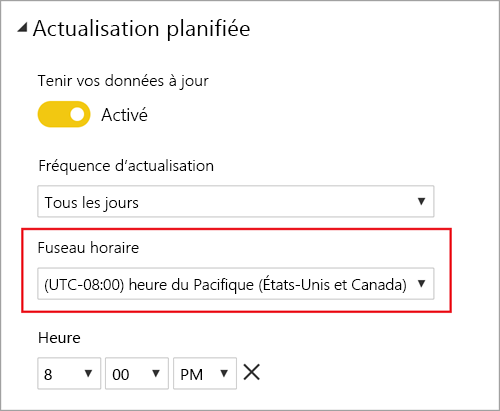
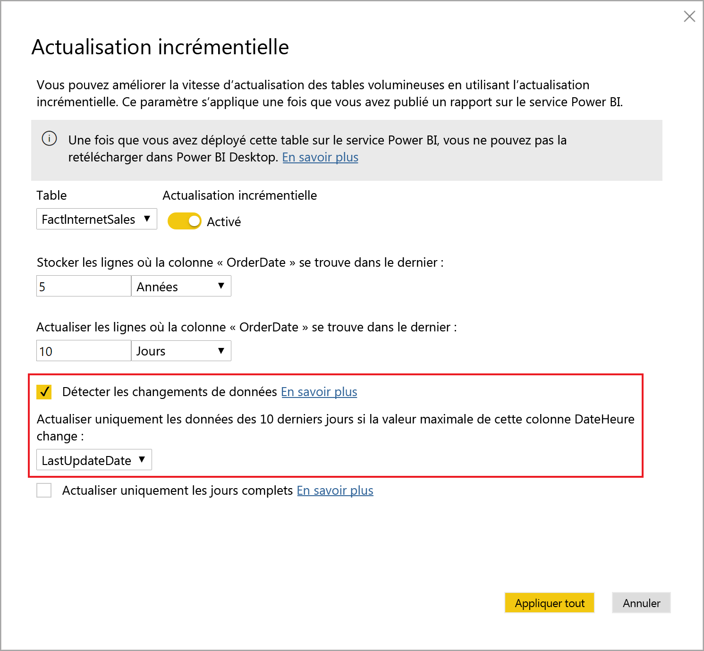
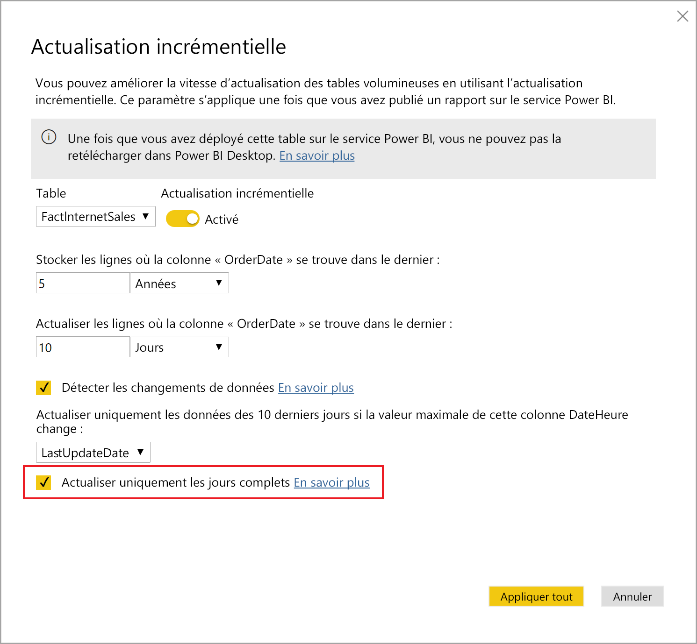
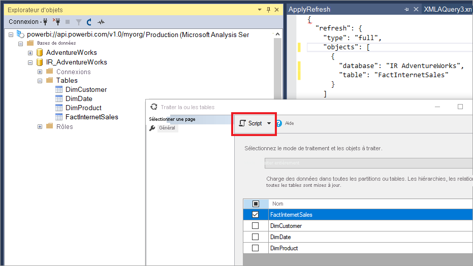

# <a name="incremental-refresh-in-power-bi"></a>Actualisation incrémentielle dans Power BI

L’actualisation incrémentielle permet d’utiliser de très grands jeux de données dans Power BI et offre les avantages suivants :

> [!div class="checklist"]
> * **Actualisations plus rapides** : Seules les données qui ont changé ont besoin d’être actualisées. Par exemple, vous pouvez actualiser uniquement les données des cinq derniers jours dans un jeu de données de dix ans.
> * **Actualisations plus fiables** : Il n’est plus nécessaire de maintenir des connexions à long terme à des systèmes sources volatiles.
> * **Consommation réduite des ressources** : Comme il y a moins de données à actualiser, la consommation globale de mémoire et d’autres ressources diminue.

> [!NOTE]
> L’actualisation incrémentielle est maintenant disponible pour les abonnements et jeux de données Power BI Pro, Premium et partagés.

## <a name="configure-incremental-refresh"></a>Configurer une actualisation incrémentielle

Les stratégies d’actualisation incrémentielle sont définies dans Power BI Desktop et sont appliquées une fois publiées sur le service Power BI.

### <a name="filter-large-datasets-in-power-bi-desktop"></a>Filtrer des jeux de données volumineux dans Power BI Desktop

Les jeux de données volumineux contenant potentiellement des milliards de lignes ne sont peut-être pas adaptés à un modèle Power BI Desktop, car le fichier PBIX est limité par les ressources en mémoire disponibles sur l’ordinateur. Ces jeux de données sont donc souvent filtrés lors de l’importation. Ce type de filtrage s’applique que l’actualisation incrémentielle soit utilisée ou non. Pour l’actualisation incrémentielle, vous filtrez à l’aide des paramètres de date/heure de Power Query.

#### <a name="rangestart-and-rangeend-parameters"></a>Paramètres RangeStart et RangeEnd

Pour l’actualisation incrémentielle, les jeux de données sont filtrés à l’aide des paramètres de date/heure de Power Query avec les noms réservés qui respectent la casse **RangeStart** et **RangeEnd**. Ces paramètres servent à filtrer les données importées dans Power BI Desktop, mais aussi à répartir de manière dynamique les données dans des plages une fois publiées sur le service Power BI. Les valeurs de paramètre sont remplacées par le service pour filtrer chaque répartition. Vous n’avez pas besoin de les définir dans les paramètres du jeu de données du service. Une fois publiées, les valeurs des paramètres sont automatiquement remplacées par le service Power BI.

Pour définir les paramètres avec les valeurs par défaut, dans l’éditeur Power Query, sélectionnez **Gérer les paramètres**.


Une fois que vous avez défini les paramètres, vous pouvez appliquer le filtre en sélectionnant l’option de menu **Filtre personnalisé** pour une colonne.



Vérifiez que les lignes sont filtrées quand la valeur de colonne *est postérieure ou égale à* **RangeStart** et *antérieure* à **RangeEnd**. D’autres combinaisons de filtres peuvent entraîner un double comptage des lignes.


> [!IMPORTANT]
> Vérifiez que les requêtes présentent un signe égal (=) sur **RangeStart** ou **RangeEnd**, mais pas les deux. Si le signe égal (=) figure sur les deux paramètres, une ligne peut satisfaire aux conditions de deux partitions, ce qui peut entraîner des données en double dans le modèle. Par exemple,  
> \#"Filtered Rows" = Table.SelectRows(dbo_Fact, each [OrderDate] **>= RangeStart** and [OrderDate] **<= RangeEnd**) peut entraîner des données en double.

> [!TIP]
> Les paramètres doivent avoir le type de données date/heure, mais ils peuvent être convertis pour répondre aux exigences de la source de données. Par exemple, la fonction Power Query suivante convertit une valeur date/heure en une valeur similaire à une clé de substitution de type entier au format *aaaammjj*, ce qui est courant pour les entrepôts de données. La fonction peut être appelée à l’étape du filtre.
>
> `(x as datetime) => Date.Year(x)*10000 + Date.Month(x)*100 + Date.Day(x)`

Sélectionnez **Fermer et appliquer** dans l’éditeur Power Query. Vous devez avoir un sous-ensemble du jeu de données dans Power BI Desktop.

#### <a name="filter-date-column-updates"></a>Filtrer les mises à jour de la colonne de date

Le filtre sur la colonne de date sert à répartir dynamiquement les données dans des plages dans le service Power BI. L’actualisation incrémentielle n’a pas vocation à prendre en charge les cas où la colonne de date filtrée est mise à jour dans le système source. Une mise à jour est interprétée comme une insertion et une suppression, et non pas comme une vraie mise à jour. Si la suppression se produit dans la plage historique et pas dans la plage incrémentielle, elle ne sera pas récupérée. Cela peut entraîner des échecs d’actualisation des données en raison de conflits de clé de partition.

#### <a name="query-folding"></a>Pliage de requêtes

Il est important que le filtre de partition soit poussé vers le système source lorsque des requêtes sont envoyées pour les opérations d’actualisation. Le filtre peut être rapproché des données seulement si la source de données prend en charge le pliage de requêtes. La plupart des sources de données qui prennent en charge les requêtes SQL prennent également en charge le « Query folding ». Toutefois, ce n’est généralement pas le cas des sources de données telles que les fichiers plats, les objets blob et les flux web. Dans les cas où le filtre n’est pas pris en charge par le back-end de source de données, il ne peut pas être rapproché des données. Dans ces cas, le moteur de mashup compense et applique le filtre localement, ce qui peut nécessiter la récupération du jeu de données complet à partir de la source de données. Cette opération peut ralentir sensiblement l’actualisation incrémentielle, et le processus peut manquer de ressources dans le service Power BI ou dans la passerelle de données locale éventuellement utilisée.

Étant donné les différents niveaux de prise en charge du pliage de requêtes pour chaque source de données, il est recommandé de vérifier que la logique de filtre est incluse dans les requêtes sources. Pour faciliter l’opération, Power BI Desktop tente d’effectuer cette vérification pour vous. S’il est impossible de l’effectuer, un avertissement s’affiche dans la boîte de dialogue de l’actualisation incrémentielle lors de la définition de la stratégie d’actualisation incrémentielle. Les sources de données basées sur SQL, comme SQL, Oracle et Teradata, peuvent se fier à cet avertissement. Les autres sources de données peuvent ne pas être en mesure d’effectuer la vérification sans suivi des requêtes. Si Power BI Desktop ne peut pas confirmer, l’avertissement suivant s’affiche. Si vous voyez cet avertissement et que vous souhaitez vérifier que le Query Folding nécessaire se produit, vous pouvez utiliser la fonctionnalité Diagnostics de requête ou suivre les requêtes reçues par la base de données source.

 

### <a name="define-the-refresh-policy"></a>Définir la stratégie d’actualisation

L’actualisation incrémentielle est disponible dans le menu contextuel des tables, à l’exception des modèles Connexion active.



#### <a name="incremental-refresh-dialog"></a>Boîte de dialogue Actualisation incrémentielle

La boîte de dialogue Actualisation incrémentielle s’affiche. Utilisez le bouton bascule pour activer la boîte de dialogue.



> [!NOTE]
> Si l’expression Power Query pour la table ne fait pas référence aux paramètres avec des noms réservés, le bouton bascule est désactivé.

Le texte d’en-tête décrit ce qui suit :

- Les stratégies d’actualisation sont définies dans Power BI Desktop. Elles sont appliquées par les opérations d’actualisation dans le service.

- Si vous pouvez télécharger le fichier PBIX contenant une stratégie d’actualisation incrémentielle à partir du service Power BI, le fichier ne s’ouvre pas dans Power BI Desktop. Cela ne sera peut-être plus le cas dans une version future, mais sachez que la taille de ces jeux de données peut augmenter considérablement, au point qu’il ne soit plus possible de les télécharger ni de les ouvrir sur un ordinateur de bureau classique.

#### <a name="refresh-ranges"></a>Plages d’actualisation

L’exemple suivant définit une stratégie d’actualisation pour stocker les données de cinq années calendaires complètes, ainsi que les données de l’année en cours jusqu’à la date actuelle, et actualiser de manière incrémentielle dix jours complets de données. La première opération d’actualisation charge les données d’historique. Les actualisations suivantes sont incrémentielles et effectuent les opérations suivantes (si elles sont planifiées pour s’exécuter tous les jours) :

- Ajout d’un nouveau jour de données.

- Actualisation de dix jours complets jusqu’à la date actuelle.

- Suppression des années calendaires qui sont antérieures aux cinq années précédant la date actuelle. Par exemple, si la date actuelle est le 1er janvier 2019, l’année 2013 est supprimée.

La première actualisation effectuée dans le service Power BI peut être plus longue, car toutes les données des cinq années calendaires complètes doivent être importées. Les actualisations suivantes sont généralement très rapides.



#### <a name="current-date"></a>Date actuelle

La *date actuelle* est basée sur la date système au moment de l’actualisation. Si l’actualisation planifiée est activée pour le jeu de données dans le service Power BI, le fuseau horaire spécifié est pris en compte pour la détermination de la date actuelle. Les actualisations planifiées et appelées manuellement via le service Power BI tiennent compte du fuseau horaire s’il est disponible. Par exemple, une actualisation qui se produit à 20 h heure du Pacifique (États-Unis et Canada) avec un fuseau horaire spécifié détermine la date actuelle en fonction de l’heure du Pacifique et non de l’heure GMT (qui correspondrait au jour suivant). Les opérations d’actualisation qui ne sont pas appelées par le service Power BI, comme la [commande d’actualisation TMSL](/analysis-services/tmsl/refresh-command-tmsl?view=power-bi-premium-current), ne prennent pas en compte le fuseau horaire de l’actualisation planifiée



> [!NOTE]
> Quand vous avez terminé la définition de ces plages, vous pouvez passer directement à l’étape de publication suivante. Les autres menus déroulants concernent des fonctionnalités avancées.

### <a name="advanced-policy-options"></a>Options de stratégie avancée

#### <a name="detect-data-changes"></a>Détecter les changements de données

L’actualisation incrémentielle de dix jours est plus efficace qu’une actualisation complète de cinq années. Toutefois, il est possible de faire mieux encore. Si vous cochez la case **Détecter les changements de données**, vous pouvez sélectionner une colonne date/heure à utiliser pour identifier et actualiser uniquement les jours où les données ont changé. Cela suppose que cette colonne existe dans le système source, généralement à des fins d’audit. **Cela ne doit pas être la même colonne que celle utilisée pour partitionner les données avec les paramètres RangeStart/RangeEnd.** La valeur maximale de cette colonne est évaluée pour chacune des périodes définies dans la plage incrémentielle. Si cette valeur n’a pas changé depuis la dernière actualisation, la période n’a pas besoin d’être actualisée. Dans l’exemple, cela peut réduire les jours concernés par l’actualisation incrémentielle de dix à deux environ.



> [!TIP]
> Dans la conception actuelle, la colonne utilisée pour détecter les changements de données doit être persistante et mise en mémoire cache. Essayez l’une des techniques suivantes pour réduire la consommation de mémoire et la cardinalité.
>
> Conservez uniquement la valeur maximale de cette colonne persistante au moment de l’actualisation, éventuellement à l’aide d’une fonction Power Query.
>
> Diminuez la précision à un niveau acceptable en fonction de vos exigences de fréquence d’actualisation.
>
> Définissez une requête personnalisée pour la détection des modifications de données à l’aide du point de terminaison XMLA et évitez de conserver entièrement la valeur de la colonne. Pour plus d’informations, consultez les requêtes personnalisées pour détecter les modifications de données ci-dessous.

#### <a name="only-refresh-complete-periods"></a>Actualiser uniquement les périodes complètes

Supposons que vous avez planifié l’actualisation à 4 h 00 chaque matin. Vous ne voudrez peut-être pas prendre en compte les données éventuellement ajoutées au système source pendant ces quatre heures. L’actualisation de certaines métriques métier, comme le nombre de barils par jour dans l’industrie du pétrole et du gaz, n’a aucun sens si elle concerne des jours partiels.

Un autre exemple est l’actualisation des données d’un système financier où les données du mois précédent sont approuvées le 12e jour calendaire du mois. Vous pouvez définir une plage incrémentielle d’un mois et planifier l’actualisation le 12e jour du mois. Avec cette option activée, les données du mois de janvier sont actualisées le 12 février, par exemple.



> [!NOTE]
> Les opérations d’actualisation dans le service sont effectuées selon l’heure UTC. Cela peut déterminer la date d’effet de l’actualisation et impacter les périodes complètes. Nous prévoyons d’ajouter la possibilité d’ignorer la date d’effet pour une opération d’actualisation.

## <a name="publish-to-the-service"></a>Publier sur le service

Vous pouvez désormais actualiser le modèle. La première actualisation peut être plus longue en raison de l’importation des données d’historique. Les actualisations suivantes peuvent être beaucoup plus rapides si elles sont effectuées à l’aide de l’actualisation incrémentielle.

## <a name="query-timeouts"></a>Délais d’expiration des requêtes

L’article sur la [résolution des problèmes d’actualisation](../connect-data/refresh-troubleshooting-refresh-scenarios.md) explique que les opérations d’actualisation dans le service Power BI sont soumises à des délais d’expiration. Les requêtes peuvent également être limitées par le délai d’expiration par défaut pour la source de données. La plupart des sources relationnelles permettent d’ignorer les délais d’expiration dans l’expression M. Par exemple, l’expression ci-dessous utilise la [fonction d’accès aux données de SQL Server](/powerquery-m/sql-database) pour définir le délai à deux heures. Chaque période définie par les plages de la stratégie soumet une requête qui respecte le paramètre de délai d’expiration de la commande.

```powerquery-m
let
    Source = Sql.Database("myserver.database.windows.net", "AdventureWorks", [CommandTimeout=#duration(0, 2, 0, 0)]),
    dbo_Fact = Source{[Schema="dbo",Item="FactInternetSales"]}[Data],
    #"Filtered Rows" = Table.SelectRows(dbo_Fact, each [OrderDate] >= RangeStart and [OrderDate] < RangeEnd)
in
    #"Filtered Rows"
```

## <a name="xmla-endpoint-benefits-for-incremental-refresh"></a>Avantages du point de terminaison XMLA pour l’actualisation incrémentielle

Le [point de terminaison XMLA](service-premium-connect-tools.md) pour les jeux de données dans une capacité Premium peut être activé pour des opérations de lecture/écriture qui peuvent bénéficier considérablement de l’actualisation incrémentielle. Les opérations d’actualisation via le point de terminaison XMLA ne sont pas limitées à [48 actualisations par jour](../connect-data/refresh-data.md#data-refresh) et le [délai d’expiration d’actualisation planifié](../connect-data/refresh-troubleshooting-refresh-scenarios.md#scheduled-refresh-timeout) n’est pas imposé et peut être utile dans des scénarios d’actualisation incrémentielle.

### <a name="refresh-management-with-sql-server-management-studio-ssms"></a>Actualiser la gestion avec SQL Server Management Studio (SSMS)

Avec l’accès en lecture-écriture du point de terminaison XMLA activé, SSMS peut être utilisé pour afficher et gérer les partitions générées par l’application de stratégies d’actualisation incrémentielle. Ceci permet, par exemple, d’actualiser une partition historique spécifique absente d’une plage incrémentielle pour exécuter une mise à jour rétro-active sans devoir actualiser toutes les données historiques. Vous pouvez également utiliser SSMS pour charger des données historiques pour des jeux de données très volumineux en ajoutant ou en actualisant des partitions historiques par lots.


#### <a name="override-incremental-refresh-behavior"></a>Remplacer le comportement d’actualisation incrémentielle

Avec SSMS, vous avez également plus de contrôle sur la façon d’appeler des actualisations incrémentielles à partir de l’utilisation du [langage TMSL (Tabular Model Scripting Language)](/analysis-services/tmsl/tabular-model-scripting-language-tmsl-reference?view=power-bi-premium-current) et du [Modèle d'objet tabulaire (TOM)](/analysis-services/tom/introduction-to-the-tabular-object-model-tom-in-analysis-services-amo?view=power-bi-premium-current). Par exemple, dans SSMS, dans l’Explorateur d’objets, cliquez avec le bouton de droite sur une table, puis sélectionnez l’option de menu **Table de processus**. Puis cliquez sur le bouton **Script** pour générer une commande d’actualisation TMSL.



Les paramètres suivants peuvent être insérés dans la commande d’actualisation TMSL pour remplacer le comportement d’actualisation incrémentielle par défaut.

- **applyRefreshPolicy** : si une table a une stratégie d’actualisation incrémentielle définie, applyRefreshPolicy détermine si la stratégie est appliquée ou non. Si la stratégie n’est pas appliquée, une opération Traiter entièrement laissera les définitions de partitions inchangées et toutes les partitions de la table seront entièrement actualisées. La valeur par défaut est true.

- **effectiveDate** : si une stratégie d’actualisation incrémentielle est appliquée, elle doit connaitre la date actuelle pour déterminer les plages de fenêtre dynamique pour la plage historique et la plage incrémentielle. Le paramètre effectiveDate vous permet de remplacer la date actuelle. Cela est utile pour les tests, les démonstrations et les scénarios d’entreprise où les données sont actualisées de façon incrémentielle jusqu’à une date dans le passé ou le futur (par exemple, des budgets futurs). La valeur par défaut est la date actuelle.

```json
{ 
  "refresh": {
    "type": "full",

    "applyRefreshPolicy": true,
    "effectiveDate": "12/31/2013",

    "objects": [
      {
        "database": "IR_AdventureWorks", 
        "table": "FactInternetSales" 
      }
    ]
  }
}
```

Pour en savoir plus sur le remplacement du comportement d’actualisation incrémentielle par défaut avec TMSL, consultez la [Commande d’actualisation](/analysis-services/tmsl/refresh-command-tmsl?view=power-bi-premium-current).

### <a name="custom-queries-for-detect-data-changes"></a>Requêtes personnalisées pour les modifications de données détectées

Vous pouvez utiliser TMSL ou TOM pour remplacer le comportement des modifications de données détectées. Non seulement, cela peut être utilisé pour éviter la persistance de la colonne de la dernière mise à jour dans le cache en mémoire, mais aussi, cela peut activer des scénarios dans lesquels la table configuration/instruction est préparée par des processus ETL afin de signaler uniquement les partitions qui doivent être actualisées. Cela peut créer un processus d’actualisation incrémentielle où seules les périodes sont actualisées, quelle que soit la date des mises à jour des données.

Le pollingExpression est destiné à être une expression M légère ou le nom d’une autre requête M. Il doit retourner une valeur scalaire et sera exécutée pour chaque partition. Si la valeur retournée est différente de celle lors de la dernière actualisation incrémentielle, la partition est signalée pour un traitement complet.

L’exemple suivant couvre la totalité des 120 mois de la plage historique pour les modifications antidatées. Le fait de spécifier 120 mois au lieu de 10 ans signifie que la compression des données n’est peut-être pas aussi efficace, mais évite d’avoir à actualiser une année historique entière, ce qui serait plus onéreux quand un mois suffit pour une modification antidatée.

```json
"refreshPolicy": {
    "policyType": "basic",
    "rollingWindowGranularity": "month",
    "rollingWindowPeriods": 120,
    "incrementalGranularity": "month",
    "incrementalPeriods": 120,
    "pollingExpression": "<M expression or name of custom polling query>",
    "sourceExpression": [
    "let ..."
    ]
}
```

## <a name="metadata-only-deployment"></a>Déploiement de métadonnées uniquement

Quand vous publiez une nouvelle version d’un fichier PBIX depuis Power BI Desktop vers un espace de travail dans Power BI Premium, si un jeu de données portant le même nom existe déjà, vous êtes invité à remplacer le jeu de données existant.


Dans certains cas, vous pouvez souhaiter remplacer le jeu de données, en particulier avec une actualisation incrémentielle. Le jeu de données dans Power BI Desktop peut être bien plus petit que celui du service. Si le jeu de données dans le service a une stratégie d’actualisation appliquée, plusieurs années de données historiques pourront être perdues si le jeu de données est remplacé. L’actualisation de toutes les données historiques peut prendre des heures et entraîner un temps d’arrêt du système pour les utilisateurs.

Au lieu de cela, il est plus utile d’exécuter un déploiement de métadonnées uniquement. Cela permet le déploiement de nouveaux objets sans perdre les données historiques. Par exemple, si vous avez ajouté de nouvelles mesures, vous pouvez déployer les nouvelles mesures sans devoir actualiser les données, en gagnant beaucoup de temps.

Lorsqu’il est configuré pour l’accès en lecture-écriture, le point de terminaison XMLA fournit la compatibilité avec les outils qui rendent cela possible. Par exemple, ALM Toolkit est un outil diff de schéma pour les jeux de données Power BI et peut être utilisé pour exécuter le déploiement des métadonnées uniquement.

Téléchargez et installez la dernière version de ALM Toolkit à partir du [référentiel Git Analysis Services](https://github.com/microsoft/Analysis-Services/releases). Des liens vers la documentation et des informations sur la prise en charge sont disponibles via le ruban aide. Pour effectuer un déploiement de métadonnées uniquement, effectuez une comparaison et sélectionnez l’instance Power BI Desktop en cours d’exécution comme source, ainsi que le jeu de données existant dans le service comme cible. Considérez les différences affichées et ignorez la mise à jour de la table avec des partitions d’actualisation incrémentielle ou utilisez la boîte de dialogue Option pour conserver des partitions pour des mises à jour de table. Validez la sélection pour garantir l’intégrité du modèle cible, puis mettez-le à jour.


## <a name="see-also"></a>Voir aussi

[Connectivité des jeux de données avec le point de terminaison XMLA](service-premium-connect-tools.md)   
[Scénarios de résolution de problèmes liés à l’actualisation](../connect-data/refresh-troubleshooting-refresh-scenarios.md)