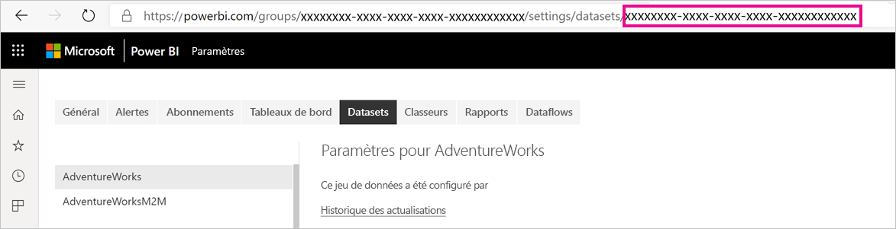
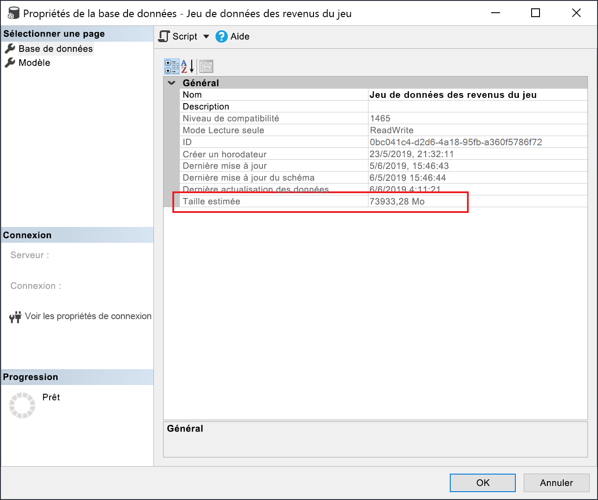

# <a name="large-models-in-power-bi-premium-preview"></a>Grands modèles dans Power BI Premium (préversion)

Les jeux de données Power BI peuvent stocker des données dans un cache en mémoire hautement compressé pour que les performances des requêtes optimisées permettent une interactivité entre utilisateurs rapide sur d’importants jeux de données. La fonctionnalité des grands modèles permet aux jeux de données dans Power BI Premium d’avoir une taille qui dépasse 10 Go. La taille du jeu de données est plutôt limitée par la taille de la capacité Power BI Premium, ce qui est similaire à la façon dont Azure Analysis Services fonctionne en termes de limitations de la taille du modèle. Pour plus d’informations sur les tailles de capacité dans Power BI Premium, consultez Nœuds de capacité. Vous pouvez configurer des grands modèles pour toutes les références SKU P Premium et A Embedded, mais ils fonctionnent uniquement avec les [nouveaux espaces de travail](../collaborate-share/service-create-the-new-workspaces.md).

Les grands modèles n’affectent pas la taille de chargement PBIX, qui est toujours limitée à 10 Go. Au lieu de cela, les jeux de données dépassent 10 Go dans le service lors de l’actualisation. Vous pouvez utiliser l’actualisation incrémentielle pour configurer un jeu de données afin qu’il dépasse 10 Go.

## <a name="enable-large-models"></a>Activer les grands modèles

Pour créer un jeu de données qui dépasse 10 Go, procédez comme suit :

1. Créez un jeu de données dans Power BI Desktop et configurez une [actualisation incrémentielle](service-premium-incremental-refresh.md).

1. Publiez le jeu de données sur le service Power BI Premium.

1. Activez le jeu de données pour les grands modèles en exécutant les applets de commande PowerShell ci-dessous. Ces cmdlets entrainent le stockage du jeu de données sur Azure Premium Files par Power BI, sans contraindre une limite de 10 Go.

1. Appelez une actualisation pour charger les données d’historique en fonction de la stratégie d’actualisation incrémentielle. La première actualisation peut prendre un certain temps pour charger l’historique. Les actualisations suivantes doivent être plus rapides, car elles sont incrémentielles.

### <a name="powershell-cmdlets"></a>Applets de commande PowerShell

Dans la version actuelle des grands modèles, activez le jeu de données pour le stockage de fichiers Premium à l’aide des applets de commande PowerShell. Vous devez disposer de privilèges d’administrateur de capacité et d’administrateur d’espace de travail pour exécuter les applets de commande PowerShell.

1. Recherchez l’ID de jeu de données (GUID). Sous l’onglet **Jeux de données** de l’espace de travail, sous les paramètres du jeu de données, vous pouvez voir l’ID dans l’URL.

    

1. À partir d’une invite d’administrateur PowerShell, installez le module [MicrosoftPowerBIMgmt](/powershell/module/microsoftpowerbimgmt.data/).

    ```powershell
    Install-Module -Name MicrosoftPowerBIMgmt
    ```

1. Exécutez les applets de commande suivantes pour vous connecter et vérifier le mode de stockage du jeu de données.

    ```powershell
    Login-PowerBIServiceAccount

    (Get-PowerBIDataset -Scope Organization -Id <Dataset ID> -Include actualStorage).ActualStorage
    ```

    La réponse doit être la suivante. Le mode de stockage est ABF (fichier de sauvegarde Analysis Services), qui est la valeur par défaut.

    ```
    Id                   StorageMode

    --                   -----------

    <Dataset ID>         Abf
    ```

1. Exécutez les applets de commande suivantes pour définir le mode de stockage sur les fichiers Premium et vérifier l’opération. La conversion en fichiers Premium peut prendre quelques secondes.

    ```powershell
    Set-PowerBIDataset -Id <Dataset ID> -TargetStorageMode PremiumFiles

    (Get-PowerBIDataset -Scope Organization -Id <Dataset ID> -Include actualStorage).ActualStorage
    ```

    La réponse doit être la suivante. Le mode de stockage est maintenant défini sur les fichiers Premium.

    ```
    Id                   StorageMode
    
    --                   -----------
    
    <Dataset ID>         PremiumFiles
    ```

Vous pouvez vérifier l’état des conversions de jeu de données vers et depuis les fichiers Premium à l’aide de l’applet de commande [Get-PowerBIWorkspaceMigrationStatus](/powershell/module/microsoftpowerbimgmt.workspaces/get-powerbiworkspacemigrationstatus).

## <a name="dataset-eviction"></a>Éviction de jeux de données

Power BI utilise la gestion de mémoire dynamique pour supprimer les jeux de données inactifs de la mémoire. Power BI supprime des jeux de données afin de pouvoir charger d’autres jeux de données pour répondre aux requêtes des utilisateurs. La gestion de mémoire dynamique permet à la somme des tailles des jeux de données d’être beaucoup plus importante que la mémoire disponible sur la capacité, mais un seul jeu de données doit tenir dans la mémoire. Pour plus d’informations sur la gestion de mémoire dynamique, consultez [Fonctionnement des capacités](service-premium-what-is.md#how-capacities-function).

Vous devez prendre en compte l’impact de l’éviction sur les grands modèles. Malgré des temps de chargement de jeux de données relativement rapides, il peut toujours y avoir un délai notable pour les utilisateurs s’ils doivent attendre le rechargement des jeux de données volumineux supprimés. C’est la raison pour laquelle, sous sa forme actuelle, la fonctionnalité des grands modèles est recommandée principalement pour les capacités dédiées aux exigences décisionnelles de l’entreprise plutôt que pour celles mélangées à des exigences décisionnelles libre-service. Les capacités dédiées aux exigences décisionnelles de l’entreprise sont moins susceptibles de déclencher une éviction et de recharger des jeux de données. En revanche, les capacités pour le décisionnel libre-service peuvent avoir de nombreux petits jeux de données qui sont plus souvent chargés en mémoire et supprimés de celle-ci.

## <a name="checking-dataset-size"></a>Vérification de la taille du jeu de données

Après avoir chargé les données d’historique, vous pouvez utiliser [SSMS](/sql/ssms/download-sql-server-management-studio-ssms) par le biais du [point de terminaison XMLA](service-premium-connect-tools.md) pour vérifier la taille estimée du jeu de données dans la fenêtre des propriétés du modèle.



Vous pouvez également vérifier la taille du jeu de données en exécutant les requêtes DMV suivantes à partir de SSMS. Additionnez les colonnes DICTIONARY\_SIZE et USED\_SIZE à partir de la sortie pour afficher la taille du jeu de données en octets.

```sql
SELECT * FROM SYSTEMRESTRICTSCHEMA
($System.DISCOVER_STORAGE_TABLE_COLUMNS,
 [DATABASE_NAME] = '<Dataset Name>') //Sum DICTIONARY_SIZE (bytes)

SELECT * FROM SYSTEMRESTRICTSCHEMA
($System.DISCOVER_STORAGE_TABLE_COLUMN_SEGMENTS,
 [DATABASE_NAME] = '<Dataset Name>') //Sum USED_SIZE (bytes)
```

## <a name="limitations-and-considerations"></a>Considérations et limitations

Gardez à l’esprit les restrictions suivantes lors de l’utilisation de grands modèles :

- **Support multigéographique** : les jeux de données activés pour les fichiers Premium échouent sur les capacités où [plusieurs zones géographiques](service-admin-premium-multi-geo.md) sont également activées.

- **Télécharger sur Power BI Desktop** : si un jeu de données est stocké dans des fichiers Premium, le [téléchargement en tant que fichier. pbix](../create-reports/service-export-to-pbix.md) échoue.
- **Régions prises en charge** : Les grands modèles sont pris en charge dans toutes les régions Azure qui prennent en charge le stockage de fichiers Premium. Pour en savoir plus, consultez [Produits disponibles par région](https://azure.microsoft.com/global-infrastructure/services/?products=storage) et consultez le tableau de la section suivante.


## <a name="availability-in-regions"></a>Disponibilité dans les régions

Les modèles volumineux dans Power BI sont disponibles uniquement dans certaines régions Azure qui prennent en charge [le stockage Azure Premium Files](/azure/storage/files/storage-files-planning#storage-tiers).

La liste suivante répertorie les régions où les grands modèles dans Power BI sont disponibles. Les régions qui ne sont pas dans la liste suivante ne sont pas prises en charge pour les modèles volumineux :


|Région Azure  |Abréviation des régions Azure  |
|---------|---------|
|Australie Est     | australiaeast        |
|Australie Sud-Est     | australiasoutheast        |
|USA Centre     | centralus        |
|Asie Est     | eastasia        |
|USA Est     | eastus        |
|USA Est 2     | eastus2        |
|Japon Est     | japaneast        |
|OuJapon Est     | japanwest        |
|Centre de la Corée     | KoreaCentral        |
|Corée du Sud     | KoreaSouth        |
|Centre-Nord des États-Unis     | northcentralus        |
|Europe Nord     | northeurope        |
|États-Unis - partie centrale méridionale     | southcentralus        |
|Asie Sud-Est     | southeastasia        |
|Sud du Royaume-Uni     | uksouth        |
|Ouest du Royaume-Uni     | ukwest        |
|Europe Ouest     | westeurope        |
|USA Ouest     | westus        |
|USA Ouest 2     | westus2        |


## <a name="next-steps"></a>Étapes suivantes

Les liens suivants fournissent des informations qui peuvent être utiles pour travailler avec des modèles volumineux :

* [Stockage Azure Premium Files](/azure/storage/files/storage-files-planning#storage-tiers)
* [Configurer la prise en charge multigéographique pour Power BI Premium](service-admin-premium-multi-geo.md)
* [Apporter vos propres clés de chiffrement pour Power BI](service-encryption-byok.md)
* [Fonctionnement des capacités](service-premium-what-is.md#how-capacities-function)
* [Actualisation incrémentielle](service-premium-incremental-refresh.md).