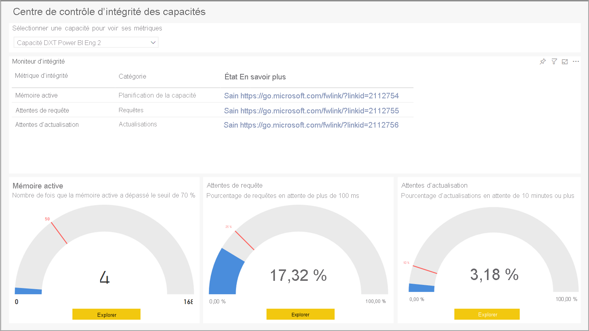
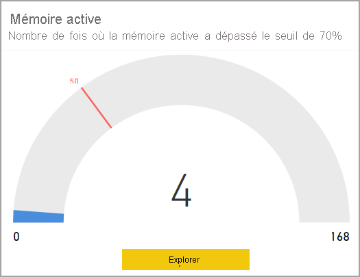
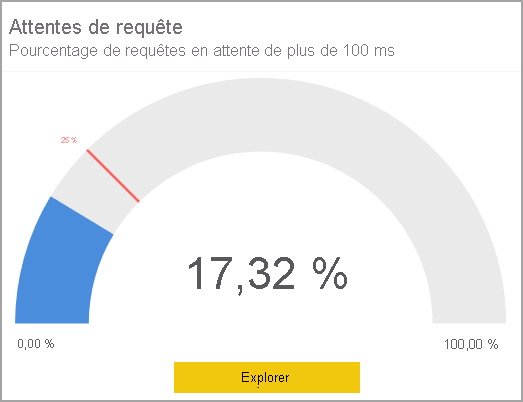
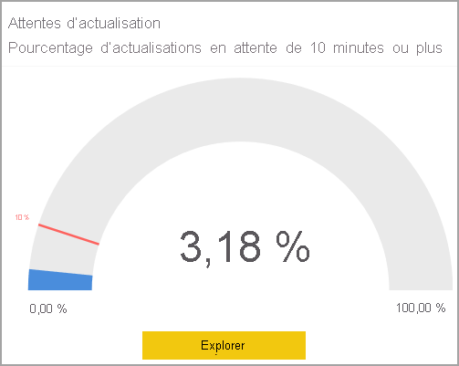

# Application Métriques Power BI Premium

Vous pouvez utiliser l’**application Métriques Power BI Premium** pour gérer l’intégrité et la capacité de votre abonnement Power BI Premium. Avec l’application, les administrateurs utilisent la page **Capacity Health Center** de l’application pour afficher et interagir avec des indicateurs qui surveillent l’intégrité de leur capacité Premium. L’application Métriques se compose de la page d’accueil, appelée **Capacity Health Center**, et de détails sur trois métriques importantes :

* Mémoire active
* Attentes de requête
* Attentes d’actualisation

Les sections suivantes décrivent en détail la page d’accueil et les trois pages de rapports de métriques. 

> [!IMPORTANT]
> Si votre capacité Power BI Premium subit une utilisation intensive des ressources entraînant des problèmes de performances ou de fiabilité, vous pouvez recevoir des e-mails de notification pour identifier et résoudre le problème. Il peut s’agir d’un moyen simplifié de dépanner les capacités surchargées. Pour plus d’informations, consultez les [notifications de capacité et de fiabilité](service-interruption-notifications.md#capacity-and-reliability-notifications).

> [!NOTE]
> Une nouvelle version de Power BI Premium a récemment été publiée. Celle-ci, appelée **Premium Gen2**, est actuellement en préversion. Premium Gen2 vise à simplifier la gestion des capacités Premium et à réduire la charge de gestion. Cette version permet notamment de réduire considérablement les métriques que les administrateurs doivent superviser (processeur uniquement) pour garantir une expérience utilisateur et des performances satisfaisantes. Pour plus d’informations, consultez [Power BI Premium Generation 2 (préversion)](service-premium-what-is.md#power-bi-premium-generation-2-preview).

## Capacity Health Center Premium

Lorsque vous ouvrez l’**application Métriques Power BI Premium**, **Capacity Health Center** s’affiche et fournit une vue d’ensemble de l’intégrité de votre capacité Power BI Premium.

La page d’accueil vous permet de sélectionner la capacité Power BI Premium que vous souhaitez afficher, si votre organisation possède plusieurs abonnements Premium. Pour afficher une capacité Premium, sélectionnez la liste déroulante en haut de la page **Select a capacity to see its metrics** (Sélectionnez une capacité pour afficher ses mesures).

Les trois indicateurs de performance clés affichent l’intégrité actuelle de la capacité Premium sélectionnée, en fonction des paramètres qui ont été appliqués à chacun d’eux. 

Pour afficher des informations spécifiques sur chaque indicateur de performance clé, sélectionnez le bouton **Explorer** en bas de chaque visuel de l’indicateur de performance clé : sa page de détails s’affiche. Les sections suivantes décrivent chaque indicateur de performance clé et les détails fournis par sa page.

## Métrique de mémoire active

La métrique de **mémoire active** est intégrée à la catégorie de *planification de la capacité*, qui constitue un bon indicateur d’intégrité pour évaluer la consommation des ressources de votre capacité, ce qui vous permet d’ajuster la capacité selon les besoins de planification à l’échelle de la capacité. 

La **mémoire active** représente la mémoire utilisée pour traiter les jeux de données en cours d’utilisation et qui, par conséquent, ne seront pas supprimés lorsque la mémoire est nécessaire. La métrique de mémoire active indique si votre capacité peut gérer une charge supplémentaire, ou si elle approche ou dépasse la capacité maximale, indique la charge actuelle de la capacité. La mémoire active en cours de consommation signifie moins de mémoire disponible pour prendre en charge des actualisations et des requêtes supplémentaires. 

L’indicateur de performance clé de **mémoire active** mesure le nombre de fois que la mémoire active de la capacité a dépassé le seuil de 70 % à 50 reprises (marqueur défini à 30 % sur les sept derniers jours), ce qui indique que la capacité s’approche d’un point où les utilisateurs peuvent commencer à rencontrer des problèmes de performances avec les requêtes.

Le visuel de jauge présenté dans cette section révèle que, au cours des sept derniers jours depuis la dernière actualisation du rapport, la capacité a dépassé le seuil de 70 % à quatre reprises, avec un fractionnement horaire. La valeur maximale de la jauge, 168, représente les sept derniers jours, en heures.

Pour connaître les détails de l’indicateur de performance clé (KPI) de mémoire active, cliquez sur le bouton **Explorer** pour consulter une page de rapport fournissant des visualisations spécifiques de ses métriques détaillées ainsi qu’un guide de dépannage affiché dans la colonne de droite de la page. 

Deux scénarios sont expliqués, que vous pouvez afficher sur la page de rapport en sélectionnant **Scénario 1** ou **Scénario 2**. 

Associés à chaque scénario, les guides de dépannage fournissent des explications détaillées sur la signification des métriques et vous aident à mieux comprendre l’état de la capacité et les solutions possibles pour atténuer les éventuels problèmes. 

Ces deux scénarios sont décrits dans les sections suivantes.

### Scénario 1 : la charge actuelle est trop élevée 

Pour déterminer si la capacité dispose de suffisamment de mémoire pour terminer ses charges de travail, consultez le premier visuel de la page : **A : Pourcentage de mémoire consommée**, qui indique la mémoire consommée par les jeux de données activement traités et qui, par conséquent, ne peuvent pas être supprimés.

Le seuil d’alarme, représentant la ligne pointillée rouge, indique les incidents qui consomment 90 % de la mémoire.

Le seuil d’alarme, représentant la ligne pointillée jaune, indique les incidents qui consomment 70 % de la mémoire. 

La ligne en pointillés noire indique la courbe de tendance d’utilisation de la mémoire, soit l’utilisation de la mémoire de la capacité actuelle au cours de la chronologie du graphique.

De nombreux dépassements du seuil d’alarme (ligne pointillée rouge) de la mémoire active et de la courbe de tendance de la mémoire (ligne pointillée noire) indiquent une forte sollicitation au niveau de la capacité de la mémoire, ce qui peut empêcher le chargement en mémoire de jeux de données supplémentaires pendant ce temps. 

Dans ce cas, vous devez examiner attentivement les autres graphiques de la page pour déterminer avec précision ce qui est le plus souvent utilisé, et comment équilibrer ou optimiser la charge, ou si nécessaire, augmenter la capacité. 

Le deuxième visuel de la page, **B : Jeux de données actifs chargés par heure** indique le nombre maximal de jeux de données chargés en mémoire, par intervalles d’une heure. 

Le troisième visuel, **C : La raison pour laquelle les jeux de données sont en mémoire** est un tableau qui liste le jeu de données selon le nom d’espace de travail, le nom de jeu de données, la taille des jeux de données non compressés en mémoire, et explique la raison pour laquelle le jeu de données est chargé en mémoire (par exemple, lorsqu’il est actualisé, interrogé, ou les deux).

#### Diagnostic du scénario 1

Une utilisation élevée et constante de la mémoire active peut entraîner l'exclusion forcée de jeux de données activement utilisés, ou empêcher le chargement de nouveaux jeux de données. Les étapes suivantes peuvent vous aider à résoudre ces problèmes

1. Examinez le graphique *A : Pourcentages de mémoire consommée*

    **a.** Si le graphique A montre que le seuil d’alarme (90 %) est franchi de nombreuses fois et/ou plusieurs heures de suite, votre capacité manque trop fréquemment de mémoire. Dans le graphique ci-dessous, nous constatons que le seuil d’avertissement (70 %) a été franchi à quatre reprises.

    

    **b.** Le graphique intitulé *B : Jeux de données actifs chargés par heure* affiche le nombre maximal de jeux de données uniques chargés en mémoire, par intervalles d’une heure. La sélection d’une barre dans le visuel filtrera les raisons pour lesquelles les jeux de données sont en mémoire.  

         

    **c.** Consultez le tableau **Pourquoi les jeux de données sont en mémoire** pour afficher la liste des jeux de données chargés en mémoire. Triez par *taille du jeu de données (Mo)* pour mettre en surbrillance les jeux de données qui occupent le plus de mémoire. Les opérations de capacité sont soit *interactives*, soit *d’arrière-plan*. Les opérations interactives incluent l’affichage des requêtes et la réponse aux interactions utilisateur (filtrage, interrogation questions-réponses, etc.). Le nombre total de requêtes et d’actualisations permet de savoir si des opérations interactives (requêtes) lourdes ou d’arrière-plan (actualisations) sont effectuées sur le jeu de données. Il est important de comprendre que les opérations interactives ont toujours la priorité sur les opérations d’arrière-plan, et ce, pour garantir la meilleure expérience utilisateur possible. Si les ressources sont insuffisantes, les opérations d’arrière-plan sont ajoutées à une file d’attente puis traitées lorsque les ressources sont libérées. Les opérations d’arrière-plan, notamment les actualisations de jeu de données et les fonctions IA, peuvent être interrompues à mi-parcours par le service Power BI, puis être ajoutées à une file d’attente.
    
      

#### Solutions pour le scénario 1

Vous pouvez effectuer les étapes suivantes pour résoudre les problèmes liés au scénario 1 :

1. **Augmenter la capacité** : l’augmentation de la capacité jusqu’à la référence SKU suivante permet de libérer deux fois plus de mémoire qu’avec la référence SKU actuelle, soulageant ainsi une éventuelle forte sollicitation de la mémoire affectant actuellement la capacité.

2. **Déplacer des jeux de données vers une autre capacité** : si vous disposez d'une autre capacité avec davantage de mémoire disponible, vous pouvez y déplacer les espaces de travail contenant les jeux de données les plus volumineux.

### Scénario 2 : la charge future dépassera les limites

Pour déterminer si la capacité dispose de suffisamment de mémoire pour terminer ses charges de travail, vous pouvez vous référer au visuel **A : Pourcentage de mémoire consommée** affiché en haut de la page, qui indique la mémoire consommée par les jeux de données activement traités et qui, par conséquent, ne peuvent pas être supprimés. La ligne pointillée noire met en évidence les tendances. Dans une capacité subissant une forte sollicitation de la mémoire, le même visuel montrera clairement la ligne de tendance de la mémoire (ligne pointillée noire) vers le haut, ce qui signifie que ce problème peut empêcher le chargement d’autres jeux de données dans la mémoire à cet instant. La ligne de tendance, la ligne pointillée noire, montre la tendance de la croissance sur une base de sept jours de données. 

#### Diagnostic du scénario 2

Pour diagnostiquer le scénario 2, déterminez si la courbe de tendance présente une tendance à la hausse vers les seuils d’avertissement ou d’alarme. 

1. Observez le **graphique A :**

    

    **a.** Si le graphique affiche une courbe vers le haut, cela signifie que la consommation de mémoire a augmenté au cours des sept derniers jours.

    **b.** En tenant compte de la croissance actuelle, prédisez le moment où la courbe de tendance franchit le seuil d’avertissement (la ligne pointillée jaune).

    **c.** Continuez à examiner la courbe de tendance au moins tous les deux jours, pour vérifier si la tendance persiste.

#### Solutions pour le scénario 2

Vous pouvez effectuer les étapes suivantes pour résoudre les problèmes liés au scénario 2 :

1. **Augmenter la capacité** : l’augmentation de la capacité jusqu’à la référence SKU suivante permet de libérer deux fois plus de mémoire qu’avec la référence SKU actuelle, soulageant ainsi une éventuelle forte sollicitation de la mémoire affectant actuellement la capacité.

2. **Déplacer des jeux de données vers une autre capacité** : si vous disposez d'une autre capacité avec davantage de mémoire disponible, vous pouvez y déplacer les espaces de travail contenant les jeux de données les plus volumineux.

## Métrique Attentes de requête

La catégorie **Requêtes** indique si les utilisateurs risquent de rencontrer des rapports visuels lents à répondre ou sans réponse. **Attentes de requête** indique le temps nécessaire à la requête pour s’exécuter depuis son déclenchement. Cet indicateur de performance clé mesure si 25 % ou plus des requêtes de la capacité sélectionnée attendent 100 millisecondes ou plus pour s’exécuter. Des attentes de requête se produisent lorsqu’il n’y a pas assez de ressources d’UC disponibles pour exécuter toutes les requêtes en attente. 

La jauge de ce visuel montre qu’au cours des sept derniers jours depuis la dernière actualisation du rapport, 17,32 % des requêtes ont attendu plus de 100 millisecondes. 

Pour en savoir plus sur l’indicateur de performance clé Requêtes en attente, cliquez sur le bouton **Explorer** afin d’afficher une page de rapport avec visualisation des métriques pertinentes, avec un guide de dépannage dans la colonne de droite de la page. Le guide de dépannage propose deux scénarios, chacun fournissant des explications détaillées sur la métrique, l'état de la capacité, et les solutions possibles pour atténuer le problème.

Nous examinerons un par un chaque scénario de requêtes en attente dans les sections suivantes.

### Scénario 1 : des requêtes longues consomment des ressources d’UC

Dans le scénario 1, des requêtes longues consomment trop de ressources d’UC. 

Vous pouvez rechercher si les mauvaises performances des rapports sont dues à une surcharge de capacité, ou à un jeu de données ou un rapport mal conçu. Il existe plusieurs raisons pour lesquelles une requête peut être exécutée pendant une période prolongée, c’est-à-dire une période de plus de 10 secondes pour terminer l'exécution. La taille et la complexité des jeux de données ainsi que la complexité des requêtes ne sont que quelques-uns des facteurs qui peuvent entraîner une requête longue. 

La page du rapport affiche les visuels suivants : 

* Le tableau supérieur intitulé **A : Temps d’attente élevés** répertorie les jeux de données dont les requêtes sont en attente. 
* **B : Distributions des temps d’attente élevés par heure** indique la répartition des temps d’attente élevés. 
* Le graphique intitulé **C : Nombre de requêtes longues par heure** indique le nombre de requêtes longues exécutées, par intervalles d’une heure.
* Le dernier visuel, le tableau **D : Requêtes longues**, affiche les requêtes longues et leurs statistiques.

Vous trouverez ci-dessous des mesures que vous pouvez prendre pour diagnostiquer et résoudre les problèmes de temps d'attente de requête.

#### Diagnostic du scénario 1

Tout d'abord, vous pouvez déterminer si des requêtes longues sont en cours pendant que vos requêtes sont en attente. 

Examinez le **graphique B**, qui indique le nombre de requêtes en attente de plus de 100 ms. Sélectionnez une colonne qui affiche un nombre élevé d’attentes.

Lorsque vous cliquez sur une colonne avec des temps d'attente élevés, le **graphique C** est filtré pour montrer le nombre de requêtes longues exécutées pendant ce temps, comme le montre l'image suivante :

Par ailleurs, le **graphique D** est également filtré pour afficher les requêtes exécutées sur la période sélectionnée.

#### Solutions pour le scénario 1

Voici les mesures que vous pouvez prendre pour résoudre les problèmes du scénario 1 :

1. **Exécuter PerfAnalyzer pour optimiser les rapports et les jeux de données** : l'analyseur de performances des rapports montrera l'effet de chaque interaction sur une page, y compris le temps de rafraîchissement de chaque visuel et la partie qui prend le plus de temps.

2. **Augmenter la capacité** : l’augmentation de la capacité jusqu’à la référence SKU suivante permet de libérer deux fois plus de ressources d’UC, soulageant ainsi toute pression sur l’UC qui risquerait d’entraîner un ralentissement des requêtes.

3. **Déplacer des jeux de données vers une autre capacité** : si vous disposez d'une autre capacité avec davantage de ressources d’UC disponibles, vous pouvez y déplacer les espaces de travail contenant les jeux de données dans lesquels figurent les requêtes en attente.

### Scénario 2 - trop de requêtes

Dans le scénario 2, un trop grand nombre de requêtes sont en cours d’exécution.

Lorsque le nombre de requêtes à exécuter dépasse les limites de la capacité, les requêtes sont placées dans une file d'attente jusqu'à ce que des ressources soient disponibles pour les exécuter. Si la taille de la file d'attente devient trop importante, les requêtes qui y figurent risquent d’attendre plus de 100 millisecondes.

#### Diagnostic du scénario 2

Dans le **tableau A**, sélectionnez un jeu de données qui présente un pourcentage élevé de temps d'attente.

Une fois que vous avez sélectionné un jeu de données affichant un temps d'attente élevé, le **graphique B** est filtré pour montrer les distributions des temps d'attente pour les requêtes sur ce jeu de données, au cours des sept derniers jours. Sélectionnez ensuite une des colonnes du **graphique B**.

Le **graphique C** est ensuite filtré pour indiquer la longueur de la file d'attente à l'heure sélectionnée dans le graphique B.

Si la longueur de la file d'attente a dépassé le seuil de 20, les requêtes du jeu de données sélectionné sont sans doute retardées car trop de requêtes tentent de s'exécuter en même temps.

#### Solutions pour le scénario 2

Vous pouvez effectuer les étapes suivantes pour résoudre les problèmes liés au scénario 2 :

1. **Augmenter la capacité** : l’augmentation de la capacité jusqu’à la référence SKU suivante permet de libérer deux fois plus de mémoire qu’avec la référence SKU actuelle, soulageant ainsi une éventuelle forte sollicitation de la mémoire affectant actuellement la capacité.

2. **Déplacer des jeux de données vers une autre capacité** : si vous disposez d'une autre capacité avec davantage de mémoire disponible, vous pouvez y déplacer les espaces de travail contenant les jeux de données les plus volumineux.

## La métrique Attentes d’actualisation

La métrique **Attentes d’actualisation** fournit des informations sur le moment où les utilisateurs peuvent être confrontés à des données de rapport anciennes ou obsolètes. **Attentes d’actualisation** représente le temps qu’une actualisation de données a attendu avant de s'exécuter, à partir du moment où elle a été déclenchée sur demande, ou a été programmée pour s'exécuter. Cet indicateur de performance mesure si 10 % ou plus des requêtes d’actualisation en attente attendent 10 minutes ou plus. L’attente se produit généralement lorsque la mémoire ou les ressources d’UC disponibles sont insuffisantes.

Cette jauge montre qu'au cours des sept derniers jours depuis la dernière actualisation du rapport, 3,18 % des actualisations ont attendu plus de 10 minutes. 

Pour plus de détails sur l’indicateur de performance clé **Attentes d’actualisation**, cliquez sur le bouton **Explorer** pour affiche une page de métriques et un guide de dépannage dans la colonne de droite de la page du rapport. Le guide fournit des explications détaillées sur les mesures figurant sur la page, et vous aide à comprendre l'état de la capacité et ce que vous pouvez faire pour atténuer les éventuels problèmes.

Deux scénarios sont expliqués, que vous pouvez afficher sur la page de rapport en sélectionnant Scénario 1 ou Scénario 2. Nous examinerons un par un chaque scénario dans les sections suivantes.

### Scénario 1 - mémoire insuffisante

Dans le scénario 1, il n'y a pas assez de mémoire disponible pour charger le jeu de données. Il existe deux situations dans lesquelles une actualisation est limitée lorsque la mémoire est faible :

1. Pas assez de mémoire pour charger le jeu de données.
2. L’actualisation a été annulée en raison d’une opération de priorité plus élevée. 

La priorité pour le chargement des jeux de données est la suivante :

1. Requête interactive
2. Actualisation à la demande
3. Actualisation planifiée

S’il n'y a pas assez de mémoire pour charger un jeu de données pour une requête interactive, les actualisations programmées sont arrêtées et leurs jeux de données sont déchargés jusqu'à ce que suffisamment de mémoire soit disponible. Si cette procédure ne libère pas suffisamment de mémoire, les actualisations à la demande sont arrêtées et leurs jeux de données sont déchargés.

#### Diagnostic du scénario 1

Pour diagnostiquer le scénario 1, commencez par déterminer si la limitation est due à une mémoire insuffisante. Les étapes requises sont les suivantes.

1. Sélectionnez le jeu de données qui vous intéresse dans le **tableau A** en cliquant dessus : 

    

    a. Lorsqu’un jeu de données est sélectionné dans le **tableau A**, **le graphique B** est filtré pour indiquer à quel moment l’attente s’est produite.

    

    b. Le **graphique C** est ensuite filtré pour afficher les éventuelles limites, comme expliqué à l’étape suivante. 

2. Examinez les résultats du **graphique C** filtré. Si le graphique indique qu’une limitation pour mémoire saturée s'est produite au moment où le jeu de données était en attente, cela signifie que ce jeu de données était en attente en raison d’une mémoire insuffisante.

    

3. Pour finir, consultez le **graphique D**, qui indique les types d’actualisations qui ont eu lieu : programmées ou à la demande. Toutes les actualisations à la demande qui se produisent en même temps peuvent être la cause de la limitation.

    

#### Solutions pour le scénario 1

Vous pouvez effectuer les étapes suivantes pour résoudre les problèmes liés au scénario 1 :

1. **Augmenter la capacité** : l’augmentation de la capacité jusqu’à la référence SKU suivante permet de libérer deux fois plus de mémoire qu’avec la référence SKU actuelle, soulageant ainsi une éventuelle forte sollicitation de la mémoire ou des ressources d’UC affectant actuellement la capacité.

2. **Déplacer des jeux de données vers une autre capacité** : si vos délais d’attente sont la conséquence d’une forte sollicitation de la mémoire ou si vous disposez d'une autre capacité avec davantage de mémoire disponible, vous pouvez y déplacer les espaces de travail contenant les jeux de données en attente.

3. **Répartir des actualisations planifiées** : la répartition des actualisations permet d’éviter l’exécution simultanée d’un trop grand nombre d’actualisations.

### Scénario 2 : ressources d’UC insuffisantes pour l’actualisation

Dans le scénario 2, il n’y a pas assez de ressources d’UC disponibles pour effectuer l’actualisation. 

Pour les capacités, Power BI limite le nombre d’actualisations qui peuvent se produire simultanément. Ce nombre est égal au nombre de cœurs principaux x 1,5. Par exemple, une capacité P1 avec quatre cœurs back-end peut exécuter 6 actualisations simultanément. Une fois le nombre maximal d’actualisations simultanées atteint, les autres actualisations attendent la fin de l’exécution de l’actualisation.

#### Diagnostic du scénario 2

Pour diagnostiquer le scénario 2, commencez par déterminer si la limitation est due à l’exécution simultanée du nombre maximal d’actualisations. Les étapes requises sont les suivantes.

1. Sélectionnez le jeu de données qui vous intéresse dans le **tableau A** en cliquant dessus : 

    

    a. Lorsqu’un jeu de données est sélectionné dans le **tableau A**, **le graphique B** est filtré pour indiquer à quel moment l’attente s’est produite.

    

    b. Le **graphique C** est ensuite filtré pour afficher les éventuelles limites, comme expliqué à l’étape suivante. 

2. Examinez les résultats du **graphique C** filtré. Si le graphique indique que le *nombre maximal d’exécutions simultanées* a été atteint au moment où le jeu de données était en attente, cela signifie que ce jeu de données était en attente en raison de ressources d’UC insuffisantes.

    

3. Pour finir, consultez le **graphique D**, qui indique les types d’actualisations qui ont eu lieu : programmées ou à la demande. Toutes les actualisations à la demande qui se produisent en même temps peuvent être la cause de la limitation.

    

#### Solutions pour le scénario 2

1. **Augmenter la capacité** : l’augmentation de la capacité jusqu’à la référence SKU suivante permet de libérer deux fois plus de mémoire et d’obtenir deux fois plus d’actualisations simultanées qu’avec la référence SKU actuelle, soulageant ainsi une éventuelle forte sollicitation de la mémoire ou des ressources d’UC affectant actuellement la capacité.

2. **Déplacer des jeux de données vers une autre capacité** : si vos délais d’attente sont dus au fait que vous avez atteint le nombre maximal d’exécutions simultanées et que vous disposez d'une autre capacité permettant davantage d’exécutions, vous pouvez y déplacer les espaces de travail contenant les jeux de données dans lesquels figurent les requêtes en attente.

3. **Répartir des actualisations planifiées** : la répartition des actualisations permet d’éviter l’exécution simultanée d’un trop grand nombre d’actualisations.

## Étapes suivantes

* [Qu’est-ce que Power BI Premium ?](service-premium-what-is.md)
* [Livre blanc sur Microsoft Power BI Premium](https://aka.ms/pbipremiumwhitepaper)
* [Planification d’un livre blanc sur le déploiement de Power BI en entreprise](https://aka.ms/pbienterprisedeploy)
* [Activation de la version d’essai Pro prolongée](../fundamentals/service-self-service-signup-for-power-bi.md)
* [FAQ sur Power BI Embedded](../developer/embedded/embedded-faq.md)

D’autres questions ? [Essayez d’interroger la communauté Power BI](https://community.powerbi.com/)

Introduite par Power BI, l’offre en préversion Power BI Premium Gen2 apporte les améliorations suivantes à l’expérience Power BI Premium :
* Performances
* Licences par utilisateur
* Mise à l’échelle supérieure
* Métriques améliorées
* Mise à l’échelle automatique
* Charge de gestion réduite

Pour plus d’informations sur Power BI Premium Gen2, consultez [Power BI Premium Generation 2 (préversion)](service-premium-what-is.md#power-bi-premium-generation-2-preview).