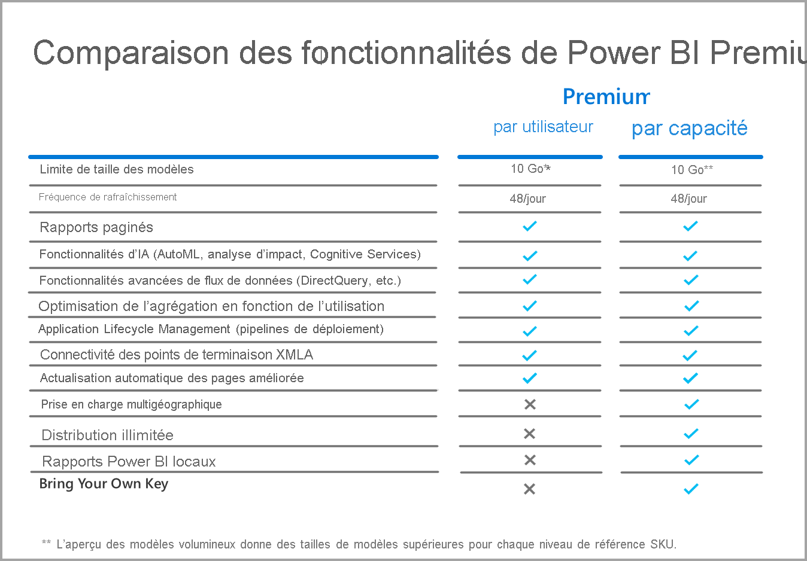

# Questions fréquentes (FAQ) sur Power BI Premium par utilisateur (préversion)

Power BI **Premium par utilisateur** permet aux organisations d’octroyer des licences pour des fonctionnalités Premium, par utilisateur. Premium par utilisateur (PPU) inclut toutes les capacités de la licence Power BI Pro, ainsi que des fonctionnalités telles que les rapports paginés, l’intelligence artificielle et d’autres capacités réservées aux abonnés Premium. 

Cet article fournit des réponses aux questions courantes sur les licences Premium par utilisateur. Toutes les informations contenues dans cet article peuvent faire l’objet de modifications et d’ajustements à mesure que le modèle Premium par utilisateur passe de la phase de préversion à celle de disponibilité générale. 

Cet article regroupe des questions et des réponses dans les catégories suivantes :
* Questions générales 
* Questions administratives 
* Questions sur l’expérience utilisateur final 

## Questions générales

1.  **Qu’entend-on par « Premium par utilisateur » (PPU) ?** 

    Le modèle Premium par utilisateur (PPU) est une nouvelle façon d’octroyer des licences pour des fonctionnalités Premium, par utilisateur. Il inclut toutes les capacités de la licence Power BI Pro, ainsi que des fonctionnalités telles que les rapports paginés, l’intelligence artificielle et d’autres capacités disponibles uniquement dans la version Premium à ce jour.

2.  **Quelle est la date de commercialisation prévue ?**

    Nous sommes actuellement en phase de développement et ne prévoyons pas la disponibilité générale de PPU avant 2021. En attendant, la préversion publique est gratuite et accessible à toutes les organisations.

3.  **Est-il nécessaire d’avoir une licence Power BI Pro ET une licence Premium par utilisateur ?**

    Non, une licence Premium par utilisateur vous confère toutes les capacités de Power BI Pro.

4.  **Est-il possible de faire un essai ?**

    Deux expériences d’essai sont proposées : dans le produit et par le biais de Microsoft 365. Tout utilisateur, à supposer que son organisation n’ait pas restreint PPU, peut accéder à l’expérience d’essai dans le produit en activant Premium par utilisateur pour un espace de travail. L’expérience d’essai par le biais de Microsoft 365 peut être activée dans le portail de la même façon qu’un essai de Power BI Pro aujourd’hui.  

5.  **Quelles sont les fonctionnalités disponibles dans Premium par utilisateur ?**

    Voici la grille de comparaison des fonctionnalités :    

    

6.  **Mon organisation a déjà Power BI Premium. Ai-je besoin d’une licence Premium par utilisateur pour publier du contenu sur ma capacité ?**
    
    Votre organisation peut choisir de compléter sa capacité Premium par des licences Premium par utilisateur, mais cela n’est pas nécessaire pour publier du contenu sur des capacités existantes.  

## Questions administratives

1.  **Comment faire pour activer Premium par utilisateur (PPU) pour mon locataire ?**
    
    Une fois qu’une licence est provisionnée pour PPU pour le locataire, les fonctionnalités PPU sont disponibles dans tout espace de travail où vous les activez. Pour la préversion, vous pouvez simplement activer les fonctionnalités PPU en sélectionnant l’élément Premium par utilisateur dans la liste déroulante des capacités, comme illustré dans l’image suivante.

    

2.  **Est-ce que PPU fonctionne comme une capacité Premium ? Puis-je activer/désactiver des fonctionnalités ?**

    Non, vous ne pouvez pas gérer la mémoire ou le processeur pour PPU (ce qui est similaire à ce que fait Power BI Pro aujourd’hui). Votre administrateur de locataire peut gérer certains paramètres de fonctionnalités, mais il ne peut pas désactiver des charges de travail telles que les rapports paginés (tout comme vous ne pouvez pas désactiver de tableaux de bord aujourd’hui). 

3.  **Où puis-je gérer les paramètres de Premium par utilisateur qui sont exposés ?**

    Une nouvelle option de menu, disponible dans les paramètres du locataire, permet aux administrateurs de gérer les paramètres de Premium par utilisateur.

4.  **Puis-je limiter les utilisateurs qui peuvent créer des espaces de travail PPU ?**

    Oui, de la même façon que vous pouvez actuellement limiter les utilisateurs qui peuvent créer des espaces de travail.

5.  **Les administrateurs de locataires peuvent-ils voir quels sont les espaces de travail de type Premium par utilisateur ?**

    Oui, ils sont désignés comme tels dans l’élément de menu Espaces de travail de l’écran d’administration de locataire.

6.  **Puis-je déplacer des espaces de travail entre les capacités Premium par utilisateur et Premium ?**

    Oui. Au moment de la disponibilité générale, vous devrez effectuer une actualisation complète de tous les jeux de données ou dataflows qui résident dans l’espace de travail une fois que celui-ci sera revenu à la capacité Premium. Cette exigence permet d’éviter les abus de la part d’entreprises cherchant à contourner le mécanisme de charge de processeur de Premium Gen2.

7.  **Les API de capacité sont-elles disponibles pour la version Premium par utilisateur ?**

    Un ensemble limité d’API est disponible pour permettre le déplacement des espaces de travail, mais vous ne pouvez pas effectuer d’opérations telles que la désactivation de charges de travail.  

## Questions sur l’expérience utilisateur final

1.  **Si je désigne un espace de travail comme étant de type Premium par utilisateur, comment les autres utilisateurs le savent-ils ?**
    
    Une nouvelle icône a été introduite pour indiquer les espaces de travail Premium par utilisateur, comme illustré dans l’image suivante :

        

2.  **Qui peut accéder au contenu d’un espace de travail ou d’une application Premium par utilisateur ?**

    Un utilisateur doit disposer d’une licence Premium par utilisateur pour voir le contenu d’un espace de travail Premium par utilisateur. Plusieurs scénarios sont pris en charge, notamment ceux où les utilisateurs accèdent au contenu par le biais du point de terminaison XMLA, avec Analyser dans Excel, à l’aide de modèles composites, etc. Vous pouvez autoriser les utilisateurs qui n’ont pas encore de licence PPU à accéder à l’espace de travail, mais ils recevront un message indiquant qu’ils ne peuvent pas accéder au contenu. Ils seront alors invités à acquérir une licence d’essai s’ils remplissent les conditions. Dans le cas contraire, l’administrateur de locataire devra leur attribuer une licence.

3.  **Si du contenu est partagé, que peuvent voir les utilisateurs en fonction de leur type de licence ?**

    Le graphique suivant décrit les différents contenus accessibles aux utilisateurs avec PPU :

       

4.  **Puis-je utiliser Premium par utilisateur pour les cas d’usage incorporés ?**

    Premium par utilisateur fonctionne de la même façon que les cas d’usage incorporés dans le cadre d’une licence Pro. Si vous incorporez du contenu, chaque utilisateur devra disposer d’une licence PPU pour y accéder.

5.  **Qu’advient-il de mon espace de travail PPU quand mon essai arrive à expiration ?**

    Les utilisateurs auront toujours accès à l’espace de travail. Toutefois, le contenu qui nécessite ce type de licence ne sera pas disponible. Vous devrez soit déplacer l’espace de travail vers une capacité Premium, soit simplement désactiver l’exigence. 
6.  **Quelle est la quantité totale de stockage offerte par Premium par utilisateur ?**

    En termes de stockage, l’ensemble du locataire est soumis à la même limite de 100 To que dans le cadre d’une capacité Premium.

7.  **L’API d’exportation est-elle disponible dans Premium par utilisateur ?**

    Elle est actuellement disponible pour les rapports paginés, mais est limitée à un seul appel toutes les 5 minutes.  Les rapports Power BI ne sont pas pris en charge pour l’instant.  

8.  **Comment les abonnements par e-mail fonctionnent-ils dans PPU ?**

    Toute personne disposant d’une licence PPU ou Pro peut recevoir l’abonnement et les pièces jointes qu’il contient, à condition que la pièce jointe soit la même pour tous les utilisateurs. Les utilisateurs Pro ne pourront pas afficher le contenu dans le portail du produit. Si des fonctionnalités d’abonnement supplémentaires autorisant des vues de données différentes pour différents destinataires sont introduites, une licence PPU (ou une capacité Premium) sera nécessaire pour utiliser ces fonctionnalités.

9.  **Puis-je aller au-delà de 48 actualisations dans le portail avec l’API d’actualisation ?**

    Le nombre d’actualisations n’est pas limité pour l’instant.  

10. **Puis-je utiliser l’application Métriques de capacité Power BI Premium pour superviser l’utilisation de Premium par utilisateur ?**

    L’application Métriques de capacité Power BI Premium ne fonctionne pas avec Premium Gen2. Elle ne vous permet donc pas d’afficher les éléments PPU.  

11. **Puis-je héberger un jeu de données Power BI dans un espace de travail PPU, créer un rapport sur celui-ci, le publier dans un espace de travail non-PPU et autoriser les utilisateurs à y accéder sans licence PPU ?**

    Non. Comme le jeu de données réside dans un espace de travail Premium par utilisateur, il n’est pas visible pour les utilisateurs sans licence, même si ceux-ci peuvent accéder au rapport dans l’espace de travail non-PPU.

12. **Puis-je actualiser plusieurs modèles de données de 10 Go en même temps ?**

    Vous êtes soumis aux mêmes limitations que celles imposées aux actualisations parallèles dans Premium Gen2.

13. **Puis-je partager du contenu hébergé dans Premium par utilisateur à l’aide de la fonctionnalité Publication sur le web ?**

    La fonctionnalité Publication sur le web se comporte de la même façon qu’avec le contenu hébergé dans une capacité Premium aujourd’hui.

14. **Si j’ai un dataflow qui s’exécute dans un espace de travail Premium par utilisateur et que je l’importe dans un jeu de données Power BI dans un autre espace de travail, est-ce que des utilisateurs sans licence Premium par utilisateur peuvent consommer ce contenu ?**

    Oui, tant que l’auteur du rapport Power BI a une licence Premium par utilisateur durant la période de préversion de PPU.

15. **Est-ce que je peux utiliser les applications mobiles Power BI avec Premium par utilisateur ?**

    Oui, les applications mobiles Power BI ont été mises à jour pour fonctionner avec tout contenu publié dans une application ou un espace de travail Premium par utilisateur.

**Étapes suivantes**

* [Qu’est-ce que Power BI Premium ?](service-premium-what-is.md)
* [Livre blanc sur Microsoft Power BI Premium](https://aka.ms/pbipremiumwhitepaper)
* [Planification d’un livre blanc sur le déploiement de Power BI en entreprise](https://aka.ms/pbienterprisedeploy)
* [Activation de la version d’essai Pro prolongée](../fundamentals/service-self-service-signup-for-power-bi.md)
* [FAQ sur Power BI Embedded](../developer/embedded/embedded-faq.md)

D’autres questions ? [Essayez d’interroger la communauté Power BI](https://community.powerbi.com/)
