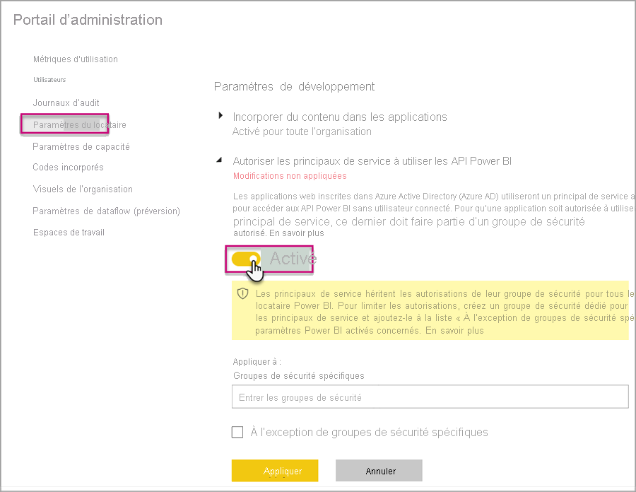

# <a name="automate-premium-workspace-and-dataset-tasks-with-service-principals"></a>Automatiser des tâches d’espace de travail et de jeu de données avec des principaux de service

Les principaux de service sont une *inscription d’application* Azure Active Directory que vous créez à l’intérieur de votre locataire pour effectuer des opérations sans assistance au niveau du service et des ressources. Il s’agit d’un type unique d’identité d’utilisateur avec un nom d’application, un ID d’application, un ID de locataire, et une *clé secrète client* ou un certificat en guise de mot de passe.

Power BI Premium utilise la même fonctionnalité de principal de service que Power BI Embedded. Pour plus d’informations, consultez [Incorporation du contenu Power BI avec le principal de service et un certificat](../developer/embedded/embed-service-principal.md).

Dans **Power BI Premium**, les principaux de service peuvent également être utilisés avec le [point de terminaison XMLA](service-premium-connect-tools.md) pour automatiser des tâches de gestion de jeu de données telles que le provisionnement d’espaces de travail, le déploiement de modèles et l’actualisation de jeux de données avec :

- PowerShell
- Automatisation d'Azure
- Azure Logic Apps
- Des applications clientes personnalisées

Seuls les [nouveaux espaces de travail](../collaborate-share/service-new-workspaces.md) prennent en charge les connexions de point de terminaison XMLA à l’aide de principaux de service. Les espaces de travail classiques ne sont pas pris en charge. Un principal de service dispose uniquement des autorisations nécessaires pour effectuer des tâches pour les espaces de travail qui lui sont attribués. Les autorisations sont affectées par le biais de l’Accès à l’espace de travail, comme les comptes UPN ordinaires.

Pour effectuer des opérations d’écriture, la **charge de travail des jeux de données** de la capacité doit avoir le [point de terminaison XMLA activé pour la lecture-écriture](service-premium-connect-tools.md#enable-xmla-read-write). Les jeux de données publiés à partir de Power BI Desktop doivent avoir la fonctionnalité [Format de métadonnées amélioré](../connect-data/desktop-enhanced-dataset-metadata.md) activée.

> [!NOTE]
> La fonctionnalité de point de terminaison XMLA de Power BI Premium est en **préversion**. Les fonctionnalités des préversions ne doivent pas être utilisées dans un environnement de production. Certaines fonctionnalités, le support et la documentation sont limités.  Reportez-vous aux [Conditions OST (Online Services Terms) Microsoft](https://www.microsoft.com/licensing/product-licensing/products?rtc=1) pour plus d’informations.

## <a name="create-a-service-principal"></a>Créer un principal du service

Les principaux de service sont créés en tant qu’inscription d’application dans le portail Azure ou à l’aide de PowerShell. Lors de la création de votre principal de service, veillez à copier et à enregistrer séparément le nom de l’application, l’ID d’application (client), l’ID d’annuaire (locataire) et le secret client. Pour découvrir les étapes de création d’un principal de service, consultez :

[Créer un principal de service - Portail Azure](https://docs.microsoft.com/azure/active-directory/develop/howto-create-service-principal-portal)   
[Créer un principal de service - PowerShell](https://docs.microsoft.com/azure/active-directory/develop/howto-authenticate-service-principal-powershell)

## <a name="create-an-azure-ad-security-group"></a>Créer un groupe de sécurité Azure AD

Par défaut, les principaux de service ont accès à tous les paramètres de locataire pour lesquels ils sont activés. En fonction de vos paramètres d’administrateur, l’accès peut comprendre des groupes de sécurité spécifiques ou toute l’organisation.

Pour restreindre l’accès du principal de service à des paramètres de locataire spécifiques, vous pouvez autoriser l’accès à des groupes de sécurité spécifiques. Vous pouvez également créer un groupe de sécurité dédié pour les principaux de service et l’exclure des paramètres d’abonné souhaités. Pour découvrir les étapes de création d’un groupe de sécurité et d’ajout d’un principal de service, consultez [Créer un groupe de base et ajouter des membres avec Azure Active Directory](https://docs.microsoft.com/azure/active-directory/fundamentals/active-directory-groups-create-azure-portal).

## <a name="enable-service-principals"></a>Activer des principaux de service

Avant d’utiliser des principaux de service dans Power BI, un administrateur doit activer l’accès des principaux de service dans le portail d’administration Power BI.

Dans le **portail d’administration** de Power BI > **Paramètres du locataire**, développez **Autoriser les principaux de service à utiliser les API Power BI**, puis cliquez sur **Activé**. Pour appliquer des autorisations à un groupe de sécurité, ajoutez le nom du groupe à **Groupes de sécurité spécifiques**.



## <a name="workspace-access"></a>Accès à l’espace de travail

Pour que votre principal de service dispose des autorisations nécessaires pour effectuer des opérations de jeu de données et d’espace de travail Premium, vous devez l’ajouter en tant que membre ou administrateur de l’espace de travail. L’utilisation de l’accès à l’espace de travail dans le service Power BI est décrite ici, mais vous pouvez également utiliser l’[API REST Ajouter un groupe d’utilisateurs](https://docs.microsoft.com/rest/api/power-bi/groups/addgroupuser).

1. Dans le service Power BI, pour un espace de travail, sélectionnez **Plus** > **Accès à l’espace de travail**.

    

2. Recherchez par nom d’application. Ajoutez le principal de service en tant qu’**Administrateur** ou **Membre** à l’espace de travail.

    

## <a name="connection-strings-for-the-xmla-endpoint"></a>Chaînes de connexion pour le point de terminaison XMLA

Une fois que vous avez créé un principal de service, activé les principaux de service pour votre locataire et ajouté le principal de service à l’accès à l’espace de travail, vous pouvez l’utiliser en tant qu’identité d’utilisateur dans les chaînes de connexion avec le point de terminaison XMLA. La différence est que pour les paramètres d’ID utilisateur et de mot de passe, vous spécifiez l’ID d’application, l’ID de locataire et le secret d’application.

`Data Source=powerbi://api.powerbi.com/v1.0/myorg/<workspace name>; Initial Catalog=<dataset name>;User ID=app:<appId>@<tenantId>;Password=<app_secret>;`

### <a name="powershell"></a>PowerShell

#### <a name="using-sqlserver-module"></a>Via le module SQLServer

Dans l’exemple suivant, AppId, TenantId et AppSecret sont utilisés pour authentifier une opération d’actualisation de jeu de données :

```powershell
Param (
        [Parameter(Mandatory=$true)] [String] $AppId,
        [Parameter(Mandatory=$true)] [String] $TenantId,
        [Parameter(Mandatory=$true)] [String] $AppSecret
       )
$PWord = ConvertTo-SecureString -String $AppSecret -AsPlainText -Force

$Credential = New-Object -TypeName "System.Management.Automation.PSCredential" -ArgumentList $AppId, $PWord

Invoke-ProcessTable -Server "powerbi://api.powerbi.com/v1.0/myorg/myworkspace" -TableName "mytable" -DatabaseName "mydataset" -RefreshType "Full" -ServicePrincipal -ApplicationId $AppId -TenantId $TenantId -Credential $Credential
```

### <a name="amo-and-adomd"></a>AMO et ADOMD

Lorsque vous vous connectez à une application cliente ou à une application web, les packages installables des [bibliothèques clientes AMO et ADOMD](https://docs.microsoft.com/azure/analysis-services/analysis-services-data-providers) version 15.0.2 (et ultérieures) issus de NuGet prennent en charge l’utilisation des principaux de service dans les chaînes de connexion à l’aide de la syntaxe suivante : `app:AppID`, puis le mot de passe ou `cert:thumbprint`.

Dans l’exemple suivant, `appID` et `password` sont utilisés pour effectuer une opération d’actualisation d’une base de données model :

```csharp
string appId = "xxx";
string authKey = "yyy";
string connString = $"Provider=MSOLAP;Data source=powerbi://api.powerbi.com/v1.0/<tenant>/<workspacename>;Initial catalog=<datasetname>;User ID=app:{appId};Password={authKey};";
Server server = new Server();
server.Connect(connString);
Database db = server.Databases.FindByName("adventureworks");
Table tbl = db.Model.Tables.Find("DimDate");
tbl.RequestRefresh(RefreshType.Full);
db.Model.SaveChanges();
```

## <a name="next-steps"></a>Étapes suivantes

[Connectivité des jeux de données avec le point de terminaison XMLA](service-premium-connect-tools.md)  
[Azure Automation](https://docs.microsoft.com/azure/automation)  
[Azure Logic Apps](https://docs.microsoft.com/azure/logic-apps/)  
[API REST Power BI](https://docs.microsoft.com/rest/api/power-bi/)
