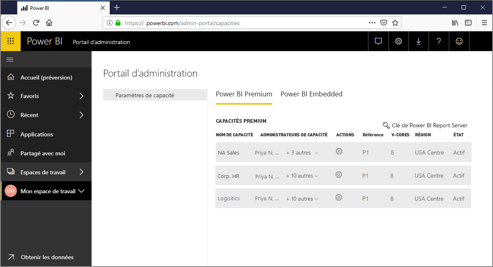
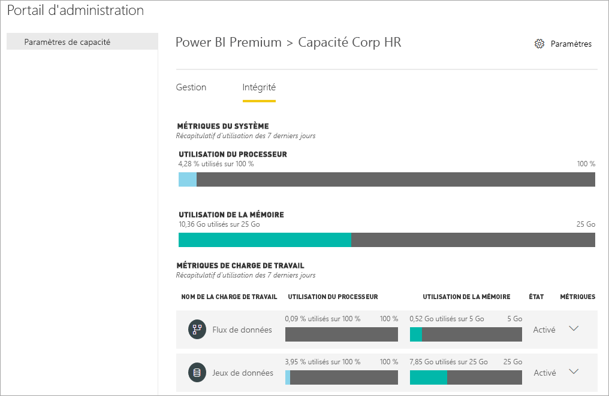
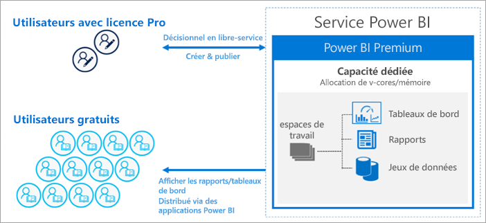
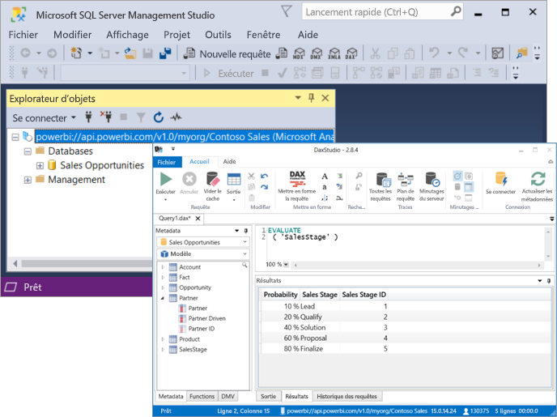

# Qu’est-ce que Power BI Premium ?

Vous pouvez utiliser Power BI Premium pour obtenir des ressources dédiées et améliorées pour votre organisation, afin que les utilisateurs de votre organisation puissent utiliser le service Power BI avec de meilleures performances et une plus grande réactivité. Par exemple, avec un abonnement Power BI Premium, vous et les utilisateurs de votre organisation accédez à :

> [!div class="checklist"]
> * Une mise à l’échelle et des performances améliorées
> * La possibilité d’accorder des licences selon la capacité
> * L’unification des fonctionnalités Business Intelligence à l’échelle de l’entreprise et en libre-service
> * L’extension du service BI local avec Power BI Report Server
> * La prise en charge de la résidence des données par région (multigéographique)
> * Le partage des données sans nécessiter de licence pour chaque utilisateur

 

Cet article présente les fonctionnalités clés de Power BI Premium. Toutefois, lorsque cela se révèle pertinent, il fournit des liens vers des articles comprenant des informations plus détaillées. Pour plus d'informations sur Power BI Pro et Power BI Premium, voir la section _Comparaison des fonctionnalités de Power BI_ de la rubrique [Prix de Power BI](https://powerbi.microsoft.com/pricing/).

## Abonnements et gestion des licences

Power BI Premium est disponible via un abonnement Office 365 au niveau du locataire, avec deux familles de références SKU :

- Les références SKU **P** (P1-P5), pour l’incorporation et les fonctionnalités d’entreprise nécessitent un engagement mensuel ou annuel, une facturation mensuelle et incluent une licence permettant d’installer localement Power BI Report Server.

- Les références SKU **EM** (EM1-EM3), pour l’_incorporation dans l’organisation_. Nécessitent un engagement annuel, avec une facturation mensuelle. Les références SKU EM1 et EM2 sont disponibles uniquement par le biais d’un programme de licence en volume. Vous ne pouvez pas les acheter directement.

Une autre approche consiste à acheter un abonnement **Power BI Embedded** dans Azure. Seules les références SKU **A** (A1-A6) n’impliquent aucune durée d’engagement et sont facturées à l'heure pour l'utilisation de visuels Power BI avec un étiquetage blanc dans les applications, portails et sites Web ou comme méthode de test des capacités P ou EM. Toutes les références SKU fournissent des v-cores pour créer des capacités. Toutefois, les références SKU EM ne peuvent être utilisées que pour l’incorporation de petite échelle. Les références SKU EM1, EM2, A1 et A2 comprenant moins de quatre v-cores ne s’exécutent pas sur une infrastructure dédiée.

Bien que cet article porte principalement sur les références SKU P, une grande partie des instructions concernent également les références SKU A. Contrairement aux références SKU des abonnements Premium, les références SKU Azure n’impliquent aucune durée d’engagement et sont facturées à l’heure. Elles sont entièrement flexibles, vous permettant d’effectuer un scale-up, un scale-down, une pause, une reprise et une suppression. 

Azure Power BI Embedded ne rentre pas dans le cadre de cet article. Toutefois, il est décrit dans la section [Approches de test](service-premium-capacity-optimize.md#testing-approaches) de l’article « Optimisation des capacités Premium » comme étant une option pratique et économique pour tester et mesurer les charges de travail. Pour plus d’informations sur les références SKU Azure, consultez la [documentation Azure Power BI Embedded](https://azure.microsoft.com/services/power-bi-embedded/).

### Achat

Les abonnements Power BI Premium peuvent être achetés par les administrateurs dans le centre d’administration Microsoft 365. Seuls les administrateurs généraux Office 365 et les administrateurs de facturation peuvent acheter des références SKU. Une fois l’abonnement acheté, le locataire reçoit le nombre de v-cores à affecter aux capacités. C’est ce qu’on appelle le *regroupement de v-cores*. Par exemple, l’achat d’une référence SKU P3 fournit au locataire 32 v-cores. Pour plus d’informations, consultez la page [Comment acheter Power BI Premium](service-admin-premium-purchase.md).

## Capacités dédiées

Avec Power BI Premium, vous bénéficiez de *capacités dédiées*. Contrairement à une capacité partagée où les charges de travail sont exécutées sur des ressources de calcul partagées avec d’autres clients, la capacité dédiée est utilisée exclusivement par une même organisation. Celle-ci est isolée et comprend des ressources de calcul dédiées qui offrent des performances fiables et constantes pour le contenu hébergé. Notez que les ressources suivantes sont stockées dans une capacité partagée plutôt que dans votre capacité dédiée :

* Classeurs Excel (sauf si les données sont d’abord importées dans Power BI Desktop)
* [Transmettre des jeux de données](/rest/api/power-bi/pushdatasets)
* [Jeux de données en streaming](../connect-data/service-real-time-streaming.md#set-up-your-real-time-streaming-dataset-in-power-bi)
* [Q&R](../create-reports/power-bi-tutorial-q-and-a.md)

Les espaces de travail résident sur des capacités. Chaque utilisateur Power BI dispose d’un espace de travail personnel nommé **Mon espace de travail**. Vous pouvez créer d’autres espaces de travail appelés **espaces de travail** pour permettre la collaboration. Par défaut, les espaces de travail, qui incluent également les espaces de travail personnels, sont créés dans une capacité partagée. Si vous avez des capacités Premium, vous pouvez leur affecter aussi bien des espaces de travail personnels que des espaces de travail classiques.

### Nœuds de capacité

Comme nous l’avons vu dans la section [Abonnements et gestion des licences](#subscriptions-and-licensing), il existe deux familles de références SKU Power BI Premium : **EM** et **P**. Toutes les références SKU Power BI Premium sont disponibles sous la forme de *nœuds* de capacité, chacun représentant un ensemble de ressources constitué d’un processeur, d’une mémoire et d’un stockage. En plus des ressources, chaque référence SKU est associée à des limites opérationnelles concernant le nombre de connexions DirectQuery et de connexions actives qui peuvent être établies par seconde, et concernant le nombre d’actualisations de modèles qui peuvent être effectuées en parallèle.

Le traitement est effectué par un nombre défini de v-cores, répartis équitablement entre le back-end et le front-end.

Les **v-cores back-end** gèrent l’essentiel des fonctionnalités Power BI : traitement des requêtes, gestion du cache, exécution des services R, actualisation des modèles et rendu côté serveur des rapports et des images. Les v-cores back-end reçoivent une quantité fixe de mémoire, qui est principalement utilisée pour héberger les modèles, également appelés « jeux de données actifs ».

Les **v-cores front-end** assurent la gestion des documents du service web, des tableaux de bord et des rapports, la gestion des droits d’accès, la planification, les API, les chargements et téléchargements et, plus généralement, tout ce qui concerne l’expérience utilisateur.

Le stockage est défini sur **100 To par nœud de capacité**.

Les ressources et les limites de chaque référence SKU Premium (et des références SKU A de taille équivalente) sont fournies dans le tableau suivant :

| Nœuds de capacité | Total des v-cores | Cœurs virtuels backend | RAM (Go) | Cœurs virtuels frontend | DirectQuery/Connexions actives (par seconde) | Parallélisme des actualisations de modèles |
| --- | --- | --- | --- | --- | --- | --- |
| EM1/A1 | 1 | 0,5 | 3 | 0,5 | 3,75 | 1 |
| EM2/A2 | 2 | 1 | 5 | 1 | 7,5 | 2 |
| EM3/A3 | 4 | 2 | 10 | 2 | 15 | 3 |
| P1/A4 | 8 | 4 | 25 | 4 | 30 | 6 |
| P2/A5 | 16 | 8 | 50 | 8 | 60 | 12 |
| P3/A6 | 32 | 16 | 100 | 16 | 120 | 24 |
| P4 | 64 | 32 | 200 | 32 | 240 | 48 |
| P5 | 128 | 64 | 400 | 64 | 480 | 96 |
| | | | | | | |

> [!NOTE]
> L'utilisation d'une référence SKU unique plus grande (p. ex. une référence SKU P2) peut être préférable à la combinaison de plusieurs petites références SKU (p. ex. deux références SKU P1). Par exemple, vous pouvez utiliser des modèles plus grands et obtenir un meilleur parallélisme avec la référence SKU P2.

### Charges de travail de capacité

Les charges de travail de capacité sont des services mis à la disposition des utilisateurs. Par défaut, les capacités Premium et Azure ne prennent en charge que la charge de travail de jeu de données qui est associée aux requêtes Power BI en cours d’exécution. La charge de travail de jeu de données ne peut pas être désactivée. Vous pouvez également activer les charges de travail suivantes : [IA (Cognitive Services)](https://powerbi.microsoft.com/blog/easy-access-to-ai-in-power-bi-preview/), [Flux de données](../transform-model/service-dataflows-overview.md#dataflow-capabilities-on-power-bi-premium) et [Rapports paginés](../paginated-reports/paginated-reports-save-to-power-bi-service.md). Ces charges de travail sont prises en charge uniquement dans les abonnements Premium. 

Chaque charge de travail supplémentaire permet de configurer la mémoire maximale (sous forme d’un pourcentage de la mémoire totale disponible) qui peut être utilisée par la charge de travail. Les valeurs par défaut pour la mémoire maximale sont déterminées par la référence SKU. Vous pouvez optimiser les ressources disponibles de votre capacité en activant uniquement les charges de travail supplémentaires lorsque vous en avez besoin. En outre, vous ne pouvez modifier les paramètres de mémoire que si vous avez constaté que les paramètres par défaut ne répondent pas aux besoins en ressources de votre capacité. Les charges de travail peuvent être activées et configurées pour une capacité par les administrateurs de capacité en accédant aux **paramètres de capacité** sur le [portail d’administration](service-admin-portal.md) ou en utilisant les [API REST Capacities](https://docs.microsoft.com/rest/api/power-bi/capacities).  

Pour plus d’informations, consultez [Configurer des charges de travail dans une capacité Premium](service-admin-premium-workloads.md). 

### Fonctionnement des capacités

Le service Power BI utilise toujours de façon optimale les ressources de la capacité, sans jamais dépasser les limites imposées à celle-ci.

Les opérations de capacité sont soit *interactives*, soit *d’arrière-plan*. Les opérations interactives incluent l’affichage des requêtes et la réponse aux interactions utilisateur (filtrage, interrogation questions-réponses, etc.). En règle générale, l’interrogation des modèles d’importation est gourmande en ressources de mémoire, tandis que l’interrogation des modèles DirectQuery et des modèles de connexion active sollicite beaucoup le processeur. Les opérations d’arrière-plan incluent les actualisations des modèles de flux de données et d’importation, ainsi que la mise en cache des requêtes.

Il est important de comprendre que les opérations interactives ont toujours la priorité sur les opérations d’arrière-plan, et ce, pour garantir la meilleure expérience utilisateur possible. Si les ressources sont insuffisantes, les opérations d’arrière-plan sont ajoutées à une file d’attente en vue d’être traitées lorsque les ressources auront été libérées. Les opérations d’arrière-plan, telles que les actualisations de jeu de données, peuvent être interrompues à mi-parcours par le service Power BI, puis être ajoutées à une file d’attente.

Pour être interrogés ou actualisés, les modèles d’importation doivent être entièrement chargés en mémoire. Le service Power BI gère l’utilisation de la mémoire à l’aide d’algorithmes sophistiqués afin de garantir une utilisation maximale de la mémoire disponible, ce qui peut provoquer une surcharge de la capacité : Même si une capacité peut stocker un grand nombre de modèles d’importation (jusqu’à 100 To par capacité Premium), lorsque le stockage sur disque combiné dépasse la quantité de mémoire prise en charge (une quantité de mémoire supplémentaire est nécessaire pour l’interrogation et l’actualisation), tous les modèles ne peuvent pas être chargés en même temps dans la mémoire.

Les modèles d’importation sont donc chargés et supprimés de la mémoire en fonction de l’utilisation. Un modèle d’importation est chargé lorsqu’il est interrogé (opération interactive) et pas encore en mémoire, ou lorsqu’il doit être actualisé (opération d’arrière-plan).

Le processus qui consiste à supprimer un modèle de la mémoire est appelé *éviction*. C’est une opération que Power BI peut effectuer rapidement selon la taille des modèles. Si la capacité ne subit aucune pression liée à la mémoire, les modèles sont simplement chargés en mémoire et y restent. Toutefois, lorsque la mémoire n’est pas suffisante pour charger un modèle, le service Power BI doit d’abord libérer de la mémoire. Il libère de la mémoire en détectant les modèles qui sont devenus inactifs. Pour cela, il recherche ceux qui n’ont pas été utilisés au cours des trois dernières minutes \[[1](#endnote-1)\] et les supprime. S’il n’y a aucun modèle inactif à supprimer, le service Power BI cherche à supprimer les modèles qui ont été chargés pour des opérations d’arrière-plan. En dernier recours, après 30 secondes de tentatives infructueuses \[[1](#endnote-1)\], l’opération interactive est mise en échec. Dans ce cas, l’utilisateur du rapport est averti de l’échec et il est invité à réessayer ultérieurement. Dans certains cas, les modèles peuvent être déchargés de la mémoire à cause des opérations de service.

Il est important de souligner que l’éviction des jeux de données est un comportement normal et même attendu. Il s’efforce d’optimiser l’utilisation de la mémoire en chargeant et en déchargeant des modèles dont les tailles combinées peuvent dépasser la quantité de mémoire disponible. Ce comportement est défini par conception et est transparent pour les utilisateurs du rapport. Un taux élevé d’évictions ne signifie pas nécessairement que la capacité ne contient pas suffisamment de ressources. Cela peut toutefois constituer un problème si la réactivité des actualisations ou des requêtes souffre de ces évictions.

L’actualisation des modèles d’importation sollicite toujours beaucoup la mémoire, car les modèles doivent être chargés en mémoire. Une quantité supplémentaire de mémoire est nécessaire au traitement. Une actualisation complète peut utiliser environ le double de la mémoire nécessaire au modèle. Cela garantit que le modèle peut être interrogé même pendant le traitement, puisque les requêtes sont envoyées au modèle existant jusqu’à ce que l’actualisation soit terminée et que les données du nouveau modèle soient disponibles. L’actualisation incrémentielle nécessite moins de mémoire et peut se terminer plus rapidement. Elle peut donc réduire considérablement la pression exercée sur les ressources de la capacité. Les actualisations de modèles peuvent elles aussi solliciter le processeur de manière importante, en particulier pour les modèles qui contiennent des transformations Power Query complexes, ou des tables/colonnes calculées qui sont complexes ou basées sur des tables volumineuses.

Tout comme les requêtes, les actualisations nécessitent que le modèle soit chargé en mémoire. Si la mémoire est insuffisante, le service Power BI tente de supprimer les modèles inactifs, et si ce n’est pas possible (si tous les modèles sont actifs), l’actualisation est mise en file d’attente. En général, les actualisations sollicitent beaucoup le processeur, encore plus que les requêtes. Pour cette raison, il existe des limites quant au nombre d’actualisations qui peuvent être effectuées simultanément. Ce nombre est égal à une fois et demi le nombre de v-cores back-end, arrondi au nombre supérieur. Si les actualisations simultanées sont trop nombreuses, une actualisation planifiée est mise en file d’attente. Dans de telles situations, l’actualisation met plus de temps à se terminer. Les actualisations à la demande, comme celles déclenchées par une requête utilisateur ou un appel d’API, seront retentées trois fois \[[1](#endnote-1)\]. Si les ressources sont toujours insuffisantes, l’actualisation échoue.

Notes de la section :   
\[1\] Susceptible de changer.

### Support régional

Lors de la création d’une capacité, les administrateurs généraux Office 365 et les administrateurs du service Power BI peuvent spécifier la région où doivent résider les espaces de travail affectés à la capacité. Il s’agit de la fonctionnalité **Multi-Geo**. Avec la fonctionnalité Multi-Geo, les organisations peuvent répondre aux exigences de résidence des données, en déployant le contenu dans les centres de données d’une région, même si cette région est différente de celle où réside l’abonnement Office 365. Pour plus d’informations, consultez [Prise en charge Multi-Geo pour Power BI Premium](service-admin-premium-multi-geo.md).

### Gestion des capacités

La gestion des capacités Premium implique la création ou la suppression de capacités, l’affectation d’administrateurs, l’affectation d’espaces de travail, la configuration de charges de travail, la supervision et la réalisation de certains ajustements pour optimiser les performances des capacités. 

Les administrateurs généraux Office 365 et les administrateurs du service Power BI peuvent créer des capacités Premium à partir des v-cores disponibles ou modifier les capacités Premium existantes. Lorsque vous créez une capacité, vous devez indiquer la taille de la capacité et sa région géographique, et vous devez lui affecter au moins un administrateur. 

Lors de la création de capacités, la plupart des tâches d’administration peuvent être effectuées dans le [portail d’administration](service-admin-portal.md).

Les administrateurs des capacités peuvent affecter des espaces de travail aux capacités, gérer les autorisations utilisateur et leur affecter d’autres administrateurs. Les administrateurs des capacités peuvent également configurer des charges de travail, ajuster les allocations de mémoire et si nécessaire, redémarrer une capacité en réinitialisant les opérations en cas de surcharge de la capacité.

Les administrateurs des capacités peuvent également vérifier qu’une capacité s’exécute correctement. Ils peuvent superviser l’intégrité des capacités dans le portail d’administration ou à l’aide de l’application Métriques de capacité Power BI Premium.

Pour plus d’informations sur la création des capacités, l’affectation d’administrateurs et l’affectation d’espaces de travail, consultez [Gérer les capacités Premium](service-premium-capacity-manage.md). Pour plus d’informations sur les rôles, consultez [Rôles d’administrateur liés à Power BI](service-admin-administering-power-bi-in-your-organization.md#administrator-roles-related-to-power-bi).

### Monitoring

La supervision des capacités Premium permet aux administrateurs de connaître les performances de chaque capacité. Vous pouvez superviser les capacités dans le portail d’administration ou avec l’application [Métriques de capacité Power BI Premium](https://app.powerbi.com/groups/me/getapps/services/capacitymetrics).

Dans le portail, la supervision fournit un aperçu rapide des métriques, où sont indiquées les charges appliquées et les ressources utilisées par votre capacité en moyenne au cours des sept derniers jours. 

L’application **Métriques de capacité Power BI Premium** fournit des informations plus détaillées sur les performances de vos capacités. L’application fournit un tableau de bord d’aperçu, ainsi que des rapports plus détaillés.

Dans le tableau de bord de l’application, vous pouvez cliquer sur la cellule d’une métrique pour ouvrir un rapport détaillé. Les rapports fournissent des métriques détaillées que vous pouvez filtrer pour n’afficher que les informations les plus importantes, et ainsi, aider au bon fonctionnement de vos capacités.

Pour plus d’informations sur la supervision des capacités, consultez [Supervision dans le portail d’administration Power BI](service-admin-premium-monitor-portal.md) et [Supervision à l’aide de l’application Métriques de capacité Power BI Premium](service-admin-premium-monitor-capacity.md).

### Optimisation des capacités

Il est essentiel d’utiliser vos capacités de façon optimale afin de fournir aux utilisateurs les performances qu’ils attendent et de tirer le meilleur parti de votre investissement Premium. La supervision des métriques clés permet aux administrateurs de déterminer le meilleur moyen de résoudre les goulots d’étranglement et de prendre les mesures nécessaires. Pour plus d’informations, consultez [Optimiser les capacités Premium](service-premium-capacity-optimize.md) et [Scénarios de capacité Premium](service-premium-capacity-scenarios.md).

### API REST Capacities

Les API REST Power BI incluent plusieurs [API Capacities](https://docs.microsoft.com/rest/api/power-bi/capacities). Avec ces API, les administrateurs peuvent gérer par programmation de nombreuses tâches liées aux capacités Premium, y compris l’activation et la désactivation des charges de travail, l’affectation des espaces de travail aux capacités, et bien plus encore.

## Jeux de données volumineux

Selon la référence SKU, vous pouvez charger jusqu’à **10 Go** de fichiers de modèle Power BI Desktop (.pbix) dans Power BI Premium. Une fois chargés, les modèles peuvent ensuite être publiés vers un espace de travail affecté à une capacité Premium. Le jeu de données peut ensuite être actualisé jusqu’à atteindre une taille maximale de **12 Go**.

### Considérations relatives à la taille

Les jeux de données volumineux peuvent consommer beaucoup de ressources. Pour les jeux de données supérieurs à 1 Go, vous devez disposer au moins d’une référence SKU P1. Même si vous pouvez publier des jeux de données volumineux dans des espaces de travail comprenant des références SKU allant de A à A3, vous ne pourrez pas les actualiser.

Le tableau suivant présente les références SKU recommandées pour le chargement ou la publication de fichiers .pbix sur le service Power BI :

   |Référence  |Taille de fichier .pbix   |
   |---------|---------|
   |P1    | < 3 Go        |
   |P2    | < 6 Go        |
   |P3, P4, P5    | jusqu’à 10 Go   |

La référence (SKU) A4 Power BI Embedded est égale à la référence P1, A5 = P2 et A6 = P3. La publication de jeux de données pour des références SKU A et EM peut retourner des erreurs qui ne sont pas spécifiques à l’erreur de limitation de taille du modèle dans la capacité partagée. Les erreurs d’actualisation pour les jeux de données dans les références SKU A et EM sont susceptibles de pointer vers des expirations de délai.

Si vous autorisez les [modèles volumineux](service-premium-large-models.md) sur un jeu de données, les limitations de taille des fichiers .pbix s’appliquent toujours au chargement ou à la publication des fichiers. Toutefois, quand une actualisation incrémentielle est associée à des modèles volumineux, la taille des jeux de données peut largement dépasser ces limites. Avec des modèles volumineux, la limitation de taille des jeux de données dépend uniquement de la taille de la capacité Power BI Premium.

Vos fichiers .pbix contiennent des données dans un *format fortement compressé*. Les données seront probablement développées lors de leur chargement en mémoire et, dès lors, peuvent être encore développées plusieurs fois au moment de l’actualisation.

L’actualisation planifiée de jeux de données volumineux peut nécessiter beaucoup de temps et de ressources. Il est donc important de ne pas planifier un trop grand nombre d’actualisations en même temps. Nous recommandons de configurer l’[actualisation incrémentielle](service-premium-incremental-refresh.md), car elle est plus rapide, plus fiable et consomme moins de ressources.

Le premier chargement des rapports concernant les jeux de données volumineux peut être long si la dernière utilisation des jeux de données remonte à quelque temps. Une barre de chargement indique la progression pour les rapports dont le chargement est plus long.

Les contraintes de mémoire par requête et les contraintes de temps étant plus importantes dans la capacité Premium, il est recommandé d’utiliser des filtres et des segments afin de limiter l’affichage des visuels au strict nécessaire.

## Actualisation incrémentielle

L’actualisation incrémentielle joue un rôle important dans la maintenance des jeux de données volumineux dans Power BI Premium. Ce type d’actualisation présente de nombreux avantages, notamment une plus grande rapidité, car seules les données qui ont été modifiées doivent être actualisées. Les actualisations sont plus fiables, car il n’est plus nécessaire de maintenir des connexions à long terme avec des sources de données volatiles. La consommation des ressources est réduite, car moins il y a de données à actualiser, plus la consommation globale de mémoire et des autres ressources diminue. Les stratégies d’actualisation incrémentielle sont définies dans **Power BI Desktop** et sont appliquées une fois publiées dans l’espace de travail d’une capacité Premium. 

Pour plus d’informations, consultez [Actualisation incrémentielle dans Power BI Premium](service-premium-incremental-refresh.md).

## Rapports paginés

Les rapports paginés, qui sont pris en charge par les références SKU P1-P3 et A4-A6, sont basés sur la technologie RDL (Report Definition Language) de SQL Server Reporting Services. Même s’ils sont basés sur la technologie RDL, ce ne sont pas les mêmes que ceux de Power BI Report Server, qui est une plateforme de création de rapports téléchargeable que vous pouvez installer localement, et qui est fournie avec Power BI Premium. Les rapports paginés sont mis en forme de manière à tenir sur une page qui peut être imprimée ou partagée. Les données sont fournies dans un tableau, même si celui-ci s’étend sur plusieurs pages. Avec l’application de bureau Windows gratuite [**Générateur de rapports Power BI**](https://go.microsoft.com/fwlink/?linkid=2086513), les utilisateurs peuvent créer des rapports paginés et les publier dans le service.

Dans Power BI Premium, les rapports paginés sont une charge de travail qui doit être activée pour une capacité à l’aide du portail d’administration. Les administrateurs de capacités peuvent l’activer, puis spécifier une quantité de mémoire sous la forme d’un pourcentage de la mémoire globale de la capacité. Contrairement aux autres types de charges de travail, Power BI Premium génère les rapports paginés dans un espace contenu au sein de la capacité. La mémoire maximale spécifiée pour cet espace est utilisée, que la charge de travail soit activée ou non. Par défaut, le pourcentage de mémoire est défini sur 20 %. 

Pour plus d’informations, consultez [Présentation des rapports paginés dans Power BI Premium](../paginated-reports/paginated-reports-report-builder-power-bi.md). Pour plus d’informations sur l’activation de la charge de travail Rapports paginés, consultez [Configurer les charges de travail](service-admin-premium-workloads.md).

## Power BI Report Server
 
Power BI Report Server est un serveur de rapports *local* fourni avec Power BI Premium et qui comprend un portail web. Vous pouvez créer votre environnement BI localement et distribuer les rapports qui se trouvent derrière le pare-feu de votre organisation. Report Server permet aux utilisateurs d’accéder à des rapports enrichis et interactifs, comprenant les fonctionnalités de création de rapports d’entreprise de SQL Server Reporting Services. Les utilisateurs peuvent explorer les données visuelles et découvrir rapidement les tendances afin de prendre des décisions éclairées plus rapidement. Report Server vous permet de choisir vos propres conditions de gouvernance. Lorsqu’une migration est nécessaire, Power BI Report Server facilite la migration vers le cloud, où votre organisation pourra tirer pleinement parti de toutes les fonctionnalités de Power BI Premium.

Pour plus d’informations, consultez [Power BI Report Server](../report-server/get-started.md).

## Partage de contenu illimité

Avec la version Premium, tous les utilisateurs, qu’ils appartiennent ou non à votre entreprise, peuvent afficher votre contenu Power BI, y compris les rapports paginés et interactifs, sans avoir à acheter de licence individuelle. 

Premium permet aux utilisateurs Pro de distribuer du contenu sans exiger que les destinataires disposent d’une licence Pro. Des licences Pro sont toutefois nécessaires pour les créateurs de contenu. Les créateurs se connectent aux sources de données, modélisent les données et créent des rapports et des tableaux de bord qui sont présentés sous la forme d’applications d’espace de travail. L’utilisateur sans licence Pro peut toujours accéder à un espace de travail qui se trouve dans une capacité Power BI Premium, à condition d’avoir le rôle Visionneur. 

Pour plus d’informations, consultez [Gestion des licences Power BI](service-admin-licensing-organization.md).

## Analysis Services dans Power BI Premium (préversion)

Le **moteur Vertipaq Analysis Services**, validé par Microsoft, alimente en arrière-plan les jeux de données et les espaces de travail Power BI Premium. Analysis Services fournit la programmabilité ainsi que la prise en charge des applications et des outils clients par le biais de bibliothèques clientes et d’API qui prennent en charge le protocole XMLA ouvert. Par défaut, les charges de travail des jeux de données de capacité Power BI Premium prennent en charge les opérations *en lecture seule* provenant des applications et outils clients tiers et Microsoft, par le biais d’un **point de terminaison XMLA**. Les administrateurs de capacité peuvent également choisir de désactiver ou d’autoriser des opérations de *lecture/écriture* via le point de terminaison.

Avec un accès en lecture seule, les outils Microsoft comme SQL Server Management Studio (SSMS) et SQL Server Profiler, ainsi que les applications tierces telles que DAX Studio et les applications de visualisation des données, peuvent se connecter aux jeux de données Premium et les interroger à l’aide d’événements XMLA, DAX, MDX, DMV et Trace. Avec un accès en lecture/écriture, les outils de modélisation des données d’entreprise, tels que Visual Studio avec l’extension de projets Analysis Services ou l’éditeur tabulaire Open source, peuvent déployer des modèles tabulaires en tant que jeu de données dans un espace de travail Premium. Et, avec des outils tels que SSMS, les administrateurs peuvent utiliser TMSL (Tabular Model Scripting Language) pour écrire des modifications de métadonnées et des scénarios d’actualisation des données avancés. 

Pour en savoir plus, consultez [Connectivité des jeux de données avec le point de terminaison XMLA](service-premium-connect-tools.md).

## Étapes suivantes

> [!div class="nextstepaction"]
> [Gérer les capacités Premium](service-premium-capacity-manage.md)

D’autres questions ? [Essayez d’interroger la communauté Power BI](https://community.powerbi.com/)

