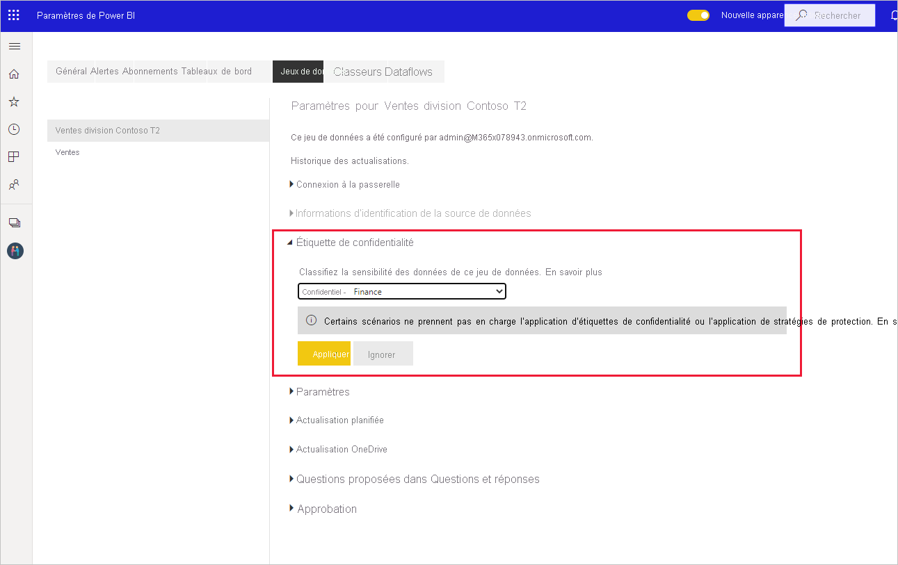

# Guide pratique pour appliquer des étiquettes de sensibilité dans Power BI

Les étiquettes de sensibilité de Microsoft Information Protection sur vos rapports, tableaux de bord, jeux de données et dataflows peuvent protéger votre contenu sensible contre les accès non autorisés aux données et contre les fuites de données. L’étiquetage correct des données avec des étiquettes de sensibilité garantit que seules les personnes autorisées peuvent accéder à vos données. Cet article explique comment appliquer des étiquettes de sensibilité à votre contenu.

Pour pouvoir appliquer des étiquettes de sensibilité dans Power BI :
* Vous devez disposer d’une licence Power BI Pro et d’autorisations de modification sur le contenu que vous souhaitez étiqueter.
* Vous devez appartenir à un groupe de sécurité qui dispose des autorisations nécessaires pour appliquer des étiquettes de sensibilité, comme décrit dans l’article intitulé [Activer les étiquettes de sensibilité dans Power BI](./service-security-enable-data-sensitivity-labels.md).
* Toutes les [Licences et autres configurations requises](./service-security-enable-data-sensitivity-labels.md#licensing-and-requirements) doivent être respectées.

Pour plus d’informations sur les étiquettes de sensibilité dans Power BI, consultez [Étiquettes de sensibilité dans Power BI](service-security-sensitivity-label-overview.md).

## Application d’étiquettes de sensibilité

Quand la protection des données est activée sur votre locataire, les étiquettes de sensibilité apparaissent dans la colonne de sensibilité dans la vue Liste des tableaux de bord, des rapports, des jeux de données et des dataflows.

**Pour appliquer ou modifier une étiquette de sensibilité sur un rapport ou un tableau de bord**
1. Cliquez sur **Plus d’options (...)** .
1. Sélectionnez **Paramètres**.
1. Dans le volet latéral des paramètres, choisissez l’étiquette de sensibilité appropriée.
1. Enregistrez les paramètres.

L’image suivante montre ces étapes sur un rapport

**Pour appliquer ou modifier une étiquette de sensibilité sur un jeu de données ou un dataflow**

1. Cliquez sur **Plus d’options (...)** .
1. Sélectionnez **Paramètres**.
1. Dans le volet latéral des paramètres, choisissez l’étiquette de sensibilité appropriée.
1. Appliquez les paramètres.

Les deux images suivantes montrent ces étapes sur un jeu de données.

Choisissez **Plus d’options (...)** , puis **Paramètres**.

Dans la page des paramètres, ouvrez la section Étiquette de sensibilité, choisissez l’étiquette de sensibilité souhaitée, puis cliquez sur **Appliquer**.

## Suppression des étiquettes de sensibilité
Pour supprimer une étiquette de sensibilité d’un rapport, d’un tableau de bord, d’un jeu de données ou d’un flux de données, suivez la [même procédure que celle utilisée pour appliquer des étiquettes](#applying-sensitivity-labels), mais choisissez **(Aucune)** quand vous êtes invité à classifier la sensibilité des données. 

## Considérations et limitations

Consultez [Étiquettes de sensibilité dans Power BI](service-security-sensitivity-label-overview.md#limitations) pour obtenir la liste des limitations relatives aux étiquettes de sensibilité dans Power BI.

## Étapes suivantes

L’objectif de cet article était d’expliquer comment appliquer des étiquettes de sensibilité dans Power BI. Les articles suivants fournissent plus de détails sur la protection des données dans Power BI. 

* [Vue d’ensemble des étiquettes de sensibilité dans Power BI](./service-security-sensitivity-label-overview.md)
* [Activer les étiquettes de sensibilité dans Power BI](./service-security-enable-data-sensitivity-labels.md)
* [Utilisation de contrôles Microsoft Cloud App Security dans Power BI](./service-security-using-microsoft-cloud-app-security-controls.md)