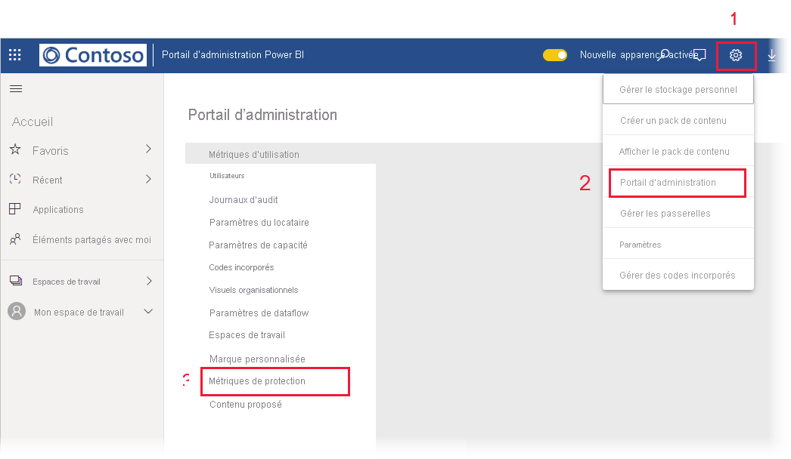

# Rapport des métriques de protection des données (préversion)

## Qu’est-ce que le rapport des métriques de protection des données ?
Le rapport de métriques  de protection des données est un rapport dédié que les [administrateurs Power BI](../admin/service-admin-role.md) peuvent utiliser pour superviser et suivre l’utilisation et l’adoption des étiquettes de sensibilité des données dans leur locataire.

 
Le rapport comprend les éléments suivants :
* Un histogramme empilé 100 % qui montre l’utilisation quotidienne des étiquettes de sensibilité dans le locataire au cours des 7, 30 ou 90 derniers jours. Ce graphique facilite le suivi de l’utilisation relative des différents types d’étiquettes au fil du temps.
* Des graphiques en anneau qui montrent l’état actuel de l’utilisation des étiquettes de sensibilité dans le locataire pour les tableaux de bord, les rapports, les jeux de données et les dataflows.
* Un lien vers le portail Cloud App Security où les alertes Power BI, les utilisateurs à risque, les journaux d’activité et d’autres informations sont disponibles. Pour plus d’informations, consultez [Utilisation des contrôles Microsoft Cloud App Security dans Power BI (préversion)](./service-security-using-microsoft-cloud-app-security-controls.md).

Le rapport est actualisé toutes les 24 heures.

## Affichage du rapport des métriques de protection des données

Vous devez disposer d’un [rôle d’administrateur Power BI](../admin/service-admin-role.md) pour ouvrir et voir le rapport.
Pour voir le rapport, accédez à **Paramètres > Portail d’administration**, puis choisissez **Métriques de protection (préversion)** .

 
 
La première fois que vous ouvrez le rapport des métriques de protection des données, le chargement peut prendre quelques secondes. Un rapport et un jeu de données intitulés **Métriques de protection des données (générées automatiquement)** seront créés dans votre environnement privé sous « Mon espace de travail ». Nous ne vous recommandons pas de le consulter ici, car il ne s’agit pas du rapport complet. Consultez plutôt le rapport dans le portail d’administration, comme décrit ci-dessus.

> [!CAUTION]
> Ne modifiez pas le rapport ou le jeu de données de quelque manière que ce soit, car de nouvelles versions du rapport sont déployées de temps en temps et les modifications apportées au rapport d’origine seront remplacées si vous mettez à jour vers la nouvelle version.

## Mises à jour du rapport

Des versions améliorées du rapport des métriques de protection des données sont publiées régulièrement. Quand vous ouvrez le rapport, si une nouvelle version est disponible, vous êtes invité à indiquer si vous voulez ouvrir la nouvelle version. Si vous répondez « Oui », la nouvelle version du rapport se charge et remplace l’ancienne version. Toutes les modifications éventuellement apportées à l’ancien rapport et/ou à l’ancien jeu de données seront perdues. Vous pouvez choisir de ne pas ouvrir la nouvelle version, mais dans ce cas, vous ne bénéficiez pas des améliorations de la nouvelle version. 
## Remarques et considérations
* Pour que le rapport des métriques de protection des données soit généré correctement, la [protection des informations](./service-security-enable-data-sensitivity-labels.md) doit être activée sur votre locataire et [des étiquettes de sensibilité doivent avoir été appliquées](../collaborate-share/service-security-apply-data-sensitivity-labels.md). 
* Pour accéder aux informations de Cloud App Security, votre organisation doit disposer de la [licence Cloud App Security](https://docs.microsoft.com/power-bi/admin/service-security-using-microsoft-cloud-app-security-controls#microsoft-cloud-app-security-licensing) appropriée.
* Si vous décidez de partager des informations du rapport des métriques de protection des données avec un utilisateur qui n’est pas administrateur Power BI, n’oubliez pas que ce rapport contient des informations sensibles sur votre organisation.
* Le rapport des métriques de protection des données est un type spécial de rapport et n’apparaît pas dans les listes « Partagé avec moi », « Récents » et « Favoris ».
* Le rapport sur les métriques de protection des données n’est pas disponible pour les [utilisateurs externes (utilisateurs invités Azure Active Directory B2B)](../admin/service-admin-azure-ad-b2b.md).
## Étapes suivantes
* [Protection des données dans Power BI (préversion)](./service-security-data-protection-overview.md)
* [Utilisation de contrôles Microsoft Cloud App Security dans Power BI (préversion)](./service-security-using-microsoft-cloud-app-security-controls.md)
* [Présentation du rôle d’administrateur du service Power BI](../admin/service-admin-role.md)
* [Activer les étiquettes de sensibilité des données dans Power BI](./service-security-enable-data-sensitivity-labels.md)