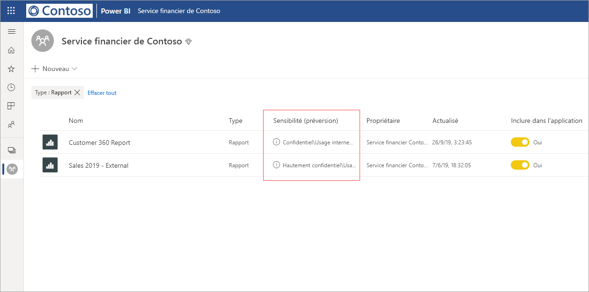
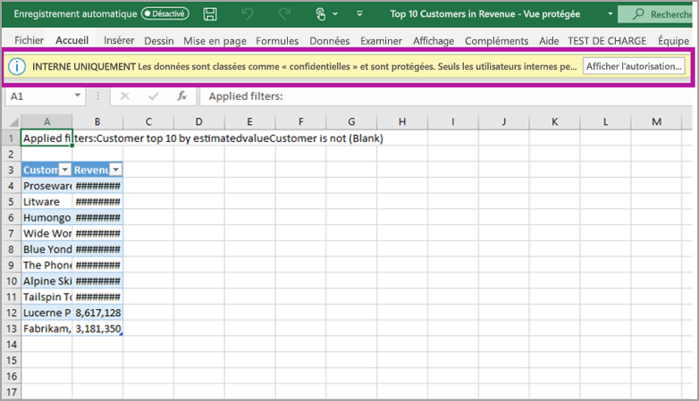

# Protection des données dans Power BI (préversion)

Les entreprises modernes ont des réglementations commerciales strictes et des exigences en matière de gestion et de protection de leurs données sensibles. Power BI peut s’intégrer à Microsoft Information Protection et à Microsoft Cloud App Security afin d’offrir un plus grand contrôle et une meilleure visibilité des données sensibles dans Power BI. 

Avec la protection des données pour Power BI, vous pouvez effectuer les opérations suivantes :

* Utilisez les étiquettes de sensibilité de Microsoft pour classifier et étiqueter du contenu dans le service Power BI (tableaux de bord, rapports, jeux de données et dataflows), avec la même taxonomie que celle utilisée pour classifier et protéger les fichiers dans Office 365. 

* Appliquez des paramètres de protection, comme le chiffrement ou les filigranes lors de l’exportation de données à partir du service Power BI vers des fichiers en appliquant la protection et l’étiquette de sensibilité du contenu (Excel, PowerPoint et PDF). 

  Par exemple, vos utilisateurs peuvent appliquer une étiquette Confidentiel à un rapport dans Power BI. Ensuite, quand les données sont exportées vers un fichier Excel, Power BI applique l’étiquette Confidentiel au fichier. L’étiquette peut chiffrer le contenu et appliquer un filigrane Confidentiel.

* Utilisez Microsoft Cloud App Security pour superviser les activités dans Power BI, examiner les problèmes de sécurité et protéger le contenu dans Power BI avec le contrôle d’application par accès conditionnel de Microsoft Cloud App Security. 

## Étiquettes de sensibilité dans Power BI

Les étiquettes de sensibilité sont créées et gérées dans le [Centre de sécurité Microsoft 365](https://security.microsoft.com/) ou dans le [Centre de conformité Microsoft 365](https://compliance.microsoft.com/).

Pour accéder aux étiquettes de sensibilité dans l’un de ces centres, accédez à **Classification > Étiquettes de sensibilité**. Ces étiquettes de sensibilité peuvent être utilisées par plusieurs services Microsoft, comme Azure Information Protection, les applications Office et les services Office 365.

> [!IMPORTANT]
> Les clients Azure Information Protection doivent migrer les étiquettes vers l’un des services précédemment listés afin que des étiquettes de sensibilité soient utilisées dans Power BI. De plus, les étiquettes de sensibilité sont uniquement prises en charge dans les clouds publics. Elles ne sont pas prises en charge pour les locataires dans des clouds, comme les clouds souverains.
>
> Apprenez-en davantage sur la [migration des étiquettes de sensibilité vers Microsoft Information Protection](https://docs.microsoft.com/azure/information-protection/configure-policy-migrate-labels).

## Fonctionnement des étiquettes de sensibilité

L’application d’une étiquette de sensibilité à un tableau de bord Power BI, un rapport, un jeu de données ou un dataflow est similaire à l’application d’une *balise* à cette ressource, ce qui offre les avantages suivants :
* **Personnalisable** : vous pouvez créer des catégories pour différents niveaux de contenu sensible dans votre organisation, comme Personnel, Public, Général, Confidentiel et Hautement confidentiel.
* **Texte en clair** : étant donné que l’étiquette est en texte clair, les utilisateurs peuvent facilement comprendre comment traiter le contenu en fonction des indications relatives à l’étiquette de sensibilité.
* **Persistant** : une fois qu’une étiquette de sensibilité a été appliquée au contenu, elle est associée à ce contenu quand il est exporté vers les types de fichiers pris en charge suivants : Excel, PowerPoint et PDF. 

  Cela signifie que l’étiquette de sensibilité suit le contenu, ce qui inclut ses paramètres de protection, et qu’elle devient la base de l’application et du respect des stratégies. 

## Exemple d’étiquette de sensibilité 

Voici un exemple rapide de la façon dont fonctionne une étiquette de sensibilité dans Power BI.

1. Dans le service Power BI, une étiquette de sensibilité **Hautement confidentiel - Interne uniquement** est appliquée à un rapport.

   

2. Quand des données sont exportées vers un fichier Excel à partir de ce rapport, l’étiquette de sensibilité et la protection sont appliquées au fichier Excel exporté.

   

Dans les programmes Microsoft Office, une étiquette de sensibilité apparaît dans les e-mails ou les documents comme dans l’image ci-dessus.

Vous pouvez également affecter une classification au contenu (par exemple, un autocollant) qui persiste et se déplace avec le contenu quand il est utilisé et partagé. Vous pouvez utiliser cette classification pour générer des rapports d’utilisation et voir les données d’activité de votre contenu sensible. En fonction de ces informations, vous pouvez toujours choisir ultérieurement d’appliquer des paramètres de protection.

## Utilisation d’étiquettes de sensibilité dans Power BI

Avant de pouvoir activer vos étiquettes de sensibilité dans Power BI, vous devez respecter les prérequis suivants : 

* Vérifiez que les étiquettes de sensibilité ont été définies dans le [Centre de sécurité Microsoft 365](https://security.microsoft.com/) ou dans le [Centre de conformité Microsoft 365](https://compliance.microsoft.com/). 
* [Activez les étiquettes de sensibilité](service-security-enable-data-sensitivity-labels.md) (préversion) dans Power BI.
* Vérifiez que les utilisateurs disposent de la licence appropriée :
  * Pour appliquer ou afficher des étiquettes dans Power BI, les utilisateurs doivent disposer d’une licence Azure Information Protection Premium P1 ou Premium P2. Vous pouvez acheter Microsoft Azure Information Protection en autonome ou par le biais de l’une des suites de licences Microsoft. Pour plus d’informations, consultez les [tarifs Azure Information Protection](https://azure.microsoft.com/pricing/details/information-protection/).
  * Pour appliquer des étiquettes à des ressources Power BI, un utilisateur doit disposer d’une licence Power BI Pro en plus de l’une des licences Azure Information Protection mentionnées ci-dessus. 

## Protéger du contenu avec Microsoft Cloud App Security

Vous pouvez protéger du contenu dans Power BI contre les fuites ou violations inattendues à l’aide de Microsoft Cloud App Security. Une fois Microsoft Cloud App Security défini et configuré, les administrateurs de la sécurité peuvent superviser l’accès et l’activité des utilisateurs, effectuer une analyse des risques en temps réel et définir des contrôles spécifiques aux étiquettes.

Par exemple, les organisations peuvent utiliser Microsoft Cloud App Security pour configurer une stratégie qui empêche les utilisateurs de télécharger des données sensibles de Power BI vers des appareils non gérés. Une telle configuration permet aux utilisateurs de rester productifs et de se connecter à Power BI à partir de n’importe où, tout en utilisant Microsoft Cloud App Security pour empêcher de compromettre leurs actions, le tout en temps réel. 

### Configuration requise

Pour que vos étiquettes de sensibilité puissent utiliser Microsoft Cloud App Security, les prérequis suivants doivent être respectés : 

* Cloud App Security et Azure Information Protection [doivent être activés pour votre locataire](https://docs.microsoft.com/cloud-app-security/azip-integration).
* L’application [ doit être connectée à Microsoft Cloud App Security](https://docs.microsoft.com/cloud-app-security/enable-instant-visibility-protection-and-governance-actions-for-your-apps).

## Considérations et limitations

La liste suivante présente certaines limitations des étiquettes de sensibilité dans Power BI :

* L’affichage et l’application d’étiquettes Microsoft Information Protection dans Power BI exigent que les utilisateurs disposent d’une licence Azure Information Protection Premium P1 ou Premium P2. Vous pouvez acheter Microsoft Azure Information Protection en autonome ou par le biais de l’une des suites de licences Microsoft. Pour plus d’informations, consultez les [tarifs Azure Information Protection](https://azure.microsoft.com/pricing/details/information-protection/).
* Les étiquettes de sensibilité ne peuvent être appliquées que sur les tableaux de bord, les rapports, les jeux de données et les dataflows.
* L’application de contrôles de protection et d’étiquettes à des fichiers exportés est prise en charge uniquement pour les fichiers Excel, PowerPoint et PDF. L’étiquette et la protection ne sont pas appliquées quand les données sont exportées vers des fichiers .CSV, un e-mail d’abonnement, des visuels d’incorporation et une impression.
* Un utilisateur qui exporte un fichier à partir de Power BI dispose d’autorisations pour accéder à ce fichier et le modifier en fonction des paramètres d’étiquette de sensibilité. L’utilisateur qui exporte les données n’obtient pas d’autorisations de propriétaire sur le fichier. 
* Les étiquettes de sensibilité ne sont pas disponibles pour les [rapports paginés]( https://docs.microsoft.com/power-bi/paginated-reports-report-builder-power-bi) et les classeurs.
* Les étiquettes de sensibilité sur des ressources Power BI sont visibles uniquement dans la liste d’espace de travail et les vues de traçabilité ; elles ne sont pas visibles dans les vues Favoris, Éléments partagés avec moi, Récents ou d’application. Notez, toutefois, qu’une étiquette appliquée à une ressource Power BI, même si elle n’est pas visible, est toujours conservée sur les données exportées vers des fichiers Excel, PowerPoint et PDF.
* Le *paramètre de chiffrement de fichier* des étiquettes de sensibilité, configuré dans le [Centre de sécurité Microsoft 365](https://security.microsoft.com/) ou le [Centre de conformité Microsoft 365](https://compliance.microsoft.com/), s’applique uniquement aux fichiers *exportés à partir de* Power BI ; il n’est pas appliqué *dans* Power BI.
* La [protection HYOK](https://docs.microsoft.com/azure/information-protection/configure-adrms-restrictions) n’est pas prise en charge pour les étiquettes appliquées dans Power BI.
* L’affichage et l’application d’étiquettes dans les applications Office sont soumis à des [conditions de licences](https://docs.microsoft.com/microsoft-365/compliance/sensitivity-labels-office-apps#subscription-and-licensing-requirements-for-sensitivity-labels).
* Les étiquettes de sensibilité sont uniquement prises en charge pour les locataires dans le cloud global (public). Les étiquettes de sensibilité ne sont pas prises en charge pour les locataires dans les autres clouds.

## Étapes suivantes

Cet article a fourni une vue d’ensemble de la protection des données dans Power BI. Les articles suivants fournissent plus de détails sur la protection des données dans Power BI. 

* [Activer les étiquettes de sensibilité des données dans Power BI](service-security-enable-data-sensitivity-labels.md)
* [Appliquer des étiquettes de sensibilité des données dans Power BI](../designer/service-security-apply-data-sensitivity-labels.md)
* [Utilisation de contrôles Microsoft Cloud App Security dans Power BI](service-security-using-microsoft-cloud-app-security-controls.md)
* [Rapport des métriques de protection des données](service-security-data-protection-metrics-report.md)