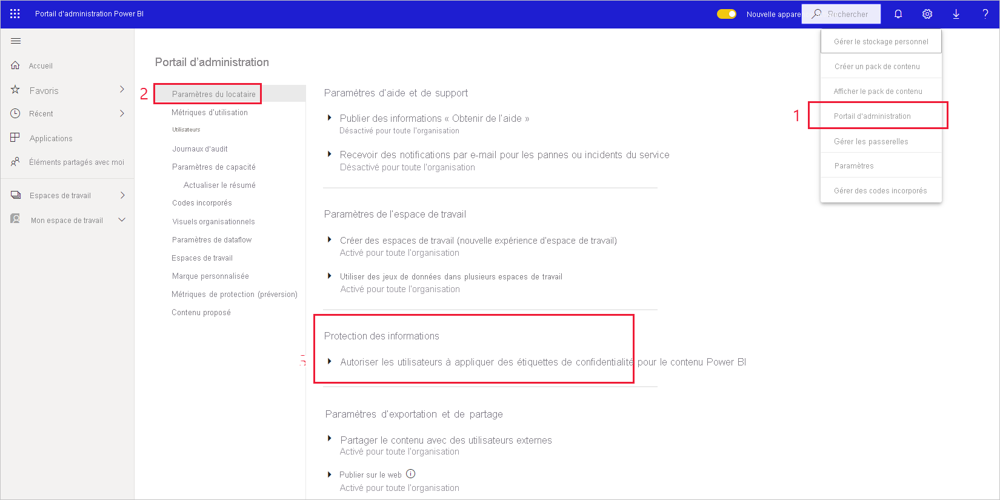
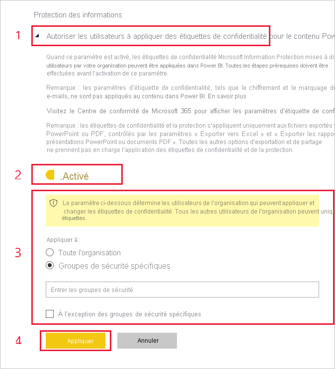

# Activer les étiquettes de sensibilité dans Power BI

Pour que [les étiquettes de sensibilité de Microsoft Information Protection](/microsoft-365/compliance/sensitivity-labels) puissent être utilisées dans Power BI, elles doivent être activées sur le locataire. Cet article explique aux administrateurs Power BI comment procéder. Pour une vue d’ensemble des étiquettes de sensibilité dans Power BI, consultez [Étiquettes de sensibilité dans Power BI](service-security-sensitivity-label-overview.md). Pour plus d’informations sur l’application des étiquettes de sensibilité dans Power BI, consultez [Application d’étiquettes de sensibilité](./service-security-apply-data-sensitivity-labels.md) 

Quand les étiquettes de sensibilité sont activées :

* Des utilisateurs et des groupes de sécurité spécifiés d’une organisation peuvent classifier et [appliquer des étiquettes de sensibilité](./service-security-apply-data-sensitivity-labels.md) à leurs tableaux de bord, rapports, jeux de données et dataflows Power BI.
* Tous les membres de l’organisation peuvent voir ces étiquettes.

L’activation des étiquettes de sensibilité nécessite une licence Azure Information Protection. Pour plus d’informations, consultez [Licences et configuration requise](#licensing-and-requirements).

## Licences et configuration requise

* Une licence Azure Information Protection Premium P1 ou Premium P2 est requise pour appliquer ou afficher des étiquettes de confidentialité Microsoft Information Protection dans Power BI. Vous pouvez acheter Azure Information Protection en autonome ou par le biais de l’une des suites de licences Microsoft. Pour plus d’informations, consultez les [tarifs Azure Information Protection](https://azure.microsoft.com/pricing/details/information-protection/).

* Pour pouvoir appliquer des étiquettes à du contenu Power BI, un utilisateur doit disposer d’une licence Power BI Pro en plus d’une des licences Azure Information Protection mentionnées ci-dessus.

* Les applications Office disposent de leurs propres [conditions de licence requises pour afficher et appliquer des étiquettes de sensibilité]( https://docs.microsoft.com/microsoft-365/compliance/get-started-with-sensitivity-labels#subscription-and-licensing-requirements-for-sensitivity-labels ).

* Avant d’activer des étiquettes de confidentialité sur votre abonné, assurez-vous qu’elles sont bien définies et publiées pour les utilisateurs et les groupes appropriés. Consultez [Créer et configurer des étiquettes de sensibilité et leurs stratégies](/microsoft-365/compliance/create-sensitivity-labels) pour plus d’informations.

>[!NOTE]
> Si votre organisation utilise des étiquettes de sensibilité Azure Information Protection, vous devez les migrer vers la plateforme d’étiquetage unifiée de Microsoft Information Protection afin qu’elles soient utilisées dans Power BI. [En savoir plus sur la migration des étiquettes de sensibilité](/azure/information-protection/configure-policy-migrate-labels).

## Activer les étiquettes de sensibilité

Accédez au **Portail d’administration** de Power BI, ouvrez le volet **Paramètres du client** et recherchez la section **Information Protection**.

Dans la section **Information Protection**, effectuez les étapes suivantes :
1. Ouvrez **Autoriser les utilisateurs à appliquer des étiquettes de confidentialité pour le contenu Power BI**.
1. Activez le bouton bascule.
1. Définissez qui peut appliquer et changer les étiquettes de sensibilité dans les ressources Power BI. Par défaut, toutes les personnes de votre organisation peuvent appliquer des étiquettes de sensibilité. Toutefois, vous pouvez choisir d’activer le paramétrage des étiquettes de sensibilité uniquement pour des utilisateurs ou des groupes de sécurité spécifiques. Si vous avez sélectionné l’ensemble de l’organisation ou des groupes de sécurité particuliers, vous pouvez exclure des sous-ensembles spécifiques d’utilisateurs ou de groupes de sécurité.
   
   * Quand les étiquettes de sensibilité sont activées pour l’ensemble de l’organisation, les exceptions sont généralement des groupes de sécurité.
   * Quand les étiquettes de sensibilité sont activées uniquement pour des utilisateurs ou des groupes de sécurité spécifiques, les exceptions sont généralement des utilisateurs spécifiques.  
    Cette approche permet d’empêcher certains utilisateurs d’appliquer des étiquettes de sensibilité dans Power BI, même s’ils appartiennent à un groupe disposant des autorisations nécessaires.

1. Appuyez sur **Appliquer**.

> [!IMPORTANT]
> Seuls les utilisateurs Power BI Pro qui disposent d’autorisations *créer* et *modifier* sur la ressource et qui font partie du groupe de sécurité approprié défini dans cette section peuvent définir et modifier les étiquettes de sensibilité. Les utilisateurs qui ne font pas partie de ce groupe ne peuvent pas définir ou modifier l’étiquette.  

## Résolution des problèmes

Power BI utilise les étiquettes de sensibilité Microsoft Information Protection. Par conséquent, si un message d’erreur s’affiche lors d’une tentative d’activation des étiquettes de sensibilité, cela peut être dû à l’une des raisons suivantes :

* Vous ne disposez pas de [licence](#licensing-and-requirements) Azure Information Protection.
* Les étiquettes de sensibilité n’ont pas été [migrées](#enable-sensitivity-labels) vers la version de Microsoft Information Protection prise en charge par Power BI.
* Aucune étiquette de sensibilité Microsoft Information Protection n’a été [définie dans votre organisation](#enable-sensitivity-labels).

## Considérations et limitations

Consultez [Étiquettes de sensibilité dans Power BI](service-security-sensitivity-label-overview.md#limitations) pour obtenir la liste des limitations relatives aux étiquettes de sensibilité dans Power BI.

## Étapes suivantes

L’objectif de cet article était d’expliquer comment activer les étiquettes de sensibilité dans Power BI. Les articles suivants fournissent plus de détails sur la protection des données dans Power BI. 

* [Vue d’ensemble des étiquettes de sensibilité dans Power BI](service-security-sensitivity-label-overview.md)
* [Guide pratique pour appliquer des étiquettes de sensibilité dans Power BI](./service-security-apply-data-sensitivity-labels.md)
* [Utilisation de contrôles Microsoft Cloud App Security dans Power BI](service-security-using-microsoft-cloud-app-security-controls.md)
* [Rapport des métriques de protection](service-security-data-protection-metrics-report.md)