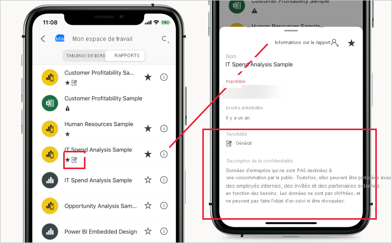

# Étiquettes de sensibilité dans Power BI

Cet article décrit les fonctionnalités des [étiquettes de sensibilité de Microsoft Information Protection](https://docs.microsoft.com/microsoft-365/compliance/sensitivity-labels?view=o365-worldwide) dans Power BI. Pour plus d’informations sur la façon d’appliquer des étiquettes de sensibilité à des rapports, des tableaux de bord, des jeux de données et des dataflows Power BI, consultez [Guide pratique pour appliquer des étiquettes de sensibilité dans Power BI](./service-security-apply-data-sensitivity-labels.md). Pour plus d’informations sur l’activation des étiquettes de sensibilité sur votre locataire, consultez [Activer les étiquettes de sensibilité des données dans Power BI](service-security-enable-data-sensitivity-labels.md).

Les étiquettes de sensibilité de Microsoft Information Protection offrent aux utilisateurs un moyen simple de classifier du contenu critique dans Power BI sans compromettre la productivité ni la possibilité de collaborer.

Les étiquettes de sensibilité peuvent être appliquées sur les jeux de données, les rapports, les tableaux de bord et les dataflows. Quand des données sont exportées depuis Power BI vers des fichiers Excel, PowerPoint ou PDF, Power BI applique automatiquement une étiquette de sensibilité sur le fichier exporté et le protège en fonction des paramètres de chiffrement de fichier de l’étiquette. De cette façon, vos données sensibles restent protégées, quel que soit l’endroit où elles se trouvent.

Les étiquettes de sensibilité appliquées sur les rapports, les tableaux de bord, les jeux de données et les dataflows Power BI sont visibles à de nombreux emplacements du service Power BI. Les étiquettes de sensibilité sur les rapports et les tableaux de bord sont également visibles dans les applications mobiles Power BI sur iOS et Android, et dans les visuels incorporés.

Un [rapport des métriques de protection](service-security-data-protection-metrics-report.md) disponible dans le portail d’administration Power BI donne aux administrateurs Power BI une visibilité complète sur les données sensibles du locataire Power BI. En outre, les journaux d’audit Power BI incluent des informations d’étiquette de sensibilité sur les activités comme l’application, la suppression et la modification des étiquettes ainsi que sur la visualisation des rapports, des tableaux de bord, etc. Ceci donne aux administrateurs Power BI et de sécurité une visibilité sur la consommation des données sensibles, permettant la supervision, les investigations et les alertes de sécurité.

## Considérations importantes

L’étiquetage de sensibilité **n’affecte pas** l’accès au contenu dans Power BI : l’accès au contenu dans Power BI est géré seulement par les autorisations de Power BI. Les étiquettes sont visibles, mais les paramètres de chiffrement associés (configurés dans le [Centre de sécurité Microsoft 365](https://security.microsoft.com/) ou dans le [Centre de conformité Microsoft 365](https://compliance.microsoft.com/)) ne sont pas appliqués. Ils sont appliqués seulement aux données exportées vers des fichiers Excel, PowerPoint et PDF.

Les étiquettes de sensibilité et le chiffrement de fichier **ne sont pas** appliqués aux chemins d’exportation autres que l’exportation vers Excel, PowerPoint et PDF. L’administrateur du locataire Power BI peut désactiver tout ou partie des chemins d’exportation qui ne prennent pas en charge l’application des étiquettes de sensibilité et les paramètres de chiffrement de fichier associés.

>[!NOTE]
> Les utilisateurs qui disposent d’une autorisation d’accès à un rapport sont autorisés à accéder à l’ensemble du jeu de données sous-jacent, sauf si la [sécurité au niveau des lignes (SNL)](./service-admin-rls.md) limite leur accès. Les auteurs de rapports peuvent classifier et étiqueter les rapports en utilisant des étiquettes de confidentialité. Si l’étiquette de sensibilité a des paramètres de protection, Power BI les applique quand les données des rapports sont exportées dans des fichiers Excel, PowerPoint ou PDF. Seuls les utilisateurs autorisés peuvent ouvrir des fichiers protégés.

## Fonctionnement des étiquettes de sensibilité dans Power BI

L’application d’une étiquette de sensibilité à un tableau de bord Power BI, un rapport, un jeu de données ou un dataflow est similaire à l’application d’une étiquette à cette ressource, ce qui offre les avantages suivants :
* **Personnalisable** : vous pouvez créer des catégories pour différents niveaux de contenu sensible dans votre organisation, comme Personnel, Public, Général, Confidentiel et Hautement confidentiel.
* **Texte en clair** : étant donné que l’étiquette est en texte clair, les utilisateurs peuvent facilement comprendre comment traiter le contenu en fonction des indications relatives à l’étiquette de sensibilité.
* **Persistante** : une fois qu’une étiquette de sensibilité a été appliquée au contenu, elle accompagne ce contenu quand il est exportée vers des fichiers Excel, PowerPoint et PDF, et devient la base pour l’application de stratégies.

Voici un exemple rapide de la façon dont fonctionnent les étiquettes de sensibilité dans Power BI. L’image ci-dessous montre comment une étiquette de sensibilité est appliquée à un rapport dans le service Power BI, puis comment les données du rapport sont exportées vers un fichier Excel, et enfin comment l’étiquette de sensibilité et ses protections persistent dans le fichier exporté.

Dans les applications Microsoft Office, une étiquette de sensibilité apparaît sous la forme d’une étiquette sur les e-mails ou les documents, comme dans l’image ci-dessus.

Vous pouvez également affecter une classification au contenu (comme un autocollant) qui persiste et se déplace avec le contenu quand il est utilisé et partagé dans Power BI. Vous pouvez utiliser cette classification pour générer des rapports d’utilisation et voir les données d’activité pour votre contenu sensible. En fonction de ces informations, vous pouvez toujours choisir ultérieurement d’appliquer des paramètres de protection.

## Héritage des étiquettes de sensibilité lors de la création d’un nouveau contenu

Quand de nouveaux rapports et tableaux de bord sont créés dans le service Power BI, ils héritent automatiquement de l’étiquette de sensibilité précédemment appliquée sur le jeu de données ou le rapport parent. Par exemple, un nouveau rapport créé sur un jeu de données qui a une étiquette de sensibilité « Hautement confidentiel » reçoit automatiquement cette étiquette « Hautement confidentiel ».

L’illustration suivante montre comment l’étiquette de sensibilité d’un jeu de données est automatiquement appliquée à un rapport basé sur le jeu de données.

>[!NOTE]
>Si pour une raison quelconque, l’étiquette de sensibilité ne peut pas être appliquée sur le nouveau rapport ou tableau de bord, Power BI ne bloque **pas** la création du nouvel élément.

## Étiquettes de sensibilité et protection sur les données exportées

Quand des données sont exportées depuis Power BI vers des fichiers Excel, PowerPoint ou PDF, Power BI applique automatiquement une étiquette de sensibilité sur le fichier exporté et le protège en fonction des paramètres de chiffrement de fichier de l’étiquette. De cette façon, vos données sensibles restent protégées, quel que soit l’endroit où elles se trouvent.

Un utilisateur qui exporte un fichier à partir de Power BI dispose d’autorisations pour accéder à ce fichier et le modifier en fonction des paramètres d’étiquette de sensibilité ; il ne reçoit pas les autorisations de propriétaire sur le fichier.

Les étiquettes de sensibilité et la protection ne sont pas appliquées quand les données sont exportées vers des fichiers .csv ou .pbix, Analyser dans Excel ou d’autres chemins d’exportation.

L’application d’une étiquette de sensibilité et d’une protection à un fichier exporté n’ajoute pas de marquage du contenu au fichier. Cependant, si l’étiquette est configurée pour appliquer des marquages de contenu, ceux-ci sont automatiquement appliqués par le client d’étiquetage unifié Azure Information Protection quand le fichier est ouvert dans des applications de poste de travail Office. Les marquages de contenu ne sont pas appliqués automatiquement quand vous utilisez l’étiquetage intégré pour les applications de bureau, mobiles ou web. Pour plus d’informations, consultez [Lorsque les applications Office appliquent le marquage de contenu et le chiffrement](https://docs.microsoft.com/microsoft-365/compliance/sensitivity-labels-office-apps?view=o365-worldwide#when-office-apps-apply-content-marking-and-encryption).

L’exportation échoue si une étiquette ne peut pas être appliquée quand les données sont exportées vers un fichier. Pour vérifier si l’exportation a échoué parce que l’étiquette n’a pas pu être appliquée, cliquez sur le nom du rapport ou du tableau de bord au centre de la barre de titre et vérifiez si le message « Impossible de charger l’étiquette de confidentialité » apparaît dans la liste déroulante des informations qui s’ouvre. Ceci peut se produire à la suite d’un problème système temporaire, ou si l’étiquette appliquée a été supprimée ou si sa publication a été annulée par l’administrateur de la sécurité.

## Persistance des étiquettes de sensibilité dans les rapports et tableaux de bord incorporés

Vous pouvez incorporer des rapports, des tableaux de bord et des visuels Power BI dans des applications métier, comme Microsoft Teams et SharePoint, ou sur le site web d’une organisation. Quand vous incorporez un visuel, un rapport ou un tableau de bord auquel une étiquette de sensibilité est appliquée, l’étiquette de sensibilité est visible dans la vue incorporée, et l’étiquette et sa protection persistent quand les données sont exportées vers Excel.

Les scénarios d’incorporation suivants sont pris en charge :
* [Incorporer pour votre organisation](../developer/embedded/embed-sample-for-your-organization.md)
* Applications Microsoft 365 (par exemple [Teams](../collaborate-share/service-collaborate-microsoft-teams.md) et [SharePoint](../collaborate-share/service-embed-report-spo.md))
* [Sécuriser l’incorporation d’URL](../collaborate-share/service-embed-secure.md) (incorporation à partir du service Power BI) 

## Étiquettes de sensibilité dans les applications mobiles Power BI

Les étiquettes de sensibilité peuvent être visualisées sur les rapports et les tableaux de bord dans les applications mobiles Power BI. Une icône près du nom du rapport ou du tableau de bord indique qu’il a une étiquette de sensibilité, et le type d’étiquette et sa description se trouvent dans la zone d’informations du rapport ou du tableau de bord.

## Clouds pris en charge
Les étiquettes de confidentialité sont prises en charge seulement pour les locataires dans des clouds (publics) mondiaux ; elles ne sont pas prises en charge dans des clouds comme les clouds nationaux.

## Exigences pour l’utilisation d’étiquettes de sensibilité dans Power BI

Avant de pouvoir activer et utiliser vos étiquettes de sensibilité dans Power BI, vous devez d’abord respecter les prérequis suivants :
* Vérifiez que les étiquettes de sensibilité ont été définies dans le [Centre de sécurité Microsoft 365](https://security.microsoft.com/) ou dans le [Centre de conformité Microsoft 365](https://compliance.microsoft.com/).
* [Activez les étiquettes de sensibilité](service-security-enable-data-sensitivity-labels.md) dans Power BI.
* Vérifiez que les utilisateurs disposent des [licences appropriées](#licensing).

## Licences

* L’affichage et l’application d’étiquettes Microsoft Information Protection dans Power BI exigent que les utilisateurs disposent d’une licence Azure Information Protection Premium P1 ou Premium P2. Vous pouvez acheter Microsoft Azure Information Protection en autonome ou par le biais de l’une des suites de licences Microsoft. Pour plus d’informations, consultez les [tarifs Azure Information Protection](https://azure.microsoft.com/pricing/details/information-protection/).
* L’affichage et l’application d’étiquettes dans les applications Office sont soumis à des [conditions de licences](https://docs.microsoft.com/microsoft-365/compliance/get-started-with-sensitivity-labels#subscription-and-licensing-requirements-for-sensitivity-labels).
* Pour appliquer des étiquettes à du contenu Power BI, un utilisateur doit disposer d’une licence Power BI Pro en plus d’une des licences Azure Information Protection mentionnées ci-dessus.

## Création et gestion des étiquettes de sensibilité

Les étiquettes de sensibilité sont créées et gérées dans le [Centre de sécurité Microsoft 365](https://security.microsoft.com/) ou dans le [Centre de conformité Microsoft 365](https://compliance.microsoft.com/).

Pour accéder aux étiquettes de sensibilité dans un de ces centres, accédez à **Classification > Étiquettes de sensibilité**. Ces étiquettes de sensibilité peuvent être utilisées par plusieurs services Microsoft, comme Azure Information Protection, les applications Office et les services Office 365.

>[!Important]
> Si votre organisation utilise des étiquettes de sensibilité Azure Information Protection, vous devez [les migrer](https://docs.microsoft.com/azure/information-protection/configure-policy-migrate-labels) vers un des services listés précédemment pour que les étiquettes soient utilisées dans Power BI.

## Limites

La liste suivante présente certaines limitations des étiquettes de sensibilité dans Power BI :

* Les étiquettes de sensibilité peuvent être appliquées seulement sur des tableaux de bord, des rapports, des jeux de données et des dataflows. Les étiquettes de sensibilité ne sont pas disponibles pour les [rapports paginés](../paginated-reports/report-builder-power-bi.md) et les classeurs.
* Les étiquettes de sensibilité sur les ressources Power BI sont visibles dans les vues Liste d’espaces de travail, Traçabilité, Favoris et Applications ; elles ne sont actuellement pas visibles dans la vue Partagé avec moi. Notez, toutefois, qu’une étiquette appliquée à une ressource Power BI, même si elle n’est pas visible, est toujours conservée sur les données exportées vers des fichiers Excel, PowerPoint et PDF.
* Les étiquettes de sensibilité de données ne sont pas prises en charge pour les applications de modèle. Les étiquettes de sensibilité définies par le créateur de l’application de modèle sont supprimées lors de l’extraction et de l’installation de l’application, et les étiquettes de sensibilité ajoutées aux artefacts dans un modèle d’application installé par le consommateur de l’application sont perdues (réinitialisées sur Nothing (pas de sélection)) lorsque l’application est mise à jour.
* Power BI ne prend pas en charge les étiquettes de sensibilité des types de protection [Ne pas transférer](https://docs.microsoft.com/microsoft-365/compliance/encryption-sensitivity-labels?view=o365-worldwide#let-users-assign-permissions), [Défini par l’utilisateur](https://docs.microsoft.com/microsoft-365/compliance/encryption-sensitivity-labels?view=o365-worldwide#let-users-assign-permissions) et [HYOK](https://docs.microsoft.com/azure/information-protection/configure-adrms-restrictions). Les types de protection Ne pas transférer et Défini par l’utilisateur font référence aux étiquettes définies dans le [Centre de sécurité Microsoft 365](https://security.microsoft.com/) ou dans le [Centre de conformité Microsoft 365](https://compliance.microsoft.com/).
* Il n’est pas recommandé d’autoriser les utilisateurs à appliquer des étiquettes parentes dans Power BI. Si une étiquette parente est appliquée au contenu, l’exportation de données à partir de ce contenu vers un fichier (Excel, PowerPoint et PDF) échouera. Consultez [Sous-étiquettes (étiquettes de regroupement)](https://docs.microsoft.com/microsoft-365/compliance/sensitivity-labels?view=o365-worldwide#sublabels-grouping-labels).

## Étapes suivantes

Cet article a fourni une vue d’ensemble de la protection des données dans Power BI. Les articles suivants fournissent plus de détails sur la protection des données dans Power BI. 

* [Activer les étiquettes de sensibilité dans Power BI](service-security-enable-data-sensitivity-labels.md)
* [Guide pratique pour appliquer des étiquettes de sensibilité dans Power BI](service-security-apply-data-sensitivity-labels.md)
* [Utilisation de contrôles Microsoft Cloud App Security dans Power BI](service-security-using-microsoft-cloud-app-security-controls.md)
* [Rapport des métriques de protection](service-security-data-protection-metrics-report.md)