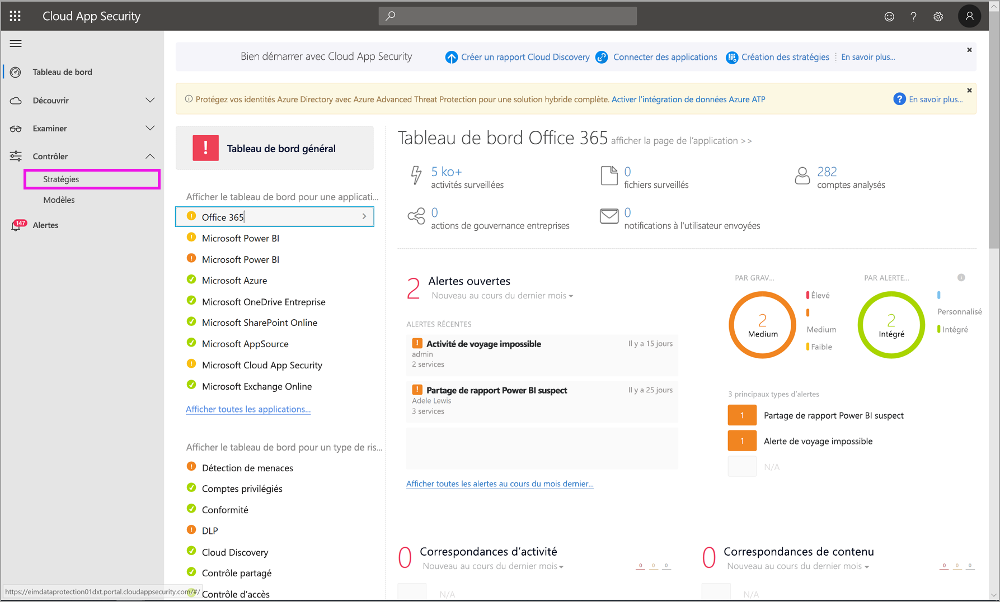
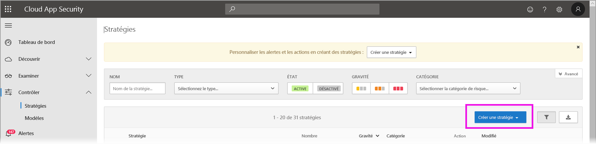
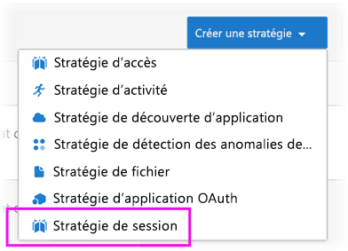
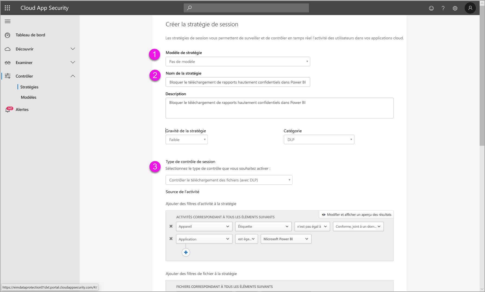
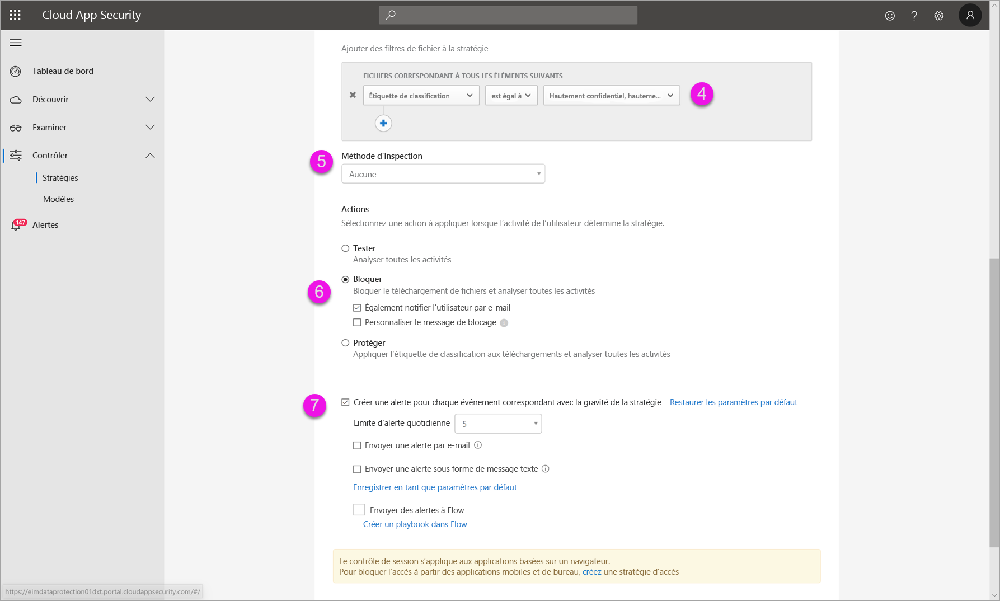
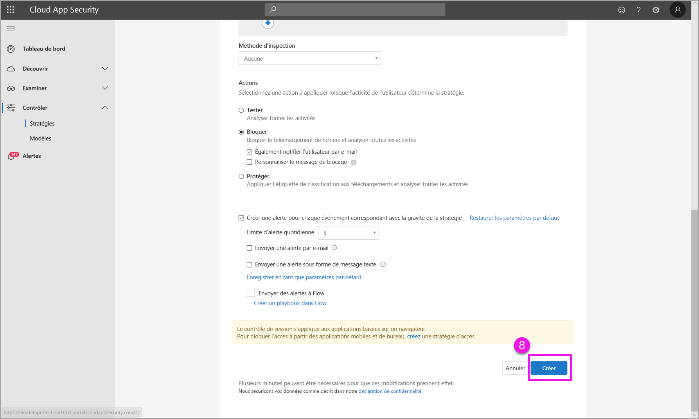

# Utilisation de contrôles Microsoft Cloud App Security dans Power BI (préversion)

En utilisant Microsoft Cloud App Security avec Power BI, vous pouvez protéger vos rapports, données et services Power BI contre les fuites ou violations inattendues. Cloud App Security vous permet de créer des stratégies d’accès conditionnel pour les données de votre organisation, à l’aide de contrôles de session en temps réel dans Azure Active Directory (Azure AD) qui contribuent de garantir la sécurité de vos analytiques Power BI. Une ces stratégies définies, les administrateurs peuvent superviser l’accès et l’activité des utilisateurs, effectuer une analyse des risques en temps réel et définir des contrôles spécifiques aux étiquettes. 

Vous pouvez configurer Microsoft Cloud App Security pour tous les types d’applications et de services, et pas seulement Power BI. Cloud App Security est un service Microsoft qui protège les applications et les appareils, et qui est géré par le biais de son propre tableau de bord. Vous devez configurer Cloud App Security pour qu’il fonctionne avec Power BI afin de tirer parti des protections Cloud App Security pour vos données et analytiques Power BI. Pour plus d’informations sur Cloud App Security, et obtenir notamment une vue d’ensemble de son fonctionnement, du tableau de bord et des scores de risque d’application, consultez la documentation [Microsoft Cloud App Security](https://docs.microsoft.com/cloud-app-security/).

## Utilisation de Microsoft Cloud App Security avec Power BI

Pour utiliser Microsoft Cloud App Security avec Power BI, vous devez utiliser et configurer les services de sécurité Microsoft appropriés, dont certains sont définis en dehors de Power BI.

### Gestion des licences Microsoft Cloud App Security

Pour avoir Microsoft Cloud App Security dans votre locataire, vous devez disposer de l’une des licences suivantes :
* MCAS : fournit des fonctionnalités OCAS pour toutes les applications prises en charge ; fait partie des suites EMS E5 et M365 E5.
* CAS-D : fournit uniquement la découverte MCAS.
* OCAS : fournit des fonctionnalités MCAS uniquement pour Office 365 ; fait partie de la suite Office E5.
* Facultatif : AAD P1 et AIP P1 pour tirer parti des principales fonctionnalités Microsoft Cloud App Security.

Les sections ci-dessous décrivent les étapes d’utilisation de Microsoft Cloud App Security dans Power BI.

### Définir des stratégies de session dans Azure Active Directory (obligatoire)
Les étapes nécessaires pour définir des contrôles de session sont effectuées dans les portails Azure AD et Microsoft Cloud App Security. Dans le portail Azure AD, vous créez une stratégie d’accès conditionnel pour Power BI et les sessions de route utilisées dans Power BI par le biais du service Microsoft Cloud App Security. 

Microsoft Cloud App Security fonctionne à l’aide d’une architecture de proxy inverse et est intégré à l’accès conditionnel Azure AD pour superviser l’activité des utilisateurs Power BI en temps réel. Les étapes suivantes sont fournies ici pour vous aider à comprendre le processus et des instructions pas à pas détaillées sont fournies dans le contenu lié de chacune de ces étapes suivantes. Vous pouvez également lire cet [article Cloud App Security](https://docs.microsoft.com/cloud-app-security/proxy-deployment-aad) qui décrit le processus dans son ensemble.

1.  [Créer une stratégie de test d’accès conditionnel Azure AD](https://docs.microsoft.com/cloud-app-security/proxy-deployment-aad#add-azure-ad)
2.  [Se connecter à chaque application à l’aide d’un utilisateur limité à la stratégie](https://docs.microsoft.com/cloud-app-security/proxy-deployment-aad#sign-in-scoped)
3.  [Vérifier que les applications sont configurées pour utiliser des contrôles d’accès et de session](https://docs.microsoft.com/cloud-app-security/proxy-deployment-aad#portal)
4.  [Tester le déploiement](https://docs.microsoft.com/cloud-app-security/proxy-deployment-aad#step-4-test-the-deployment)

Le processus de définition de stratégies de session est décrit en détail dans l’article [Stratégies de session](https://docs.microsoft.com/cloud-app-security/session-policy-aad). 

### Définir des stratégies de détection des anomalies pour superviser les activités PBI (recommandé)
Vous pouvez définir des stratégies de détection des anomalies Power BI qui peuvent être étendues indépendamment, afin qu’elles s’appliquent uniquement aux utilisateurs et groupes que vous voulez inclure et exclure dans la stratégie. [En savoir plus](https://docs.microsoft.com/cloud-app-security/anomaly-detection-policy#scope-anomaly-detection-policies).

Cloud App Security dispose également de deux détections dédiées et intégrées pour Power BI. [Pour plus d’informations, consultez la section correspondante, plus loin dans ce document](#built-in-microsoft-cloud-app-security-detections-for-power-bi).

### Utiliser des étiquettes de sensibilité Microsoft Information Protection (recommandé)

Les étiquettes de sensibilité vous permettent de classifier et de protéger du contenu sensible, afin que les membres de votre organisation puissent collaborer avec des partenaires en dehors de votre organisation, tout en restant vigilant et conscient du contenu et des données sensibles. 

Vous pouvez lire l’article sur les [étiquettes de sensibilité dans Power BI](../collaborate-share/service-security-apply-data-sensitivity-labels.md), qui décrit en détail le processus d’utilisation d’étiquettes de sensibilité pour Power BI. Un [exemple de stratégie Power BI basée sur des étiquettes de sensibilité](#example) est donné ci-dessous.

## Détections Microsoft Cloud App Security intégrées pour Power BI

Les détections Microsoft Cloud App Security permettent aux administrateurs de superviser des activités spécifiques d’une application supervisée. Pour Power BI, il existe actuellement deux détections Cloud App Security dédiées et intégrées : 

* **Partage suspect** : détecte quand un utilisateur partage un rapport sensible avec une adresse e-mail inconnue (externe à l’organisation). Un rapport sensible est un rapport dont l’étiquette de sensibilité est définie sur **INTERNE UNIQUEMENT** ou un niveau supérieur. 

* **Partage en masse de rapports** : détecte quand un utilisateur partage de nombreux rapports différents dans une seule session.

Les paramètres de ces détections sont configurés dans le portail Cloud App Security. [En savoir plus](https://docs.microsoft.com/cloud-app-security/anomaly-detection-policy#unusual-activities-by-user). 

## Rôle d’administrateur Power BI dans Microsoft Cloud App Security

Un nouveau rôle est créé pour les administrateurs Power BI lors de l’utilisation de Microsoft Cloud App Security avec Power BI. Quand vous vous connectez en tant qu’administrateur Power BI au [portail Cloud App Security](https://portal.cloudappsecurity.com/), vous disposez d’un accès limité aux données pertinentes, alertes, utilisateurs à risque, journaux d’activité et autres informations Power BI.

## Considérations et limitations 
L’utilisation de Cloud App Security avec Power BI est conçue pour garantir la sécurité du contenu et des données de votre organisation, avec des détections qui supervisent les sessions utilisateur et leurs activités. Quand vous utilisez Cloud App Security avec Power BI, vous devez garder à l’esprit quelques points et limitations :

* Microsoft Cloud App Security peut uniquement fonctionner sur des fichiers Excel, PowerPoint et PDF.
* Si vous voulez utiliser des fonctionnalités d’étiquettes de sensibilité dans vos stratégies de session pour Power BI, vous devez disposer d’une licence Azure Information Protection Premium P1 ou Premium P2. Vous pouvez acheter Microsoft Azure Information Protection en autonome ou par le biais de l’une des suites de licences Microsoft. Pour plus d’informations, consultez les [tarifs Azure Information Protection](https://azure.microsoft.com/pricing/details/information-protection/). De plus, les étiquettes de sensibilité doivent avoir été appliquées sur vos ressources Power BI.
* Le contrôle de session est disponible pour n’importe quel navigateur sur toute plateforme principale d’un système d’exploitation. Il est recommandé d’utiliser Internet Explorer 11, Microsoft Edge (dernière version), Google Chrome (dernière version), Mozilla Firefox (dernière version) ou Apple Safari (dernière version). Les appels d’API publiques Power BI et les autres sessions hors navigateur ne sont pas pris en charge dans le cadre du contrôle de session Microsoft Cloud App Security. [Consultez plus de détails](https://docs.microsoft.com/cloud-app-security/proxy-intro-aad#supported-apps-and-clients).

> [!CAUTION]
> * La stratégie d’*inspection du contenu* sur Microsoft Cloud App Security n’est actuellement pas disponible dans Power BI quand vous appliquez une stratégie de fichier Excel. Ne définissez donc pas cette stratégie pour Power BI.
> * Dans la partie « Action » de la stratégie de session, la fonctionnalité « Protéger » ne fonctionne que s’il n’existe aucune étiquette sur l’élément. S’il existe déjà une étiquette, l’action « Protéger » ne s’applique pas ; vous ne pouvez pas remplacer une étiquette existante qui a déjà été appliquée à un élément dans Power BI.

## Exemple

L’exemple suivant vous montre comment créer une stratégie de session à l’aide de Microsoft Cloud App Security avec Power BI.

Tout d’abord, créez une stratégie de session. Sélectionnez **Stratégies** dans le menu de gauche du portail **Cloud App Security**.

Dans la fenêtre qui s’affiche, sélectionnez la liste déroulante **Créer une stratégie**.

Dans les options de la liste déroulante, sélectionnez **Stratégie de session**.

Dans la fenêtre qui s’affiche, créez la stratégie de session. Les étapes numérotées décrivent les paramètres de l’image suivante.

  1. Dans la liste déroulante **Modèle de stratégie**, choisissez *Aucun modèle*.
  2. Pour la zone **Nom de la stratégie**, indiquez un nom pertinent pour votre stratégie de session.
  3. Pour **Type de contrôle de session**, sélectionnez *Contrôler le téléchargement du fichier (avec DLP)* .

      Pour la section **Source de l’activité**, choisissez les stratégies de blocage appropriées. Nous vous recommandons de bloquer les appareils non gérés et non conformes. Choisissez de bloquer les téléchargements quand la session se trouve dans Power BI.

        

        Quand vous faites défiler la liste vers le bas, plus d’options s’affichent. L’image suivante présente ces options, avec des exemples supplémentaires. 

  4. Choisissez *Étiquette de confidentialité* avec la valeur *Hautement confidentiel* ou toute valeur qui correspond le mieux à votre organisation.
  5. Remplacez la valeur de la **Méthode d’inspection**  par *Aucune*.
  6. Choisissez l’option **Bloquer** qui correspond à vos besoins.
  7. Veillez à créer une alerte pour une telle action.

        

        

  8. Enfin, prenez soin de sélectionner le bouton **Créer** pour créer la stratégie de session.

        

> [!CAUTION]
> Veillez à ne pas créer de stratégie **Inspection du contenu** sur les fichiers Excel dans Power BI. Il s’agit d’une limitation connue de cette *préversion*.

## Étapes suivantes
L’objectif de cet article était d’expliquer comment Microsoft Cloud App Security peut fournir des protections de données et de contenu pour Power BI. Les articles suivants pourraient également vous intéresser, car ils décrivent la protection des données pour Power BI et la prise en charge de contenu pour les services Azure qui l’activent.

* [Vue d’ensemble de la protection des données dans Power BI](service-security-data-protection-overview.md)
* [Activer les étiquettes de sensibilité des données dans Power BI](service-security-enable-data-sensitivity-labels.md)
* [Appliquer des étiquettes de sensibilité des données dans Power BI](../collaborate-share/service-security-apply-data-sensitivity-labels.md)

Les articles suivants sur Azure et la sécurité pourraient également vous intéresser :

* [Protéger les applications avec le contrôle d’application par accès conditionnel de Microsoft Cloud App Security](https://docs.microsoft.com/cloud-app-security/proxy-intro-aad)
* [Déployer le contrôle d’application par accès conditionnel pour les applications proposées](https://docs.microsoft.com/cloud-app-security/proxy-deployment-aad)
* [Stratégies de session](https://docs.microsoft.com/cloud-app-security/session-policy-aad)
* [Vue d’ensemble des étiquettes de sensibilité](https://docs.microsoft.com/microsoft-365/compliance/sensitivity-labels)
* [Rapport des métriques de protection des données](service-security-data-protection-metrics-report.md)