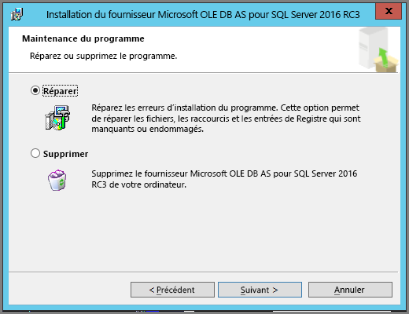
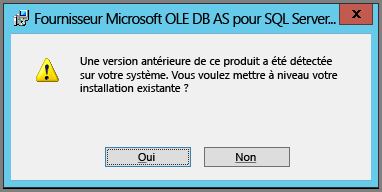

# Résolution des problèmes de la fonctionnalité Analyser dans Excel

Il peut arriver que vous obteniez un résultat inattendu lors de l’utilisation de la fonctionnalité Analyser dans Excel, ou que la fonctionnalité ne fonctionne pas comme prévu. Cette page fournit des solutions pour les problèmes courants lors de l’utilisation de la fonctionnalité Analyser dans Excel.

> [!NOTE]
> Il existe une page distincte dédiée à la description et l’activation de la fonctionnalité [Analyser dans Excel](service-analyze-in-excel.md).
> 
> Si vous rencontrez un scénario ne figurant pas dans la liste ci-dessous, et que cela vous pose des problèmes, vous pouvez demander de l’aide sur le [site de la communauté](https://community.powerbi.com/), ou créer un [ticket de support](https://powerbi.microsoft.com/support/).
> 
> 

Cet article contient les sections suivantes qui traitent de la résolution des problèmes :

* Mise à jour des bibliothèques Excel pour le fournisseur OLE DB
* Déterminer si vous devez mettre à jour vos bibliothèques Excel
* Erreur Impossible d’établir une connexion
* Erreur Interdit
* Aucun modèle de données
* Erreur Jeton expiré
* Impossible d’accéder à vos services locaux Analysis Services
* Impossible de faire glisser quelque chose dans la zone des valeurs de tableau croisé dynamique (aucune mesure)

## Mise à jour des bibliothèques Excel pour le fournisseur OLE DB
Pour utiliser **Analyser dans Excel**, votre ordinateur doit avoir un fournisseur AS OLE DB actuel installé. Ce [billet de communauté](https://community.powerbi.com/t5/Service/Analyze-in-Excel-Initialization-of-the-data-source-failed/m-p/30837#M8081) constitue une source précieuse pour vérifier votre installation du fournisseur OLE DB, ou pour télécharger une version récente.

Le niveau de bits des bibliothèques Excel doit correspondre à celui de la version de Windows. Si vous avez installé Windows 64 bits, vous devez installer le fournisseur OLE DB 64 bits.

Pour télécharger les dernières bibliothèques Excel, visitez Power BI et sélectionnez la **flèche vers le bas** dans l’angle supérieur droit du service Power BI, puis sélectionnez **Analyser dans les mises à jour Excel**.

Dans la boîte de dialogue qui s’affiche, sélectionnez **Télécharger (version préliminaire)** .

## Déterminer si vous devez mettre à jour vos bibliothèques Excel
Vous pouvez télécharger la version la plus récente des bibliothèques de fournisseur OLE DB Excel en suivant les liens de la section précédente. Lorsque vous avez téléchargé la bonne bibliothèque de fournisseur OLD DB et avez commencé l’installation, les vérifications sont effectuées par rapport à la version actuellement installée.

Si vos bibliothèques clientes de fournisseur OLE DB Excel sont à jour, vous verrez une boîte de dialogue qui ressemble à ceci :

Autrement, si la nouvelle version que vous installez est plus récente que la version sur votre ordinateur, la boîte de dialogue suivante s’affiche :

Si vous voyez la boîte de dialogue vous invitant à mettre à niveau, vous devez continuer l’installation pour obtenir la version la plus récente du fournisseur OLE DB sur votre ordinateur.

## Erreur Impossible d’établir une connexion
La cause principale pour l’erreur *Impossible d’établir une connexion* est que les bibliothèques du client du fournisseur OLE DB de votre ordinateur ne sont pas à jour. Pour plus d’informations sur la façon de déterminer la bonne mise à jour et obtenir les liens de téléchargement, consultez **Mise à jour des bibliothèques Excel pour le fournisseur OLE DB** plus haut dans cet article.

## Erreur Interdit
Certains utilisateurs possèdent plusieurs comptes Power BI, et lorsqu’Excel tente de se connecter à Power BI à l’aide des informations d’identification existantes, il peut utiliser des informations d’identification qui n’ont pas d’accès au jeu de données ou rapport auquel vous souhaitez accéder.

Lorsque cela se produit, vous pouvez recevoir une erreur intitulée **Interdit**, ce qui signifie que vous pouvez être connecté à Power BI avec des informations d’identification qui n’ont pas les autorisations pour ce jeu de données. Si vous rencontrez l’erreur **Interdit**, utilisez des informations d’identification qui ont la permission d’accéder au jeu de données que vous essayez d’utiliser lorsque ces informations vous sont demandées.

Si vous rencontrez toujours des erreurs, connectez-vous à Power BI avec un compte qui a l’autorisation, et vérifiez que vous pouvez afficher et accéder au jeu de données dans la version de Power BI à laquelle vous tentez d’accéder dans Excel.

## Aucun modèle de données
Si vous rencontrez une erreur indiquant **Impossible de trouver le modèle de cube OLAP**, le jeu de données auquel vous tentez d’accéder n’a aucun modèle de données et ne peut donc pas être analysé dans Excel.

## Erreur Jeton expiré
Si vous recevez une erreur **Jeton expiré**, cela signifie que vous n’avez pas récemment utilisé la fonctionnalité **Analyser dans Excel** sur l’ordinateur que vous utilisez. Saisissez simplement vos informations d’identification à nouveau ou rouvrez le fichier, et l’erreur devrait disparaître.

## Impossible d’accéder à Analysis Services en local
Si vous essayez d’accéder à un jeu de données qui a des connexions à des données Analysis Services locales, vous risquez de recevoir un message d’erreur. **Analyser dans Excel** prend en charge la connexion à des jeux de données et rapports dans **Analysis Services** en local avec une chaîne de connexion, à condition que votre ordinateur soit sur le même domaine que le serveur **Analysis Services** et que votre compte ait accès à ce serveur **Analysis Services**.

## Impossible de faire glisser quelque chose dans la zone des valeurs de tableau croisé dynamique (aucune mesure)
Lorsque **Analyser dans Excel** se connecte à un modèle OLAP externe (c’est la façon dont Excel se connecte à Power BI), le *tableau croisé dynamique* exige que les **mesures** soient définies dans le modèle externe, car tous les calculs sont effectués sur le serveur. Ce comportement est différent lorsque vous utilisez une source de données locale (comme des tableaux dans Excel ou quand vous utilisez des jeux de données dans **Power BI Desktop** ou le **service Power BI**) : dans ce cas, le modèle tabulaire est disponible localement et [vous pouvez utiliser des mesures implicites](https://support.microsoft.com/en-us/office/measures-in-power-pivot-86484821-a324-4da3-803b-82fd2e5033f4), c’est-à-dire des mesures générées dynamiquement et qui ne sont pas stockées dans le modèle de données. Dans ces cas-là, le comportement dans Excel est différent du comportement dans **Power BI Desktop** ou le **service Power BI** : il peut y avoir des colonnes de données qui peuvent être traitées en tant que mesures dans Power BI, mais qui ne peuvent pas être utilisées en tant que valeurs (mesures) dans Excel.

Pour résoudre ce problème, plusieurs options s’offrent à vous :

1. Créez des [mesures dans votre modèle de données dans **Power BI Desktop**](../transform-model/desktop-tutorial-create-measures.md), puis publiez le modèle de données dans le **service Power BI** et accédez à ce jeu de données publié à partir d’Excel.
2. Créez des [mesures dans votre modèle de données à partir de PowerPivot (dans Excel)](https://support.office.com/article/Create-a-Measure-in-Power-Pivot-d3cc1495-b4e5-48e7-ba98-163022a71198).
3. Si vous avez importé des données à partir d’un classeur Excel qui ne contient que des tables (et aucun modèle de données), vous pouvez [ajouter les tables au modèle de données](https://support.office.com/article/Add-worksheet-data-to-a-Data-Model-using-a-linked-table-d3665fc3-99b0-479d-ba09-a37640f5be42), puis suivre les étapes de l’option 2 (voir ci-dessus) pour créer des mesures dans votre modèle de données.

Une fois que vos mesures sont définies dans le modèle au sein du service Power BI, vous pouvez les utiliser dans la zone **Valeurs** des tableaux croisés dynamiques Excel.

## Étapes suivantes
[Analyser dans Excel](service-analyze-in-excel.md)

[Tutoriel : Créer ses propres mesures dans Power BI Desktop](../transform-model/desktop-tutorial-create-measures.md)

[Mesures dans PowerPivot](https://support.microsoft.com/en-us/office/measures-in-power-pivot-86484821-a324-4da3-803b-82fd2e5033f4)

[Créer une mesure dans PowerPivot](https://support.office.com/article/Create-a-Measure-in-Power-Pivot-d3cc1495-b4e5-48e7-ba98-163022a71198)

[Ajouter des données de feuille de calcul à un modèle de données à l’aide d’une table liée](https://support.office.com/article/Add-worksheet-data-to-a-Data-Model-using-a-linked-table-d3665fc3-99b0-479d-ba09-a37640f5be42)
