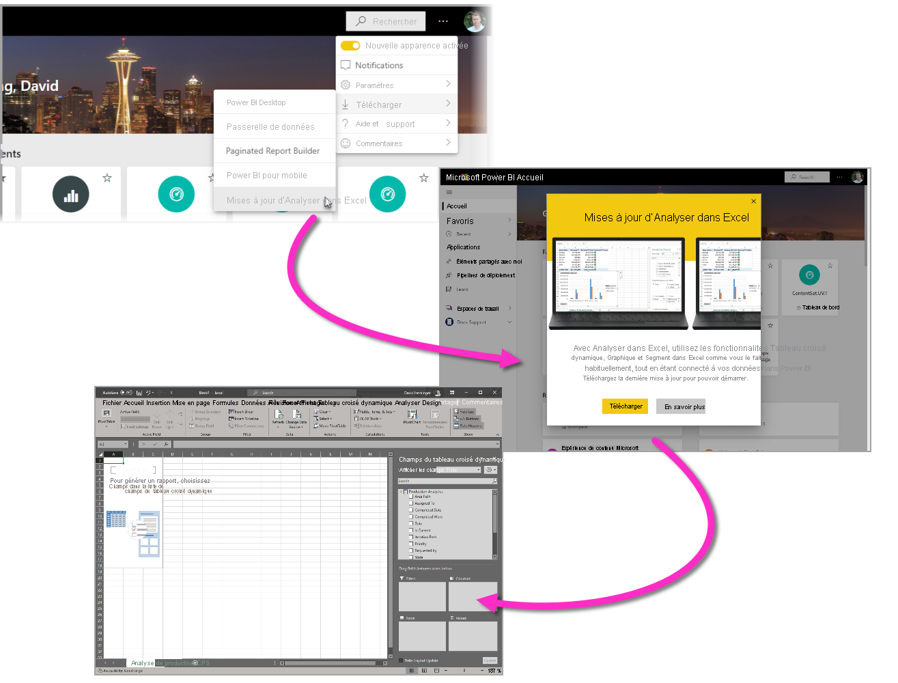
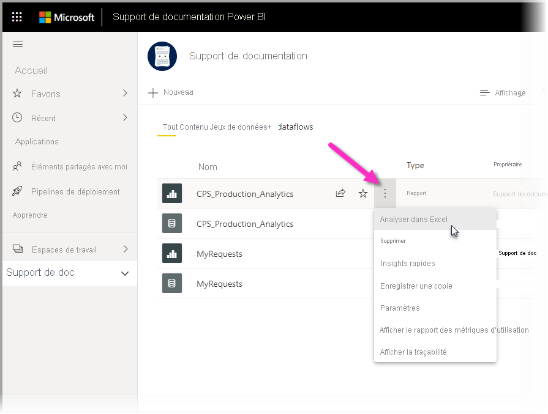
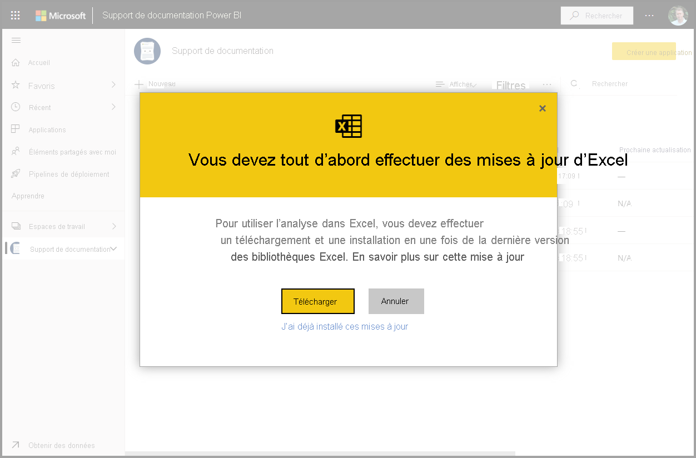
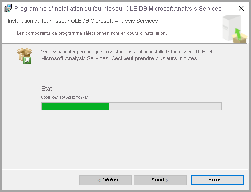
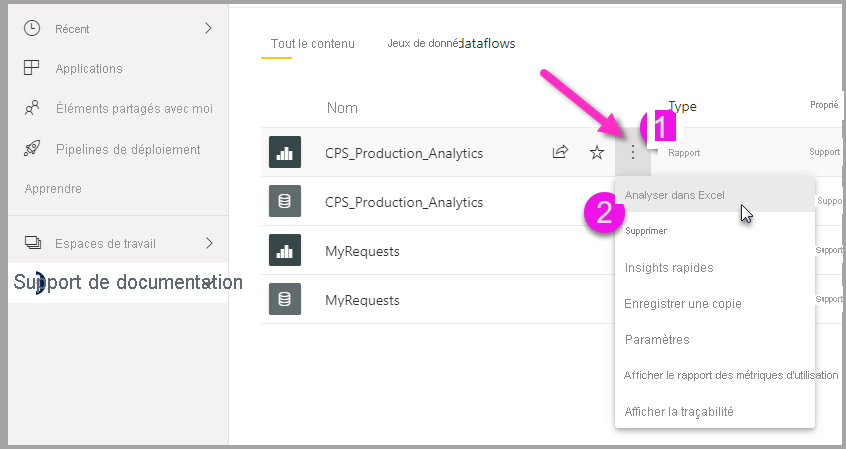
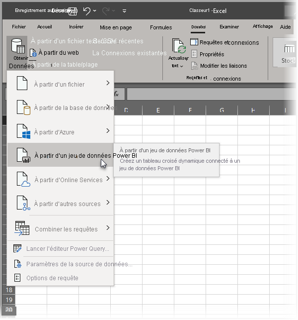

# Analyser dans Excel
Avec **Analyser dans Excel**, vous pouvez placer les jeux de données Power BI dans Excel, puis les afficher et interagir avec eux à l’aide de tableaux croisés dynamiques, de graphiques, de segments et d’autres fonctionnalités Excel. Pour utiliser **Analyser dans Excel** vous devez d’abord télécharger la fonctionnalité à partir de Power BI, l’installer, puis sélectionner un ou plusieurs jeux de données à utiliser dans Excel. 

Cet article explique comment installer et utiliser Analyser dans Excel, décrit ses limitations, puis présente les étapes suivantes. Vous apprendrez les compétences suivantes :

* [Installer Analyser dans Excel](#install-analyze-in-excel)
* [Connexion aux données Power BI](#connect-to-power-bi-data)
* [Utiliser Excel pour analyser les données](#use-excel-to-analyze-the-data)
* [Enregistrement et partage de votre classeur](#saving-and-sharing-your-new-workbook)
* [Configuration requise](#requirements)

Mettons-nous au travail et commençons le processus d’installation.

## Installer Analyser dans Excel

Vous devez installer **Analyser dans Excel** à partir des liens fournis dans le service Power BI. Power BI détecte la version d’Excel que vous avez sur votre ordinateur et télécharge automatiquement la version appropriée (32 ou 64 bits). Le service Power BI s’exécute dans un navigateur. Vous pouvez vous connecter au Power BI à l’aide du lien suivant :

* [Se connecter à Power BI](https://app.powerbi.com)

Une fois que vous êtes connecté et que le service Power BI s’exécute dans votre navigateur, sélectionnez l’élément **Plus d’options** (le « ... ») dans le coin supérieur droit, puis sélectionnez **Télécharger > Mises à jour d'Analyser dans Excel**. Cet élément de menu s’applique aux nouvelles installations des mises à jour d’Analyser dans Excel.

Vous pouvez également naviguer dans le service Power BI vers un jeu de données que vous souhaitez analyser, puis sélectionner l’élément **Plus d’options** pour un jeu de données, un rapport ou un autre élément Power BI. Dans le menu qui s’affiche, sélectionnez l’option **Analyser dans Excel**, comme illustré dans l’image suivante.

Dans les deux cas, Power BI détecte si vous avez installé Analyser dans Excel et vous invite à le télécharger si nécessaire. 

Lorsque vous sélectionnez Télécharger, Power BI détecte la version d’Excel que vous avez installée et télécharge la version appropriée du programme d’installation d’Analyser dans Excel. Vous voyez un état de téléchargement dans la partie inférieure de votre navigateur, ou à l’endroit où votre navigateur affiche la progression du téléchargement. 

Une fois le téléchargement terminé, exécutez le programme d’installation (.msi) pour installer Analyser dans Excel. Le nom du processus d’installation est différent d’Analyser dans Excel : le nom sera **Microsoft Analysis Services OLE DB Provider**, comme indiqué dans l’image suivante, ou un nom similaire.

Une fois l’opération terminée, vous êtes prêt à sélectionner un rapport dans le service Power BI (ou un autre élément de données Power BI, comme un jeu de données), puis à l’analyser dans Excel.

## Connexion aux données Power BI

Dans le service Power BI, accédez au jeu de données ou au rapport que vous souhaitez analyser dans Excel, puis :

1. Sélectionnez le menu **Plus d’options**.

1. Sélectionnez **Analyser dans Excel** à partir des éléments de menu qui s’affichent.

    L’illustration suivante montre la sélection d’un rapport.

    
    
    >[!NOTE]
    >N’oubliez pas que si vous sélectionnez Analyser dans Excel à partir d’un menu Rapport, c’est le jeu de données sous-jacent du rapport qui est intégré à Excel.

    Le service Power BI crée ensuite un fichier Excel du jeu de données conçu (et structuré) pour une utilisation avec **Analyser dans Excel** et commence un processus de téléchargement dans votre navigateur.
    
    

    Le nom de fichier correspond au jeu de données (ou au rapport ou toute autre source de données) à partir duquel il a été dérivé. Ainsi, si le rapport a été nommé *Rapport trimestriel*, le fichier téléchargé est **Rapport trimestriel.xlsx**.

    >[!Note]
    >Analyser dans Excel télécharge maintenant un fichier Excel au lieu d’un fichier ODC. Ceci permet de protéger des données sur les données exportées à partir de Power BI. Le fichier Excel téléchargé hérite de l’étiquette de sensibilité du jeu de données choisi pour l’analyse dans Excel.

3. Lancez le fichier Excel.

    >[!NOTE]
    >La première fois que vous ouvrez le fichier, vous devrez peut-être **activer la modification** puis **activer le contenu**, en fonction de vos paramètres [Mode protégé](https://support.microsoft.com/en-gb/office/what-is-protected-view-d6f09ac7-e6b9-4495-8e43-2bbcdbcb6653?ui=en-us&rs=en-gb&ad=gb) et [Documents approuvés](https://support.microsoft.com/en-us/office/trusted-documents-cf872bd8-47ec-4c02-baa5-1fdba1a11b53).
    >
    >
    >
    >

Quand vous utilisez Excel pour analyser Power BI à l’aide d’un tableau croisé dynamique, Power BI étend l’héritage des étiquettes de confidentialité à Excel. Une étiquette de confidentialité appliquée à un jeu de données Power BI est appliquée automatiquement au fichier Excel lors de la création d’un tableau croisé dynamique dans Excel. 

Si, par la suite, l’étiquette du jeu de données devient plus restrictive, l’étiquette appliquée sur le fichier Excel est automatiquement mise à jour lors de l’actualisation des données dans Excel. Si le jeu de données devient moins restrictif, aucun héritage ni mise à jour d’étiquette ne se produit.

Les étiquettes de confidentialité définies manuellement dans Excel ne sont pas automatiquement remplacées par celles du jeu de données. Si un fichier Excel comporte une étiquette de confidentialité définie manuellement, un conseil de stratégie indique une recommandation de mise à niveau de l’étiquette. 

Pour plus d’informations, consultez [Guide pratique pour appliquer des étiquettes de confidentialité dans Power BI](../admin/service-security-apply-data-sensitivity-labels.md).

## Utiliser Excel pour analyser les données

Une fois que vous avez activé la modification et le contenu, Excel vous présente un **tableau croisé dynamique** vide et une liste de **champs** prêts à être analysés provenant du jeu de données Power BI.

Le fichier Excel comporte une chaîne de connexion MSOLAP, connectée à votre jeu de données dans Power BI. Quand vous analysez ou manipulez les données, Excel interroge le jeu de données de Power BI et renvoie les résultats à Excel. Si le jeu de données est connecté à une source de données active via DirectQuery, Power BI interroge la source de données et renvoie les résultats vers Excel.

Une fois cette connexion aux données dans Power BI établie, vous pouvez créer des tableaux croisés dynamiques et des graphiques, et analyser le jeu de données comme vous le feriez pour un jeu de données local dans Excel.

**Analyser dans Excel** est particulièrement utile pour les jeux de données et les rapports qui se connectent aux sources de données suivantes :

* Bases de données *tabulaire* ou *multidimensionnelle* Analysis Services
* Les fichiers Power BI Desktop ou classeurs Excel avec des modèles de données qui ont des mesures de modèle créées à l’aide de DAX (Data Analysis Expressions).

> [!IMPORTANT]
> Utiliser **Analyser dans Excel** expose toutes les données de niveau de détail à tous les utilisateurs autorisés à accéder au jeu de données.

Il y a quelques éléments à prendre en compte lorsque vous commencez à utiliser Analyser dans Excel, pouvant nécessiter une étape supplémentaire ou deux. Ces éventualités sont décrites dans les sections suivantes. 

### Connectez-vous à Power BI
Même si vous êtes déjà connecté à Power BI dans votre navigateur, vous êtes invité à vous connecter à Power BI avec votre compte Power BI la première fois que vous ouvrez un nouveau fichier Excel dans Excel. Cela permet d’authentifier la connexion entre Excel et Power BI.

### Utilisateurs disposant de plusieurs comptes Power BI
Certains utilisateurs disposent de plusieurs comptes Power BI. Si c’est le cas, vous êtes peut-être connecté à Power BI avec un compte, mais votre autre compte a accès au jeu de données utilisé dans Analyser dans Excel. Dans ce cas, vous risquez d’obtenir une erreur **Interdit** ou un message d’échec de connexion si vous tentez d’accéder à un jeu de données qui est utilisé par l’option Analyser dans Excel.

Si cela se produit, vous aurez l’occasion de vous connecter à nouveau. Vous pourrez alors vous connecter à l’aide du compte Power BI qui a accès au jeu de données utilisé par l’option Analyser dans Excel. Vous pouvez également sélectionner votre nom dans le ruban supérieur d’Excel, ce qui permet d’identifier le compte actuellement connecté. Déconnectez-vous et reconnectez-vous avec l’autre compte.

## Enregistrement et partage de votre nouveau classeur

Vous pouvez **Enregistrer** le classeur Excel que vous créez avec le jeu de données Power BI, tout comme n’importe quel autre classeur. Toutefois, vous ne pouvez pas publier ni importer le classeur dans Power BI, car vous pouvez uniquement publier ou importer dans Power BI les classeurs qui comprennent des tables de données ou des modèles de données. Étant donné que le nouveau classeur est connecté au jeu de données dans Power BI, la publication ou l’importation dans Power BI seraient redondantes.

Une fois que le classeur est enregistré, vous pouvez le partager avec d’autres utilisateurs Power BI dans votre organisation. 

Quand un utilisateur avec lequel vous avez partagé votre classeur ouvre celui-ci pour la première fois, vos tableaux croisés dynamiques et vos données s’affichent tels qu’ils étaient quand vous avez enregistré le classeur pour la dernière fois. Il peut donc ne pas s’agir de la dernière version de vos données. Pour obtenir la dernière version des données, l’utilisateur doit cliquer sur le bouton **Actualiser** du ruban **Données**. Étant donné que le classeur se connecte à un jeu de données dans Power BI, les utilisateurs qui tentent d’actualiser le classeur doivent se connecter à Power BI et installer les mises à jour Excel la première fois qu’ils tentent une mise à jour à l’aide de cette méthode.

Étant donné que les utilisateurs doivent actualiser le jeu de donnée et que l’actualisation n’est pas prise en charge dans Excel Online pour les connexions externes, il est recommandé d’ouvrir le classeur dans une version de bureau d’Excel.

> [!NOTE]
> Les administrateurs de locataires Power BI peuvent utiliser le *portail d’administration Power BI* pour désactiver l’utilisation de la fonction **Analyser dans Excel** avec les jeux de données locaux hébergés dans des bases de données Analysis Services (AS). Lorsque cette option est désactivée, la fonction **Analyser dans Excel** est désactivée pour les bases de données, mais reste disponible pour une utilisation avec d’autres jeux de données.

## Autres façons d’accéder à des jeux de données Power BI à partir d’Excel
Les utilisateurs disposant de SKU Office spécifiques peuvent également se connecter à des jeux de données Power BI à partir d’Excel à l’aide de la fonctionnalité **Obtenir des données** dans Excel. Si votre référence SKU ne prend pas en charge cette fonctionnalité, l’option de menu **Obtenir des données** ne s’affiche pas.

Dans le menu du ruban **Données**, sélectionnez **Obtenir des données > À partir d’un jeu de données Power BI** comme indiqué dans l’image suivante.

Un volet s’affiche, dans lequel vous pouvez parcourir les jeux de données auxquels vous avez accès, voir si des jeux de données sont certifiés ou promus, et déterminer si des étiquettes de protection des données ont été appliquées à ces jeux de données. 

Pour plus d’informations sur l’obtention de données dans Excel, consultez [Créer un tableau croisé dynamique à partir de jeux de données Power BI](https://support.office.com/article/31444a04-9c38-4dd7-9a45-22848c666884) dans la documentation Excel.

Vous pouvez également accéder aux **tables recommandées** dans Excel, dans la galerie **Types de données**. Pour en savoir plus sur les tables par défaut et savoir comment y accéder, consultez [Accéder aux tables recommandées Power BI dans Excel (préversion)](service-excel-featured-tables.md).

## Configuration requise
Il existe certaines conditions à l’utilisation de l’option **Analyser dans Excel** :

* **Analyser dans Excel** est compatible avec Microsoft Excel 2010 SP1 et versions ultérieures.

* Les tableaux croisés dynamiques d’Excel ne prennent pas en charge l’agrégation des champs numériques en mode glisser-déposer. Des *mesures doivent être prédéfinies* pour votre jeu de données dans Power BI. Apprenez-en plus sur la [création de mesures](../transform-model/desktop-measures.md).
* Certaines organisations appliquent des règles de stratégie de groupe qui empêchent l’installation des mises à jour requises relatives à l’option **Analyser dans Excel**. Si vous ne parvenez pas à installer les mises à jour, contactez votre administrateur.
* **Analyser dans Excel** nécessite que le jeu de données soit dans Power BI Premium ou que l’utilisateur dispose d’une licence Power BI Pro. Pour plus d’informations sur les différences de fonctionnalités entre les différents types de licences, consultez la section _Comparaison des fonctionnalités de Power BI_ de la rubrique [Prix de Power BI](https://powerbi.microsoft.com/pricing/).
* Les utilisateurs peuvent se connecter aux jeux de données par le biais de la fonctionnalité Analyser dans Excel s’ils disposent d’une autorisation d’accès au jeu de données sous-jacent.  Un utilisateur peut obtenir cette autorisation de plusieurs façons, par exemple en ayant le rôle de membre de l’espace de travail contenant le jeu de données, en bénéficiant du partage d’un rapport ou tableau de bord qui utilise le jeu de données ou en ayant l’autorisation de génération pour le jeu de données dans un espace de travail ou une application qui contient le jeu de données. Découvrez plus en détail l’[autorisation de génération](../connect-data/service-datasets-build-permissions.md) pour les jeux de données.
* Les utilisateurs invités ne peuvent pas utiliser **Analyser dans Excel** pour les jeux de données envoyés à partir (provenant) d’un autre locataire. 
* La fonctionnalité **Analyser dans Excel** est une fonctionnalité du service Power BI et n’est pas disponible dans Power BI Report Server et Power BI Embedded. 
* **Analyser dans Excel** est pris en charge uniquement sur les ordinateurs exécutant Microsoft Windows.

Pour les utilisateurs qui doivent désinstaller la fonctionnalité **Analyser dans Excel**, vous pouvez le faire à l’aide des paramètres système **Ajouter ou supprimer des programmes** sur votre ordinateur Windows.

## Résolution des problèmes
Il peut arriver que vous obteniez un résultat inattendu lors de l’utilisation de la fonctionnalité Analyser dans Excel, ou que la fonctionnalité ne fonctionne pas comme prévu. [Cette page fournit des solutions pour les problèmes courants lors de l’utilisation de la fonctionnalité Analyser dans Excel](desktop-troubleshooting-analyze-in-excel.md).

## Étapes suivantes

Les articles suivants pourraient également vous intéresser :

* [Use cross-report drillthrough in Power BI Desktop](../create-reports/desktop-cross-report-drill-through.md) (Utiliser une extraction interrapport dans Power BI Desktop)
* [Utilisation de segments Power BI Desktop](../visuals/power-bi-visualization-slicers.md)
* [Résolution des problèmes d’Analyser dans Excel](desktop-troubleshooting-analyze-in-excel.md)
* [Accéder aux tables recommandées Power BI dans Excel (préversion)](service-excel-featured-tables.md).
* [Guide pratique pour appliquer des étiquettes de sensibilité dans Power BI](../admin/service-security-apply-data-sensitivity-labels.md)
