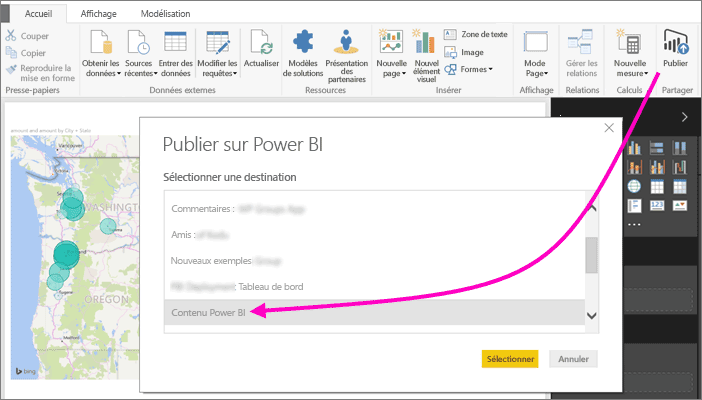
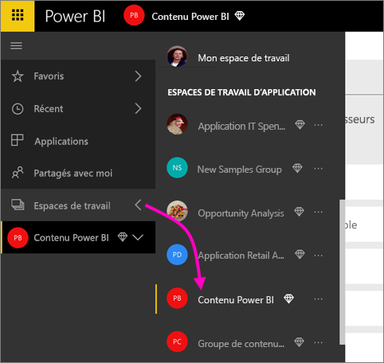
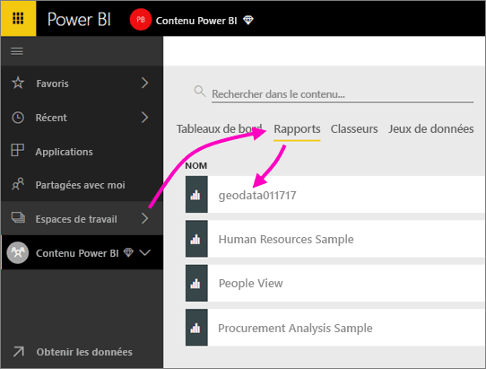
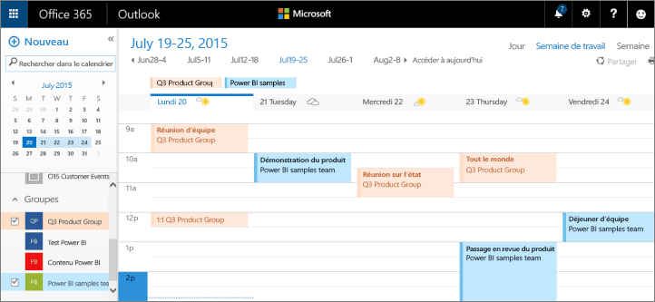

# Collaborer dans un espace de travail classique
Les espaces de travail Power BI sont d’excellents environnements pour collaborer avec vos collègues sur des tableaux de bord, des rapports et des jeux de données afin de créer des *applications*. Cet article concerne les espaces de travail *classiques* originaux.  

La collaboration ne s’arrête pas aux espaces de travail dans Power BI. Quand vous créez un des espaces de travail classiques dans Power BI, vous créez automatiquement un groupe Office 365 en arrière-plan. Office 365 offre d’autres services de groupe, comme le partage de fichiers sur OneDrive Entreprise, les conversations dans Exchange, le calendrier partagé, les tâches, etc. En savoir plus sur les[groupes dans Office 365](https://support.office.com/article/Create-a-group-in-Office-365-7124dc4c-1de9-40d4-b096-e8add19209e9)

> [!NOTE]
> L’expérience des nouveaux espaces de travail change la relation entre les espaces de travail Power BI et les groupes Office 365. Quand vous créez un des nouveaux espaces de travail classiques dans Power BI, vous ne créez plus automatiquement un groupe Office 365 en arrière-plan. Pour plus d’informations, consultez [Créer les nouveaux espaces de travail dans Power BI](service-create-the-new-workspaces.md).

Vous devez être titulaire d’une licence [Power BI Pro](../fundamentals/service-features-license-type.md) pour créer un espace de travail.

## Collaborer sur des fichiers Power BI Desktop dans un espace de travail
Après avoir créé un fichier Power BI Desktop, vous pouvez le publier dans un espace de travail, afin que tous les membres de l’espace de travail puisent collaborer sur ce fichier.

1. Dans Power BI Desktop, sélectionnez **Publier** dans le ruban **Accueil**, puis sélectionnez l’espace de travail dans la zone **Sélectionner une destination**.
   
    
2. Dans le service Power BI, sélectionnez la flèche à côté d’**Espaces de travail**, puis sélectionnez l’espace de travail.
   
    
3. Sélectionnez l’onglet **Rapports**, puis choisissez votre rapport.
   
    
   
    Celui-ci est semblable à tout autre rapport dans Power BI. Vous et d’autres utilisateurs de l’espace de travail pouvez modifier le rapport et enregistrer des vignettes dans le tableau de bord de votre choix.

## Collaborer dans Office 365
La collaboration dans Office 365 débute dans l’espace de travail classique dans Power BI.

1. Dans le service Power BI, sélectionnez la flèche à côté d’**Espaces de travail**, puis **Plus d’options** (...) en regard du nom de votre espace de travail. 
   
   
2. Dans ce menu, vous pouvez collaborer avec votre groupe de plusieurs façons : 
   
   * Avoir une [conversation de groupe dans Office 365](#have-a-group-conversation-in-office-365).
   * [Planifier un événement](#schedule-an-event-on-the-group-workspace-calendar) dans le calendrier de l’espace de travail de groupe.
   
   Quand vous accédez pour la première fois à votre espace de travail de groupe dans Office 365, la procédure peut prendre un certain temps. Patientez 15 à 30 minutes, puis actualisez votre navigateur.

## Avoir une conversation de groupe dans Office 365
1. Sélectionnez **Plus d’options** (...) en regard du nom de votre espace de travail \> **Conversations**. 
   
    
   
   Le site d’e-mail et de conversation de votre espace de travail de groupe s’ouvre dans Outlook pour Office 365.
   
   
2. En savoir plus sur les [conversations de groupe dans Outlook pour Office 365](https://support.office.com/Article/Have-a-group-conversation-a0482e24-a769-4e39-a5ba-a7c56e828b22).

## Planifier un événement dans le calendrier de l’espace de travail de groupe
1. Sélectionnez **Plus d’options** (...) en regard du nom d’espace de travail \> **Calendrier**. 
   
   
   
   Le calendrier de votre espace de travail de groupe s’ouvre dans Outlook pour Office 365.
   
   
2. En savoir plus sur les [calendriers de groupe dans Outlook pour Office 365](https://support.office.com/Article/Add-edit-and-subscribe-to-group-events-0cf1ad68-1034-4306-b367-d75e9818376a).

## Gérer un espace de travail classique
Si vous êtes propriétaire ou administrateur d’un espace de travail, vous pouvez également ajouter ou supprimer des membres. Pour en savoir plus, consultez [Gérer votre espace de travail dans Power BI](service-manage-app-workspace-in-power-bi-and-office-365.md).

## Étapes suivantes
* [Publier des applications dans Power BI](service-create-distribute-apps.md).
* D’autres questions ? [Posez vos questions à la Communauté Power BI](https://community.powerbi.com/).
* Vous souhaitez formuler des commentaires ? Consultez la page des [suggestions concernant Power BI](https://ideas.powerbi.com/forums/265200-power-bi).
