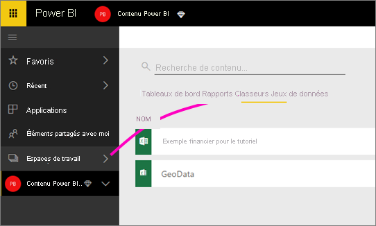

# Se connecter à des fichiers stockés dans OneDrive pour votre espace de travail Power BI
Lorsque vous [créez un espace de travail dans Power BI](service-create-workspaces.md), vous créez également un groupe Microsoft 365, avec un compte OneDrive Entreprise associé. Cet article explique comment stocker et mettre à jour vos fichiers Excel, CSV et Power BI Desktop sur OneDrive Entreprise. Ces mises à jour sont alors répercutées automatiquement dans les rapports et tableaux de bord Power BI basés sur les fichiers.

> [!NOTE]
> L’expérience des nouveaux espaces de travail change la relation entre les espaces de travail Power BI et les groupes Microsoft 365. Vous ne créez plus automatiquement un groupe Microsoft 365 chaque fois que vous créez un nouvel espace de travail. Pour plus d’informations, consultez [Création des nouveaux espaces de travail](service-create-the-new-workspaces.md)

L’ajout de fichiers à votre espace de travail est un processus en deux étapes : 

1. Tout d’abord, [chargez des fichiers sur OneDrive Entreprise](#1-upload-files-to-the-onedrive-for-business-for-your-workspace) pour votre espace de travail.
2. Ensuite, [connectez-vous à ces fichiers à partir de Power BI](#2-import-excel-files-as-datasets-or-as-excel-online-workbooks).

> [!NOTE]
> Les espaces de travail sont disponibles seulement avec une [licence Power BI Pro](../fundamentals/service-features-license-type.md).
> 

## 1 Charger des fichiers sur OneDrive Entreprise pour votre espace de travail
1. Dans le service Power BI, sélectionnez la flèche située en regard de Espaces de travail, puis sélectionnez les points de suspension ( **…** ) en regard du nom de votre espace de travail. 
   
   
2. Sélectionnez **Fichiers** pour ouvrir OneDrive Entreprise pour votre espace de travail sur Microsoft 365.
   
   > [!NOTE]
   > Si vous ne voyez pas **Fichiers** dans le menu de l’espace de travail, sélectionnez **Membres** pour ouvrir OneDrive Entreprise pour votre espace de travail. Sélectionnez ici **Fichiers**. Microsoft 365 définit un emplacement de stockage OneDrive pour les fichiers de l’espace de travail de groupe de votre application. Ce processus peut prendre un certain temps.
   > 
   > 
3. Ici, vous pouvez charger des fichiers sur OneDrive Entreprise pour votre espace de travail. Sélectionnez **Charger** et accédez à vos fichiers.
   
   

## 2 Importer des classeurs Excel en que jeux de données ou classeurs Excel Online
Maintenant que vos fichiers se trouvent sur OneDrive Entreprise pour votre espace de travail, vous avez deux possibilités. Vous pouvez : 

* [Importer les données du classeur Excel en tant que jeu de données](../connect-data/service-get-data-from-files.md). Puis vous en servir pour générer des rapports et des tableaux de bord, que vous pouvez ensuite afficher dans un navigateur web et sur des appareils mobiles.
* [Vous connecter à des classeurs Excel complets dans Power BI](../connect-data/service-excel-workbook-files.md) et les afficher exactement tels qu’ils apparaissent dans Excel Online.

### Importer ou se connecter aux fichiers dans l’espace de travail
1. Dans Power BI, basculez vers l’espace de travail de sorte que le nom de celui-ci apparaisse dans l’angle supérieur gauche. 
2. Sélectionnez **Obtenir des données** en bas du volet de navigation. 
   
   
3. Dans la zone **Fichiers** , sélectionnez **Obtenir**.
   
   
4. Sélectionnez **OneDrive** - *Nom de l’espace de travail*.
   
    
5. Sélectionnez le fichier souhaité > **Se connecter**.
   
    À ce stade, vous décidez s’il faut [importer les données du classeur Excel](../connect-data/service-get-data-from-files.md) ou [se connecter aux classeurs Excel tout entiers](../connect-data/service-excel-workbook-files.md).
6. Sélectionnez **Importer** ou **Se connecter**.
   
    
7. Si vous sélectionnez **Importer**, le classeur apparaît sous l’onglet **Jeux de données**. 
   
    
   
    Si vous sélectionnez **Se connecter**, le classeur apparaît sous l’onglet **Classeurs**.
   
    

## Étapes suivantes
* [Créer des applications et des espaces de travail dans Power BI](../collaborate-share/service-create-distribute-apps.md)
* [Importer des données de classeurs Excel](../connect-data/service-get-data-from-files.md)
* [Se connecter à des classeurs Excel entiers](../connect-data/service-excel-workbook-files.md
* D’autres questions ? [Essayez la communauté Power BI](https://community.powerbi.com/)
* Vous souhaitez formuler des commentaires ? Consultez la page des [suggestions concernant Power BI](https://ideas.powerbi.com/forums/265200-power-bi).
