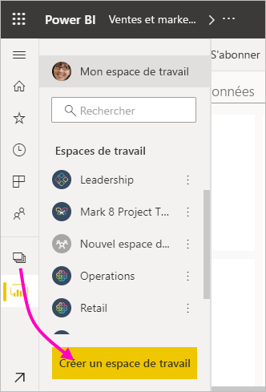
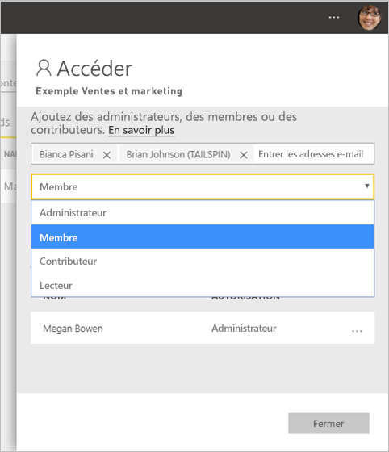
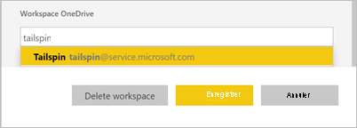
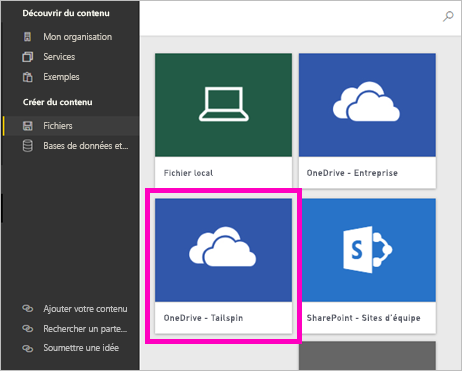

# Créer les nouveaux espaces de travail dans Power BI

Cet article explique comment créer un des *nouveaux espaces de travail* à la place d’un espace de travail *classique*. Les deux types d’espaces de travail sont des emplacements où collaborer avec des collègues. Dans ceux-ci, vous créez des regroupements de tableaux de bord, de rapports et de rapports paginés. Si vous le souhaitez, vous pouvez également regrouper cette collection dans une *application* et la distribuer à un public plus large. Pour plus d’informations, consultez l’article sur les [nouveaux espaces de travail](service-new-workspaces.md).

Prêt à migrer votre espace de travail classique ? Consultez [Mettre à niveau les espaces de travail classiques vers de nouveaux espaces de travail dans Power BI](service-upgrade-workspaces.md) pour plus d’informations.

> [!NOTE]
> Pour appliquer la sécurité au niveau des lignes (RLS) aux utilisateurs de Power BI Pro qui parcourent du contenu dans un espace de travail, attribuez le rôle Lecteur à ces utilisateurs. Consultez [Rôles dans les nouveaux espaces de travail](service-new-workspaces.md#roles-in-the-new-workspaces) pour une explication des différents rôles.

## Créer un nouvel espace de travail

1. Commencez par créer l’espace de travail. Sélectionnez **Espaces de travail** > **Créer un espace de travail**.
   
     

2. Vous créez automatiquement un espace de travail mis à niveau, sauf si vous choisissez **Revenir au type classique**.
   
     
     
     Si vous sélectionnez **Revenir au type classique**, vous créez un [espace de travail classique](service-create-workspaces.md) basé sur un groupe Microsoft 365.

2. Donnez un nom unique à l’espace de travail. Si le nom n’est pas disponible, modifiez-le de façon à obtenir un nom unique.
   
     L’application que vous créez à partir de l’espace de travail aura le même nom et la même icône que l’espace de travail.
   
1. Voici quelques éléments facultatifs que vous pouvez définir pour votre espace de travail :

    - Téléchargez une **image d’espace de travail**. Les fichiers peuvent être au format .png ou .jpg. La taille du fichier doit être inférieure à 45 ko. 
    - [Spécifiez un espace de travail OneDrive](#set-a-workspace-onedrive) pour utiliser un emplacement de stockage de fichiers de groupe Microsoft 365.    
    - [Ajoutez une liste de contacts](#create-a-contact-list). Par défaut, les administrateurs de l’espace de travail sont les contacts. 
    - [Autoriser les contributeurs à mettre à jour l’application](#allow-contributors-to-update-the-app) pour l’espace de travail
    - Pour affecter l’espace de travail à une **Capacité dédiée**, sous l’onglet **Premium**, sélectionnez **Capacité dédiée**.

        

1. Sélectionnez **Enregistrer**.

    Power BI crée l’espace de travail et l’ouvre. Vous le voyez dans la liste des espaces de travail dont vous êtes membre. 

## Accorder l’accès à votre espace de travail

Toute personne disposant d’un rôle d’administrateur dans un espace de travail peut accorder à d’autres utilisateurs l’accès à l’espace de travail en les ajoutant aux différents rôles. Les créateurs d’espace de travail sont automatiquement des administrateurs. Pour obtenir une explication des rôles, consultez [Rôles dans les nouveaux espaces de travail](service-new-workspaces.md#roles-in-the-new-workspaces).

1. Dans la liste de contenu de l’espace de travail, dans la mesure où vous êtes administrateur, vous voyez **Accéder**.

    

1. Ajoutez des groupes de sécurité, des listes de distribution, des groupes Microsoft 365 ou des personnes individuelles à ces espaces de travail en tant que lecteurs, membres, contributeurs ou administrateurs. 

    

9. Sélectionnez **Ajouter** > **Fermer**.

## Définir un espace de travail OneDrive

La fonctionnalité OneDrive de l’espace de travail vous permet de configurer un groupe Microsoft 365 dont le stockage de fichiers de la bibliothèque de documents SharePoint est accessible aux utilisateurs de l’espace de travail. Vous devez d’abord créer le groupe en dehors de Power BI. 

Power BI ne synchronise pas les autorisations des utilisateurs ou des groupes qui sont configurés pour avoir accès à l’espace de travail avec l’appartenance au groupe Microsoft 365. La meilleure pratique consiste à attribuer au même groupe Microsoft 365, dont vous configurez le stockage de fichiers dans ce groupe Microsoft 365, l’[accès à l’espace de travail](#give-access-to-your-workspace). Gérez ensuite l’accès à l’espace de travail en gérant l’appartenance au groupe Microsoft 365. 

1. Accédez au nouveau paramètre **OneDrive de l’espace de travail** de l’une des deux manières suivantes :

    Dans le volet **Créer un espace de travail**, lors de sa création.

    Dans le volet de navigation, sélectionnez la flèche à côté de **Espaces de travail**, sélectionnez **Plus d’options** (...) en regard du nom de l’espace de travail > **Paramètres de l’espace de travail**. Le volet **Paramètres** s’ouvre.

    

2. Sous **Avancé** > **OneDrive de l’espace de travail**, tapez le nom du groupe Microsoft 365 que vous avez créé. Tapez simplement le nom, et non l’URL. Power BI récupère automatiquement le OneDrive du groupe.

    

3. Sélectionnez **Enregistrer**.

### Accéder à l’emplacement OneDrive de l’espace de travail

Après avoir configuré l'emplacement OneDrive, vous y accédez de la même manière que vous accédez aux autres sources de données du service Power BI.

1. Dans le volet de navigation, sélectionnez **Obtenir des données** puis, dans la zone **Fichiers**, sélectionnez **Obtenir**.

    

1.  L'entrée **OneDrive - Entreprise** est votre propre OneDrive Entreprise personnel. Le deuxième OneDrive est celui que vous avez ajouté.

    

## Créer une liste de contacts

Vous pouvez spécifier les utilisateurs qui reçoivent une notification concernant les problèmes qui se produisent dans l’espace de travail. Par défaut, tout utilisateur ou groupe spécifié comme administrateur de l’espace de travail est averti, mais vous pouvez personnaliser la *liste de contacts*. Les utilisateurs ou groupes de la liste des contacts apparaissent dans l’interface utilisateur (IU) pour aider les utilisateurs à obtenir de l’aide concernant l’espace de travail.

1. Accédez au nouveau paramètre **Liste de contacts** de l’une des deux manières suivantes :

    Dans le volet **Créer un espace de travail**, lors de sa création.

    Dans le volet de navigation, sélectionnez la flèche à côté de **Espaces de travail**, sélectionnez **Plus d’options** (...) en regard du nom de l’espace de travail > **Paramètres de l’espace de travail**. Le volet **Paramètres** s’ouvre.

    

2. Sous **Avancé**, **Liste de contacts**, acceptez la valeur par défaut, **Administrateurs de l'espace de travail**, ou ajoutez votre propre liste d’**Utilisateurs ou groupes spécifiques**. 

    

3. Sélectionnez **Enregistrer**.

## Autoriser les contributeurs à mettre à jour l’application

Le paramètre **Autoriser les contributeurs à mettre à jour l’application pour cet espace de travail** permet aux administrateurs de l’espace de travail de déléguer aux utilisateurs du rôle Collaborateur la possibilité de mettre à jour l’application pour l’espace de travail. Par défaut, seuls les administrateurs et les membres de l’espace de travail peuvent publier et mettre à jour l’application pour l’espace de travail. 

1. Pour accéder à ce paramètre, dans le volet de navigation, sélectionnez la flèche à côté de **Espaces de travail**, sélectionnez **Plus d’options** (...) en regard du nom de l’espace de travail > **Paramètres de l’espace de travail**. Le volet **Paramètres** s’ouvre.

    

2. Sous **Avancé**, développez **Paramètres de sécurité**. Sélectionnez **Autoriser les contributeurs à mettre à jour l’application pour cet espace de travail**. 

Quand ce paramètre est activé, les collaborateurs ont la possibilité d’effectuer les actions suivantes :
* Mettre à jour des métadonnées de l’application (par exemple, le nom, l’icône, la description, le site de support et la couleur)
* Ajouter ou supprimer des éléments inclus dans l’application (par exemple, des rapports ou des jeux de données)
* Modifier la navigation dans l’application ou l’élément sur lequel l’application s’ouvre par défaut

Toutefois, les contributeurs ne peuvent pas :
* Publier l’application pour la première fois
* Modifier les titulaires d’autorisations d’accès à l’application

## Applications dans les nouveaux espaces de travail

Vous pouvez créer et consommer des *applications*, au lieu de packs de contenu, pour les nouvelles expériences d'espace de travail. Les applications sont des collections de tableaux de bord, de rapports et de jeux de données qui se connectent à des services tiers et à des données organisationnelles. Les applications facilitent l’extraction de données à partir des services tels que Microsoft Dynamics CRM, Salesforce et Google Analytics.

Dans la nouvelle expérience d’espace de travail, vous ne pouvez pas créer ni consommer des packs de contenu d’organisation. Demandez à vos équipes internes de fournir des applications pour tous les packs de contenu que vous utilisez actuellement. 

### Distribuer une application

Si vous voulez distribuer du contenu officiel à un large public au sein de votre organisation, vous pouvez publier une *application* à partir de votre espace de travail.  Quand votre contenu est prêt, vous choisissez les tableaux de bord et les rapports que vous voulez publier, puis vous les publiez en tant qu’application. Vous pouvez créer une application à partir de chaque espace de travail.

Découvrez comment [publier une application à partir des nouveaux espaces de travail](service-create-distribute-apps.md).

## Étapes suivantes
* Découvrir l’[organisation du travail dans la nouvelle expérience d’espace de travail dans Power BI](service-new-workspaces.md)
* [Créer des espaces de travail classiques](service-create-workspaces.md)
* [Publier une application à partir des nouveaux espaces de travail dans Power BI](service-create-distribute-apps.md)
* Vous avez des questions ? [Essayez d’interroger la communauté Power BI](https://community.powerbi.com/)
