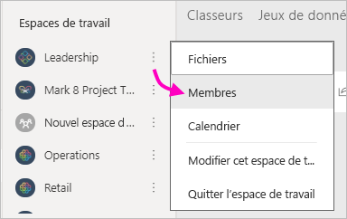
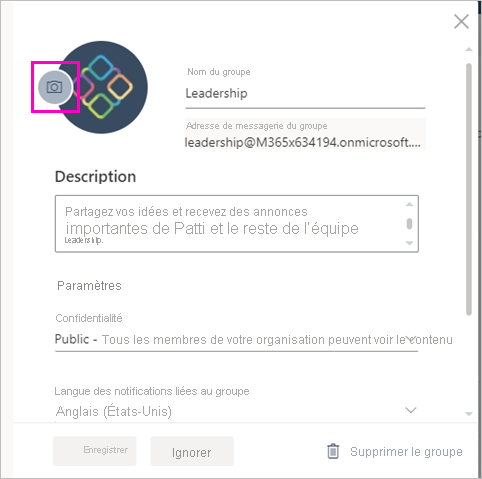

# Créer des espaces de travail classiques dans Power BI

Dans Power BI, vous pouvez créer des *espaces de travail*, qui sont des endroits où collaborer avec des collègues pour créer et affiner des collections de tableaux de bord, de rapports et de rapports paginés. Vous pouvez ensuite les regrouper en *applications* que vous pouvez distribuer dans toute votre organisation, ou seulement à des personnes ou des groupes spécifiques. 

**Le saviez-vous ?** Power BI offre une nouvelle expérience de l’espace de travail, qui est désormais l’expérience par défaut. Consultez [Organiser le travail dans les nouveaux espaces de travail ](service-new-workspaces.md) pour plus d’informations sur les nouveaux espaces de travail. Prêt à migrer votre espace de travail classique ? Consultez [Mettre à niveau les espaces de travail classiques vers de nouveaux espaces de travail dans Power BI](service-upgrade-workspaces.md) pour plus d’informations.

Quand vous créez un espace de travail classique, vous créez un groupe Office 365 associé sous-jacent. Toute l’administration des espaces de travail se fait dans Office 365. Vous pouvez ajouter des collègues à ces espaces de travail en tant que membres ou administrateurs. Dans l’espace de travail, vous pouvez tous collaborer sur des tableaux de bord, des rapports et d’autres articles que vous prévoyez de publier pour un public plus large. Toutes les personnes que vous ajoutez à un espace de travail doivent avoir une licence Power BI Pro. 

## Vidéo : Applications et espaces de travail
<iframe width="640" height="360" src="https://www.youtube.com/embed/Ey5pyrr7Lk8?showinfo=0" frameborder="0" allowfullscreen></iframe>

## Créer un espace de travail classique basé sur un groupe Office 365

Quand vous créez un espace de travail, il est basé sur un groupe Office 365.

[!INCLUDE [powerbi-service-create-app-workspace](../includes/powerbi-service-create-app-workspace.md)]

Quand vous le créez, vous devez attendre environ une heure pour qu’il se propage à Office 365. 

### Ajouter une image à votre espace de travail Office 365 (facultatif)
Par défaut, Power BI crée un petit cercle de couleur pour votre application, contenant les initiales de celle-ci. Vous pouvez le personnaliser avec une image. Pour ajouter une image, vous avez besoin d’une licence Exchange Online.

1. Sélectionnez **Espaces de travail**, sélectionnez **Plus d’options** (...) en regard du nom de l’espace de travail, puis choisissez **Membres**. 
   
     
   
    Le compte Office 365 Outlook pour l’espace de travail s’ouvre dans une nouvelle fenêtre de navigateur.
2. Sélectionnez le crayon **Modifier**.
   
     
3. Sélectionnez l’image d’appareil photo et recherchez l’image que vous souhaitez utiliser.
   
     

     Les images peuvent être des fichiers .png, .jpg ou .bmp. Leur taille de fichier peut être importante, jusqu’à 3 Mo. 

4. Sélectionnez **OK**, puis **Enregistrer**.
   
    L’image remplace le cercle de couleur dans la fenêtre Office 365 Outlook. 
   
     
   
    Après quelques minutes, l’image apparaît également dans l’application dans Power BI.

## Ajouter du contenu à votre espace de travail

Une fois que vous avez créé un espace de travail, vous pouvez y ajouter du contenu. Cela s’apparente à l’ajout de contenu à Mon espace de travail, sauf que les autres personnes au sein de l’espace de travail peuvent également en voir le contenu et travailler dessus. Une différence importante est que, lorsque vous avez terminé, vous pouvez publier le contenu en tant qu’application. Quand vous visualisez du contenu de la liste de contenu dans un espace de travail, le nom de l’espace de travail apparaît en tant que propriétaire.

### Se connecter à des services tiers dans des espaces de travail

Des applications sont fournies pour tous les services tiers pris en charge par Power BI, ce qui facilite l’obtention de données auprès des services que vous utilisez, comme Microsoft Dynamics CRM, Salesforce ou Google Analytics. Vous pouvez publier des applications d’organisation pour donner aux utilisateurs les données dont ils ont besoin.

Dans les espaces de travail actuels, vous pouvez également vous connecter avec des packs de contenu d’organisation et des packs de contenu tiers, comme Microsoft Dynamics CRM, Salesforce ou Google Analytics. Envisagez de migrer vos packs de contenu d’organisation vers des applications.

## Distribuer une application

Si vous voulez distribuer du contenu officiel à un large public au sein de votre organisation, vous pouvez publier une application à partir de votre espace de travail.  Quand le contenu est prêt, vous choisissez les tableaux de bord et les rapports que vous voulez publier, puis vous les publiez en tant qu’*application*. Vous pouvez créer une application à partir de chaque espace de travail.

La liste Applications dans le volet de navigation présente toutes les applications que vous avez installées. Vos collègues peuvent obtenir votre application de différentes manières. 
- Ils peuvent rechercher et installer votre application à partir de Microsoft AppSource.
- Vous pouvez leur envoyer un lien direct. 
- Vous pouvez l’installer automatiquement dans les comptes Power BI de vos collègues si l’administrateur Power BI vous y autorise. 

Les utilisateurs voient automatiquement le contenu d’application mis à jour après la publication d’une mise à jour depuis votre espace de travail. Vous pouvez contrôler la fréquence à laquelle les données sont actualisées en définissant la planification de l’actualisation dans les jeux de données utilisés par le contenu de l’application dans votre espace de travail. Pour plus d’informations, consultez [Publier une application à partir des nouveaux espaces de travail dans Power BI](service-create-distribute-apps.md).

## Forum aux questions sur les applications Power BI classiques

### En quoi les applications diffèrent-elles des packs de contenu d’organisation ?
Les applications sont l’évolution des packs de contenu d’organisation. Si vous avez déjà des packs de contenu d’organisation, ceux-ci continuent à fonctionner parallèlement aux applications. Les applications et les packs de contenu présentent quelques différences majeures. 

* Quand des utilisateurs professionnels installent un pack de contenu, celui-ci perd son identité groupée : il s’agit simplement d’une liste de tableaux de bord et de rapports entremêlés avec d’autres tableaux de bord et rapports. En revanche, les applications conservent leur regroupement et leur identité même après installation. Les utilisateurs peuvent ainsi continuer à y accéder facilement au fil du temps.
* Vous pouvez créer plusieurs packs de contenu à partir de tout espace de travail, mais une application a une relation un-à-un avec son espace de travail. 
* Étant donné que nous prévoyons de déconseiller progressivement les packs de contenu d’organisation, nous vous recommandons de commencer à créer des applications dès à présent.  
* Avec la nouvelle expérience des espaces de travail, nous effectuons les premières étapes vers la dépréciation des packs de contenu d’organisation. Vous ne pouvez pas les consommer ou les créer dans les espaces de travail.

Consultez les [différences entre les espaces de travail nouveaux et classiques](service-new-workspaces.md#new-and-classic-workspace-differences) pour comparer les deux. 

## Étapes suivantes
* [Installer et utiliser des applications dans Power BI](service-create-distribute-apps.md)
- [Créer de nouveaux espaces de travail](service-create-the-new-workspaces.md)
* Vous avez des questions ? [Essayez d’interroger la communauté Power BI](https://community.powerbi.com/)
