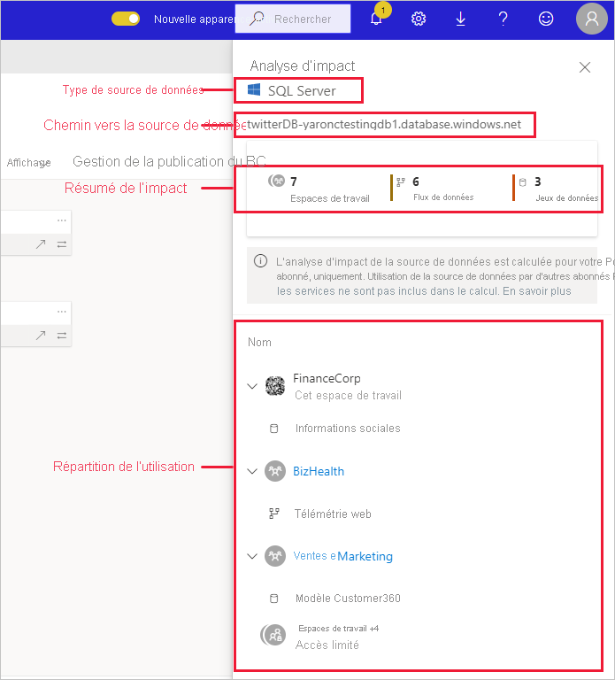
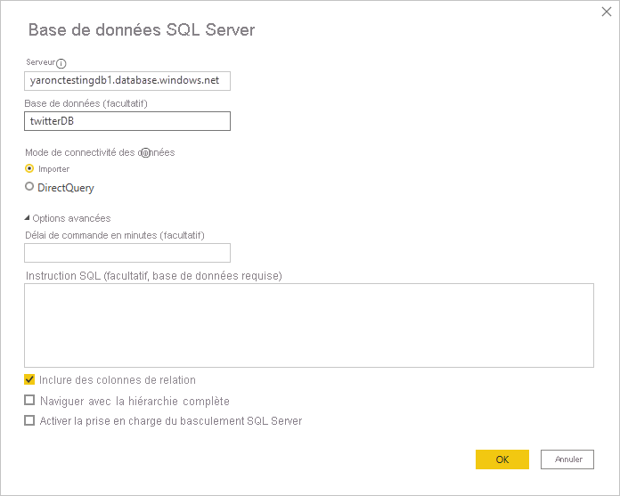
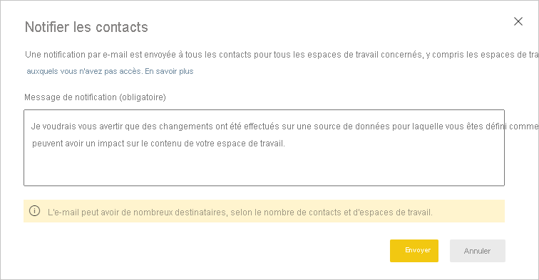

# Analyse d’impact de la source de données

L’analyse d’impact de la source de données vous permet de voir où votre source de données est utilisée dans votre organisation. Cela peut être utile quand vous souhaitez avoir une idée des personnes concernées par la mise hors connexion temporaire ou définitive de la source de données. Elle indique combien d’espaces de travail, dataflows et jeux de données utilisent la source de données et offre une navigation facile des espaces de travail où se trouvent les dataflows et les jeux de données affectés pour vous permettre d’approfondir vos recherches.

L’analyse d’impact de la source de données peut également vous aider à repérer une duplication de données dans le locataire, par exemple quand plusieurs utilisateurs créent des modèles similaires à partir de la même source de données. En vous aidant à découvrir de tels jeux de données et dataflows redondants, l’analyse d’impact de la source de données a pour objectif d’avoir « une seule source de vérité ».

## Effectuer une analyse d’impact de la source de données

Pour effectuer une analyse d’impact de la source de données :

1. Accédez à l’espace de travail qui contient la source de données qui vous intéresse et ouvrez la [vue de traçabilité](service-data-lineage.md).
1. Recherchez la fiche de la source de données, puis cliquez sur l’icône d’analyse d’impact.

    
 
Le panneau latéral Analyse d’impact s’ouvre.

 
* **Type de source de données** : indique le type de source de données
* **Chemin de la source de données** : chemin de la source de données, tel que défini dans Power BI Desktop. Par exemple, dans l’image ci-dessus, le chemin de la source de données de la base de données SQL Server est la chaîne de connexion « twitterDB-yaronctestingdb1.database.windows.net », comme défini dans Power BI Desktop (voir ci-dessous). Il se compose du nom de base de données « twitterDB » et du nom de serveur « yaronctestingdb1.database.windows.net ».

    
 
* **Résumé de l’impact** : affiche le nombre d’espaces de travail, de dataflows et de jeux de données potentiellement impactés. Ce nombre comprend les espaces de travail auxquels vous n’avez pas accès.
* **Répartition de l’utilisation** : affiche, pour chaque espace de travail, les noms des dataflows et jeux de données impactés. Pour approfondir l’exploration de l’impact sur un espace de travail spécifique, cliquez sur le nom de l’espace de travail afin de l’ouvrir. Une fois dans l’espace de travail affecté, utilisez l’[analyse d’impact des jeux de données](service-dataset-impact-analysis.md) pour consulter les détails sur l’utilisation des rapports et tableaux de bord connectés.

## Notifier les contacts

Si vous avez apporté (ou souhaitez apporter) une modification à un jeu de données, il est conseillé de contacter les utilisateurs concernés pour les en informer. Lorsque vous notifiez des contacts, un e-mail est envoyé aux [listes de contacts](service-create-the-new-workspaces.md#create-a-contact-list) de tous les espaces de travail impactés (dans le cas d’espaces de travail classiques, l’e-mail est envoyé aux administrateurs de l’espace de travail). Votre nom s’affiche dans l’e-mail afin que les contacts puissent vous trouver et vous répondre sur un nouveau thread. 

1. Cliquez sur **Notifier les contacts** dans le volet latéral Analyse d’impact. La boîte de dialogue Notifier les contacts s’affiche.

   

1. Dans la zone de texte, fournissez des détails sur la modification.
1. Quand le message est prêt, cliquez sur **Envoyer**.

## Confidentialité

Dans le volet latéral Analyse d’impact, seuls sont visibles les noms réels des espaces de travail, jeux de données et dataflows auxquels vous avez accès. Les éléments auxquels vous n’avez pas accès sont listés comme ayant un Accès limité. Cela est dû au fait que certains noms d’éléments peuvent contenir des informations personnelles.
Les nombres indiqués par le résumé de l’impact incluent tous les dataflows et jeux de données impactés, y compris ceux qui résident dans les espaces de travail auxquels vous n’avez pas accès.

## Limites

L’analyse d’impact de la source de données n’étant pas encore prise en charge pour les rapports paginés, vous ne voyez pas si la source de données a un impact direct sur ces types de rapports dans le locataire.

## Étapes suivantes

* [Analyse d’impact sur les jeux de données](service-dataset-impact-analysis.md)
* [Lignage des données](service-data-lineage.md)