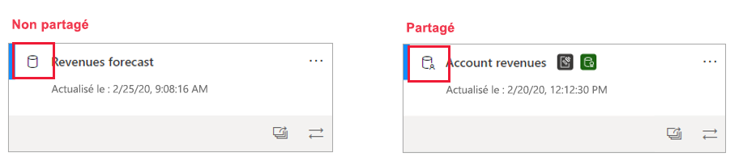
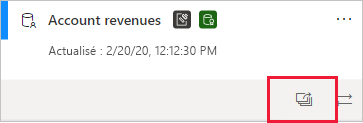
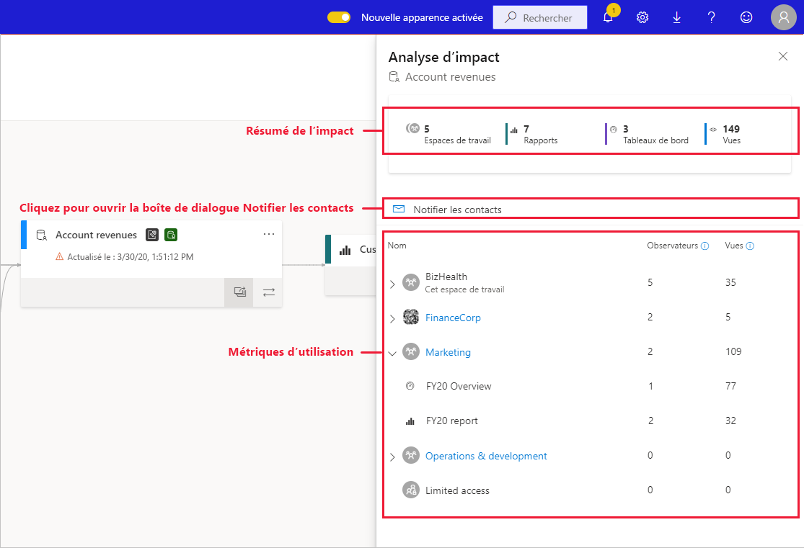
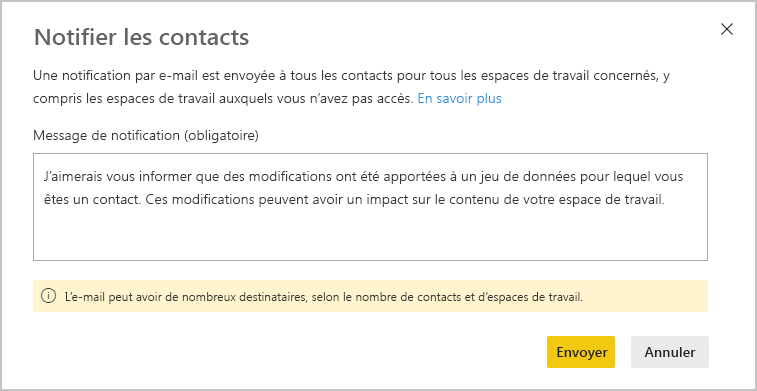
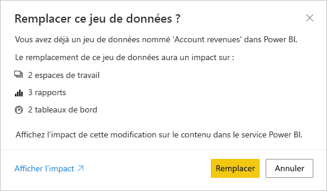

# Analyse de l’impact des jeux de données

Quand vous apportez (ou envisagez d’apporter) des modifications à un jeu de données, il est important de pouvoir évaluer l’impact de ces modifications sur les rapports et les tableaux de bord en aval qui dépendent de ce jeu de données. L’**analyse d’impact sur les jeux de données** fournit des informations qui peuvent vous aider à effectuer cette évaluation.
* Elle indique combien d’espaces de travail, rapports et tableaux de bord sont susceptibles d’être affectés par vos modifications, et vous permet de naviguer facilement vers les espaces de travail où se trouvent les rapports et les tableaux de bord affectés afin que vous puissiez approfondir vos recherches.
* Elle indique combien de visiteurs uniques et combien de vues il y a sur les éléments potentiellement affectés. Cela vous aide à déterminer l’impact global de la modification pour l’élément en aval. Par exemple, il est probablement plus important d’examiner l’effet d’une modification apportée à un rapport qui a 20 000 visiteurs uniques que d’examiner l’effet de la modification sur un rapport qui a trois visiteurs.
* Elle offre un moyen simple d’informer les personnes concernées de la modification que vous avez apportée ou pensez apporter.

Vous pouvez lancer facilement l’analyse d’impact sur les jeux de données à partir de la [vue de traçabilité des données](service-data-lineage.md).

## Identification des jeux de données partagés

Vous pouvez effectuer une analyse d’impact sur les jeux de données partagés et non partagés. Toutefois, elle est particulièrement utile pour les jeux de données qui sont partagés entre des espaces de travail, où il est bien plus compliqué d’obtenir une image claire des dépendances en aval qu’avec les jeux de données non partagés, dont toutes les dépendances se trouvent dans le même espace de travail que le jeu de données lui-même.

Dans la vue de traçabilité, vous pouvez voir la différence entre les jeux de données partagés et non partagés d’après l’icône qui s’affiche dans l’angle supérieur gauche de la carte du jeu de données.

## Effectuer une analyse d’impact sur les jeux de données

Vous pouvez effectuer une analyse d’impact sur n’importe quel jeu de données de l’espace de travail, qu’il soit partagé ou non. Vous ne pouvez pas effectuer d’analyse d’impact sur les jeux de données externes qui sont affichés dans la vue de traçabilité des données mais qui résident en fait dans un autre espace de travail. Pour effectuer une analyse d’impact sur un jeu de données externe, vous devez accéder à l’espace de travail source.

Pour effectuer une analyse d’impact sur le jeu de données, cliquez sur le bouton Analyse d’impact sur la carte du jeu de données.

Le panneau latéral Analyse d’impact s’ouvre.

* Le **récapitulatif d’impact** indique le nombre d’espaces de travail, rapports et tableaux de bord potentiellement impactés, ainsi que le nombre total de vues pour tous les rapports et tableaux de bord en aval qui sont connectés au jeu de données.
* Le lien **Notifier les contacts** ouvre une boîte de dialogue dans laquelle vous pouvez créer et envoyer un message concernant les modifications de jeu de données que vous apportez aux listes de contacts des espaces de travail affectés. 
* La **répartition de l’utilisation** indique, pour chaque espace de travail, le nombre total de vues pour les rapports et tableaux de bord potentiellement impactés et, pour chaque rapport et tableau de bord, le nombre total de visiteurs et de vues, où
   * Visiteurs : nombre d’utilisateurs distincts qui ont affiché un rapport ou un tableau de bord.
   * Vues : nombre de vues pour un rapport ou un tableau de bord.

Les métriques d’utilisation concernent les 30 derniers jours, à l’exclusion du jour actuel. Le nombre comprend l’utilisation provenant des applications associées. Les métriques vous aident à comprendre l’utilisation du jeu de données à l’échelle du locataire, et à évaluer l’impact éventuel des modifications de votre jeu de données.

## Notifier les contacts

Si vous avez apporté (ou envisagez d’apporter) une modification à un jeu de données, vous souhaiterez peut-être contacter les utilisateurs concernés pour les informer. Quand vous notifiez des contacts, un e-mail est envoyé aux [listes de contacts](../collaborate-share/service-create-the-new-workspaces.md#workspace-contact-list) de tous les espaces de travail concernés. Votre nom s’affiche dans l’e-mail afin que les contacts puissent vous trouver et vous répondre sur un nouveau thread. 

1. Cliquez sur **Notifier les contacts** dans le volet latéral Analyse d’impact. La boîte de dialogue Notifier les contacts s’affiche.

   

1. Dans la zone de texte, fournissez des détails sur la modification.
1. Quand le message est prêt, cliquez sur **Envoyer**.

> [!NOTE]
> L’option Notifier les contacts n’est pas disponible si le jeu de données sur lequel vous effectuez l’analyse d’impact se trouve dans un espace de travail classique.

## Confidentialité

Pour effectuer une analyse d’impact sur un jeu de données, vous devez disposer d’autorisations en écriture sur celui-ci. Dans le volet latéral Analyse d’impact, seuls sont visibles les noms réels des espaces de travail, rapports et tableaux de bord auxquels vous avez accès. Les éléments auxquels vous n’avez pas accès sont listés comme ayant un **Accès limité**. Cela est dû au fait que certains noms d’éléments peuvent contenir des informations personnelles.

Même si vous n’avez pas accès à certains espaces de travail, vous verrez quand même une synthèse des métriques d’utilisation pour ces espaces de travail, et vos messages de notification de contacts seront envoyés aux listes de contacts de ces espaces de travail.

## Analyse d’impact à partir de Power BI Desktop

Quand vous apportez une modification à un jeu de données dans Power BI Desktop et que vous le republiez ensuite dans le service Power BI, un message indique le nombre d’espaces de travail, rapports et tableaux de bord susceptibles d’être impactés par la modification, et vous invite à confirmer que vous souhaitez remplacer le jeu de données actuellement publié par celui que vous avez modifié. Ce message contient également un lien vers l’analyse d’impact complète du jeu de données dans le service Power BI, où vous pouvez voir plus d’informations et prendre des mesures pour atténuer les risques liés à vos modifications.

> [!NOTE]
> Les informations affichées dans le message indiquent uniquement l’impact potentiel ; cela ne veut pas nécessairement dire que quelque chose a été endommagé. Bien souvent, les modifications apportées aux jeux de données n’ont pas d’effet négatif sur les tableaux de bord et rapports en aval. Toutefois, vous recevrez quand même ce message qui clarifie l’impact potentiel.
>
>Dans le message, le nombre d’espaces de travail est mentionné uniquement si plusieurs espaces de travail contiennent des rapports et des tableaux de bord affectés.

## Limites

* Les métriques d’utilisation ne sont actuellement pas prises en charge pour les espaces de travail classiques et personnels.

## Étapes suivantes

* [Présentation du partage de jeux de données entre plusieurs espaces de travail (préversion)](../connect-data/service-datasets-across-workspaces.md)
* [Lignage des données](service-data-lineage.md)

