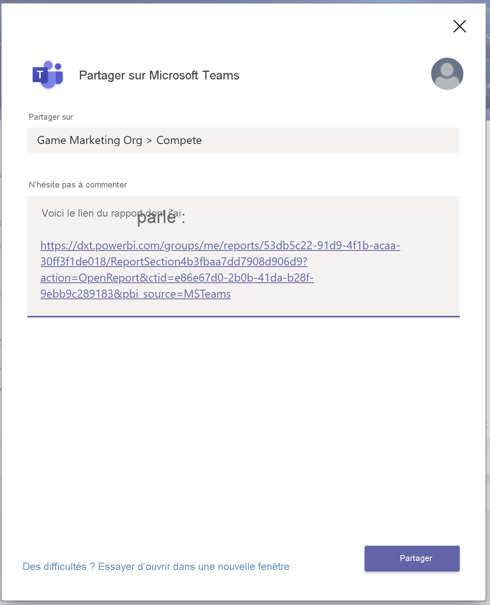
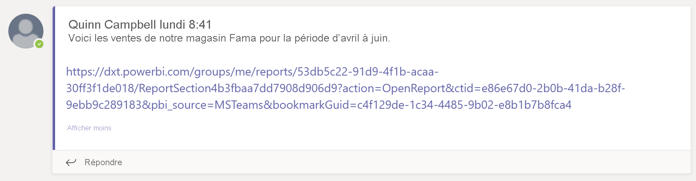
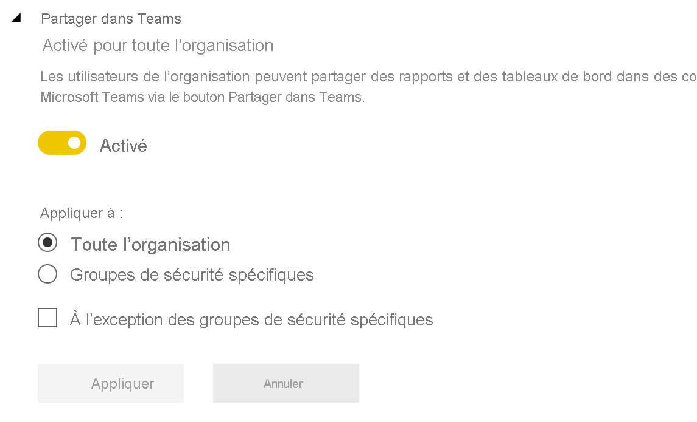

# Collaborer dans Microsoft Teams avec Power BI

Avec l’onglet **Power BI** pour Microsoft Teams, vous pouvez facilement incorporer des rapports interactifs dans les canaux et les conversations Microsoft Teams. Utilisez l’onglet **Power BI** pour Microsoft Teams afin d’aider vos collègues à trouver les données que votre équipe utilise et de discuter des données au sein de vos canaux d’équipe. Quand vous collez un lien vers vos rapports, tableaux de bord et applications dans la boîte de message Microsoft Teams, l’aperçu du lien montre des informations sur le lien. Utilisez les boutons **Partager dans Teams** pour démarrer rapidement des conversations lorsque vous affichez des rapports et des tableaux de bord dans Power BI.

## Configuration requise

Pour que l’onglet **Power BI** pour Microsoft Teams fonctionne, vérifiez que :

- Vos utilisateurs ont une licence Power BI Pro ou que le rapport est contenu dans une [capacité Power BI Premium (référence SKU EM ou P)](../admin/service-premium-what-is.md) avec une licence Power BI.
- Microsoft Teams a l’onglet **Power BI**.
- Les utilisateurs se sont connectés au service Power BI pour activer leur licence Power BI afin de consommer le rapport.
- Pour ajouter un rapport dans Microsoft Teams avec l’onglet **Power BI**, vous devez disposer au moins du rôle Lecteur dans l’espace de travail qui héberge le rapport. Pour plus d’informations sur les différents rôles, consultez [Rôles dans les nouveaux espaces de travail](service-new-workspaces.md#roles-in-the-new-workspaces).
- Pour afficher le rapport sous l’onglet **Power BI** dans Microsoft Teams, les utilisateurs doivent être autorisés à visualiser le rapport.
- Les utilisateurs doivent être des utilisateurs de Microsoft Teams ayant accès aux canaux et aux conversations.

Pour que les aperçus des liens fonctionnent, vérifiez que :

- Les utilisateurs remplissent les conditions requises pour utiliser l’onglet **Power BI** pour Microsoft Teams.
- Les utilisateurs sont connectés à Power BI.

Pour que les boutons **Partager dans Teams** fonctionnent, vérifiez les éléments suivants :

- Les utilisateurs remplissent les conditions requises pour utiliser l’onglet **Power BI** pour Microsoft Teams.
- Les utilisateurs sont connectés à Power BI.
- Les administrateurs Power BI n’ont pas désactivé le paramètre **Partager dans Teams** sur le client.

## Incorporer votre rapport

Suivez ces étapes pour incorporer votre rapport dans un canal ou une conversation Microsoft Teams.

1. Ouvrez un canal ou une conversation dans Microsoft Teams, puis sélectionnez l’icône **+** .

    

1. Sélectionnez l’onglet **Power BI**.

    

1. Utilisez les options fournies pour sélectionner un rapport dans un espace de travail ou une application Power BI.

    

1. Le nom de l’onglet est automatiquement mis à jour pour correspondre au nom du rapport, mais vous pouvez le modifier.

1. Sélectionnez **Enregistrer**.

## Rapports pris en charge pour l’incorporation de l’onglet Power BI

Vous pouvez incorporer les types de rapports suivants sur l’onglet **Power BI** :

- Rapports interactifs et paginés.
- Rapports dans **Mon espace de travail**, les nouvelles expériences d’espace de travail et les espaces de travail classiques.
- Rapports dans des applications Power BI.

## Obtenir un aperçu d’un lien

Suivez ces étapes pour obtenir l’aperçu d’un lien pour du contenu dans le service Power BI.

1. Copiez un lien vers un rapport, un tableau de bord ou une application dans le service Power BI. Par exemple, copiez le lien à partir de la barre d’adresses du navigateur.

1. Collez le lien dans la boîte de message de Microsoft Teams. Connectez-vous au service d’aperçu de lien si vous y êtes invité. Il peut être nécessaire d’attendre quelques secondes pour que l’aperçu du lien se charge.

    

1. L’aperçu de lien de base s’affiche une fois la connexion effectuée.

    

1. Sélectionnez l’icône **Développer** pour montrer la carte enrichie de l’aperçu.

    

1. La carte enrichie de l’aperçu de lien montre le lien et les boutons d’action pertinents.

    

1. Envoyez le message.

## Boutons Partager dans Teams dans le service Power BI

Suivez ces étapes pour partager des liens vers des canaux et conversations Microsoft Teams lorsque vous affichez des rapports ou des tableaux de bord dans le service Power BI.

1. Utilisez les boutons **Partager dans Teams** dans la barre d’action ou dans le menu contextuel d’un objet visuel spécifique.

   * Bouton **Partager dans Teams** dans la barre d’action :

       
    
   * Bouton **Partager dans Teams** dans le menu contextuel visuel :
    
      

1. Dans la boîte de dialogue **Partager dans Microsoft Teams**, sélectionnez le canal ou les personnes devant recevoir le lien. Vous pouvez entrer un message si vous le souhaitez. Vous serez peut-être invité à vous connecter au préalable à Microsoft Teams.

    

1. Sélectionnez **Partager** pour envoyer le lien.
    
1. Le lien est ajouté aux conversations existantes ou démarre une nouvelle conversation.

    

1. Sélectionnez le lien pour ouvrir l’élément dans le service Power BI.

1. Si vous avez utilisé le menu contextuel pour un objet visuel spécifique, ce dernier est mis en surbrillance à l’ouverture du rapport.

    
    

## Accorder l’accès aux rapports

L’incorporation d’un rapport dans Microsoft Teams ou l’envoi d’un lien vers un élément n’accorde pas automatiquement aux utilisateurs l’autorisation d’afficher le rapport. Vous devez [permettre aux utilisateurs d’afficher le rapport dans Power BI](service-share-dashboards.md). Vous pouvez utiliser un groupe Microsoft 365 pour votre équipe afin de faciliter la tâche.

> [!IMPORTANT]
> Veillez à passer en revue les utilisateurs qui peuvent afficher le rapport dans le service Power BI et à accorder l’accès à ceux qui ne sont pas répertoriés.

Pour garantir que tous les membres d’une équipe ont accès aux rapports, vous pouvez les placer dans un même espace de travail et accorder au groupe Microsoft 365 pour votre équipe l’accès.

## Aperçus de lien

Des aperçus de lien sont fournis pour les éléments suivants dans Power BI :
- Rapports
- Tableaux de bord
- Applications

Le service d’aperçu de lien nécessite que vos utilisateurs se connectent. Pour vous déconnecter, sélectionnez l’icône **Power BI** dans le bas de la boîte de message. Sélectionnez ensuite **Se déconnecter**.

## Démarrer une conversation

Quand vous ajoutez un onglet de rapport Power BI dans Microsoft Teams, Teams crée automatiquement un onglet de conversation pour le rapport.

- Sélectionnez l’icône **Afficher l’onglet de conversation** dans l’angle supérieur droit.

    

    Le premier commentaire est un lien vers le rapport. Tout le monde dans ce canal Microsoft Teams peut voir le rapport et en discuter dans la conversation.

    
    
## Paramètre client Partager dans Teams

Le paramètre client **Partager dans Teams** dans le portail d’administration de Power BI permet aux organisations de masquer les boutons **Partager dans Teams**. Lorsque l’option est désactivée, les utilisateurs ne voient pas les boutons **Partager dans Teams** dans la barre d’action ou les menus contextuels lorsqu’ils affichent des rapports et tableaux de bord dans le service Power BI.

## Problèmes connus et limitations

- Power BI ne prend pas en charge les mêmes langues localisées que Microsoft Teams. Par conséquent, vous risquez de ne pas voir la localisation appropriée dans le rapport incorporé.
- Les tableaux de bord Power BI ne peuvent pas être incorporés dans l’onglet **Power BI** pour Microsoft Teams.
- Un utilisateur sans licence Power BI ni autorisation d’accès pour le rapport voit un message « Ce contenu n’est pas disponible ».
- Vous pourriez rencontrer des problèmes si vous utilisez Internet Explorer 10. <!--You can look at the [browsers support for Power BI](../consumer/end-user-browsers.md) and for [Microsoft 365](https://products.office.com/office-system-requirements#Browsers-section). -->
- Les [filtres d’URL](service-url-filters.md) ne sont pas pris en charge avec l’onglet **Power BI** pour Microsoft Teams.
- Dans les clouds nationaux, le nouvel onglet **Power BI** n’est pas disponible. Une version plus ancienne peut être disponible, qui ne prend pas en charge la nouvelle expérience ni les rapports dans les applications Power BI.
- Une fois que vous avez enregistré l’onglet, vous ne pouvez pas changer son nom via les paramètres des onglets. Utilisez l’option **Renommer** pour le changer.
- L’authentification unique n’est pas prise en charge pour le service d’aperçu de lien.
- Les aperçus de lien ne fonctionnent pas dans les conversations des réunions ni dans les canaux privés.
- Les boutons **Partager dans Teams** peuvent ne pas fonctionner si votre navigateur utilise des paramètres de confidentialité stricts. Utilisez l’option **Vous avez une difficulté ? Essayer d’ouvrir dans une nouvelle fenêtre** si la boîte de dialogue ne s’ouvre pas correctement.
- **Partager dans Teams** n’inclut pas d’aperçu de lien.
- Les aperçus de lien et les boutons **Partager dans Teams** n’accordent pas aux utilisateurs l’autorisation d’afficher l’élément. Les autorisations doivent être gérées séparément.
- Le bouton **Partager dans Teams** n’est pas disponible dans les menus contextuels visuels lorsqu’un auteur de rapport définit l’option **Plus** sur *Désactiver* pour l’objet visuel.

## Étapes suivantes

- [Partager un tableau de bord avec vos collègues et les autres utilisateurs](service-share-dashboards.md)
- [Créer et distribuer une application dans Power BI](service-create-distribute-apps.md)
- [Qu’est-ce que Power BI Premium ?](../admin/service-premium-what-is.md)

D’autres questions ? [Essayez d’interroger la communauté Power BI](https://community.powerbi.com/)
