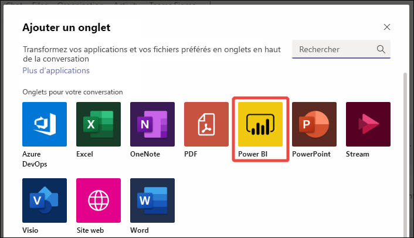
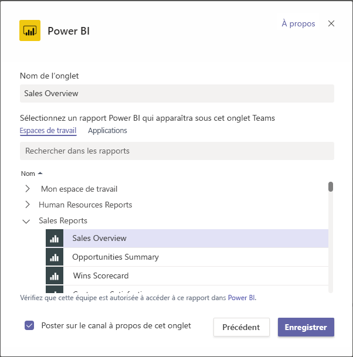
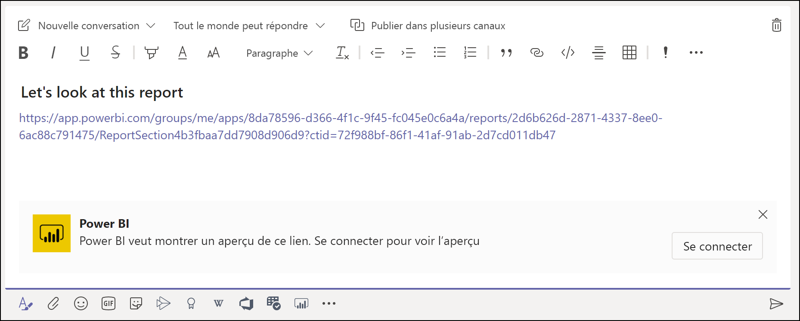
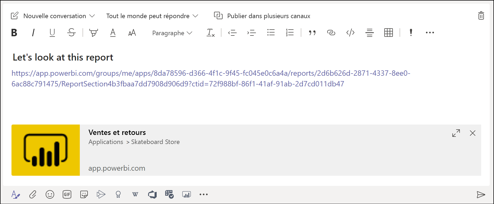
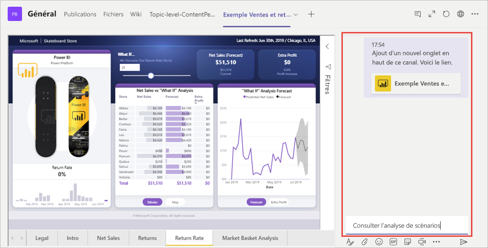

# Incorporer des rapports dans Microsoft Teams avec l’onglet Power BI

Avec l’onglet Power BI mis à jour pour Microsoft Teams, vous pouvez facilement incorporer des rapports interactifs dans les canaux et les conversations Microsoft Teams. Utilisez l’onglet Power BI pour Microsoft Teams afin d’aider vos collègues à trouver les données que votre équipe utilise et de discuter des données au sein de vos canaux d’équipe.  Quand vous collez un lien vers vos rapports, tableaux de bord et applications dans la boîte de message Microsoft Teams, l’aperçu du lien montre des informations à leur sujet. Vos utilisateurs peuvent ainsi comprendre plus facilement l’élément vers lequel le lien les dirige.

## Configuration requise

Pour que l’**onglet Power BI pour Microsoft Teams** fonctionne, vérifiez que :

- Vos utilisateurs ont une licence Power BI Pro ou que le rapport est contenu dans une [capacité Power BI Premium (référence SKU EM ou P)](../admin/service-premium-what-is.md) avec une licence Power BI.
- Microsoft Teams a l’onglet Power BI.
- Les utilisateurs se sont connectés au service Power BI pour activer leur licence Power BI afin de consommer le rapport.
- Pour ajouter un rapport dans Microsoft Teams avec l’onglet Power BI, vous devez disposer au moins du rôle Lecteur dans l’espace de travail qui héberge le rapport. Pour plus d’informations sur les différents rôles, consultez [Rôles dans les nouveaux espaces de travail](service-new-workspaces.md#roles-in-the-new-workspaces).
- Pour afficher le rapport sous l’onglet Power BI dans Microsoft Teams, les utilisateurs doivent être autorisés à visualiser le rapport.

En outre, pour que les **aperçus des liens** fonctionnent, vérifiez que :
- Les utilisateurs remplissent les conditions requises pour utiliser l’onglet Power BI pour Microsoft Teams.
- Les utilisateurs se sont connectés au service Power BI. 

## Incorporer votre rapport

Suivez ces étapes pour incorporer votre rapport dans un canal ou une conversation Microsoft Teams.

1. Ouvrez un canal ou une conversation dans Microsoft Teams, puis sélectionnez l’icône **+** .

    

2. Sélectionnez l’onglet Power BI.

    

3. Utilisez les options fournies pour choisir un rapport dans un espace de travail ou une application Power BI.

    

4. Le nom de l’onglet est automatiquement mis à jour pour correspondre au nom du rapport, mais vous pouvez le modifier. 

5. Appuyez sur **Enregistrer**.

## Rapports pris en charge pour l’incorporation de l’onglet Power BI
Vous pouvez incorporer les types de rapports suivants sur l’onglet Power BI :

- Rapports interactifs et paginés.
- Rapports dans Mon espace de travail, les nouvelles expériences d’espace de travail et les espaces de travail classiques.
- Rapports dans des applications Power BI.

## Obtenir un aperçu d’un lien

Suivez ces étapes pour obtenir l’aperçu d’un lien pour du contenu dans le service Power BI.

1. Copiez un lien vers un rapport, un tableau de bord ou une application dans le service Power BI. Par exemple, copiez le lien à partir de la barre d’adresses du navigateur.

2. Collez le lien dans la boîte de message de Microsoft Teams. Connectez-vous au service d’aperçu de lien si vous y êtes invité. Il peut être nécessaire d’attendre quelques secondes pour que l’aperçu du lien se charge.

    

3. L’aperçu de lien de base apparaît une fois la connexion effectuée.

    

4. Sélectionnez l’icône Développer pour montrer la carte enrichie de l’aperçu.

    

5. La carte enrichie de l’aperçu de lien montre le lien et les boutons d’action pertinents

    

6. Envoyez le message.

## Accorder l’accès aux rapports

L’incorporation d’un rapport dans Microsoft Teams ou l’envoi d’un lien vers un élément n’accorde pas automatiquement aux utilisateurs l’autorisation d’afficher le rapport : vous devez [autoriser les utilisateurs à afficher le rapport dans Power BI](service-share-dashboards.md). Vous pouvez utiliser un groupe Microsoft 365 pour votre équipe afin de faciliter la tâche.

> [!IMPORTANT]
> Veillez à passer en revue les utilisateurs qui peuvent afficher le rapport dans le service Power BI et à accorder l’accès à ceux qui ne sont pas répertoriés.

Pour garantir que tous les membres de votre équipe ont accès aux rapports, vous pouvez les placer dans un même espace de travail dans Power BI et accorder au groupe Microsoft 365 pour votre équipe l’accès à l’espace de travail.

## Aperçus de lien 

Des aperçus de lien sont fournis pour les éléments suivants dans Power BI :
- Rapports
- Tableaux de bord
- Applications

Le service d’aperçu de lien nécessite que vos utilisateurs se connectent. Pour vous déconnecter, sélectionnez l’icône Power BI dans le bas de la boîte de message, puis sélectionnez Se déconnecter.

## Démarrer une conversation

Quand vous ajoutez un onglet de rapport Power BI dans Teams, Teams crée automatiquement un onglet de conversation pour le rapport. 

- Sélectionnez **Afficher l’onglet de conversation** dans l’angle supérieur droit.

    

    Le premier commentaire est un lien vers le rapport. Tout le monde dans ce canal Teams peut voir le rapport et en discuter dans la conversation.

    

## Problèmes connus et limitations

- Power BI ne prend pas en charge les mêmes langues localisées que Microsoft Teams. Par conséquent, vous risquez de ne pas voir la localisation appropriée dans le rapport incorporé.
- Les tableaux de bord Power BI ne peuvent pas être incorporés dans l’onglet Power BI pour Microsoft Teams.
- Un utilisateur sans licence Power BI ni autorisation sur le rapport voit un message « Ce contenu n’est pas disponible ».
- Vous pouvez rencontrer des problèmes si vous utilisez Internet Explorer 10. <!--You can look at the [browsers support for Power BI](../consumer/end-user-browsers.md) and for [Microsoft 365](https://products.office.com/office-system-requirements#Browsers-section). -->
- Les [filtres d’URL](service-url-filters.md) ne sont pas pris en charge avec l’onglet Power BI pour Microsoft Teams.
- Dans les clouds nationaux, le nouvel onglet Power BI n’est pas disponible. Une version plus ancienne peut être disponible, qui ne prend pas en charge la nouvelle expérience d’espace de travail ni les rapports dans les applications Power BI. 
- Une fois que vous avez enregistré l’onglet, vous ne pouvez pas changer son nom via les paramètres des onglets. Utilisez l’option Renommer pour le changer.
- L’authentification unique n’est pas prise en charge pour le service d’aperçu de lien.
- Les aperçus de lien ne fonctionnent pas dans les conversations des réunions ni dans les canaux privés.

## Étapes suivantes
- [Partager un tableau de bord avec vos collègues et les autres utilisateurs](service-share-dashboards.md)  
- [Créer et distribuer une application dans Power BI](service-create-distribute-apps.md)  
- [Qu’est-ce que Power BI Premium ?](../admin/service-premium-what-is.md)

D’autres questions ? [Essayez d’interroger la communauté Power BI](https://community.powerbi.com/)
