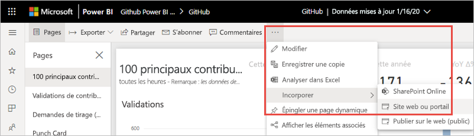
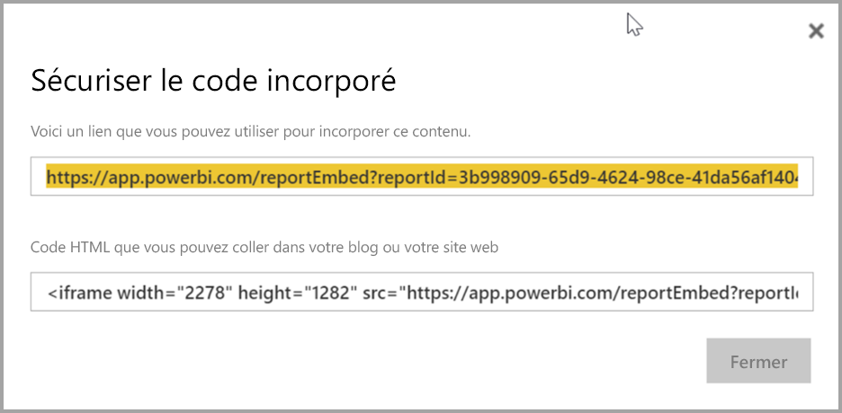
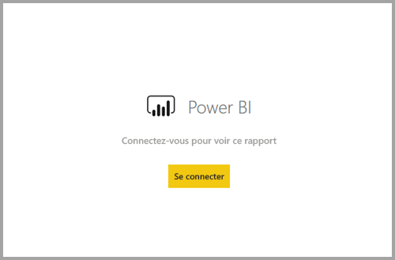
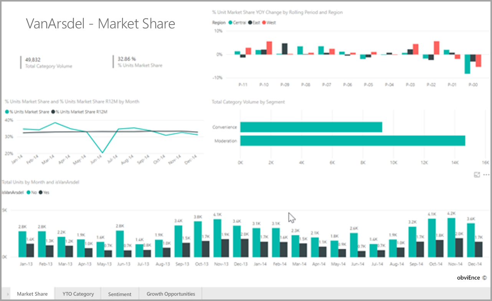

# <a name="embed-a-report-in-a-secure-portal-or-website"></a>Incorporer un rapport dans un site web ou portail sécurisé

Avec la nouvelle option **Incorporer** pour les rapports Power BI, vous pouvez incorporer des rapports dans les portails web internes de manière simple et sécurisée. Ces portails peuvent être **basés sur le cloud** ou **hébergés localement**, à l’image de SharePoint 2019. Les rapports incorporés respectent toutes les autorisations d’élément et les données de sécurité via la [sécurité au niveau des lignes (RLS)](../admin/service-admin-rls.md). Ils fournissent l’intégration sans code dans n’importe quel portail qui accepte une URL ou un iFrame. 

L’option **Incorporer** prend en charge les [filtres URL](service-url-filters.md) et les paramètres d’URL. Elle vous permet d’effectuer une intégration aux portails à l’aide d’une approche avec peu de code qui nécessite uniquement une connaissance élémentaire de HTML et de JavaScript.

## <a name="how-to-embed-power-bi-reports-into-portals"></a>Comment incorporer des rapports Power BI dans des portails

1. Ouvrez un rapport dans le service Power BI.

2. Dans le menu **Plus d’options (...)** , sélectionnez **Incorporer** >  **Site web ou portail**.

    

2. Sélectionnez l’option **Incorporer** pour ouvrir une boîte de dialogue qui fournit un lien et un iFrame que vous pouvez utiliser pour incorporer le rapport de manière sécurisée.

    

3. Qu’un utilisateur ouvre directement une URL de rapport ou une URL incorporée dans un portail web, l’accès aux rapports nécessite une authentification. L’écran suivant s’affiche si un utilisateur ne s’est pas connecté à Power BI dans sa session de navigateur. Quand il sélectionne **Connexion**, une nouvelle fenêtre de navigateur ou un nouvel onglet peut s’ouvrir. Faites en sorte qu’il vérifie les bloqueurs de fenêtres contextuelles s’il n’est pas invité à se connecter.

    

4. Une fois que l’utilisateur s’est connecté, le rapport s’ouvre, affichant les données et permettant de naviguer entre les pages et de définir des filtres. Seuls les utilisateurs qui disposent de l’autorisation d’affichage peuvent voir le rapport dans Power BI. Toutes les [règles de sécurité au niveau des lignes (RLS)](../admin/service-admin-rls.md) sont également appliquées. Enfin, l’utilisateur doit disposer d’une licence correcte. Il doit avoir une licence Power BI Pro, ou le rapport doit être dans un espace de travail qui se trouve dans une capacité Power BI Premium. L’utilisateur doit se connecter chaque fois qu’il ouvre une nouvelle fenêtre de navigateur. Toutefois, une fois connecté, les autres rapports se chargent automatiquement.

    

5. Quand vous utilisez un iFrame, vous pouvez être amené à modifier la **hauteur** et la **largeur** afin qu’il tienne dans la page web de votre portail.

    

## <a name="granting-report-access"></a>Octroi d’un accès au rapport

L’option **Incorporer** ne permet pas automatiquement aux utilisateurs de voir le rapport. Les autorisations de consultation sont définies dans le service Power BI.

Dans le service Power BI, vous pouvez partager des rapports incorporés avec des utilisateurs qui ont besoin d’un accès. Si vous utilisez un groupe Microsoft 365, vous pouvez lister l’utilisateur comme membre de l’espace de travail. Pour plus d’informations, consultez [Gérer l’espace de travail dans Power BI et Microsoft 365](service-manage-app-workspace-in-power-bi-and-office-365.md).

## <a name="licensing"></a>Licences

Pour que les utilisateurs puissent voir le rapport incorporé, ils ont besoin d’une licence Power BI Pro ou le contenu doit se trouver dans un espace de travail qui se trouve dans une [capacité Power BI Premium (référence SKU EM ou P)](../admin/service-admin-premium-purchase.md).

## <a name="customize-your-embed-experience-using-url-settings"></a>Personnaliser votre expérience d’incorporation à l’aide des paramètres d’URL

Vous pouvez personnaliser l’expérience utilisateur à l’aide des paramètres d’entrée de l’URL d’incorporation. Dans l’iFrame fourni, vous pouvez mettre à jour les paramètres **src** de l’URL.

| Propriété  | Description  |  |  |  |
|--------------|-----------------------------------------------------------------------------------------------------------------------------------------------------------------------------------------------------------------------|---|---|---|
| pageName  | Vous pouvez utiliser le paramètre de chaîne de requête **pageName** pour définir la page de rapport à ouvrir. Vous pouvez trouver cette valeur à la fin de l’URL du rapport quand vous affichez un rapport dans le service Power BI, comme indiqué ci-dessous. |  |  |  |
| Filtres d’URL  | Vous pouvez utiliser des [filtres d’URL](service-url-filters.md) dans l’URL d’incorporation que vous avez reçue à partir de l’interface utilisateur de Power BI pour filtrer le contenu d’incorporation. Ainsi, vous pouvez créer des intégrations avec peu de code et des connaissances de base de HTML et de JavaScript.  |  |  |  |

## <a name="set-which-page-opens-for-an-embedded-report"></a>Définir la page qui s’ouvre pour un rapport incorporé 

Vous pouvez trouver la valeur **pageName** à la fin de l’URL du rapport quand vous consultez un rapport dans le service Power BI.

1. Ouvrez le rapport à partir du service Power BI dans votre navigateur web et copiez l’URL de la barre d’adresses.

    

2. Ajoutez le paramètre **pageName** à l’URL.

    

## <a name="filter-report-content-using-url-filters"></a>Filtrer le contenu du rapport à l’aide de filtres d’URL 

Vous pouvez utiliser des [filtres d’URL](service-url-filters.md) pour fournir différentes vues du rapport. Par exemple, l’URL ci-dessous filtre le rapport pour afficher les données pour le secteur de l’énergie.

L’utilisation de la combinaison de **pageName** et de [filtres d’URL](service-url-filters.md) peut être très puissante. Vous pouvez créer des expériences à l’aide de code HTML et JavaScript de base.

Par exemple, voici un bouton que vous pouvez ajouter à une page HTML :

```html
<button class="textLarge" onclick='show("ReportSection", "Energy");' style="display: inline-block;">Show Energy</button>
```

Quand l’utilisateur le sélectionne, le bouton appelle une fonction pour mettre à jour l’iFrame avec une URL mise à jour, qui inclut le filtre pour le secteur de l’énergie.

```javascript
function show(pageName, filterValue)

{

var newUrl = baseUrl + "&pageName=" + pageName;

if(null != filterValue && "" != filterValue)

{

newUrl += "&$filter=Industries/Industry eq '" + filterValue + "'";

}

//Assumes there's an iFrame on the page with id="iFrame"

var report = document.getElementById("iFrame")

report.src = newUrl;

}
```


Vous pouvez ajouter autant de boutons que vous le souhaitez pour créer une expérience personnalisée avec peu de code. 

## <a name="considerations-and-limitations"></a>Considérations et limitations

* Les rapports paginés sont pris en charge avec les scénarios d’incorporation sécurisée, et les rapports paginés avec des paramètres d’URL sont également pris en charge. Découvrez-en plus sur la [transmission de paramètres de rapport dans une URL pour un rapport paginé](../paginated-reports/report-builder-url-pass-parameters.md).

* Ne prend pas en charge les utilisateurs invités externes avec Azure B2B.

* L’incorporation sécurisée fonctionne pour les rapports publiés sur le service Power BI.

* L’utilisateur doit se connecter pour voir le rapport à chaque fois qu’il ouvre une nouvelle fenêtre de navigateur.

* Certains navigateurs vous obligent à actualiser la page après la connexion, en particulier lorsque vous utilisez les modes InPrivate ou Incognito.

* Vous risquez de rencontrer des problèmes si vous utilisez des versions de navigateur non prises en charge. Power BI prend en charge [la liste de navigateurs suivante](../fundamentals/power-bi-browsers.md).

* La version classique de SharePoint Server n’est pas prise en charge, car elle requiert des versions d’Internet Explorer antérieures à la version 11, ou l’activation du mode d’Affichage de compatibilité.

* Pour obtenir une expérience d’authentification unique, utilisez [l’option Incorporer dans SharePoint Online](service-embed-report-spo.md), ou générez une intégration personnalisée suivant la méthode d’incorporation [les données appartiennent à l’utilisateur](../developer/embedded/embed-sample-for-your-organization.md). 

* La fonctionnalité d’authentification automatique fournie avec l’option **Incorporer** ne fonctionne pas avec l’API JavaScript Power BI. Pour l’API JavaScript Power BI, utilisez la méthode d’incorporation [les données appartiennent à l’utilisateur](../developer/embedded/embed-sample-for-your-organization.md). 

* La durée de vie du jeton d’authentification est contrôlée en fonction de vos paramètres AAD. Quand le jeton d’authentification expire, l’utilisateur doit actualiser son navigateur pour recevoir un jeton d’authentification mis à jour. La durée de vie par défaut est d’une heure, mais elle peut être plus courte ou plus longue dans votre organisation.

## <a name="next-steps"></a>Étapes suivantes

* [Moyens de partager votre travail dans Power BI](service-how-to-collaborate-distribute-dashboards-reports.md)

* [Filtrer un rapport à l’aide de paramètres de chaîne de requête dans l’URL](service-url-filters.md)

* [Incorporer avec le composant WebPart Rapport dans SharePoint Online](service-embed-report-spo.md)

* [Publier sur le web à partir de Power BI](service-publish-to-web.md)
