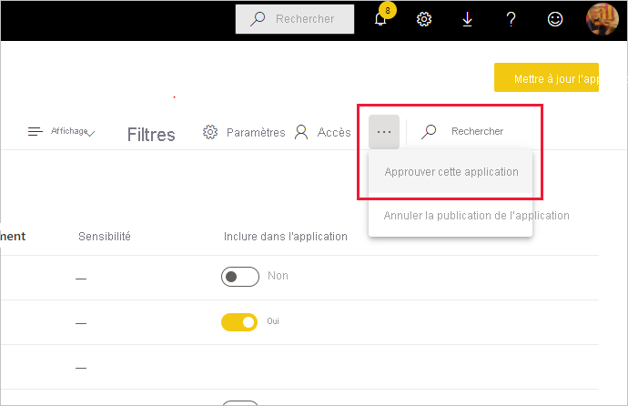

# Approuver votre contenu

Power BI propose deux méthodes pour approuver votre contenu à forte valeur ajoutée afin d’en augmenter la visibilité : la **promotion** et la **certification**.

* **Promotion** : La promotion est un moyen de mettre en exergue le contenu que vous estimez précieux et utile pour les autres utilisateurs. Elle encourage l’utilisation collaborative et la diffusion du contenu au sein d’une organisation.

    Tout propriétaire de contenu, ainsi que tout membre disposant d’autorisations d’écriture sur l’espace de travail où se trouve le contenu, peut promouvoir le contenu dès lors qu’il pense que ce contenu est suffisamment adapté au partage.

* **Certification** : La certification signifie que le contenu répond aux normes de qualité de l’organisation et qu’il peut être considéré comme fiable, faisant autorité et prêt à être utilisé au sein de l’organisation.

    Seuls des réviseurs autorisés peuvent certifier du contenu. Les propriétaires de contenu qui souhaitent voir leur contenu certifié et qui ne sont pas autorisés à le certifier eux-mêmes doivent suivre les instructions de leur organisation en matière de certification de contenu.

Il est actuellement possible d’approuver ceci :
* Groupes de données
* Dataflows (préversion)
* Rapports (préversion)
* Applications (préversion)

Cet article explique comment [promouvoir du contenu](#promote-content), comment [certifier du contenu](#certify-content) si vous êtes réviseur autorisé et comment [demander une certification](#request-content-certification) si ce n’est pas le cas.

Reportez-vous à [Approbation : Promotion et certification de contenu Power BI](service-endorsement-overview.md) pour en savoir plus sur l’approbation.

## Promouvoir du contenu

Pour promouvoir du contenu, vous devez disposer d’autorisations d’écriture sur l’espace de travail dans lequel se trouve le contenu que vous voulez promouvoir.

>[!NOTE]
>À titre d’illustration, la boîte de dialogue d’approbation des jeux de données figure ci-dessous. Les boîtes de dialogue des autres types de contenu sont presque identiques, avec les mêmes cases d’option. 

1. Accédez aux [paramètres](#how-to-get-to-content-settings) du contenu que vous voulez promouvoir.

1. Développez la section d’approbation, puis sélectionnez **Promu**. Si vous promouvez un jeu de données, fournissez-en une brève description.

    

1. Sélectionnez **Appliquer**.

## Certifier du contenu

La certification de contenu constitue une grande responsabilité que seuls les utilisateurs autorisés peuvent assumer. Les autres utilisateurs peuvent [demander une certification de contenu](#request-content-certification). Cette section décrit comment certifier du contenu.

>[!NOTE]
>À titre d’illustration, la boîte de dialogue d’approbation des jeux de données figure ci-dessous. Les boîtes de dialogue des autres types de contenu sont presque identiques, avec les mêmes cases d’option. 

1. Obtenez des autorisations d’écriture sur l’espace de travail où se trouve le contenu que vous voulez certifier. Vous pouvez demander ces autorisations au propriétaire du contenu ou à toute personne disposant d’autorisations d’administrateur sur l’espace de travail.

1. Examinez attentivement le contenu pour déterminer s’il respecte les normes de certification de votre organisation.

1. Si vous décidez de certifier le contenu, accédez à l’espace de travail où il réside, puis ouvrez les [paramètres](#how-to-get-to-content-settings) du contenu à certifier.

1. Développez la section d’approbation, puis sélectionnez **Certifié**. 

    

1. Sélectionnez **Appliquer**.

## Demander une certification de contenu

Si vous voulez certifier votre contenu, mais que vous n’y êtes pas autorisé, suivez les étapes ci-dessous.

>[!NOTE]
>À titre d’illustration, la boîte de dialogue d’approbation des jeux de données figure ci-dessous. Les boîtes de dialogue des autres types de contenu sont presque identiques, avec les mêmes cases d’option. 

1. Accédez à l’espace de travail dans lequel se trouve le contenu à certifier, puis ouvrez les [paramètres](#how-to-get-to-content-settings) de ce contenu.

1. Développez la section d’approbation. Le bouton **Certifié** est grisé, car vous n’êtes pas autorisé à certifier du contenu. Cliquez sur le lien pour savoir comment faire certifier votre contenu.

    
    
    >[!NOTE]
    >Si vous avez cliqué sur le lien ci-dessus mais que vous avez été redirigé vers cette note, cela signifie que votre administrateur Power BI n’a pas fourni d’informations. Dans ce cas, contactez directement l’administrateur Power BI.

## Comment accéder aux paramètres de contenu

La boîte de dialogue Approbation est accessible par le biais des paramètres du contenu à approuver. Suivez les instructions ci-dessous pour accéder aux paramètres de chaque type de contenu.

* **Jeux de données** : En mode Liste, pointez sur le jeu de données à approuver, cliquez sur **Autres options (...)** , puis choisissez **Paramètres** dans le menu qui s’affiche.
* **Dataflows** (préversion) : En mode Liste, pointez sur le dataflow à approuver, cliquez sur **Autres options (...)** , puis choisissez **Paramètres** dans le menu qui s’affiche.

* **Rapports** (préversion) : En mode Liste, pointez sur le rapport à approuver, cliquez sur **Autres options (...)** , puis choisissez **Paramètres** dans le menu qui s’affiche. Si le rapport est ouvert, vous pouvez également choisir **Fichier > Paramètres**.

* **Applications** (préversion) : Accédez à l’espace de travail de l’application, cliquez sur **Autres options (...)** dans la barre de menus, puis choisissez **Approuver cette application**.

    

## Étapes suivantes

* [En savoir plus sur l’approbation de contenu](service-endorsement-overview.md)
* [Activer la certification de contenu](../admin/service-admin-setup-certification.md) (administrateurs Power BI)
* Vous avez des questions ? [Essayez d’interroger la communauté Power BI](https://community.powerbi.com/)
