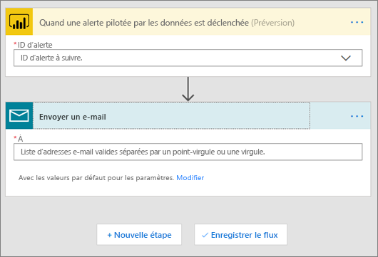
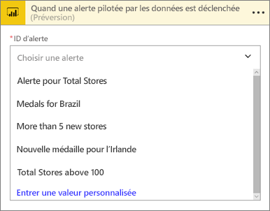
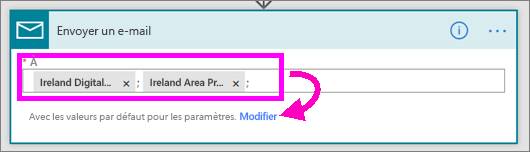
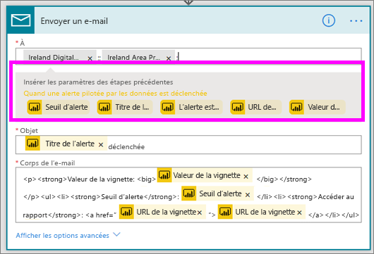
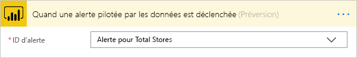
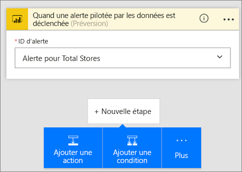
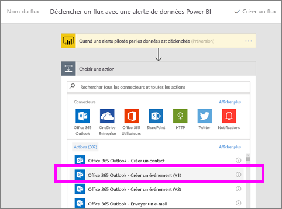

# Power Automate et Power BI

[Power Automate](https://docs.microsoft.com/power-automate/getting-started) est une offre SaaS pour l’automatisation des workflows dans un nombre croissant d’applications et de services SaaS sur lesquels les utilisateurs professionnels s’appuient. Power Automate vous permet d’automatiser des tâches en intégrant vos applications et services favoris (y compris Power BI) pour obtenir des notifications, synchroniser des fichiers, collecter des données et bien plus encore. Les tâches répétitives sont simplifiées grâce à l’automatisation des flux de travail.

[Prise en main à l’aide de Power Automate maintenant.](https://docs.microsoft.com/power-automate/getting-started)

Effectuer le suivi de Sirui crée un flux Power Automate qui envoie un e-mail détaillé à des collègues quand une alerte Power BI est déclenchée. Suivez ensuite les instructions détaillées sous la vidéo pour essayer vous-même.

<iframe width="560" height="315" src="https://www.youtube.com/embed/YhmNstC39Mw" frameborder="0" allowfullscreen></iframe>

## Créer un flux déclenché par une alerte de données Power BI

### Conditions préalables
Ce didacticiel vous montre comment créer deux flux différents : un à partir d’un modèle et l’autre à partir de zéro. Pour la suite, [créez une alerte de données dans Power BI](../create-reports/service-set-data-alerts.md), créez un compte Slack gratuit et [inscrivez-vous gratuitement à Power Automate](https://flow.microsoft.com/#home-signup).

## Créer un flux qui utilise Power BI - à partir d’un modèle
Dans cette tâche, nous utilisons un modèle pour créer un flux simple qui déclenche par un alerte de données Power BI (notification).

1. Connectez-vous à Power Automate (flow.microsoft.com).
2. Sélectionnez **Mes flux**.
   
   
3. Sélectionnez **Créer à partir d’un modèle**.
   
    
4. Utilisez la zone de recherche pour trouver des modèles Power BI et sélectionnez **Envoyer un e-mail à n’importe quelle audience quand une alerte de données Power BI est déclenchée > Continuer**.
   
    

### Créer le flux
Ce modèle a un déclencheur (alerte de données Power BI en cas de nouvelles médailles olympiques pour l’Irlande) et une action (envoyer un e-mail). Lorsque vous sélectionnez un champ, Power Automate affiche un contenu dynamique que vous pouvez inclure.  Dans cet exemple, nous incluons la valeur et l’URL de la mosaïque dans le corps du message.

1. Dans la liste déroulante des déclencheurs, sélectionnez une alerte de données Power BI. Sélectionnez **New medal for Ireland** (Nouvelle médaille pour l’Irlande). Pour savoir comment créer une alerte, voir [Alertes de données dans Power BI](../create-reports/service-set-data-alerts.md).
   
   
2. Entrez une ou plusieurs adresses e-mail valides, puis sélectionnez **Modifier** (voir ci-dessous) ou **Ajouter du contenu dynamique**. 
   
   

3. Power Automate crée un titre et un message que vous pouvez conserver ou modifier. Toutes les valeurs définies lors de la création de l’alerte dans Power BI sont utilisables : placez simplement votre curseur dessus et sélectionnez-les dans la zone grise en surbrillance. 

   

1.  Par exemple, si vous avez créé le titre d’alerte **Nous avons gagné une autre médaille** dans Power BI, vous pouvez sélectionner **Titre de l’alerte** pour ajouter ce texte au champ Objet de votre adresse e-mail.

    

    De même, vous pouvez accepter le corps de l’e-mail par défaut ou créer le vôtre. Dans l’exemple ci-dessus, quelques modifications ont été apportées au message.

1. Lorsque vous avez terminé, sélectionnez **Créer un flux** ou **Enregistrer le flux**.  Le flux est créé et évalué.  Power Automate vous indique s’il trouve des erreurs.
2. S’il en détecte, sélectionnez **Modifier le flux** pour les corriger ; sinon, sélectionnez **Terminé** pour exécuter le nouveau flux.
   
   
5. Lorsque l’alerte de données se déclenche, un e-mail est envoyé aux adresses que vous avez indiquées.  
   
   

## Créer un Power Automate qui utilise Power BI - à partir de zéro (vide)
Dans cette tâche, nous créons un flux simple à partir de zéro, déclenché par une alerte de données Power BI (notification).

1. Connectez-vous à Power Automate.
2. Sélectionnez **Mes flux** > **Créer entièrement**.
   
   
3. Utilisez la zone de recherche pour trouver un déclencheur Power BI et sélectionnez **Power BI - quand une alerte de données est déclenchée**.

### Créer votre flux
1. Dans la liste déroulante, sélectionnez le nom de l’alerte.  Pour savoir comment créer une alerte, voir [Alertes de données dans Power BI](../create-reports/service-set-data-alerts.md).
   
    
2. Sélectionnez **Nouvelle étape** > **Ajouter une action**.
   
   
3. Recherchez **Outlook** et sélectionnez **Créer un événement**.
   
   
4. Complétez les champs de l’événement. Lorsque vous sélectionnez un champ, Power Automate affiche un contenu dynamique que vous pouvez inclure.
   
   
5. Quand vous avez terminé, sélectionnez **Créer un flux**.  Power Automate enregistre et évalue le flux. S’il n’y a pas d’erreurs, sélectionnez **Terminé** pour exécuter ce flux.  Le nouveau flux est ajouté à votre page **Mes flux**.
   
   
6. Lorsque le flux est déclenché par l’alerte de données Power BI, vous recevez une notification d’événement Outlook semblable à celle-ci.
   
    

## Étapes suivantes
* [Bien démarrer avec Power Automate](https://docs.microsoft.com/power-automate/getting-started/)
* [Définir des alertes de données dans le service Power BI](../create-reports/service-set-data-alerts.md)
* [Définir des alertes de données sur votre iPhone](../consumer/mobile/mobile-set-data-alerts-in-the-mobile-apps.md)
* [Définir des alertes dans l’application mobile Power BI pour Windows 10](../consumer/mobile/mobile-set-data-alerts-in-the-mobile-apps.md)
* D’autres questions ? [Posez vos questions à la communauté Power BI](https://community.powerbi.com/)
