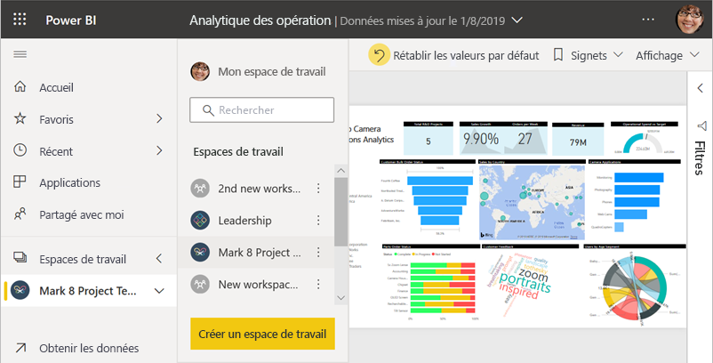
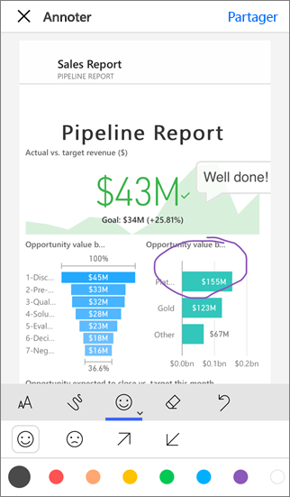
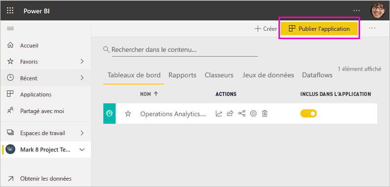
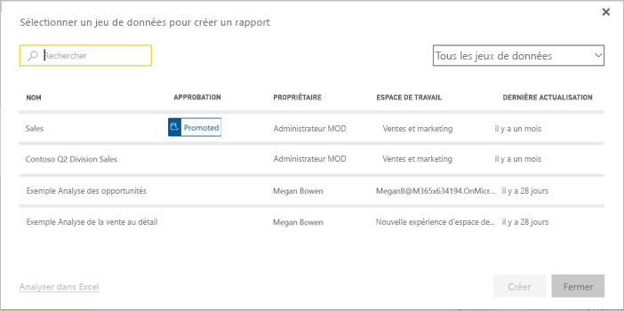

# Façons de collaborer et partager dans Power BI

Vous avez créé des tableaux de bord et des rapports. Vous voudrez peut-être collaborer dessus avec vos collègues. Ou peut-être êtes-vous prêt à les distribuer plus largement. Quelle est la meilleure façon de collaborer dessus et de les partager ? Dans cet article, nous comparons vos options.

*Applications dans le service Power BI*

**Collaborer**

- Collaborer avec des collègues pour créer des rapports et tableaux de bord dans des *espaces de travail*.
- Collaborez dans *Microsoft Teams*.

**Distribuer ou partager des tableaux de bord et des rapports**

- *Partagez des tableaux de bord ou des rapports* à partir de Mon espace de travail ou d’un autre espace de travail.
- Annoter et partager à partir des *applications mobiles* Power BI.
- Regrouper les tableaux de bord et rapports des espaces de travail dans des *applications*, et les distribuer à un groupe plus important ou à toute l’organisation.
- Incorporer des rapports dans des *portails sécurisés* ou des *sites web publics*.
- Imprimer des rapports
- Créer une *application modèle* que vous pouvez distribuer aux utilisateurs Power BI externes, par le biais de Microsoft AppSource
 
**Partager les données**

- Créer des *jeux de données partagés* que vos collègues peuvent utiliser comme base pour leurs propres rapports, dans leur propre espace de travail.
- Créez des *dataflows* comme moyen de partager une source de données commune.

Quelle que soit l’option choisie, pour partager du contenu, vous avez besoin d’une [licence Power BI Pro](../fundamentals/service-features-license-type.md). Sinon, le contenu doit se trouver dans une [capacité Premium](../admin/service-premium-what-is.md). Les besoins en licence varient pour les collègues qui consultent votre contenu, et dépendent de l’option que vous choisissez. Les sections suivantes offrent des informations détaillées. 

## Collaborer dans un espace de travail

Quand des équipes travaillent ensemble, elles ont besoin d’accéder aux mêmes documents pour pouvoir collaborer facilement. Dans les espaces de travail Power BI, les équipes partagent la propriété et la gestion de leurs tableaux de bord, rapports, jeux de données et classeurs. Les utilisateurs Power BI organisent parfois leurs espaces de travail en fonction des structures organisationnelles, ou les créent pour des projets spécifiques. D’autres organisations utilisent plusieurs espaces de travail pour stocker différentes versions des rapports ou des tableaux de bord qu’elles utilisent. 

Les espaces de travail fournissent des rôles qui déterminent les autorisations de vos collègues. Utilisez ces rôles pour déterminer qui peut gérer l’espace de travail, modifier ou distribuer du contenu, ou simplement afficher le contenu. En savoir plus sur les [rôles dans les nouveaux espaces de travail](service-new-workspaces.md#roles-in-the-new-workspaces).

Les espaces de travail conviennent mieux à la collaboration que Mon espace de travail, car ils permettent la copropriété du contenu. Vous et toute votre équipe pouvez facilement mettre à jour ou donner un accès à d’autres personnes. Mon espace de travail convient mieux à une utilisation par des personnes individuelles pour du contenu ponctuel ou personnel.

Imaginons maintenant que vous avez un tableau de bord terminé, que vous devez partager avec vos collègues. Quel est la meilleure façon de leur donner accès au tableau de bord ? La réponse dépend de plusieurs facteurs. 

- Si vos collègues doivent maintenir le tableau de bord à jour, ou s’ils ont besoin d’accéder à tout le contenu de l’espace de travail, vous pouvez les ajouter à l’espace de travail en tant que Membres ou Contributeurs. 
- Si vos collègues ont simplement besoin d’afficher le contenu de l’espace de travail, ajoutez-les en tant qu’observateurs.
- Si les collègues doivent simplement voir ce tableau de bord et pas tout le contenu de l’espace de travail, vous pouvez partager directement le tableau de bord avec eux.
- Si le tableau de bord fait partie d’un ensemble de tableaux de bords et de rapports que vous devez distribuer à de nombreux collègues, le mieux à faire est de publier une *application*.

Découvrez-en plus sur la manière de [créer les nouveaux espaces de travail](service-create-the-new-workspaces.md). 

## Collaborer dans Microsoft Teams

Augmentez la collaboration pilotée par les données au sein de votre organisation en incorporant vos rapports Power BI et vos rapports paginés Power BI dans Microsoft Teams. Le service Power BI dispose d’un bouton **Partager dans Teams** pour les rapports. Vous pouvez ajouter des onglets Power BI distincts pour chaque rapport individuel et attribuer à chaque onglet le nom du rapport ou un autre nom quelconque. 

Quand vous ajoutez un onglet de rapport Power BI dans Microsoft Teams, Teams crée automatiquement un onglet de conversation pour le rapport. Tout le monde dans ce canal Microsoft Teams peut voir le rapport et en discuter dans la conversation. 

:::image type="content" source="media/service-how-to-collaborate-distribute-dashboards-reports/power-bi-teams-conversation-tab.png" alt-text="Onglet de conversation Microsoft Teams":::

En savoir plus sur la [collaboration dans Microsoft Teams avec Power BI](service-embed-report-microsoft-teams.md).

## Partager des tableaux de bord et rapports

Supposons que vous avez finalisé un rapport dans Power BI Desktop et que vous souhaitez que d’autres utilisateurs y aient accès. Une des options est de le *partager* avec eux dans le service Power BI. Vous le publiez dans votre propre espace de travail ou dans un autre espace de travail. Vous avez peut-être créé un tableau de bord associé et vous êtes prêt.

Vous avez besoin d’une licence Power BI Pro pour partager votre contenu. Les personnes avec qui vous partagez votre contenu aussi, ou bien le contenu doit être dans un espace de travail qui se trouve dans une [capacité Premium](../admin/service-premium-what-is.md). Quand vous partagez un tableau de bord ou un rapport, les destinataires peuvent le consulter et interagir avec celui-ci. Si vous leur accordez l’autorisation, ils peuvent le modifier, en faire une copie et le partager avec leurs collègues. Ils voient les mêmes données que vous dans le tableau de bord et les rapports. Ils ont accès à toutes les données du jeu de données sous-jacent, sauf si la [Sécurité au niveau des lignes (RLS)](../admin/service-admin-rls.md) est appliquée.

Vous pouvez également partager le tableau de bord avec des personnes extérieures à votre organisation. Celles-ci peuvent également consulter le tableau de bord ou le rapport, et interagir avec celui-ci, mais elles ne peuvent pas le partager. 

Découvrez comment [partager des tableaux de bord et rapports](service-share-dashboards.md) à partir du service Power BI. Vous pouvez également en apprendre davantage sur l’ajout d’un filtre à un lien et [partager une vue filtrée de votre rapport](service-share-reports.md).

## Annoter et partager à partir des applications mobiles Power BI

Dans les applications mobiles Power BI pour les appareils iOS et Android, vous pouvez annoter une vignette, un rapport ou un visuel et le partager avec tout le monde par e-mail.

Vous partagez une capture instantanée de la vignette, du rapport ou de l’objet visuel. Vos destinataires voient cet élément exactement tel qu’il était quand vous avez envoyé l’e-mail. Le message contient également un lien vers le tableau de bord ou le rapport. Si vos destinataires possèdent une licence Power BI Pro ou que le contenu est dans une [capacité Premium](../admin/service-premium-what-is.md), et que vous avez déjà partagé le contenu avec eux, ils peuvent l’ouvrir. Vous pouvez envoyer des instantanés de vignettes à tout le monde, pas simplement à vos collègues dans le même domaine de messagerie.

En savoir plus sur l’[annotation et le partage de vignettes, de rapports et de visuels](../consumer/mobile/mobile-annotate-and-share-a-tile-from-the-mobile-apps.md) à partir des applications mobiles iOS et Android.

Vous pouvez également [partager une capture instantanée d’une vignette](../consumer/mobile/mobile-windows-10-phone-app-get-started.md) à partir de l’application Power BI pour les appareils Windows 10, mais pas l’annoter.

## Distribuer des insights dans une application

Supposons que vous souhaitiez distribuer votre tableau de bord à un large public au sein de votre organisation. Vos collègues et vous avez créé un *espace de travail*, puis créé et affiné des tableaux de bord, des rapports et des jeux de données dans cet espace. Désormais, vous sélectionnez les tableaux de bord et les rapports et les publiez en tant qu’*application* pour un groupe ou pour toute votre organisation.

Les applications sont faciles à trouver et à installer dans le service Power BI ([https://app.powerbi.com](https://app.powerbi.com)). Vous pouvez envoyer à vos utilisateurs professionnels un lien direct vers l’application, ou ceux-ci peuvent rechercher cette dernière dans AppSource. Si votre administrateur Power BI vous y autorise, vous pouvez installer une application automatiquement dans les comptes Power BI de vos collègues. En savoir plus sur la [publication d’une application](service-create-distribute-apps.md).

Après avoir installé l’application, ils peuvent l’afficher dans leur navigateur ou sur leur appareil mobile.

Pour que vos utilisateurs puissent voir l’application, ils doivent posséder une licence Power BI Pro, ou l’application doit être stockée dans une capacité Power BI Premium. Pour plus de détails, consultez [Qu’est-ce que Power BI Premium ?](../admin/service-premium-what-is.md).

Vous pouvez également publier des applications pour des personnes extérieures à votre organisation. Celles-ci peuvent consulter le tableau de bord et interagir avec celui-ci, mais elles ne peuvent pas le partager avec d’autres personnes. Vous pouvez désormais créer des *applications modèles* et les déployer pour n’importe quel client Power BI.

## Incorporer des rapports dans des portails sécurisés ou des sites web publics

### Incorporer des rapports dans les portails sécurisés

Vous pouvez incorporer des rapports Power BI dans des portails ou des sites web où les utilisateurs s’attendent à les voir.  
Avec les options **Incorporer dans SharePoint Online** et **Incorporer** du service Power BI, vous pouvez incorporer des rapports pour vos utilisateurs internes de manière sécurisée. Quelle que soit l’option choisie, Power BI applique l’ensemble des autorisations et de la sécurité des données avant que les utilisateurs ne puissent voir le contenu. La personne qui consulte le rapport doit avoir la licence appropriée.  

- **Incorporer dans SharePoint Online** fonctionne avec le composant WebPart Power BI pour SharePoint Online. Il fournit une expérience d’authentification unique et permet de contrôler la façon dont le rapport est incorporé. En savoir plus sur l’[Incorporation dans SharePoint Online](service-embed-report-spo.md).
- L’option **Incorporer** fonctionne avec n’importe quel portail ou site web qui prend en charge l’incorporation de contenu à l’aide d’une URL ou d’un iFrame. En savoir plus sur l’option [Incorporer](service-embed-secure.md).

### Publier sur des sites web publics

Avec **Publier sur le web**, vous pouvez publier des rapports Power BI sur le web en incorporant des visualisations dans les billets de blog, les sites web, les réseaux sociaux et d’autres supports de communication en ligne. Tous les utilisateurs d’Internet peuvent afficher vos rapports et vous n’avez aucun contrôle sur les personnes qui peuvent voir ce que vous avez publié. Celles-ci n’ont pas besoin d’une licence Power BI. La fonction de publication sur le web n’est disponible que pour les rapports que vous pouvez modifier. Vous ne pouvez pas publier des rapports sur le web s’ils sont partagés avec vous ou s’ils figurent dans une application. En savoir plus sur la [publication sur le web](service-publish-to-web.md).

>[!Warning]
>Utilisez [Publier sur le web](service-publish-to-web.md) seulement pour partager du contenu publiquement, mais pas pour un partage en interne.

## Imprimer ou enregistrer au format PDF ou dans un autre format de fichier statique

À partir du service Power BI, vous pouvez imprimer, enregistrer au format PDF ou enregistrer sous un autre format de fichier statique n’importe lequel des éléments suivants :

- Un tableau de bord entier
- Une vignette du tableau de bord
- Une page du rapport
- Un rapport paginé
- Une visualisation du service Power BI. 

Vous ne pouvez imprimer des Power BI qu’une seule page à la fois. Vous ne pouvez pas imprimer l’intégralité du rapport à la fois. En savoir plus sur l’[impression ou l’enregistrement d’un rapport ou d’un tableau de bord sous forme de fichier statique](../consumer/end-user-print.md).

Les rapports paginés, en revanche, sont conçus pour être imprimés. Pour plus d’informations, lisez la [comparaison des rapports Power BI et des rapports paginés](../paginated-reports/paginated-reports-report-builder-power-bi.md#compare-power-bi-reports-and-paginated-reports). 

## Créer et déployer des applications modèles

Les *applications modèles* sont conçues pour être distribuées publiquement, souvent dans Microsoft AppSource. Vous créez une application, puis, avec un peu (voire aucun) codage, vous pouvez la déployer pour n’importe quel client Power BI. Vos clients se connectent à leurs propres données et instancient leurs propres comptes. En savoir plus sur les [applications modèles Power BI](../connect-data/service-template-apps-overview.md).

## Partager un jeu de données

Admettons-le, certaines personnes sont meilleures que d’autres pour créer des modèles de données bien conçus et de haute qualité dans leurs rapports. Vous êtes peut-être l’une de ces personnes. L’utilisation de ces modèles de données par l’ensemble des utilisateurs de l’organisation peut se révéler bénéfique. Les *jeux de données partagés* remplissent ce rôle. Lorsque vous créez un rapport avec un modèle de données que tout le monde doit utiliser, vous pouvez enregistrer ce rapport dans le service Power BI et autoriser les bonnes personnes à l’utiliser. Ensuite, elles peuvent créer leurs rapports à partir de votre jeu de données. De cette façon, tout le monde base ses rapports sur les mêmes données et voit la même version des choses.

En savoir plus sur la [création et l’utilisation des jeux de données partagés](../connect-data/service-datasets-across-workspaces.md).

## Créer des dataflows

Les *dataflows* sont un moyen en libre-service d’unifier les données provenant de sources disparates et de les préparer pour la modélisation. Les analystes créent des dataflows pour la réception, la transformation, l’intégration et l’enrichissement des Big Data. Ils créent et gèrent les flux dans les espaces de travail du service Power BI. Découvrez plus en détail la [Préparation des données en libre-service avec des dataflows](../transform-model/service-dataflows-overview.md).

## Considérations et limitations

- Vous ne pouvez pas partager des rapports à partir de Power BI Report Server. Mais vous pouvez créer des [abonnements pour vous-même ou d’autres](/sql/reporting-services/working-with-subscriptions-web-portal).

## Étapes suivantes

- [Partager des tableaux de bord avec vos collègues et d’autres utilisateurs](service-share-dashboards.md)
- [Créer et publier une application dans Power BI](service-create-distribute-apps.md)
- [Incorporer un rapport dans un site web ou un portail sécurisé](service-embed-secure.md)

Vous voulez donner votre avis ? Accédez au [site de la communauté Power BI](https://community.powerbi.com/) pour effectuer des suggestions.

D’autres questions ? [Posez vos questions à la communauté Power BI](https://community.powerbi.com/)
