# Superviser les métriques d’utilisation dans la nouvelle expérience d’espace de travail (préversion)

De cette manière, vous pouvez démontrer votre impact et hiérarchiser vos efforts. Vos mesures d’utilisation peuvent indiquer qu’un de vos rapports est utilisé quotidiennement par un segment important de l’organisation ou que vous avez créé un tableau de bord qui n’est pas du tout consulté. Ce type de retour est essentiel car il guide vos efforts de travail.

Les rapports créés dans des espaces de travail modernes donnent accès à des métriques d’utilisation améliorées qui permettent de découvrir comment et par qui ils sont utilisés dans l’organisation, et d’identifier les problèmes de performances de haut niveau. Ces rapports d’utilisation améliorés remplacent les rapports de métriques d’utilisation existants documentés dans [Monitoring des métriques d’utilisation pour les tableaux de bord et les rapports Power BI](service-usage-metrics.md).

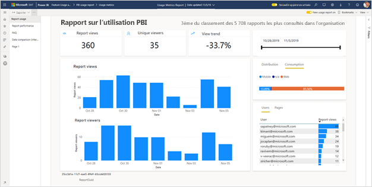

> [!NOTE]
> Vous pouvez exécuter des rapports de métriques d’utilisation seulement dans le service Power BI. Toutefois, si vous enregistrez un rapport des métriques d’utilisation ou que vous l’épinglez à un tableau de bord, vous pouvez l’ouvrir et le manipuler sur des appareils mobiles.

## Prérequis

- Vous avez besoin d’une licence Power BI Pro pour exécuter et accéder aux données des métriques d’utilisation. Cependant, la fonctionnalité de métriques d’utilisation capture les informations d’utilisation de tous les utilisateurs, quelle que soit la licence qui leur est attribuée.
- Pour pouvoir accéder aux métriques d’utilisation améliorées, vous devez créer le rapport dans un espace de travail moderne et avoir un accès en modification à ce rapport.
- Votre administrateur Power BI doit avoir autorisé les métriques d’utilisation pour les créateurs de contenu. Il peut aussi avoir activé la collecte des données par utilisateur dans les métriques d’utilisation. Pour plus d’informations, consultez [Activer ces options dans le portail d’administration](../admin/service-admin-portal.md#control-usage-metrics).

## Créer et afficher un rapport de métriques d’utilisation amélioré

Seuls les utilisateurs disposant d’autorisations d’administrateur, de membre ou de contributeur peuvent afficher le rapport de métriques d’utilisation amélioré. Les autorisations d’affichage ne sont pas suffisantes. Si vous êtes au moins contributeur sur l’espace de travail moderne dans lequel se trouve votre rapport, vous pouvez suivre la procédure ci-dessous pour afficher les métriques d’utilisation améliorées :

1. Ouvrez l’espace de travail qui contient le rapport pour lequel vous souhaitez analyser les métriques d’utilisation.
2. Dans la liste de contenu de l’espace de travail, ouvrez le menu contextuel du rapport et sélectionnez **Afficher le rapport de métriques d’utilisation**. Vous pouvez également ouvrir le rapport, ouvrir le menu contextuel dans la barre de commandes, puis sélectionner **Métriques d’utilisation**.

    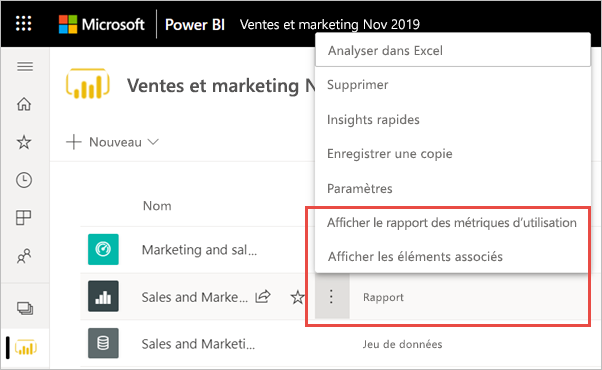

1. La première fois que vous procédez de la sorte, Power BI crée le rapport des métriques d’utilisation et vous avertit quand il est prêt.

    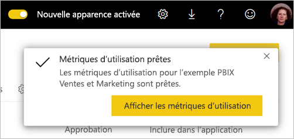

1. Pour voir les résultats, sélectionnez **Afficher les métriques d’utilisation**.
2. Si c’est la première fois que vous effectuez cette opération, Power BI est susceptible d’ouvrir l’ancien rapport de métriques d’utilisation. Pour afficher le rapport de métriques d’utilisation amélioré, basculez Nouveau rapport d’utilisation sur **Activé** en haut à droite.

    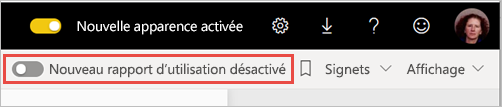

    > [!NOTE]
    > La bascule Nouveau rapport d’utilisation n’est disponible que si le rapport se trouve dans un espace de travail moderne. Les espaces de travail hérités ne proposent pas de rapports de métriques d’utilisation améliorés.

## À propos du rapport de métriques d’utilisation amélioré

Quand vous affichez le rapport de métriques d’utilisation amélioré en suivant la procédure ci-dessus, Power BI génère un rapport prédéfini avec les métriques d’utilisation de ce contenu au cours des 30 derniers jours. Ce rapport est très similaire aux rapports Power BI que vous connaissez déjà. Vous pouvez le segmenter en fonction de la façon dont vos utilisateurs finaux ont reçu leur accès, et s’ils ont accédé au service via le web ou via une application mobile, etc. Le rapport de métriques d’utilisation évolue en même temps que les rapports et se met à jour quotidiennement avec les nouvelles données.

> [!NOTE]
> Les rapports de métriques d’utilisation ne s’affichent pas dans les listes Récents, Espaces de travail, Favoris, ni dans d’autres listes de contenu. Vous ne pouvez pas les ajouter à une application. Si vous épinglez une vignette du rapport sur les mesures d’utilisation à un tableau de bord, vous ne pouvez pas ajouter ce tableau de bord à une application.

### Jeu de données du rapport de métriques d’utilisation

Le rapport de métriques d’utilisation amélioré s’appuie sur un jeu de données de rapport de métriques d’utilisation que Power BI crée automatiquement lors du premier lancement du rapport. Power BI actualise ensuite ce jeu de données tous les jours. S’il n’est pas possible de modifier la planification de l’actualisation, vous pouvez en revanche mettre à jour les informations d’identification utilisées par Power BI pour actualiser les données de métriques d’utilisation. Cela peut être nécessaire pour reprendre l’actualisation planifiée si les informations d’identification ont expiré ou si vous avez supprimé l’utilisateur qui a lancé à l’origine le rapport de métriques d’utilisation à partir de l’espace de travail dans lequel se trouve le jeu de données.

> [!NOTE]
> Bien qu’en préversion, le jeu de données de métriques d’utilisation peut présenter des changements mineurs qui affectent les rapports personnalisés.  

### Pages du rapport de métriques d’utilisation

Le rapport de métriques d’utilisation amélioré comporte les pages suivantes :

- **Utilisation du rapport** : informations sur les vues et les visiteurs du rapport, notamment le nombre d’utilisateurs qui ont affiché le rapport par date.
- **Performance du rapport** : durées d’ouverture types du rapport décomposées par méthode de consommation et type de navigateur.
- **FAQ** : réponses aux questions fréquentes, par exemple, qu’est-ce qu’un « visiteur » ou une « vue » ?

### Métriques figurant dans le rapport

| **Page** | **Métrique** | **Description** |
| --- | --- | --- |
| Utilisation des rapports | Vues de rapport | Une vue de rapport est enregistrée chaque fois qu’un utilisateur ouvre un rapport. Notez que la définition d’une vue diffère de celle des rapports de métriques d’utilisation précédents. Le fait de changer de page n’est plus considéré comme une vue supplémentaire. Certaines activités comme le partage et l’épinglage ne sont plus prises en compte dans les métriques d’utilisation.|
| Utilisation des rapports | Visiteurs uniques | Un visiteur est une personne qui a ouvert le rapport au moins une fois au cours de la période (en fonction du compte d’utilisateur AAD). |
| Utilisation des rapports | Tendance des vues | La tendance des vues reflète les modifications du nombre de vues au fil du temps. Elle compare la première moitié de la période sélectionnée à la seconde moitié. |
| Utilisation des rapports | Segment de date | Vous pouvez modifier la période sur la page Utilisation du rapport, par exemple pour calculer les tendances hebdomadaires ou bihebdomadaires. Dans le coin inférieur gauche de la page Utilisation du rapport, vous pouvez déterminer la date la plus ancienne et la plus récente à laquelle les données d’utilisation sont disponibles pour le rapport sélectionné. |
| Utilisation des rapports | Rank | Selon le nombre de vues, le classement indique la popularité d’un rapport par rapport à tous les autres rapports de l’organisation. Un classement de 1 signifie que le rapport a le plus grand nombre de vues de tous les rapports de l’organisation.   |
| Utilisation des rapports | Vues du rapport par jour | Nombre total de vues par jour. |
| Utilisation des rapports | Visiteurs du rapport par jour | Nombre total d’utilisateurs différents qui ont consulté le rapport (en fonction du compte d’utilisateur AAD). |
| Utilisation des rapports | Méthode de distribution | Manière dont les utilisateurs ont obtenu l’accès au rapport, par exemple en tant que membres d’un espace de travail, suite au partage du rapport ou en installant une application. |
| Utilisation des rapports | Segment de plateforme | Manière dont les utilisateurs ont accédé au rapport, par l’intermédiaire du service Power BI (powerbi.com), de Power BI Embedded ou d’un appareil mobile. |
| Utilisation des rapports | Utilisateurs avec vues de rapport | Liste des utilisateurs qui ont ouvert le rapport trié par nombre de vues. |
| Utilisation des rapports | Pages | Si le rapport comporte plus d’une page, segmentez-le par page(s) visitées(s). Si vous voyez une option de liste « Vide », cela signifie qu’une page de rapport a été ajoutée récemment (dans les 24 heures, le nom réel de la nouvelle page s’affiche dans la liste des segments) et/ou que des pages de rapport ont été supprimées. « Vide » capture ces types de situations. |
| Performance du rapport | Durée d’ouverture type | 50e centile du temps nécessaire à l’ouverture du rapport, soit la durée au-dessous de laquelle 50 % des actions d’ouverture de rapport sont effectuées. La page Performance du rapport décompose également la durée d’ouverture type du rapport par méthode de consommation et type de navigateur.   |
| Performance du rapport | Tendance de la durée d’ouverture | La tendance de la durée d’ouverture reflète les changements de performance de l’ouverture du rapport dans le temps. Elle compare les durées d’ouverture du rapport sur la première moitié de la période sélectionnée avec celles de la seconde moitié. |
| Performance du rapport | Segment de date | Vous pouvez modifier la période sur la page Performance du rapport, par exemple pour calculer les tendances hebdomadaires ou bihebdomadaires. En bas à gauche de la page Performance du rapport, vous pouvez déterminer la date la plus ancienne et la plus récente à laquelle les données d’utilisation sont disponibles pour le rapport sélectionné. |
| Performance du rapport | Performance journalière | Performance pour 10 %, 50 % et 90 % des actions d’ouverture de rapport calculées pour chaque jour. |
| Performance du rapport | Performance sur 7 jours | Performance pour 10 %, 50 % et 90 % des actions d’ouverture de rapport calculées sur les 7 derniers jours pour chaque date. |
| Performance du rapport | Méthode de consommation | Manière dont les utilisateurs ont ouvert le rapport, par l’intermédiaire du service Power BI (powerbi.com), de Power BI Embedded ou d’un appareil mobile. |
| Performance du rapport | Browsers | Navigateur utilisé par les utilisateurs pour ouvrir le rapport, par exemple Firefox, Edge ou Chrome. |

## Mettre à jour les informations d’identification du rapport de métriques d’utilisation

Suivez la procédure ci-dessous pour devenir propriétaire d’un jeu de données de rapport de métriques d’utilisation et mettre à jour les informations d’identification.

1. Ouvrez l’espace de travail qui contient le rapport pour lequel vous souhaitez mettre à jour le jeu de données du rapport de métriques d’utilisation.
2. Dans la barre d’en-tête noire en haut, sélectionnez l’icône **Paramètres**, puis **Paramètres**.

    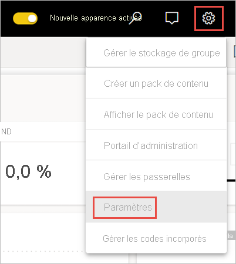

3. Basculez vers l’onglet **Jeux de données**.

1. Sélectionnez le jeu de données du rapport de métriques d’utilisation. 

    
    
    Si vous n’êtes pas propriétaire actuel du jeu de données, vous devez le devenir pour pouvoir mettre à jour les informations d’identification de la source de données. 
    
5. Sélectionnez le bouton **Devenir propriétaire**, puis à nouveau **Devenir propriétaire** dans la boîte de dialogue **Paramètres de propriété du jeu de données**.

1. Sous **Informations d’identification de la source de données**, sélectionnez **Modifier les informations d’identification**.

    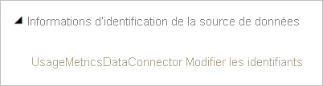

2. Dans la boîte de dialogue **Configurer le rapport de métriques d’utilisation**, sélectionnez **Se connecter**.

    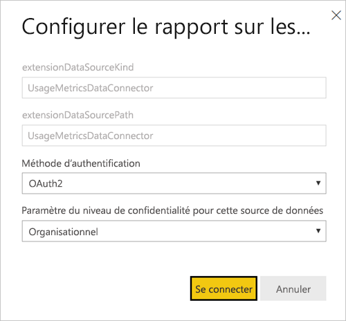

1. Complétez la séquence de connexion. Une notification indique que la source de données a bien été mise à jour.

    > [!NOTE]
    > Le jeu de données du rapport de métriques d’utilisation comporte les données d’utilisation des 30 derniers jours. L’importation des nouvelles données d’utilisation peut prendre jusqu’à 24 heures. L’interface utilisateur Power BI ne permet pas de déclencher une actualisation manuelle.

## Désactiver les rapports de métriques d’utilisation

Les rapports de métriques d’utilisation sont une fonctionnalité que l’administrateur Power BI ou l’administrateur général peut activer ou désactiver. Les administrateurs disposent d’un contrôle granulaire sur les utilisateurs ayant accès aux métriques d’utilisation. Par défaut, celles-ci sont activées pour tous les utilisateurs au sein de l’organisation. Pour plus d’informations sur ces paramètres, consultez [Contrôler les métriques d’utilisation](../admin/service-admin-portal.md#control-usage-metrics) dans l’article sur le portail d’administration.

> [!NOTE]
> Seuls les administrateurs du locataire Power BI peuvent voir le portail d’administration et modifier les paramètres.

## Exclure les informations utilisateur des rapports de métriques d’utilisation

Par défaut, les données par utilisateur sont activées pour les métriques d’utilisation et les informations des comptes des consommateurs des contenus sont incluses dans le rapport des métriques. Si les administrateurs ne souhaitent pas exposer ces informations à certains ou à l’ensemble des utilisateurs, ils peuvent les exclure de leurs rapports d’utilisation en désactivant Données par utilisateur dans les métriques d’utilisation pour les créateurs de contenu dans les paramètres de tenant du portail d’administration Power BI pour les groupes de sécurité spécifiés ou pour l’ensemble de l’organisation.

1. Dans l’onglet **Paramètres du tenant** du portail d’administration, développez **Données par utilisateur dans les métriques pour les créateurs de contenu** sous **Paramètres d’audit et d’utilisation**, puis sélectionnez **Désactivé**.

2. Choisissez si vous souhaitez **Supprimer toutes les données existantes par utilisateur dans le contenu des métriques d’utilisation actuelles**, puis sélectionnez **Appliquer**.

    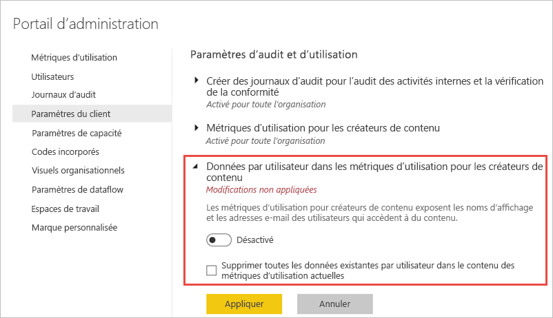

Si les informations utilisateur sont exclues, le rapport d’utilisation fait référence aux utilisateurs comme Sans nom.

Quand les métriques d’utilisation sont désactivées pour toute l’organisation, les administrateurs peuvent utiliser l’option Supprimer tout le contenu des métriques d’utilisation pour supprimer toutes les vignettes des rapports et des tableaux de bord existants qui ont été générées à partir des rapports de métriques d’utilisation. Cette option supprime tout accès aux données de métriques d’utilisation pour tous les utilisateurs au sein de l’organisation qui peuvent déjà les utiliser. La suppression du contenu de métriques d’utilisation existantes est irréversible.

> [!NOTE]
> Seuls les administrateurs du tenant Power BI peuvent voir le portail d’administration et configurer le paramètre Données par utilisateur dans les métriques d’utilisation pour les créateurs de contenu.

## Personnaliser le rapport de métriques d’utilisation

Pour explorer les données du rapport ou créer vos propres rapports sur le jeu de données sous-jacent, vous avez plusieurs options :

- **[Faire une copie du rapport](#create-a-copy-of-the-usage-report) dans le service Power BI :**   utilisez **Enregistrer une copie** pour créer une instance distincte du rapport de métriques d’utilisation, que vous pouvez personnaliser en fonction de vos besoins spécifiques.
- **[Se connecter au jeu de données](#create-a-new-usage-report-in-power-bi-desktop) avec un nouveau rapport :**   pour chaque espace de travail, le jeu de données porte le nom « Rapport de métriques d’utilisation », comme nous l’avons vu dans la section [Jeu de données du rapport de métriques d’utilisation](#usage-metrics-report-dataset). Vous pouvez utiliser Power BI Desktop pour générer des rapports de métriques d’utilisation personnalisés basés sur le jeu de données sous-jacent.
- **[Utiliser Analyser dans Excel](#analyze-usage-data-in-excel) :**   vous pouvez également tirer parti des tableaux croisés dynamiques, des graphes et des fonctionnalités de segment de Microsoft Excel 2010 SP1 (et versions ultérieures) pour analyser les données d’utilisation de Power BI. [Découvrez la fonctionnalité Analyser dans Excel.](service-analyze-in-excel.md)

### Créer une copie du rapport d’utilisation

Quand vous créez une copie du rapport d’utilisation prédéfini en lecture seule, Power BI crée une instance modifiable du rapport. À première vue, il se présente de la même façon. Cependant, vous pouvez maintenant ouvrir le rapport en mode Édition, ajouter de nouvelles visualisations, des filtres et des pages, modifier ou supprimer les visualisations existantes, etc. Power BI enregistre le nouveau rapport dans l’espace de travail actuel.

1. Dans le nouveau rapport de métriques d’utilisation, sélectionnez le menu **Plus d’options** (…), puis **Enregistrer une copie**.

    

2. Dans la boîte de dialogue **Enregistrer le rapport**, entrez un nom, puis sélectionnez **Enregistrer**.

    Power BI crée un rapport Power BI modifiable, enregistré dans l’espace de travail actif, puis ouvre la copie du rapport. 

3. Sélectionnez le menu **Plus d’options** (…), puis **Modifier** pour basculer en mode Édition. 

    Vous pouvez, par exemple, modifier les filtres, ajouter des pages et générer de nouvelles visualisations, mettre en forme les polices et les couleurs, etc.

1. Le nouveau rapport est enregistré dans l’onglet Rapports de l’espace de travail actif et ajouté à la liste des contenus Récents.

    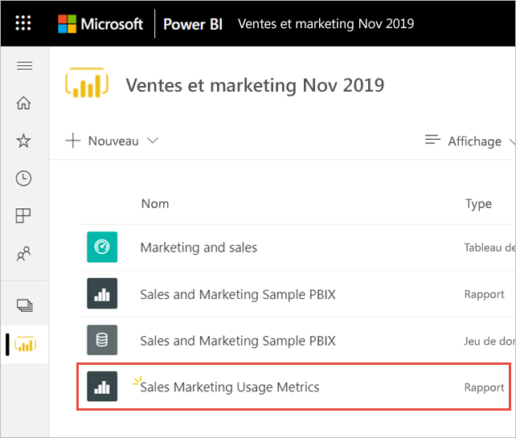
    
> [!NOTE]
> Lorsque vous enregistrez une copie du rapport de métriques d’utilisation, elle est traitée comme un rapport Power BI standard. Il sera accessible à tous les utilisateurs qui disposent d’autorisations d’affichage dans l’espace de travail, y compris les utilisateurs du rôle viewer.

### Créer un rapport d’utilisation dans Power BI Desktop

Vous pouvez créer un nouveau rapport d’utilisation dans Power BI Desktop, à partir du jeu de données du rapport de métriques d’utilisation. Pour établir une connexion au jeu de données du rapport de métriques d’utilisation et créer votre propre rapport, vous devez être connecté au service Power BI dans Power BI Desktop. 

1. Ouvrez Power BI Desktop.

2. Si vous n’êtes pas connecté au service Power BI, sélectionnez **Se connecter** dans le menu **Fichier**.

1. Pour vous connecter au jeu de données du rapport de métriques d’utilisation, sélectionnez **Obtenir des données** dans le ruban **Accueil**.

4. Dans le volet gauche, sélectionnez **Power Platform**, puis **Jeux de données Power BI** > **Se connecter**.

    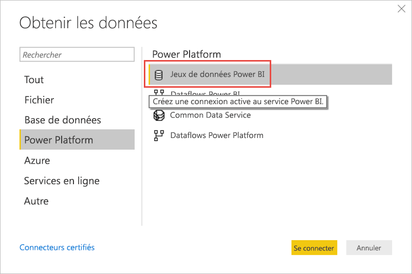

1. Faites défiler jusqu’au jeu de données souhaité ou tapez *Rapport de métriques d’utilisation* dans la zone de recherche. 

6. Vérifiez, dans la colonne Espace de travail, que vous sélectionnez le bon jeu de données, puis sélectionnez **Créer**. 

    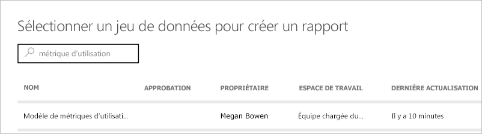

7. Consultez la liste Champs dans Power BI Desktop, qui vous permet d’accéder aux tables, aux colonnes et aux mesures dans le jeu de données sélectionné.

    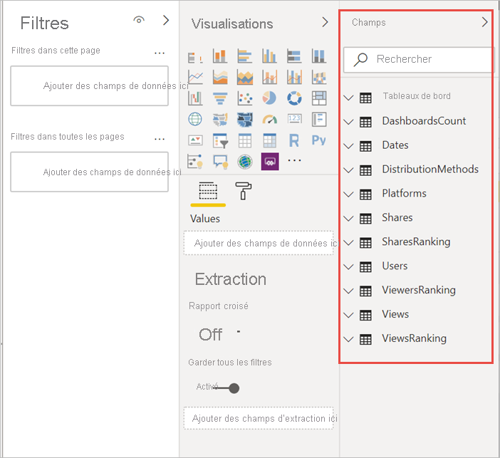

1. Vous pouvez désormais créer et partager des rapports d’utilisation personnalisés, le tout à partir du même jeu de données du rapport de métriques d’utilisation.

### Analyser les données d’utilisation dans Excel

Lorsque vous vous connectez aux données d’utilisation dans Excel, vous pouvez créer des tableaux croisés dynamiques qui utilisent les mesures prédéfinies. Sachez que les tableaux croisés dynamiques d’Excel ne prennent pas en charge l’agrégation des champs numériques par glisser-déposer en cas de connexion à un jeu de données Power BI.

1. Avant toute chose, [créez une copie du rapport de métriques d’utilisation](#create-a-copy-of-the-usage-report) si vous ne l’avez pas déjà fait. 

2. Ouvrez le nouveau rapport de métriques d’utilisation, sélectionnez le menu **Plus d’options** (…), puis **Analyser dans Excel**.

    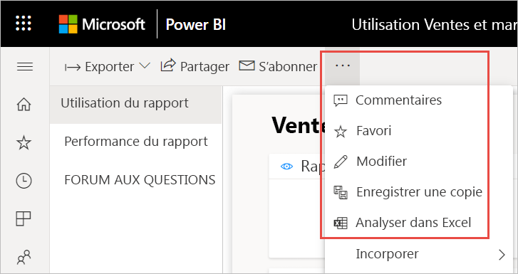

1. Si la boîte de dialogue **Des mises à jour Excel sont nécessaires** apparaît, sélectionnez **Télécharger** et installez les dernières mises à jour pour la connectivité Power BI, ou sélectionnez **J’ai déjà installé ces mises à jour**.

    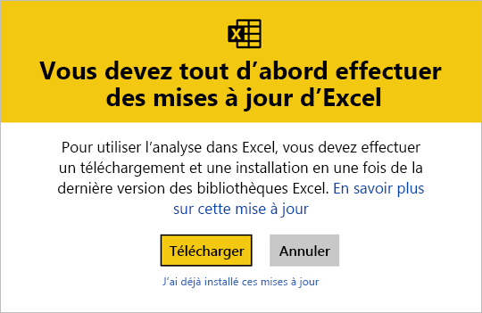

    > [!NOTE]
    > Certaines organisations appliquent des règles de stratégie de groupe qui empêchent l’installation dans Excel des mises à jour Analyser dans Excel requises. Si vous ne parvenez pas à installer les mises à jour, contactez votre administrateur.

1. Dans la boîte de dialogue du navigateur qui vous demande ce que vous voulez faire avec le fichier .odc du rapport de métriques d’utilisation, sélectionnez **Ouvrir**.

    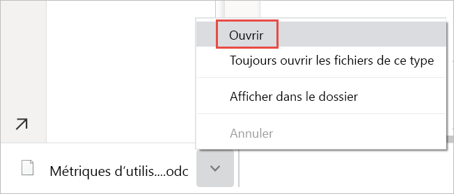

1. Power BI lance Excel. Vérifiez le nom et le chemin du fichier .odc, puis sélectionnez **Activer**.

    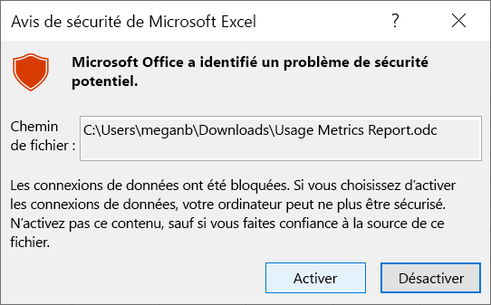

1. Maintenant qu’Excel s’est ouvert et que vous disposez d’un tableau croisé dynamique vide, vous pouvez faire glisser des champs dans les zones Lignes, Colonnes, Filtres et Valeurs et créer des vues personnalisées dans vos données d’utilisation.

    

## Métriques d’utilisation dans les clouds nationaux

Power BI est disponible dans des cloud nationaux distincts. Ces clouds offrent les mêmes niveaux de sécurité, de confidentialité, de conformité et de transparence que la version internationale de Power BI, combinés à un modèle unique pour les réglementations locales sur la fourniture de services, la résidence des données, l’accès et le contrôle. Les métriques d'utilisation modernes sont actuellement disponibles dans les clouds nationaux suivants : 

- Cloud communautaire pour le service public des États-Unis
- Cloud communautaire pour le service public des États-Unis – High
- Ministère de la défense des États-Unis
- Chine

Pour plus d’informations, consultez [Clouds nationaux](https://powerbi.microsoft.com/clouds/).

## Considérations et limitations

Il est important de savoir que le rapport de métriques d’utilisation amélioré peut présenter des différences avec son prédécesseur. En particulier, il se base désormais sur les données d’activité collectées à partir du service Power BI. Les versions précédentes du rapport de métriques d’utilisation s’appuyaient sur la télémétrie des clients, qui ne correspondent pas toujours aux métriques d’utilisation collectées à partir du service. En outre, le rapport de métriques d’utilisation amélioré applique une définition différente du terme « vue ». Une vue est un événement d’ouverture de rapport, enregistré dans le service chaque fois qu’un utilisateur ouvre un rapport. Le fait de changer de page n’est plus considéré comme une vue supplémentaire.

> [!NOTE]
> Étant donné que le rapport de métriques d’utilisation amélioré s’appuie sur les données d’activité collectées à partir du service Power BI, les métriques d’utilisation correspondent désormais au nombre agrégé d’activités dans les journaux d’audit et les journaux d’activité. La sous-évaluation et la surévaluation du nombre d’activités en raison de connexions réseau incohérentes, de bloqueurs de publicité ou d’autres problèmes côté client ne biaisent plus le nombre de visiteurs et de vues.

Outre les différences ci-dessus entre la version précédente et la version améliorée du rapport de métriques d’utilisation, notez les limitations suivantes de la préversion :

- Les métriques d’utilisation du tableau de bord s’appuient toujours sur la version précédente des rapports de métriques d’utilisation.
- Les rapports de métriques d’utilisation améliorés sont disponibles uniquement pour les rapports des espaces de travail modernes. Les rapports des espaces de travail hérités ne prennent en charge que la version précédente des rapports de métriques d’utilisation.
- Les métriques de performances des rapports sont basées sur la télémétrie des clients. Certains types de vues ne sont pas inclus dans les mesures de performances. Par exemple, lorsqu’un utilisateur sélectionne un lien vers un rapport dans un message électronique, la vue est comptabilisée dans l’utilisation des rapports, sans qu’il y ait d’événement dans les métriques de performances.
- Les métriques de performances des rapports ne sont pas disponibles pour les rapports paginés. L’onglet Pages de la page Utilisation du rapport ainsi que les graphes de la page Performances du rapport n’affichent pas de données pour ces types de rapports.
- Le masquage des utilisateurs ne fonctionne pas comme prévu avec des groupes imbriqués. Si votre organisation a désactivé Données par utilisateur dans les métriques d’utilisation pour les créateurs de contenu dans les paramètres de tenant du portail d’administration Power BI, seuls les membres du niveau supérieur sont masqués. Les membres des sous-groupes sont toujours visibles.
- L’initialisation du jeu de données du rapport de métriques d’utilisation peut prendre quelques minutes, ce qui entraîne l’affichage d’un rapport de métriques d’utilisation vide, car l’interface utilisateur de Power BI n’attend pas la fin de l’actualisation. Vérifiez que l’opération d’actualisation a réussi dans l’historique d’actualisation, dans les paramètres du jeu de données du rapport de métriques d’utilisation.
- L’initialisation du jeu de données du rapport de métriques d’utilisation est susceptible d’échouer en raison d’un délai d’expiration au cours de l’actualisation. Pour résoudre ce problème, consultez la section Dépannage.
- Le partage est désactivé pour le rapport de métriques d’utilisation. Pour pouvoir accorder aux utilisateurs un accès en lecture au rapport, vous devez d’abord leur donner accès à l’espace de travail.
- Dans certains scénarios, vous pouvez remarquer que les données de performances sont manquantes. Cela peut se produire si un utilisateur ouvre un rapport et interagit avec lui avant la fin de son chargement ou si une erreur s’est produite lors du chargement du rapport.
- Les données de performances s’appuient sur le client/l’appareil qui envoie les données à Power BI. Selon la latence du réseau, les bloqueurs de publicités, les pare-feu et les règles de réseau définies par votre organisation, les données de performances peuvent ne jamais parvenir à Power BI. Par conséquent, elles ne peuvent que présenter un exemple et ne peuvent pas inclure ni montrer tous les utilisateurs. 

## Forum Aux Questions

Outre les considérations et limitations ci-dessus, les questions et les réponses suivantes, sur les métriques d’utilisation, pourront être utiles aux utilisateurs et aux administrateurs :

**Q :** Je ne parviens pas à exécuter les métriques d’utilisation sur un rapport.

**R :** Vous ne pouvez voir les métriques d’utilisation que pour les rapports dont vous êtes propriétaire ou que vous avez l’autorisation de modifier.

**Q :** Pourquoi ne puis-je pas voir le Nouveau rapport d’utilisation sur la bascule en haut à droite de mon rapport de métriques d’utilisation existant ?

**R :** Le rapport de métriques d’utilisation amélioré n’est disponible que dans les espaces de travail modernes.

**Q :** Quelle est la période couverte par le rapport ?

**R :** Le rapport d’utilisation se base sur les données d’activité des 30 derniers jours, à l’exception de la date du jour. Il est possible d’affiner la période à l’aide du segment Date sur la page Utilisation du rapport, par exemple pour analyser uniquement les données de la semaine précédente.

**Q :** Quand les dernières données d’activité en date s’affichent-elles ?

**R :** Le rapport d’utilisation comprend les données d’activité jusqu’au dernier jour complet selon le fuseau horaire UTC. Les données affichées dans le rapport dépendent également de l’heure d’actualisation du jeu de données. Power BI l’actualise une fois par jour.

**Q :** Les données ne semblent pas à jour.

**R :** Notez que les nouvelles données d’activité peuvent mettre jusqu’à 24 heures à s’afficher dans le rapport d’utilisation.

**Q :** Quelle est la source des données d’utilisation ?

**R :** Le jeu de données du rapport de métriques d’utilisation importe les données à partir d’un magasin de métriques d’utilisation interne à Power BI à l’aide d’un Connecteur de données de métriques d’utilisation personnalisé. Vous pouvez modifier les informations d’identification de ce connecteur sur la page Paramètres du jeu de données du rapport de métriques d’utilisation.

**Q :** Comment me connecter aux données ? Ou modifier le rapport par défaut ?

**R :** Vous pouvez créer une copie du rapport d’utilisation prédéfini en lecture seule. La copie du rapport se connecte au même jeu de données du rapport de métriques d’utilisation. Vous pouvez ainsi modifier les détails du rapport.

**Q :** Qu’est-ce qu’un « visiteur » et qu’est-ce qu’une « vue » ?

**R :** Un visiteur est une personne qui a ouvert le rapport au moins une fois au cours de la période. Une vue est un événement d’ouverture de rapport. Une vue de rapport est enregistrée chaque fois qu’un utilisateur ouvre un rapport.

Notez que la définition d’une vue diffère de celle des rapports de métriques d’utilisation précédents. Le fait de changer de page n’est plus considéré comme une vue supplémentaire.

**Q :** Comment la « tendance des vues » est-elle calculée ?

**R :** La tendance des vues reflète les modifications du nombre de vues au fil du temps. Elle compare la première moitié de la période sélectionnée à la seconde moitié. Vous pouvez modifier la période à l’aide du segment Date sur la page Utilisation du rapport, par exemple pour calculer les tendances hebdomadaires ou bihebdomadaires.

**Q :** Que signifient « distribution » et « plateforme » ?

**R :** La distribution montre comment les visiteurs ont obtenu l’accès à un rapport : partagé directement, par l’accès à l’espace de travail ou par le biais d’une application.

La plateforme indique la technologie utilisée par le visiteur pour ouvrir le rapport : PowerBI.com, Mobile ou Embedded.

**Q :** Comment le classement des rapports fonctionne-t-il ?

**R :** Selon le nombre de vues, le classement indique la popularité d’un rapport par rapport à tous les autres rapports de l’organisation. Un classement de 1 signifie que le rapport a le plus grand nombre de vues de tous les rapports de l’organisation.

**Q :** À quoi correspondent les « utilisateurs sans nom » ?

**R :** Votre organisation peut décider d’exclure les informations utilisateur de votre rapport d’utilisation. Dans ce cas, le rapport fait référence aux utilisateurs comme Sans nom.

**Q :** Qu’est-ce que la « durée d’ouverture type du rapport » ?

**R :** La durée d’ouverture type du rapport 50e centile du temps nécessaire à l’ouverture du rapport, soit la durée au-dessous de laquelle 50 % des actions d’ouverture de rapport sont effectuées. La page Performance du rapport décompose également la durée d’ouverture type du rapport par méthode de consommation et type de navigateur.

**Q :** Comment la « tendance de la durée d’ouverture » est-elle calculée ?

**R :** La tendance de la durée d’ouverture reflète les changements de performance de l’ouverture du rapport dans le temps. Elle compare les durées d’ouverture du rapport sur la première moitié de la période sélectionnée avec celles de la seconde moitié. Vous pouvez modifier la période à l’aide du segment Date sur la page Performance du rapport, par exemple pour calculer les tendances hebdomadaires ou bihebdomadaires.

**Q :**  Il existe quatre rapports dans la version précédente du rapport de métriques d’utilisation, mais la version améliorée n’en affiche que trois.

**R :**  Le rapport de métriques d’utilisation amélioré inclut uniquement les rapports qui ont été ouverts au cours des 30 derniers jours, tandis que la version précédente couvre les 90 derniers jours. Si un rapport n’apparaît pas dans le rapport de métriques d’utilisation amélioré, c’est probablement parce qu’il n’a pas été utilisé depuis plus de 30 jours.

## Résoudre les problèmes : Supprimer le jeu de données

Si vous soupçonnez des problèmes de cohérence des données ou d’actualisation, il peut être judicieux de supprimer le jeu de données du rapport de métriques d’utilisation existant. Vous pouvez ensuite exécuter une nouvelle fois Afficher les métriques d’utilisation pour générer un nouveau jeu de données avec les rapports de métriques d’utilisation améliorés associés. Procédez comme suit.

### Supprimer le jeu de données

1. Ouvrez l’espace de travail qui contient le rapport pour lequel vous souhaitez réinitialiser le jeu de données du rapport de métriques d’utilisation.

2. Dans la barre d’en-tête noire en haut, sélectionnez l’icône **Paramètres**, puis **Paramètres**.

    

3. Basculez vers l’onglet **Jeux de données**, puis sélectionnez le jeu de données du rapport de métriques d’utilisation. 

    

5. Copiez l’ID de l’espace de travail et du jeu de données à partir de l’URL qui s’affiche dans la barre d’adresses de votre navigateur.

    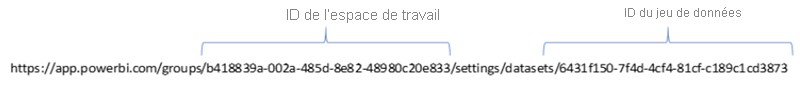

1. Dans votre navigateur, accédez à [https://docs.microsoft.com/rest/api/power-bi/datasets/deletedatasetingroup](https://docs.microsoft.com/rest/api/power-bi/datasets/deletedatasetingroup), puis sélectionnez le bouton **Essayer**.

    

1. Connectez-vous à Power BI, collez l’ID de l’espace de travail dans la zone de texte **groupId** et l’ID du jeu de données dans la zone de texte **datasetId**, puis sélectionnez **Exécuter**. 

    

1. Sous le bouton **Exécuter**, vérifiez que le service retourne le code de réponse **200**. Ce code indique que le jeu de données et les rapports de métriques d’utilisation associés ont bien été supprimés.

    

### Créer un nouveau rapport de métriques d’utilisation

1. Dans le service Power BI, vous voyez que le jeu de données a disparu.

    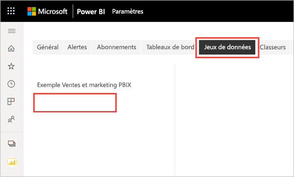

2. Si vous voyez toujours le rapport de métriques d’utilisation dans la liste Rapports, actualisez votre navigateur.

3. [Créez un nouveau rapport de métriques d’utilisation](#create--view-an-improved-usage-metrics-report).

## Étapes suivantes

[Administration de Power BI dans le portail d’administration](../admin/service-admin-portal.md)

D’autres questions ? [Posez vos questions à la communauté Power BI](https://community.powerbi.com/)
