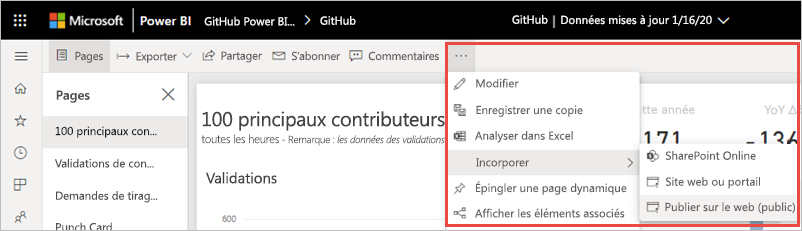
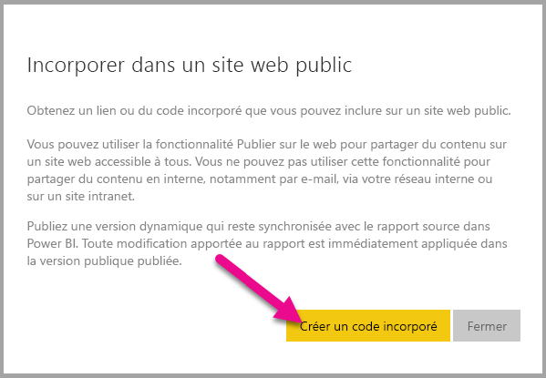
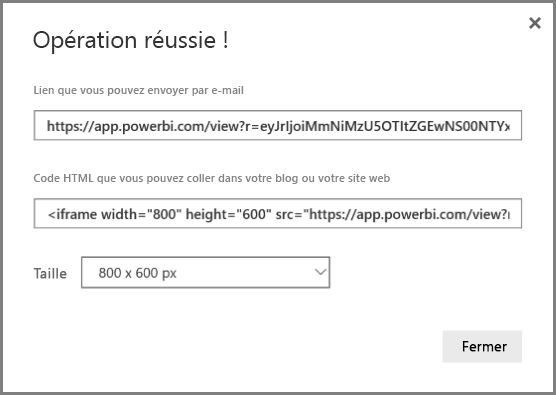
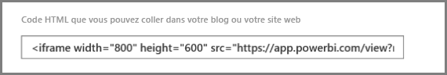
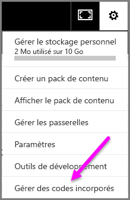
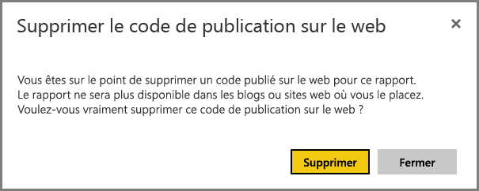

# Publication sur le web à partir de Power BI

Avec l’option **Publier sur le web** de Power BI, vous pouvez facilement incorporer du contenu Power BI interactif dans des billets de blog, des sites web, des e-mails ou des réseaux sociaux. Vous pouvez également modifier, mettre à jour ou actualiser vos visuels publiés, ou bien annuler leur partage.

> [!WARNING]
> Quand vous utilisez **Publier sur le web** , tout le monde sur Internet peut voir le rapport ou visuel que vous publiez. La visualisation ne nécessite aucune authentification. Elle inclut la visualisation des données à un niveau détaillé qui sont agrégées dans vos rapports. Avant de publier un rapport, vérifiez que vous voulez bien partager publiquement les données et les visualisations. Ne publiez pas d’informations confidentielles ou propriétaires. En cas de doute, vérifiez les stratégies de votre organisation avant la publication.

>[!Note]
>Vous pouvez incorporer votre contenu de façon sécurisée dans un portail ou un site web interne. Utilisez les options [Incorporer](service-embed-secure.md) ou [Incorporer dans SharePoint Online](service-embed-report-spo.md). Ces options garantissent que toutes les autorisations et la sécurité des données sont appliquées quand vos utilisateurs visualisent vos données internes.

## Créer des codes incorporés avec Publier sur le web

**Publier sur le web** est disponible pour les rapports que vous pouvez modifier dans vos espaces de travail personnel et de groupe.  Cette option n’est pas disponible pour les rapports partagés avec vous ni pour ceux qui s’appuient sur la sécurité au niveau des lignes pour sécuriser les données. Consultez la section [**Limitations**](#limitations) ci-dessous pour obtenir la liste complète des situations où l’option **Publier sur le web** n’est pas prise en charge. Lisez l’ **avertissement** plus haut dans cet article avant d’utiliser la fonctionnalité **Publier sur le web**.

Les étapes suivantes décrivent comment utiliser **Publier sur le web**.

1. Ouvrez un rapport dans un espace de travail que vous pouvez modifier, puis sélectionnez **Plus d’options (...)**   > **Incorporer** > **Publier sur le web (public)** .

   
   
2. Si votre administrateur Power BI ne vous a pas autorisé à créer des codes incorporés, il peut être nécessaire de le contacter.

   
   
   Pour de l’aide sur la recherche de la personne qui peut activer Publier sur le web dans votre organisation, consultez [Recherche de votre administrateur Power BI](#find-your-power-bi-administrator) plus loin dans cet article.

3. Passez en revue le contenu de la boîte de dialogue et sélectionnez **Créer un code incorporé**.

   

4. Lisez l’avertissement, illustré ici, puis confirmez que les données peuvent être incorporées dans un site web public. Le cas échéant, sélectionnez **Publier**.

   

5. Une boîte de dialogue s’affiche avec un lien. Sélectionnez le lien pour l’envoyer par e-mail ou copiez le HTML. Vous pouvez l’incorporer dans du code comme un iFrame, ou le coller directement dans une page web ou un blog.

   

6. Si vous avez déjà créé un code incorporé pour un rapport et que vous sélectionnez **Publier sur le web** , vous ne verrez pas les boîtes de dialogue des étapes 2 à 4. Au lieu de cela, la boîte de dialogue **Code incorporé** s’affiche :

   

   Vous pouvez créer un seul code incorporé pour chaque rapport.

Si vous apportez des changements dans la boîte de dialogue, veillez à copier l’URL ou l’iFrame mis à jour pour utiliser les paramètres mis à jour dans votre page.

### Conseils pour les modes d’affichage

Quand vous incorporez du contenu dans un billet de blog, vous avez généralement besoin de l’ajuster à une taille d’écran spécifique.  Vous pouvez ajuster la hauteur et la largeur de la balise iFrame selon vos besoins. Toutefois, vous devez vérifier que votre rapport tient dans la zone donnée de l’iFrame. Pour cela, définissez un mode d’affichage approprié quand vous modifiez le rapport.

Le tableau suivant fournit des instructions sur le mode d’affichage et les effets de son incorporation.

| Mode d’affichage | Son aspect quand il est incorporé |
| --- | --- |
|  |Le mode d’affichage **Ajuster à la page** respecte la hauteur et la largeur de page de votre rapport. Si vous définissez les proportions de votre page sur *Dynamique* (par exemple, 16:9 ou 4:3), votre contenu est ajusté au sein de l’iFrame. En cas d’incorporation dans un iFrame, l’utilisation de l’option **Ajuster à la page** risque de générer un *cadre* , où un fond gris est affiché dans des zones de l’iFrame après que le contenu a été mis à l’échelle de manière à s’ajuster à l’iFrame. Pour diminuer le cadre, définissez la hauteur et la largeur de l’iFrame de manière appropriée. |
|  |Avec le mode d’affichage **Taille réelle** , le rapport conserve sa taille telle qu’elle est définie dans la page de rapport. Des barres de défilement peuvent ainsi apparaître dans votre iFrame. Définissez la hauteur et la largeur de l’iFrame afin d’éviter les barres de défilement. |
|  |Avec le mode d’affichage **Ajuster à la largeur** , le contenu tient dans la zone horizontale de l’iFrame. Une bordure apparaît quand même, mais le contenu est mis à l’échelle pour utiliser tout l’espace horizontal disponible. |

### Conseils pour la hauteur et la largeur de l’iFrame

Un code incorporé **Publier sur le web** se présente comme l’exemple suivant :

 
Vous pouvez modifier manuellement la largeur et la hauteur pour vous assurer que le code s’adapte exactement à la page dans laquelle vous l’incorporez.

Pour obtenir un ajustement idéal, vous pouvez essayer d’ajouter 56 pixels à la hauteur de l’iFrame pour correspondre à la taille actuelle de la barre inférieure. Si la page de votre rapport utilise la taille dynamique, le tableau ci-dessous fournit des tailles que vous pouvez utiliser pour obtenir un ajustement sans cadre.

| Proportions | Taille | Dimensions (largeur x hauteur) |
| --- | --- | --- |
| 16:9 |Small |640 x 416 px |
| 16:9 |Medium |800 x 506 px |
| 16:9 |Large |960 x 596 px |
| 4:3 |Petite |640 x 536 px |
| 4:3 |Medium |800 x 656 px |
| 4:3 |Grande |960 x 776 px |

## Gérer des codes incorporés

Une fois que vous avez créé un code incorporé **Publier sur le web** , vous pouvez gérer vos codes à partir du menu **Paramètres** du service Power BI. Si vous gérez des codes incorporés, vous pouvez supprimer le visuel ou le rapport de destination d’un code (ce qui rend le code incorporé inutilisable) ou récupérer celui-ci.

1. Pour gérer vos codes incorporés **Publier sur le web** , ouvrez **Paramètres** et sélectionnez **Gérer des codes incorporés**.

   

2. Vos codes incorporés s’affichent.

   

3. Vous pouvez récupérer ou supprimer un code incorporé. Sa suppression désactive tous les liens vers ce rapport ou visuel.

   

4. Si vous sélectionnez **Supprimer** , vous êtes invité à confirmer.

   

## Mises à jour des rapports et actualisation des données

Après avoir créé et partagé votre code incorporé **Publier sur le web** , le rapport est mis à jour avec les modifications que vous apportez. Le lien vers le code incorporé est immédiatement actif. Toute personne qui ouvre le lien peut l’afficher. Les données sont mises en cache pendant une heure à partir de l’heure à laquelle elles sont récupérées. Nous vous déconseillons d’utiliser la publication sur le web pour les données qui doivent être actualisées fréquemment. Pour en savoir plus, consultez la section [**Fonctionnement**](#howitworks) plus loin dans cet article. 

### Actualisation des données

Les actualisations de données sont répercutées automatiquement dans votre rapport ou élément visuel incorporé. Lorsque les données sont actualisées pour un modèle de données d’importation dans le service Power BI, le service efface le cache de données, ce qui permet de mettre à jour rapidement les données. Pour désactiver l’actualisation automatique, sélectionnez **Ne pas actualiser** dans la planification du jeu de données utilisé par le rapport.  

### Utilisation intensive

Une utilisation intensive peut se produire lorsqu’un rapport reçoit trop de requêtes dans un laps de temps réduit. Dans ce cas, les utilisateurs ne peuvent pas afficher ni interagir avec le rapport tant que la période d’utilisation intensive n’est pas terminée. 

Nous vous recommandons de définir un espace réservé d’image pour votre rapport. En cas d’utilisation intensive, les utilisateurs verront l’espace réservé d’image. 

Pour éviter une utilisation intensive, limitez le nombre de requêtes distinctes que votre rapport peut générer, ainsi que la fréquence d’actualisation des données.

## Visuels Power BI

Les visuels Power BI sont pris en charge par la fonctionnalité **Publier sur le web**. Quand vous utilisez **Publier sur le web** , les utilisateurs avec lesquels vous partagez votre visuel publié n’ont pas besoin d’activer les visuels Power BI pour visualiser le rapport.

## Présentation de la colonne d’état du code incorporé

>[!Note]
>Passez fréquemment en revue les codes incorporés que vous avez publiés. Supprimez ceux qui n’ont plus besoin d’être accessibles publiquement.

La page **Gérer des codes incorporés** comprend une colonne d’état. Par défaut, les codes incorporés sont **actifs** , mais peuvent aussi présenter l’un des états listés ci-dessous.

| État | Description |
| --- | --- |
| **Actif** |Le rapport est à la disposition des utilisateurs Internet qui peuvent l’afficher et interagir avec. |
| **Bloqué** |Le contenu du rapport ne respecte pas les [conditions d’utilisation de Power BI](https://powerbi.microsoft.com/terms-of-service). Microsoft l’a bloqué. Si vous pensez que le contenu a été bloqué par erreur, contactez le support. |
| **Non pris en charge** |Le jeu de données du rapport utilise la sécurité au niveau des lignes ou une autre configuration non prise en charge. Pour obtenir la liste complète, consultez la section [**Limitations**](#limitations). |
| **Enfreint** |Le code incorporé est en dehors de la stratégie de locataire définie. Cet état se produit généralement quand un code incorporé a été créé et que le paramètre de locataire **Publier sur le web** a été modifié de façon à exclure l’utilisateur qui est propriétaire du code incorporé. Si le paramètre de locataire est désactivé ou que l’utilisateur n’est plus autorisé à créer des codes incorporés, les codes incorporés existants affichent l’état **Enfreint**. Pour plus d’informations, consultez la section [Recherche de votre administrateur Power BI](#find-your-power-bi-administrator) dans cet article. |

## Signaler un problème lié à du contenu Publier sur le web

Pour signaler un problème lié à du contenu **Publier sur le web** incorporé dans un site web ou un blog, utilisez l’icône de **drapeau** située dans la barre inférieure du rapport **Publier sur le web**.

Vous êtes invité à envoyer un e-mail à Microsoft pour expliquer votre problème. Microsoft évalue le contenu au regard des [conditions d’utilisation de Power BI](https://powerbi.microsoft.com/terms-of-service) et prend les mesures nécessaires.

## Licences

Vous devez être un utilisateur de Microsoft Power BI pour utiliser la fonctionnalité **Publier sur le web**. Il n’est pas nécessaire que les lecteurs de votre rapport soient des utilisateurs Power BI.

## Fonctionnement (détails techniques)

Quand vous créez un code incorporé à l’aide de la fonctionnalité **Publier sur le web** , vous permettez aux utilisateurs Internet de voir le rapport. Comme votre rapport est disponible publiquement, vous pouvez vous attendre à ce que des lecteurs le partagent facilement au moyen des réseaux sociaux. Les utilisateurs peuvent consulter le rapport soit en ouvrant l’URL publique directe, soit en affichant l’URL incorporée dans une page web ou un blog. Lorsque les utilisateurs accèdent au rapport, Power BI met en cache la définition du rapport, ainsi que les résultats des requêtes nécessaires à l’affichage du rapport. Cette mise en cache garantit que le rapport est consultable par des milliers d’utilisateurs simultanés sans aucun impact sur les performances.

Les données sont mises en cache pendant une heure à partir de l’heure à laquelle elles sont récupérées. Si vous mettez à jour la définition du rapport (par exemple si vous changez son mode d’affichage) ou si vous actualisez les données qu’il contient, les modifications se refléteront dans la version du rapport consultée par vos utilisateurs au bout d’un certain temps. Lorsqu’une actualisation des données est effectuée pour un modèle de données d’importation, le service efface les données mises en cache et récupère de nouvelles données. Dans la plupart des cas, la mise à jour des données est quasiment simultanée à l’importation des données. Toutefois, pour les rapports qui comportent de nombreuses requêtes distinctes, la mise à jour peut prendre un certain temps. Étant donné que chacun des éléments et chacune des valeurs de données sont mis en cache indépendamment, lorsqu’une mise à jour de données se produit, l’utilisateur peut voir un mélange de valeurs anciennes et actuelles. Il est donc recommandé d’anticiper votre travail et de créer le code incorporé **Publier sur le web** seulement quand vous êtes satisfait des paramètres. Si vos données sont actualisées, réduisez le nombre d’actualisations et effectuez les actualisations pendant les heures creuses. Nous vous déconseillons d’utiliser la publication sur le web pour les données qui doivent être actualisées fréquemment.

## Recherche de votre administrateur Power BI

Le portail d’administration Power BI a des paramètres qui contrôlent qui peut publier sur le web. Collaborez avec l’[l’administrateur Power BI](../admin/service-admin-role.md) de votre organisation pour modifier les [paramètres de locataire de Publier sur le web](../admin/service-admin-portal.md#publish-to-web) dans le portail d’administration.

Pour les organisations de petite taille ou les personnes qui se sont inscrites à Power BI, vous n’avez peut-être pas encore un administrateur Power BI. Suivez notre [procédure de prise de contrôle de l’administration](/azure/active-directory/users-groups-roles/domains-admin-takeover). Dès que vous disposez d’un administrateur Power BI, il peut activer la création d’un code incorporé.

En général, les organisations établies disposent déjà d’un administrateur Power BI. Les personnes avec l’un des rôles suivants peuvent agir en tant qu’administrateur Power BI :

- Administrateurs généraux
- Utilisateurs avec le rôle d’administrateur du service Power BI dans Azure Active Directory

Vous devez [trouver une de ces personnes](/office365/admin/admin-overview/admin-overview#who-has-admin-permissions-in-my-business) dans votre organisation et lui demander de mettre à jour les [paramètres de locataire de Publier sur le web](../admin/service-admin-portal.md#publish-to-web) dans le portail d’administration.

## Limites

La fonctionnalité **Publier sur le web** est prise en charge pour la grande majorité des sources de données et des rapports dans le service Power BI. Cependant, les types de rapports suivants ne sont actuellement pas pris en charge ou ne sont pas disponibles avec **Publier sur le web**  :

- Rapports qui utilisent la sécurité au niveau des lignes.
- Rapports qui utilisent une source de données de connexion active, notamment une source de données tabulaire Analysis Services hébergée localement, une source de données multidimensionnelle Analysis Services et Azure Analysis Services.
- Rapports utilisant un [jeu de données partagé](../connect-data/service-datasets-across-workspaces.md) qui est stocké dans un autre espace de travail que le rapport.
- [Jeux de données partagés et certifiés](../connect-data/service-datasets-share.md)
- Rapports partagés directement ou via un pack de contenu d’organisation
- Rapports dans un espace de travail où vous n’êtes pas membre avec l’autorisation de modification.
- Les visuels « R » et Python ne sont actuellement pas pris en charge dans les rapports **Publier sur le web**.
- Exportation de données à partir de visuels dans un rapport qui a été publié sur le web.
- Visuels ArcGIS Maps for Power BI.
- Questions et réponses pour les visuels Power BI.
- Rapports contenant des mesures DAX au niveau du rapport.
- Modèles de requêtes de données à authentification unique.
- Informations confidentielles ou propriétaires sécurisées.
- La fonctionnalité d’authentification automatique fournie avec l’option **Incorporer** ne fonctionne pas avec l’API JavaScript Power BI. Pour l’API JavaScript Power BI, utilisez l’approche [les données appartiennent à l’utilisateur](../developer/embedded/embed-sample-for-your-organization.md) pour l’incorporation.

## Étapes suivantes

- [Composant web du rapport SharePoint Online](service-embed-report-spo.md) 

- [Incorporer un rapport dans un site web ou portail sécurisé](service-embed-secure.md)

D’autres questions ? [Posez vos questions à la communauté Power BI](https://community.powerbi.com/)
