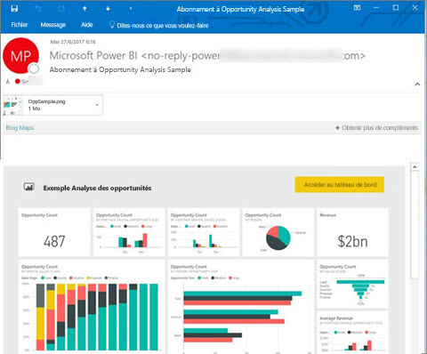
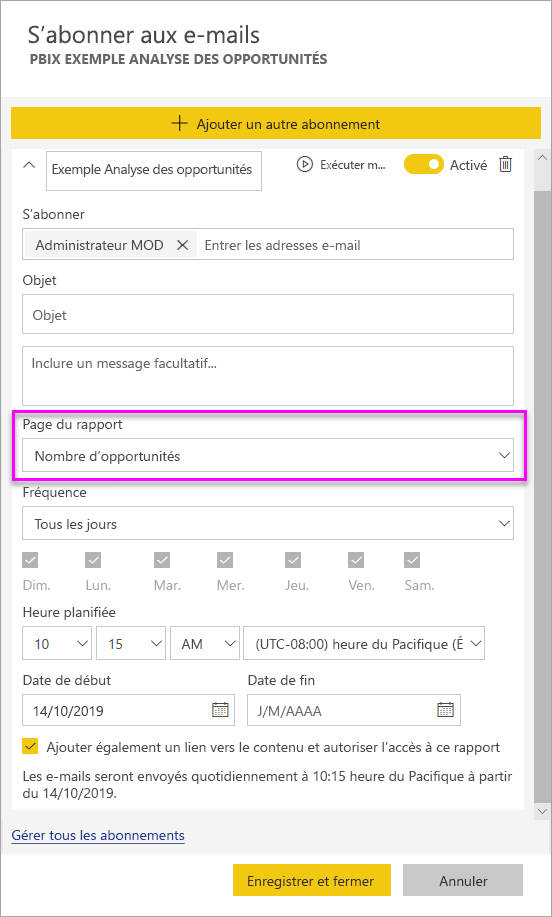
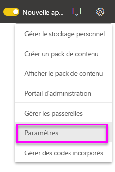

# Vous abonner vous et d’autres utilisateurs à des rapports et tableaux de bord dans le service Power BI

Vous pouvez vous abonner vous et vos collègues aux pages de rapport, tableaux de bord et rapports paginés qui vous intéressent le plus. Les abonnements par e-mail à Power BI vous permettent d’effectuer les opérations suivantes :

- Déterminer la fréquence à laquelle vous voulez recevoir les e-mails : une fois par jour, une fois par semaine, une fois par heure, une fois par mois ou un jour après l’actualisation des données initiales.
- Choisir l’heure à laquelle vous voulez recevoir l’e-mail, si vous choisissez une fois par jour, une fois par semaine, une fois par heure ou une fois par mois.
- Configurer 24 abonnements différents par rapport ou tableau de bord Power BI.  Le nombre d’abonnements que vous pouvez configurer pour les rapports paginés est illimité.
- Définir l’envoi d’un e-mail contenant une image du rapport et un lien vers le rapport dans le service.  Sur les appareils mobiles où des applications Power BI sont installées, la sélection de ce lien lance l’application Power BI au lieu d’ouvrir le rapport ou le tableau de bord sur le site web Power BI.
- Inclure une pièce jointe de l’intégralité du rapport, si vous vous abonnez à un rapport paginé.
- Envoyer un e-mail aux utilisateurs en dehors de votre locataire si votre contenu Power BI est hébergé dans une capacité Premium.  Les administrateurs peuvent contrôler l’accès aux personnes qui peuvent envoyer des abonnements par e-mail à des utilisateurs externes en tirant parti des paramètres de contrôle de partage externe existants dans le centre d’administration Power BI.

 

## Configuration requise

La **création** d’un abonnement peut être effectué par :

- des utilisateurs titulaires d’une licence Power BI Pro ; 
- des utilisateurs qui consultent le contenu dans un espace de travail ou une application Premium peuvent également s’abonner au contenu qui s’y trouve, même sans licence Power BI Pro. 

Vous n’avez pas besoin de modifier les autorisations sur le contenu (tableau de bord ou rapport) pour créer un abonnement pour vous-même, mais vous devez avoir les autorisations de modification pour en créer un pour quelqu’un d’autre.

## S’abonner à un tableau de bord, une page de rapport ou un rapport paginé

Que vous vous abonniez à un tableau de bord, un rapport ou un rapport paginé, le processus est le même. Le même bouton vous permet de vous abonner aux rapports et aux tableaux de bord du service Power BI.

L’abonnement aux rapports paginés est un peu différent. Consultez [Vous abonner vous et d’autres utilisateurs à un rapport paginé dans le service Power BI](../consumer/paginated-reports-subscriptions.md) pour plus d’informations.
 
.

1. Ouvrez le tableau de bord ou le rapport.
2. Dans la barre de menus supérieure, sélectionnez **S’abonner** ou l’icône en forme d’enveloppe :::image type="icon" source="media/service-report-subscribe/power-bi-icon-envelope.png" border="false":::.
   
    

1. Utilisez le curseur jaune pour activer ou désactiver l’abonnement. Positionner le curseur sur **Désactivé** ne supprime pas l’abonnement. Pour supprimer l’abonnement, sélectionnez l’icône Corbeille.

2. Votre adresse e-mail se trouve déjà dans la zone **S’abonner**. Vous pouvez également ajouter d’autres adresses e-mail du même domaine à l’abonnement. Si le rapport ou le tableau de bord est hébergé dans une [capacité Premium](../admin/service-premium-what-is.md), vous pouvez abonner d’autres adresses e-mail individuelles et à des alias de groupe, qu’ils se trouvent, ou non, dans votre domaine. Si le rapport ou le tableau de bord n’est pas hébergé dans une capacité Premium, vous pouvez abonner d’autres utilisateurs, mais ils doivent eux aussi disposer de licences Power BI Pro. Consultez [Considérations et résolution des problèmes](#considerations-and-troubleshooting) ci-dessous pour plus d’informations.

3. Renseignez les informations **Objet** et **Message** de l’e-mail.

4. Sélectionnez une **Fréquence** pour votre abonnement :  **Quotidien**, **Toutes les heures**, **Hebdomadaire**, **Mensuel** ou **Après l’actualisation des données (une fois par jour)** . Pour recevoir l’e-mail d’abonnement certains jours uniquement, sélectionnez **Toutes les heures** ou **Hebdomadaire**, puis choisissez les jours auxquels vous voulez le recevoir. Par exemple, si vous voulez recevoir l’e-mail d’abonnement seulement les jours ouvrés, sélectionnez **Hebdomadaire**, puis décochez les cases **Sam** et **Dim**. Si vous sélectionnez **Mensuel**, entrez le ou les jours du mois auxquels vous souhaitez recevoir l’e-mail d’abonnement.

5. Si vous choisissez **Quotidien**, **Toutes les heures**, **Mensuel** ou **Hebdomadaire**, vous pouvez également choisir une **Heure planifiée** pour l’abonnement. Vous pouvez choisir une exécution à une heure pile ou 15, 30 ou 45 minutes après. Sélectionnez le matin (AM) ou l’après-midi/le soir (PM). Vous pouvez également spécifier le fuseau horaire. Si vous choisissez **Toutes les heures**, sélectionnez l’**Heure planifiée** à laquelle vous voulez que l’abonnement démarre : il sera alors exécuté toutes les heures après cela.

6. Par défaut, la date de début de votre abonnement est la date de sa création. Vous pouvez sélectionner une date de fin. Si vous ne définissez pas de date de fin, la date de fin est automatiquement un an après la date de début. Vous pouvez la remplacer par n’importe quelle date dans le futur (jusqu’à l’année 9999) à tout moment avant la fin de l’abonnement. Quand un abonnement atteint une date de fin, il s’arrête jusqu’à ce que vous le réactiviez. Vous recevez des notifications avant la date de fin planifiée pour savoir si vous voulez la prolonger.

    Dans la capture d’écran ci-dessous, vous voyez que quand vous vous abonnez à un rapport, vous vous abonnez en fait à une _page_ de rapport. Pour vous abonner à plusieurs pages d’un rapport, sélectionnez **Ajouter un autre abonnement**, puis sélectionnez une autre page.
     
      

1. (Facultatif) Spécifiez s’il faut inclure un lien pour revenir au contenu dans Power BI et s’il faut autoriser les utilisateurs à accéder au contenu auquel vous les abonnez.  Si vous choisissez d’inclure un lien, pour une expérience optimale, vérifiez que tous les utilisateurs ont accès au rapport.
2. Sélectionnez **Enregistrer et fermer**. Les abonnés reçoivent un e-mail et un instantané du tableau de bord ou de la page de rapport à la fréquence et à l’heure que vous avez sélectionnées. Vous pouvez créer jusqu’à 24 abonnements en tout par rapport ou tableau de bord, et vous pouvez fournir des destinataires, des heures et des fréquences différents pour chaque abonnement. Tous les abonnements définis sur **Après l’actualisation des données** pour votre tableau de bord ou votre rapport envoient un e-mail seulement après la première actualisation planifiée.

    > [!NOTE]
    > Si vous modifiez l’abonnement après avoir enregistré et fermé, le choix de donner aux utilisateurs l’accès au contenu auquel vous vous abonnez prend effet, quelles que soient vos sélections précédentes.
    >

    > [!TIP]
    > Vous souhaitez envoyer l’e-mail d’un abonnement dès maintenant, ou ultérieurement à la demande ? Sélectionnez **Exécuter maintenant** pour les abonnements associés au tableau de bord ou au rapport que vous voulez envoyer. Vous voyez une notification indiquant qu’un e-mail est envoyé à tous les utilisateurs de cet abonnement. Cette action n’est pas comptabilisée dans la limite des 24 exécutions d’abonnement planifiées par jour et par rapport ou tableau de bord. Cette opération ne déclenche PAS l’actualisation des données dans le jeu de données sous-jacent.
    >

## Gérer vos abonnements

Seule la personne qui a créé l’abonnement peut le gérer. L’écran de gestion des abonnements est accessible de 2 façons. La première méthode consiste à sélectionner **Gérer tous les abonnements** à partir de la boîte de dialogue **S’abonner aux e-mails** (voir l’étape 4 ci-dessus). La deuxième consiste à sélectionner l’icône de roue dentée Power BI  dans la barre de menus supérieure, puis à choisir **Paramètres**.

Les abonnements affichés dépendent de l’espace de travail actuellement actif. Pour voir tous les abonnements à la fois pour tous les espaces de travail, vérifiez que **Mon espace de travail** est actif. Pour comprendre le fonctionnement des espaces de travail, consultez [Espaces de travail dans Power BI](service-create-workspaces.md).

Un abonnement se termine dans l’un des cas suivants :

- La licence Pro expire.
- Le propriétaire supprime le tableau de bord ou le rapport.
- Le compte d’utilisateur utilisé pour créer l’abonnement est supprimé.

Les administrateurs Power BI peuvent utiliser les journaux d’audit Power BI pour voir les détails des abonnements. Ces détails sont les suivants :

- Created By
- Date de création
- Contenu auquel s’applique l’abonnement
- Destinataires
- Fréquence
- Modifié par
- Date de modification

## Considérations et résolution des problèmes

### Général

- Comme avec les autres produits de décisionnel, le moment pour lequel vous définissez votre abonnement correspond au début du traitement de l’abonnement.  Une fois le traitement du rapport terminé, l’abonnement est mis en file d’attente et envoyé aux destinataires de l’e-mail.  Nous mettons tout en œuvre pour traiter et fournir tous les abonnements le plus rapidement possible. Toutefois, il peut arriver que lors des pics de demande vous constatiez un délai plus long dû au nombre d’abonnements que Power BI peut envoyer simultanément. La plupart des clients ne devraient pas observer un délai de plus de 15 minutes pour le traitement et l’envoi des rapports. Cela peut prendre jusqu’à 30 minutes à certains moments et pour certains locataires dont l’utilisation est significative.  Nous estimons que le délai de livraison ne sera jamais supérieur à 60 minutes au-delà du moment où l’abonnement est planifié.  Si vous observez un délai aussi long, vérifiez d’abord que l’adresse `no-reply-powerbi@microsoft.com` figure dans votre liste des expéditeurs approuvés et n’est pas bloquée par votre fournisseur de messagerie.  Si elle n’est pas bloquée, contactez le support Power BI pour obtenir de l’aide.
- Actuellement, les abonnements par e-mail pour les rapports et les tableaux de bord utilisant des jeux de données de connexion active ne sont pas pris en charge en cas d’abonnement d’utilisateurs autres que vous-même, excepté pour les rapports paginés. Vous pouvez abonner d’autres utilisateurs à un rapport paginé à l’aide de votre contexte de sécurité. Découvrez-en plus sur l’[abonnement à des rapports paginés](../consumer/paginated-reports-subscriptions.md).
- Power BI suspend automatiquement l’actualisation des jeux de données associés à des tableaux de bord et rapports qui n’ont pas été consultés depuis plus de 2 mois. Toutefois, si vous ajoutez un abonnement à un rapport ou tableau de bord, il n’est pas suspendu même si le rapport ou tableau de bord n’est pas consulté.
- Si vous ne recevez pas les e-mails d’abonnement, vérifiez que votre nom d’utilisateur principal (UPN) est en mesure d’en recevoir.
- Si votre tableau de bord ou rapport est dans une capacité Premium, vous pouvez utiliser des alias de messagerie de groupe pour les abonnements, au lieu d’abonner vos collègues à une seule adresse e-mail à la fois. Les alias sont basés sur l’annuaire Active Directory actuel.
- Si votre contenu n’est pas dans une capacité Premium, seuls les utilisateurs Power BI Pro peuvent recevoir des abonnements par e-mail. 
- Les abonnements ne prennent pas en charge les signets pour l’instant.
- L’option permettant de fournir l’accès au rapport/tableau de bord s’affiche toujours comme étant activée quand vous modifiez un abonnement existant.  Si vous désactivez cette option et que vous enregistrez l’abonnement, il enregistre cet état. Cependant, quand vous modifiez à nouveau le rapport, elle est activée par défaut.

### Tableaux de bord

- Les tableaux de bord comportant plus de 25 vignettes épinglées, ou 4 pages de rapport dynamique épinglées, risquent de ne pas s’afficher entièrement dans les e-mails d’abonnement envoyés aux utilisateurs. Les abonnements aux tableaux de bord avec un nombre de vignettes supérieur ne sont pas bloqués. Toutefois, ils ne seront pas pris en charge si vous rencontrez des problèmes. Vous devez donc réduire leur nombre de vignettes dans la limite de prise en charge.
- Dans de rares occasions, la remise des abonnements par e-mail à leurs destinataires peut prendre plus de quinze minutes. Si cela se produit, nous vous recommandons d’exécuter l’actualisation de vos données et votre abonnement par e-mail à des moments différents pour garantir une remise en temps voulu. Si le problème persiste, contactez le support Power BI.
- Pour les abonnements par e-mail aux tableaux de bord, si la sécurité au niveau des lignes (SNL) est appliquée à des vignettes, elles ne s’affichent pas.
- Pour les abonnements aux tableaux de bord, certains types de mosaïques ne sont pas encore pris en charge, notamment les vignettes de streaming, de vidéo et de contenu web personnalisé.
- Si vous partagez un tableau de bord avec un collègue extérieur à votre locataire, vous ne pouvez pas créer d’abonnement pour lui, *sauf si* le tableau de bord se trouve dans un espace de travail ou une application Premium. Par conséquent, si vous êtes `aaron@contoso.com`, vous pouvez partager avec `anyone@fabrikam.com`, mais vous ne pouvez pas encore abonner `anyone@fabrikam.com` et il ne peut pas s’abonner au contenu partagé.

### Rapports

- Pour les abonnements par e-mail aux rapports, si le jeu de données utilise SNL, vous pouvez créer un abonnement pour vous-même. Vous ne pouvez pas abonner d’autres utilisateurs à un rapport auquel la sécurité au niveau des lignes (SNL) est appliquée, excepté pour les rapports paginés. Vous pouvez abonner d’autres utilisateurs à un rapport paginé à l’aide de votre contexte de sécurité. Découvrez-en plus sur l’[abonnement à des rapports paginés](../consumer/paginated-reports-subscriptions.md).
- Les abonnements aux pages de rapports sont liés au nom de la page de rapport. Si vous vous abonnez à une page de rapport et que vous la renommez, vous devez recréer votre abonnement.
- Votre organisation peut configurer certains paramètres dans Azure Active Directory, pour limiter la possibilité d’utiliser des abonnements par messagerie électronique dans Power BI. Vous pouvez limiter, entre autres, l’authentification multifacteur ou les restrictions de plage IP pour l’accès aux ressources.
- Les abonnements aux e-mails ne prennent pas en charge la plupart des [visuels personnalisés](../developer/visuals/power-bi-custom-visuals.md). La seule exception est celle des éléments visuels personnalisés qui ont été [certifiés](../developer/visuals/power-bi-custom-visuals-certified.md).
- Actuellement, les abonnements aux e-mails ne prennent pas en charge les visuels personnalisés alimentés par R.
- Les abonnements aux e-mails sont envoyés avec l’état par défaut des filtres et des segments du rapport. Si vous changez les valeurs par défaut après l’abonnement, les changements ne s’affichent pas dans l’e-mail. Les rapports paginés prennent en charge cette fonctionnalité et vous permettent de définir les valeurs de paramètre spécifiques par abonnement.
- Supposons que vous disposiez d’un rapport avec connexion active à Analysis Services, et que l’abonnement soit défini pour s’exécuter après l’actualisation des données. Il s’exécute la première fois que le service Power BI détecte une modification dans votre modèle local lorsqu’il interroge l’instance Analysis Services.  Power BI vérifie toutes les heures si des modifications ont été apportées au modèle de données Analysis Services, afin de déterminer quand envoyer l’abonnement.

## Étapes suivantes

- [Vous abonner vous et d’autres utilisateurs à un rapport paginé dans le service Power BI](../consumer/paginated-reports-subscriptions.md)
- D’autres questions ? [Essayez d’interroger la communauté Power BI](https://community.powerbi.com/)    
- [Lire le billet de blog](https://powerbi.microsoft.com/blog/introducing-dashboard-email-subscriptions-a-360-degree-view-of-your-business-in-your-inbox-every-day/)