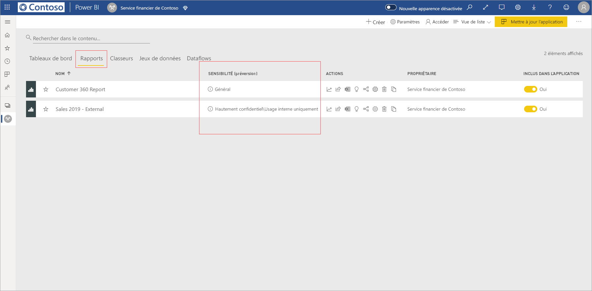
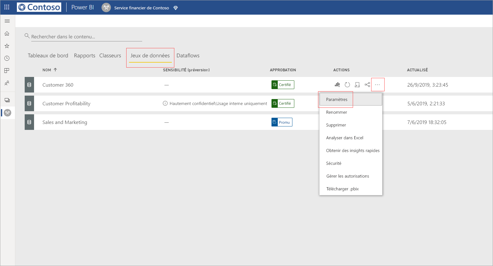
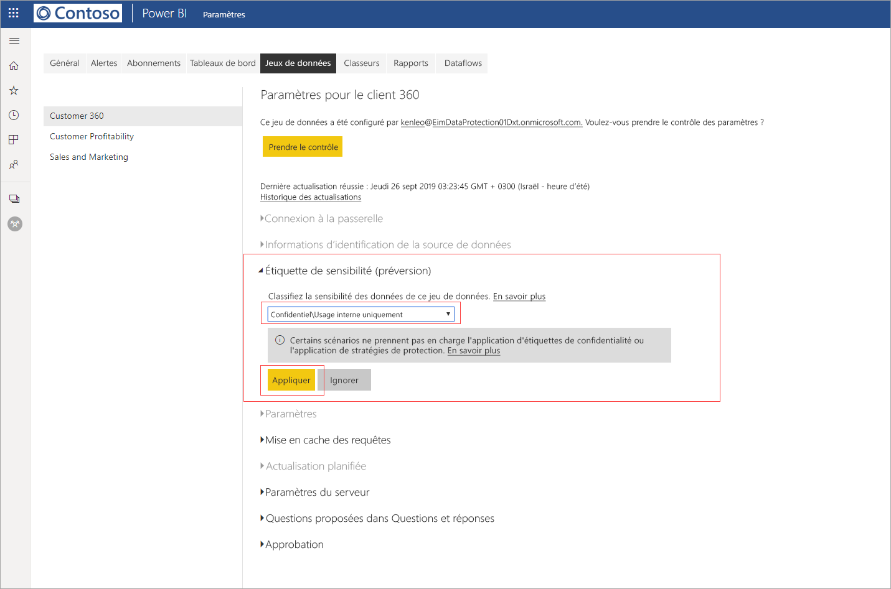
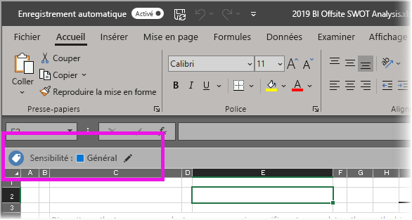

# Appliquer des étiquettes de sensibilité des données dans Power BI

Les étiquettes de sensibilité de Microsoft Information Protection sur vos rapports, tableaux de bord, jeux de données et dataflows peuvent protéger votre contenu sensible contre les accès non autorisés aux données et aux fuites de données. L’étiquetage correct des données avec des étiquettes de sensibilité des données garantit que seules les personnes autorisées peuvent accéder à vos données. Cet article explique comment appliquer des étiquettes de sensibilité à votre contenu.

Pour pouvoir appliquer des étiquettes de sensibilité dans Power BI :
* Vous devez disposer d’une licence Power BI Pro et d’autorisations de modification sur le contenu que vous souhaitez étiqueter.
* Vous devez appartenir à un groupe de sécurité qui dispose des autorisations nécessaires pour appliquer des étiquettes de sensibilité des données, comme décrit dans l’article intitulé [Activer les étiquettes de sensibilité des données dans Power BI](../admin/service-security-enable-data-sensitivity-labels.md#enable-data-sensitivity-labels).
* L’ensemble des [prérequis](../admin/service-security-data-protection-overview.md#requirements-for-using-sensitivity-labels-in-power-bi) et des [conditions de licence](../admin/service-security-data-protection-overview.md#licensing) doivent être remplis.

Pour plus d’informations sur les étiquettes de sensibilité des données dans Power BI, consultez [Vue d’ensemble de la protection des données dans Power BI](../admin/service-security-data-protection-overview.md).

## Application d’étiquettes de sensibilité

Quand la protection des données est activée sur votre locataire, les étiquettes de sensibilité apparaissent dans la colonne de sensibilité dans la vue Liste des tableaux de bord, des rapports, des jeux de données et des dataflows.

**Pour appliquer ou modifier une étiquette de sensibilité sur un rapport ou un tableau de bord**
1. Cliquez sur **Plus d’options (...)** .
1. Sélectionnez **Paramètres**.
1. Dans le volet latéral des paramètres, choisissez l’étiquette de sensibilité appropriée.
1. Enregistrez les paramètres.

L’image suivante montre ces étapes sur un rapport

**Pour appliquer ou modifier une étiquette de sensibilité sur un jeu de données ou un dataflow**

1. Cliquez sur **Plus d’options (...)** .
1. Sélectionnez **Paramètres**.
1. Dans le volet latéral des paramètres, choisissez l’étiquette de sensibilité appropriée.
1. Appliquez les paramètres.

Les deux images suivantes montrent ces étapes sur un jeu de données.

Choisissez **Plus d’options (...)** , puis **Paramètres**.

Dans la page des paramètres, ouvrez la section Étiquette de sensibilité, choisissez l’étiquette de sensibilité souhaitée, puis cliquez sur **Appliquer**.

## Suppression des étiquettes de sensibilité
Pour supprimer une étiquette de sensibilité d’un rapport, d’un tableau de bord, d’un jeu de données ou d’un flux de données, suivez la [même procédure que celle utilisée pour appliquer des étiquettes](#applying-sensitivity-labels), mais choisissez **(Aucune)** quand vous êtes invité à classifier la sensibilité des données. 

## Protection des données dans les fichiers exportés

La protection des données associée aux étiquettes de sensibilité est appliquée aux données seulement quand il s’agit de fichiers Excel, PowerPoint et PDF. Elle n’est pas prise en charge pour Analyser dans Excel, pour l’exportation au format. csv, pour les téléchargements de jeux de données (.pbix), pour la connexion dynamique au service Power BI ni pour n’importe quel autre format d’exportation. Les options d’exportation de données sont contrôlées par les [paramètres d’exportation](../service-admin-portal.md#export-and-sharing-settings) de l’administrateur du locataire Power BI.

Quand vous [exportez des données à partir d’un rapport](https://docs.microsoft.com/power-bi/consumer/end-user-export) qui a une étiquette de sensibilité vers un fichier Excel, PowerPoint ou PDF, le fichier généré hérite de cette étiquette. L’étiquette de sensibilité est visible dans le fichier, et l’accès au fichier est limité aux personnes qui disposent d’autorisations suffisantes.

## Considérations et limitations

La liste suivante présente certaines limitations des étiquettes de sensibilité dans Power BI :

**Général**
* Les étiquettes de sensibilité ne peuvent être appliquées que sur les tableaux de bord, les rapports, les jeux de données et les dataflows. Les étiquettes de sensibilité ne sont pas disponibles pour les [rapports paginés](../paginated-reports/report-builder-power-bi.md) et les classeurs.
* Les étiquettes de sensibilité sur les ressources Power BI sont visibles dans les vues Liste d’espaces de travail, Traçabilité, Favoris et Applications ; elles ne sont actuellement pas visibles dans la vue Partagé avec moi. Notez, toutefois, qu’une étiquette appliquée à une ressource Power BI, même si elle n’est pas visible, est toujours conservée sur les données exportées vers des fichiers Excel, PowerPoint et PDF.
* Les étiquettes de sensibilité sont uniquement prises en charge pour les locataires dans le cloud global (public). Les étiquettes de sensibilité ne sont pas prises en charge pour les locataires dans les autres clouds.
* Les étiquettes de sensibilité de données ne sont pas prises en charge pour les applications de modèle. Les étiquettes de sensibilité définies par le créateur de l’application de modèle sont supprimées lors de l’extraction et de l’installation de l’application, et les étiquettes de sensibilité ajoutées aux artefacts dans un modèle d’application installé par le consommateur de l’application sont perdues (réinitialisées sur Nothing (pas de sélection)) lorsque l’application est mise à jour.
* Power BI ne prend pas en charge les étiquettes de sensibilité des types de protection [Ne pas transférer](https://docs.microsoft.com/microsoft-365/compliance/encryption-sensitivity-labels?view=o365-worldwide#let-users-assign-permissions), [Défini par l’utilisateur](https://docs.microsoft.com/microsoft-365/compliance/encryption-sensitivity-labels?view=o365-worldwide#let-users-assign-permissions) et [HYOK](https://docs.microsoft.com/azure/information-protection/configure-adrms-restrictions). Les types de protection Ne pas transférer et Défini par l’utilisateur font référence aux étiquettes définies dans le [Centre de sécurité Microsoft 365](https://security.microsoft.com/) ou dans le [Centre de conformité Microsoft 365](https://compliance.microsoft.com/).

**Export**
* Les contrôles d’étiquette et de protection sont appliqués seulement quand les données sont exportées vers des fichiers Excel, PowerPoint et PDF. L’étiquette et la protection ne sont pas appliquées quand les données sont exportées vers des fichiers .csv ou .pbix, Analyser dans Excel ou tout autre chemin d’exportation.
* L’application d’une étiquette de sensibilité et d’une protection à un fichier exporté n’ajoute de marquage de contenu au fichier. Cependant, si l’étiquette est configurée pour appliquer des marquages de contenu, ceux-ci sont automatiquement appliqués par le client d’étiquetage unifié Azure Information Protection quand le fichier est ouvert dans des applications de poste de travail Office. Les marquages de contenu ne sont pas appliqués automatiquement quand vous utilisez l’étiquetage intégré pour les applications de bureau, mobiles ou web. Pour plus d’informations, consultez [Lorsque les applications Office appliquent le marquage de contenu et le chiffrement](https://docs.microsoft.com/microsoft-365/compliance/sensitivity-labels-office-apps?view=o365-worldwide#when-office-apps-apply-content-marking-and-encryption).
* Un utilisateur qui exporte un fichier à partir de Power BI dispose d’autorisations pour accéder à ce fichier et le modifier en fonction des paramètres d’étiquette de sensibilité. L’utilisateur qui exporte les données n’obtient pas d’autorisations de propriétaire sur le fichier.
* L’exportation échoue si une étiquette ne peut pas être appliquée quand les données sont exportées vers un fichier. Pour vérifier si l’exportation a échoué parce que l’étiquette n’a pas pu être appliquée, cliquez sur le nom du rapport ou du tableau de bord au centre de la barre de titre et vérifiez si le message « Impossible de charger l’étiquette de confidentialité » apparaît dans la liste déroulante des informations qui s’ouvre. Ceci peut se produire si l’étiquette appliquée a été supprimée ou si sa publication a été annulée par l’administrateur de la sécurité, ou à la suite d’un problème système temporaire.

## Étapes suivantes

L’objectif de cet article était d’expliquer comment appliquer les étiquettes de sensibilité des données dans Power BI. Les articles suivants fournissent plus de détails sur la protection des données dans Power BI. 

* [Vue d’ensemble de la protection des données dans Power BI](../admin/service-security-data-protection-overview.md)
* [Activer les étiquettes de sensibilité des données dans Power BI](../admin/service-security-enable-data-sensitivity-labels.md)
* [Utilisation de contrôles Microsoft Cloud App Security dans Power BI](../admin/service-security-using-microsoft-cloud-app-security-controls.md)